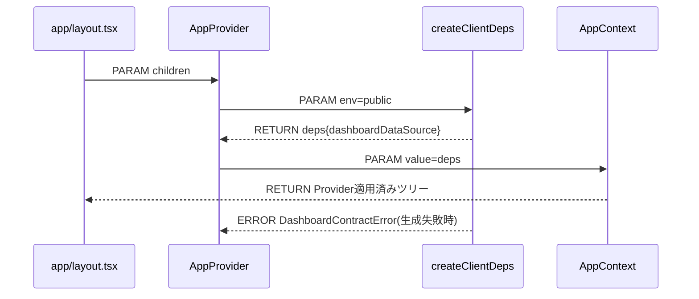
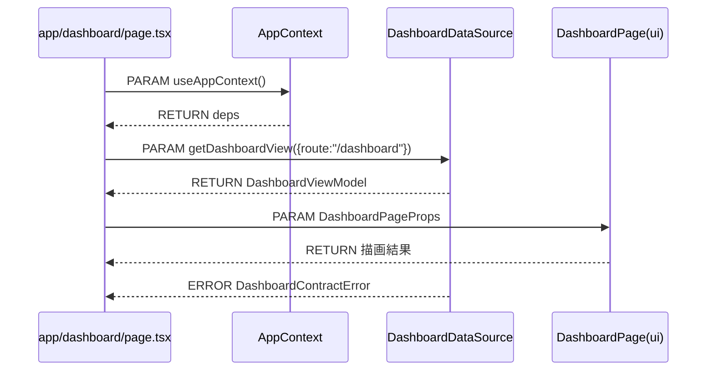
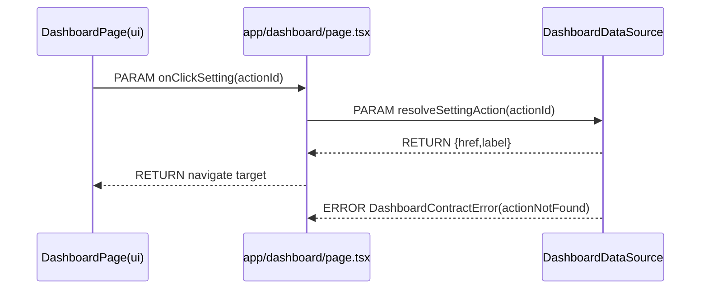
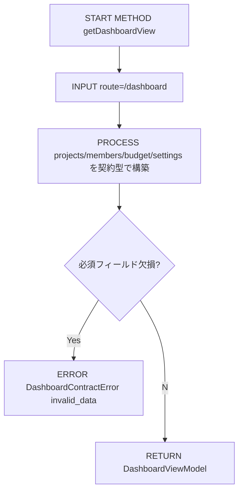
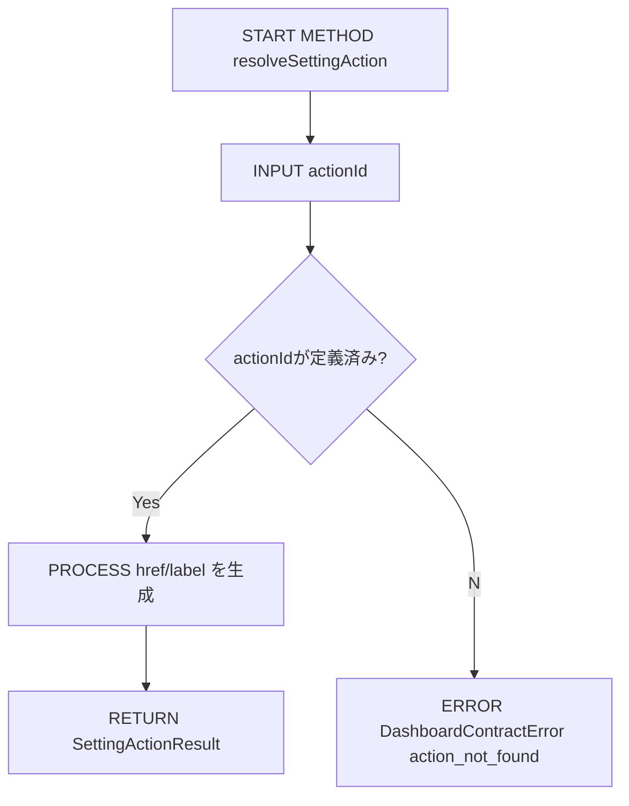
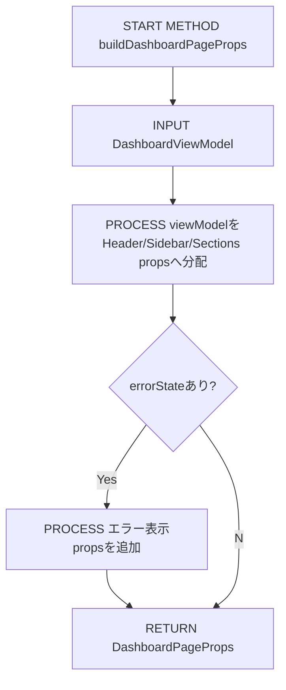

# Implementation Plan — Upstream Demo ダッシュボード画面

---

## 0. 実装入力コンテキスト

| 項目 | 記入 |
| --- | --- |
| 対象Issue | [DESIGN] Upstream Demo: ダッシュボード画面 |
| 対象リポジトリ内パス（実装起点） | `/home/runner/work/Agile-PMBOK-Assist/Agile-PMBOK-Assist` |

### 0.1 変更サマリ一覧（複数行）

| 区分（追加/修正/削除） | 対象（機能/画面/API） | 変更概要 |
| --- | --- | --- |
| 追加 | docs | `/.github/copilot/plans/00-dashboard-page.md` を作成し、dashboard 1ページの設計を固定する |
| 追加 | contracts/pages | `packages/contracts/src/pages/dashboard.ts` の契約（DataSource/DTO/エラー型）を定義する |
| 追加 | ui/pages | `packages/ui/src/pages/dashboard/DashboardPage.tsx` の描画API（props）を定義する |
| 追加 | app page | `app/dashboard/page.tsx` の橋渡し責務（Contextからdeps取得→UI props化）を定義する |
| 追加 | app providers | `src/providers/AppProvider.tsx` に dashboard deps を配布するDI経路を定義する |

### 0.2 入力制約一覧（複数行）

| 制約区分（互換性/禁止事項/期限/その他） | 制約内容 | 適用対象 |
| --- | --- | --- |
| 互換性 | 既存 `/` ルート（`app/page.tsx`）の挙動を変更しない | app |
| 互換性 | App Router（`app/`）のみ採用し、`next/router` を使わない | routing |
| 禁止事項 | `packages/contracts` に fetch/storage/logger 等の実装を入れない | contracts |
| 禁止事項 | `app/dashboard/page.tsx` で DI コンテナや plugin 具象を new/import しない | app page |
| 禁止事項 | private 実装や `private/` ディレクトリを扱わない | repo全体 |
| その他 | 本Issueは設計のみ。コード実装・テスト追加は実装Issueで行う | 進め方 |

### 0.3 関連機能・関連仕様一覧（複数行）

| 種別（要件/設計方針/ADR/調査/既存実装/外部仕様/その他） | パス/識別子 | この設計での利用目的 |
| --- | --- | --- |
| 要件 | `.github/copilot/10-requirements.md` | 受入可能な要件記述の基準確認 |
| 設計方針 | `.github/copilot/20-architecture.md` | DIP固定ルールと2段階ループの順守 |
| 既存実装 | `mock/v1/web/src/app/page.jsx` | ダッシュボード機能（一覧/予算/設定/ヘッダ/左ペイン）の抽出 |
| テンプレート | `.github/copilot/80-templates/implementation-plan.md` | 設計ドキュメント構造の準拠 |
| その他 | Issue本文のSSOT規範 | Upstream/public限定・責務分離・品質ゲートを固定 |

---

## 1. 実装対象機能と機能ゴール

| 項目 | 内容 | 根拠 |
| --- | --- | --- |
| 実装対象詳細（機能/画面/API） | `/dashboard` 画面の契約・UI・ページ橋渡し・AppProvider DI配布を1ページ分定義する | Issue本文「成果物」「4点セット」 |
| 機能ゴール（実装後に観測できるユーザーユース） | ユーザーが `/dashboard` を開くと、共通ヘッダ・左メニュー・プロジェクト一覧・メンバー一覧・予算執行状況・設定ボタンが表示される | mock画面要件 |
| 非ゴール（今回やらないこと） | private実装、認証、DB接続、複数ページ量産 | Issue本文「非ゴール」 |
| 完了条件（実装完了の判定） | docs→contracts→ui→page→AppProvider の実装差分が揃い、CI品質ゲートが成功する | Issue本文「Done」「品質ゲート」 |
| 受入確認手順（1行で再現可能） | `npm run lint && npm run build && npm run test` 実行後、`npm run dev` で `/dashboard` 表示確認 | 品質ゲート運用 |

---

## 2. 前提・制約（SSOT）

| 種別 | 内容 | 根拠（ファイル/ADR/Issue） |
| --- | --- | --- |
| 参照したSSOT | 参照順は `00-index.md` に従い、`10-60` とテンプレートを適用する | `.github/copilot/00-index.md` |
| Next.js構成前提（app/src/packages） | アプリは repo直下、ローカルパッケージは `packages/` に分離する | Issue本文「フォルダ構造（Upstream）」 |
| 依存境界前提（page.tsx / AppProvider / contracts） | DI起点は `app/layout.tsx` 配下の `AppProvider` 固定。`app/dashboard/page.tsx` は `AppContext` + `@contracts/*` + `packages/ui/*` のみ参照する | Issue本文「Dependency Injection Rule」 |
| 技術制約（互換性/期限/運用/セキュリティ） | contracts は interface/typeのみ、例外変換は plugins、Secrets/PII をログへ出さない | `.github/copilot/20-architecture.md`, Issue本文 |
| 未確定前提（TBD） | なし（本設計で dashboard 1ページに必要な契約と責務を確定済み） | 本ドキュメント |

---

## 3. 要件定義（実装受入条件）

### 3.1 機能要件

| ID | 要件 | 受入条件（テスト可能な形） |
| --- | --- | --- |
| FR-01 | `/dashboard` ルートを追加する | `app/dashboard/page.tsx` が存在し、`npm run dev` でHTTP 200で表示される |
| FR-02 | 共通ヘッダと左ペインメニューを表示する | 画面上にヘッダタイトルと左メニュー項目が表示される |
| FR-03 | プロジェクト一覧を表示する | DataSourceから受け取った `projects[]` が件数どおり描画される |
| FR-04 | メンバー一覧を表示する | DataSourceから受け取った `members[]` が件数どおり描画される |
| FR-05 | 予算執行状況を表示する | `budgetSummary` と `budgetSeries` を使用した表示が確認できる |
| FR-06 | 設定ボタン群を表示する | 設定セクションにボタンが規定数描画される |
| FR-07 | `app/dashboard/page.tsx` は橋渡し責務に限定する | `rg -n "new |fetch\(|axios|localStorage|window" app/dashboard/page.tsx` が0件 |
| FR-08 | contracts を interface/type のみに保つ | `packages/contracts/src/pages/dashboard.ts` に実装コード（HTTP/Storage）が存在しない |
| FR-09 | DIを AppProvider に固定する | dashboard依存の生成箇所が `src/providers/AppProvider.tsx`（またはそこから呼ぶcomposition）に限定される |
| FR-10 | import境界を守る | `app/dashboard/page.tsx` から `packages/plugins/*` へのimportが0件 |

### 3.2 非機能要件

| ID | 要件 | 受入条件（テスト可能な形） |
| --- | --- | --- |
| NFR-01 | 型安全 | contractsの公開型で page/ui のpropsが解決できる（TypeScriptエラーなし） |
| NFR-02 | 再現性 | 同一planで同一ファイル構成を再現できる |
| NFR-03 | セキュリティ | 画面表示・ログ・ドキュメントにSecrets/PIIを含めない |
| NFR-04 | 保守性 | DataSource差し替え時に UI 側の変更が不要 |
| NFR-05 | 境界明確性 | page/ui/contracts/plugins の責務逸脱がない |
| NFR-06 | CI適合 | lint/typecheck/test/build/security を実行計画に含む |
| NFR-07 | 拡張性 | 新規ページ追加時に11章テンプレをコピーして増設可能 |

---

## 4. スコープ境界

### 4.0 スコープ境界の定義（機能単位）

| 区分（In-Scope/Out-of-Scope） | 対象機能/責務 | 判定理由 |
| --- | --- | --- |
| In-Scope | dashboard page契約の定義 | FR-03〜FR-06の表示入力を固定するため |
| In-Scope | dashboard UI props設計 | contracts準拠でpublic UIを分離するため |
| In-Scope | page橋渡し設計 | FR-07（薄いpage責務）を満たすため |
| In-Scope | AppProvider DI配布設計 | FR-09（DI固定）を満たすため |
| In-Scope | import制約・受入条件の明文化 | FR-10/NFR-05を検証可能にするため |
| Out-of-Scope | DB/API連携の実実装 | 非ゴール |
| Out-of-Scope | 認証・認可 | 非ゴール |
| Out-of-Scope | private依存の追加 | 非ゴール |
| Out-of-Scope | 複数ページ同時実装 | 非ゴール |
| Out-of-Scope | 既存トップページ再設計 | 本Issue対象外 |

### 4.1 実装責務マッピング

| 実装責務 | 主担当レイヤ | 完了判定 |
| --- | --- | --- |
| 画面入力契約の定義 | `packages/contracts` | `DashboardDataSource` と `DashboardViewModel` が型として定義される |
| 依存注入と配布 | `src/providers` | AppProviderからdashboard depsがContext配布される |
| 画面橋渡し | `app/dashboard/page.tsx` | deps取得→props変換→UI呼び出しのみを実施する |
| 画面描画 | `packages/ui` | propsだけで6機能を描画できる |

### 4.2 実装時の影響範囲・互換性リスク

| 影響対象 | 結論（影響あり/なし/未確定） | 影響内容 |
| --- | --- | --- |
| UI/画面 | 影響あり | `/dashboard` 新規追加により導線が増える |
| API契約 | 影響あり | `packages/contracts/src/pages/dashboard.ts` の新規契約追加 |
| データ互換 | 影響なし | 既存データ保存形式の変更なし |
| 外部依存 | 影響なし | 新規ライブラリ追加なし |
| CI/運用 | 影響あり | lint/typecheck/test/build/security の確認対象に新規ファイル追加 |

### 4.3 外部依存・Secrets の扱い

| 項目 | 内容 | リスク/対応 |
| --- | --- | --- |
| 外部依存の追加/更新 | なし | 依存更新リスクなし |
| Secrets 利用有無 | なし | ダミーデータのみ使用 |
| ログ/設定への機密混入対策 | エラーメッセージは一般化し機密値を埋め込まない | plugins境界で例外正規化 |

### 4.4 4章の自己検証（必須）

| チェック項目 | 合格条件 |
| --- | --- |
| Design PR差分を書いていないか | 実装時の責務のみ記載し、現在差分の説明を書いていない |
| 実装責務を書いているか | In-Scopeに5件の実装責務を記載 |
| 実装影響を書いているか | 4.2で `影響あり` を3件具体記述 |

---

## 5. アーキテクチャ設計

### 5.0 DI生成経路（テキスト必須）

| 区分（記載例/追記No） | 生成/受け渡し主体 | 契約名（contract） | 具象名（impl/plugins） | 入力（契約/型/設定） | 出力（契約/型/設定） | 境界制約（禁止事項を含む） |
| --- | --- | --- | --- | --- | --- | --- |
| 01 | `app/layout.tsx` | `AppProviderProps（contract）` | `RootLayoutImpl（app）` | `children` | `AppProvider` 呼び出し | layoutでDataSource具象を生成しない |
| 02 | `src/providers/AppProvider.tsx` | `DashboardDataSource（contract）` | `createClientDeps（plugins/composition）` | 実行環境設定 | `deps.dashboardDataSource` | DI生成はここ以外で実施しない |
| 03 | `src/providers/AppContext.tsx` | `AppDeps（contract）` | `AppContextProviderImpl（providers）` | `deps` | `useAppContext` で参照可能なContext | Context値の加工やI/Oをしない |
| 04 | `app/dashboard/page.tsx` | `DashboardPageContract（contract）` | `DashboardPageBridgeImpl（app）` | `useAppContext()` の deps | `DashboardPageProps` | `plugins` を直接importしない |
| 05 | `packages/ui/src/pages/dashboard/DashboardPage.tsx` | `DashboardPageProps（contract）` | `DashboardPageImpl（ui）` | 描画用props | HTML/JSX描画結果 | DataSource呼び出し・DI生成をしない |

#### 5.0.1 最小固定セット（TBD禁止）

| 最小固定項目 | 必須記載内容 | 対応セクション |
| --- | --- | --- |
| DI単一路 | `AppProvider -> createClientDeps -> AppContext -> app/dashboard/page.tsx -> DashboardPage` | 5.0, 5.7.0, 5.7.1 |
| Server/Client境界 | cookie/session読取は server境界に限定し、`DashboardPage.tsx` は client表示専用（必要時のみ`"use client"`） | 5.5.1, 8.3 |
| import許可/禁止 | `app/dashboard/page.tsx` は `@contracts/*`, `packages/ui/*`, `AppContext` のみ許可。`packages/plugins/*` とbarrel経由importは禁止 | 8.4, 8.3 |

### 5.1 設計判断

#### 5.1.1 責務分離 / データフロー（詳細）

| レイヤ | 主責務 | 禁止事項 |
| --- | --- | --- |
| contracts | dashboard向け型・interface・エラー型定義 | 実装コード・例外変換 |
| plugins/composition | DataSource具象の生成・差し替え | UI依存を持つこと |
| providers | depsをReact Contextで供給 | ドメインロジックを持つこと |
| app page | deps呼び出しとUI props変換 | fetch/new/window/localStorage |
| ui | propsに基づく表示 | DataSource直接呼び出し |

#### 5.1.2 エッジケース
- DataSourceが空配列を返す場合: 各セクションに「データなし」表示を出す。
- 予算値が0または欠損: `budgetSummary` は `0` 扱いで表示しNaNを出さない。
- DataSourceが契約エラーを返す場合: pageで `errorState` propsへ正規化してUIへ渡す。

### 5.2 トレードオフ

| 選択肢 | 採用可否 | 理由 |
| --- | --- | --- |
| pageで直接fetch | 不採用 | DIP違反・テスト性低下 |
| AppProviderでdeps生成 | 採用 | IssueのDI固定ルールに一致 |
| contractsにページ合成契約を置く | 採用 | 再利用可能な入力契約を固定できる |

### 5.3 ルーティング方針の確定と移行戦略

| 項目 | 方針 |
| --- | --- |
| ルーティング | `app/dashboard/page.tsx` を追加（App Router） |
| 互換性 | 既存 `/` を維持し、段階的に `/dashboard` を導線追加 |
| 移行 | 旧`mock`は参照専用。本体は contracts/ui/app に再配置 |

### 5.4 依存カテゴリ方針（境界崩壊防止）

| 依存カテゴリ | 許可レイヤ | 禁止レイヤ |
| --- | --- | --- |
| contracts | app/ui/providers/plugins | なし（ただし相対参照禁止、`@contracts/*` 使用） |
| plugins | composition/providers | app/ui/contracts |
| AppContext | app page | contracts/ui |
| UI component | app page | plugins/composition |

### 5.5 データ取得ライフサイクル（SSR/SSG/CSR）

| 項目 | 方針 |
| --- | --- |
| `/dashboard` page | Server Componentを基本とし、データ取得はdeps経由 |
| UI部品 | 表示専用。インタラクションが必要なコンポーネントのみ Client化 |
| モックデータ | `createClientDeps` で生成し、契約型でUIへ供給 |

#### 5.5.1 実行境界固定
- Server境界: cookie/session読取、環境変数評価、plugin選定。
- Client境界: 表示状態（開閉・選択）管理のみ。
- 禁止: Serverコンポーネントで `window/document/localStorage` を使用しない。

### 5.6 エラーハンドリング標準形

| 層 | 入力 | 出力 |
| --- | --- | --- |
| plugins | 例外（HTTP/Runtime） | `DashboardContractError` へ変換 |
| page | `DashboardContractError` | `errorState` props |
| ui | `errorState` | ユーザー向けエラーメッセージ表示 |

### 5.7 シーケンス図（Mermaid / 複数必須）

#### 5.7.0 DI初期化シーケンス


#### 5.7.1 `/dashboard` 初期表示シーケンス


#### 5.7.2 設定ボタン押下シーケンス


### 5.8 処理フロー図（メソッドレベル / 複数必須）

#### 5.8.1 メソッド一覧

| No | メソッド名 | 役割 | 入力 | 出力 |
| --- | --- | --- | --- | --- |
| M-01 | `DashboardDataSource.getDashboardView` | 画面全体の表示データ取得 | `DashboardViewRequest` | `DashboardViewModel` |
| M-02 | `DashboardDataSource.resolveSettingAction` | 設定ボタン押下時の遷移先解決 | `SettingActionId` | `SettingActionResult` |
| M-03 | `buildDashboardPageProps` | page層でUI propsへ整形 | `DashboardViewModel` | `DashboardPageProps` |

#### 5.8.2 `getDashboardView` フロー


#### 5.8.3 `resolveSettingAction` フロー


#### 5.8.4 `buildDashboardPageProps` フロー


---

## 6. 契約仕様（Interface Contract）

### 6.0 DIP固定前提（Plugin型アーキテクチャ）
- contracts は interface/type のみ。
- plugins が contracts を実装し、AppProvider で注入する。
- page/ui は contracts 経由でのみ依存する。

### 6.1 入出力契約（API/関数/UseCase）

| 契約名 | I/O概要 | 利用箇所 |
| --- | --- | --- |
| `DashboardDataSource` | 画面表示データ取得・設定アクション解決 | AppProvider/page |
| `DashboardViewRequest` | route, locale, timezone | page→DataSource |
| `DashboardViewModel` | header/sidebar/projects/members/budget/settings/errorState | DataSource→page→ui |

### 6.2 型/DTO/スキーマ

| 型名 | 主なプロパティ |
| --- | --- |
| `DashboardProjectItem` | `id`, `name`, `code`, `status`, `memberCount` |
| `DashboardMemberItem` | `id`, `displayName`, `role`, `availability` |
| `BudgetSummary` | `planned`, `spent`, `remaining`, `executionRate` |
| `BudgetSeriesPoint` | `month`, `planned`, `spent` |
| `SettingAction` | `id`, `label`, `href`, `iconKey` |

### 6.3 契約インターフェース定義（実装エンジニア向け固定案）

```ts
export interface DashboardDataSource {
  getDashboardView(input: DashboardViewRequest): Promise<DashboardViewModel>;
  resolveSettingAction(actionId: SettingActionId): Promise<SettingActionResult>;
}

export interface DashboardViewRequest {
  /** 例: "/dashboard" */
  route: string;
  /** BCP47 locale 例: "ja-JP", "en-US" */
  locale: string;
  /** IANA timezone 例: "Asia/Tokyo", "UTC" */
  timezone: string;
}

export interface DashboardViewModel {
  header: DashboardHeaderView;
  sidebar: DashboardSidebarView;
  projects: DashboardProjectItem[];
  members: DashboardMemberItem[];
  budgetSummary: BudgetSummary;
  budgetSeries: BudgetSeriesPoint[];
  settings: SettingAction[];
  errorState?: DashboardContractError;
}

export type DashboardContractErrorCode =
  /** 必須フィールド不足や型不整合など契約データ不正 */
  | "invalid_data"
  /** DataSourceからの取得失敗（通信不能・依存障害） */
  | "data_source_unavailable"
  /** 設定アクションIDが未定義 */
  | "action_not_found";

export interface DashboardContractError {
  code: DashboardContractErrorCode;
  message: string;
}
```

---

## 7. データ設計（必要な場合のみ）

| データ | 内容 | 備考 |
| --- | --- | --- |
| モックデータソース | project/member/budget/settings の静的配列 | Upstreamデモ用途 |
| 永続化 | なし | 本Issue範囲外 |
| 外部API | なし | 本Issue範囲外 |

---

## 8. 実装指示（製造Agent向け）

### 8.1 変更予定ファイル一覧（必須）

| 区分 | パス | 目的 |
| --- | --- | --- |
| 追加 | `packages/contracts/src/pages/dashboard.ts` | dashboard契約追加 |
| 追加 | `packages/ui/src/pages/dashboard/DashboardPage.tsx` | public UI実装 |
| 追加 | `app/dashboard/page.tsx` | page橋渡し |
| 修正 | `src/providers/AppProvider.tsx` | deps注入 |
| 修正 | `src/providers/AppContext.tsx` | AppDeps型拡張 |
| 修正 | `src/lib/createClientDeps.ts` | dashboardDataSource実装注入 |

### 8.2 実装手順（順序付き）
1. contractsの型・interfaceを追加する。
2. createClientDepsとAppProviderでDataSourceを注入する。
3. app/dashboard/page.tsxでdeps呼び出し→UI props整形を実装する。
4. DashboardPage UIをprops描画専用で実装する。
5. lint/typecheck/test/build/securityを実行し受入条件を確認する。

### 8.3 実装禁止事項（ガードレール）
- `app/dashboard/page.tsx` に `new` / `fetch` / plugin直import / business logic を書かない。
- `packages/contracts/*` に実装コード、URL、認証、I/Oコードを置かない。
- `packages/ui/*` で DataSource を呼び出さない。
- Server境界外で cookie/session を読まない。
- `"use client"` 不要ファイルに client-only API を書かない。

### 8.4 import制約の自動化

| 対象 | 許可 | 禁止 |
| --- | --- | --- |
| `app/dashboard/page.tsx` | `@contracts/*`, `packages/ui/*`, `src/providers/AppContext` | `packages/plugins/*`, `src/composition/*` 直接import |
| `packages/ui/src/pages/dashboard/*` | `@contracts/*`, ui内部 | `src/providers/*`, `packages/plugins/*` |
| `packages/contracts/src/pages/dashboard.ts` | contracts内部型 | React/Next/HTTP関連import |

---

## 9. テスト実装計画

### 9.1 テストケース

| ID | 種別 | 観点 | 実行手順 | 期待結果 |
| --- | --- | --- | --- | --- |
| TC-01 | lint | import制約違反検知 | `npm run lint` | エラー0 |
| TC-02 | typecheck | contracts/ui/page型整合 | `npm run typecheck` | エラー0 |
| TC-03 | test | UIの表示回帰（主要セクション） | `npm run test` | 既存+追加テスト成功 |
| TC-04 | build | Next.jsビルド成立 | `npm run build` | build成功 |
| TC-05 | manual | `/dashboard` 初期表示 | `npm run dev` 後にブラウザ確認 | 6機能が表示される |
| TC-06 | static check | contracts実装混入防止 | `rg -n "fetch\(|axios|localStorage|window" packages/contracts/src/pages/dashboard.ts` | 0件 |
| TC-07 | static check | DI固定確認 | `rg -n "new .*DataSource|createClientDeps" app/dashboard/page.tsx` | 0件 |

---

## 10. オープン課題 / ADR

| ID | 状態 | 内容 | 解決方針 |
| --- | --- | --- | --- |
| ADR-01 | Open | 予算グラフ描画ライブラリ選定 | 既存依存で実現可能な実装を優先し、新規依存は避ける |
| ADR-02 | Open | 設定ボタン押下時の遷移方式（Link/Router） | App Router標準APIで統一しUI propsに遷移先を保持 |

### 10.1 TBD回収トラッキング（必須）

| 項目 | 状態 | 備考 |
| --- | --- | --- |
| 本plan内TBD | なし | 実装開始に必要な判断は確定済み |

---

## 11. 新規ページ追加テンプレ（設計規約）

### 11.1 docs 必須項目
- `.github/copilot/plans/<issueNo>-page-<slug>.md` を作成し、FR/NFRとDI経路を固定する。

### 11.2 contracts 必須項目
- `packages/contracts/src/pages/<slug>.ts` に `DataSource`, `ViewModel`, `ContractError` を定義する。

### 11.3 ui 必須項目
- `packages/ui/src/pages/<slug>/<PageName>Page.tsx` を作成し、props描画専用にする。

### 11.4 app page 必須項目
- `app/<slug>/page.tsx` を作成し、`AppContext` から deps を取得して UI へ渡す。
