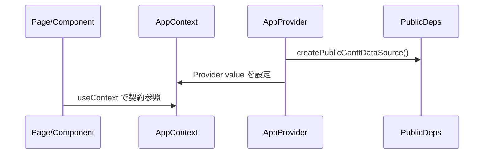
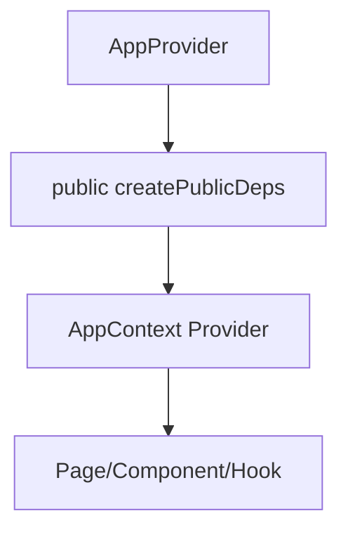

# Implementation Plan: Next.js Plugin SSOT (Public)

## 1. 機能要件 / 非機能要件

- 機能要件:
  - AppProvider を唯一の DI ポイントとして固定し、public で動作する依存実装を提供する。
  - contracts に interface/type のみを定義し、private 実装を持ち込まない。
  - docs/architecture.md に DI ルールを SSOT として明文化する。
  - ESLint の restricted import で private 参照を禁止する。
- 非機能要件:
  - 既存 UI/挙動を壊さず、public リポジトリに private 実装を追加しない。

## 2. スコープと変更対象

- 変更ファイル（新規/修正/削除）:
  - 新規: app/contracts/gantt.ts
  - 新規: app/providers/AppContext.ts
  - 新規: app/providers/AppProvider.tsx
  - 新規: app/providers/public/createPublicDeps.ts
  - 修正: app/layout.tsx
  - 修正: eslint.config.mjs
  - 新規: docs/architecture.md
  - 新規: .github/instructions/react.upstream.instructions.md
  - 新規: .github/instructions/nextjs.upstream.instructions.md
- 影響範囲・互換性リスク:
  - RootLayout で AppProvider を追加するため、クライアント境界の追加のみ。
  - private 参照禁止の ESLint 追加で今後の import に制約が掛かる。
- 外部依存・Secrets の扱い:
  - 依存追加なし。Secrets を扱わない。

## 3. 設計方針

- 責務分離 / データフロー:
  - contracts が型契約のみを定義し、public 実装は providers/public に置く。
  - AppProvider が public 実装を生成し AppContext へ注入する。
- エッジケース / 例外系 / リトライ方針:
  - demo データ更新は in-memory 更新で完結し、失敗は投げない。
- ログと観測性（漏洩防止を含む）:
  - ログ追加なし。Secrets/PII を出力しない。

### 3.1 製造時の変更予定ファイル一覧

| No. | パス | 変更内容 |
| --- | -- | ---- |
| 1 | app/contracts/gantt.ts | GanttDataSource/Task の interface を追加 |
| 2 | app/providers/AppContext.ts | 依存注入用の Context を定義 |
| 3 | app/providers/public/createPublicDeps.ts | public 完成実装の依存生成 |
| 4 | app/providers/AppProvider.tsx | DI ルートを固定 |
| 5 | app/layout.tsx | AppProvider で children をラップ |
| 6 | eslint.config.mjs | no-restricted-imports を追加 |
| 7 | docs/architecture.md | DI ルールの SSOT 追記 |
| 8 | .github/instructions/*upstream*.md | SSOT 規範を追加 |

## 4. 設計UML

- シーケンス図:

- 処理フロー図:

## 5. 人間が行う作業:

| 手順ID | 作業名 | 作業の目的 | 具体的な作業内容（人間がやることを詳細に書く） | 判断・確認ポイント | 完了条件（チェック可能な状態） |
| ---- | --- | ----- | ----------------------- | --------- | --------------- |
| H-01 | UI確認 | 既存 UI 変化の有無確認 | RootLayout に provider を追加後、画面表示が維持されることを確認する | UI 変化の有無 | 表示が崩れていない |
| H-02 | ESLint確認 | restricted import の有効性確認 | lint を実行して rule が登録されることを確認する | ESLint 設定の反映 | lint 実行時に rule が有効 |

### 5.1 使用する情報・資料

- 作業に必要な資料:
  - Issue 本文（SSOT 規範）

## 6. テスト戦略

- テスト観点（正常 / 例外 / 境界 / 回帰）:
  - 既存テスト基盤が無いため追加しない。lint/build で回帰を確認する。
- モック / フィクスチャ方針:
  - なし。
- テスト追加の実行コマンド（例: `python -m pytest`）:
  - `npm run lint`
  - `npm run build`

## 7. CI 品質ゲート

- 実行コマンド（format / lint / typecheck / test / security）:
  - `npm run lint`
  - `npm run build`
- 通過基準と失敗時の対応:
  - 既存エラーは記録し、変更による追加エラーが無いことを確認する。

## 8. ロールアウト・運用

- ロールバック方法:
  - 追加ファイルと AppProvider の変更を元に戻す。
- 監視・運用上の注意:
  - public 実装のみを置き、private 参照を禁止する。

## 9. オープンな課題 / ADR 要否

- 未確定事項:
  - なし。
- ADR に残すべき判断:
  - なし。
