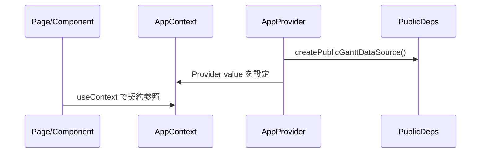
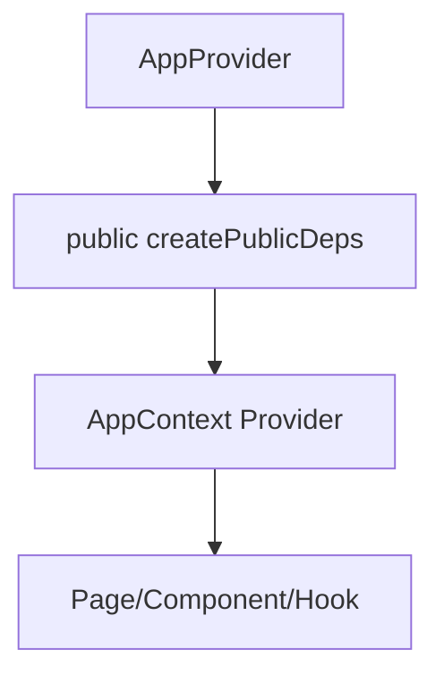

# Implementation Plan: Next.js Plugin SSOT (Public)

## 1. 機能要件 / 非機能要件

- 機能要件:
  - SSOT 規範（.github/instructions）のみを整備し、public リポジトリに private 実装が混入しない運用を明文化する。
  - AppProvider / contracts / providers/public などの実装方針は plan に記載するが、本 Issue では実装コードを追加しない。
- 非機能要件:
  - 既存 UI/挙動を変更せず、SSOT 規範のみに変更を限定する。

## 2. スコープと変更対象

- 変更ファイル（新規/修正/削除）:
  - 新規: .github/instructions/react.upstream.instructions.md
  - 新規: .github/instructions/nextjs.upstream.instructions.md
  - 更新: .github/copilot/plans/00-nextjs-plugin-ssot.md
- 影響範囲・互換性リスク:
  - SSOT 規範文書のみの変更で、実装への影響はない。
- 外部依存・Secrets の扱い:
  - 依存追加なし。Secrets を扱わない。

## 3. 設計方針

- 責務分離 / データフロー:
  - contracts が型契約のみを定義し、public 実装は providers/public に置く方針を SSOT として記載する。
  - AppProvider が public 実装を生成し AppContext へ注入する設計方針のみを明文化する。
- エッジケース / 例外系 / リトライ方針:
  - 実装コードを追加しないため、対象なし。
- ログと観測性（漏洩防止を含む）:
  - ログ追加なし。Secrets/PII を出力しない。

### 3.1 製造時の変更予定ファイル一覧

| No. | パス | 変更内容 |
| --- | -- | ---- |
| 1 | .github/instructions/react.upstream.instructions.md | React 依存注入規約を追加 |
| 2 | .github/instructions/nextjs.upstream.instructions.md | Next.js SSOT 規範を追加 |
| 3 | .github/copilot/plans/00-nextjs-plugin-ssot.md | 実装方針を明文化 |

### 3.2 将来の実装方針（本 Issue では実装しない）

- app/contracts/gantt.ts に interface/type のみを定義する。
- app/providers/public/createPublicDeps.ts に public 完成実装を置く。
- app/providers/AppProvider.tsx / AppContext.ts を DI ルートとして構成する。
- app/layout.tsx で AppProvider を適用する。
- docs/architecture.md と eslint.config.mjs は別 Issue で再作成・更新する前提とする。

## 4. 設計UML

- シーケンス図:
  - 将来実装時の依存注入フローを示す参考図。

- 処理フロー図:

## 5. 人間が行う作業:

| 手順ID | 作業名 | 作業の目的 | 具体的な作業内容（人間がやることを詳細に書く） | 判断・確認ポイント | 完了条件（チェック可能な状態） |
| ---- | --- | ----- | ----------------------- | --------- | --------------- |
| H-01 | 規約確認 | SSOT 規範の整合性確認 | instructions の内容が Issue 要件と一致していることを確認する | 規約の抜け/重複 | 要件が満たされている |

### 5.1 使用する情報・資料

- 作業に必要な資料:
  - Issue 本文（SSOT 規範）

## 6. テスト戦略

- テスト観点（正常 / 例外 / 境界 / 回帰）:
  - ドキュメント/規約のみの変更のため追加しない。
- モック / フィクスチャ方針:
  - なし。
- テスト追加の実行コマンド（例: `python -m pytest`）:
  - なし。

## 7. CI 品質ゲート

- 実行コマンド（format / lint / typecheck / test / security）:
  - なし。
- 通過基準と失敗時の対応:
  - 変更範囲が文書のみであることを確認する。

## 8. ロールアウト・運用

- ロールバック方法:
  - 追加した instructions と plan の変更を戻す。
- 監視・運用上の注意:
  - public 実装のみを置き、private 参照を禁止する方針を守る。

## 9. オープンな課題 / ADR 要否

- 未確定事項:
  - なし。
- ADR に残すべき判断:
  - なし。
