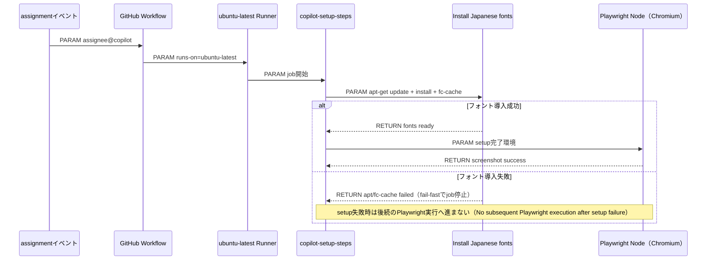
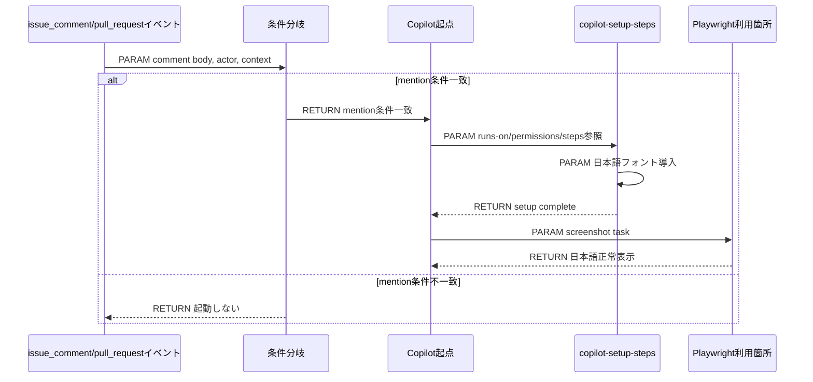
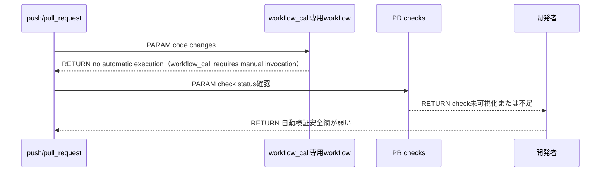
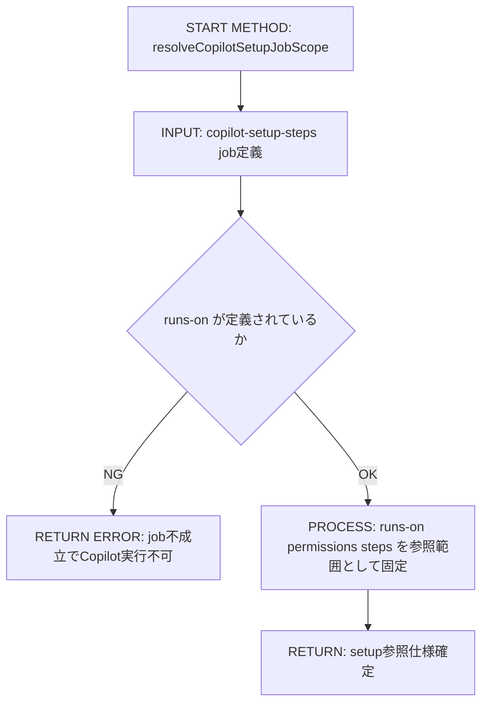
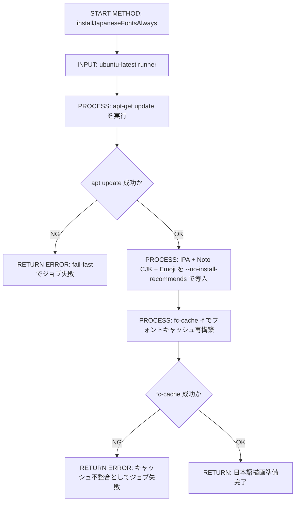
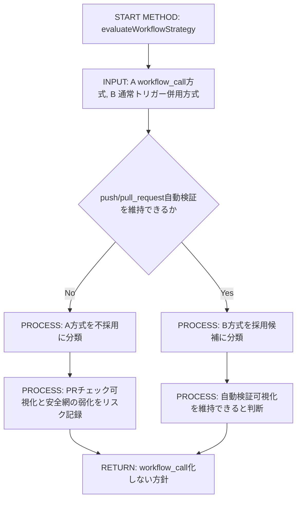

# Implementation Plan — Playwrightスクリーンキャプチャ日本語文字化け対策

---

## 0. 実装入力コンテキスト

| 項目 | 記入 |
| --- | --- |
| 対象Issue | [#100](https://github.com/LevelCapTech/Agile-PMBOK-Assist/issues/100) `[DESIGN] Playwrightスクリーンキャプチャ時の日本語文字化け対策とcopilot-setup-steps.yml設計方針の確定` |
| 対象リポジトリ内パス（実装起点） | `/home/runner/work/Agile-PMBOK-Assist/Agile-PMBOK-Assist` |

### 0.1 変更サマリ一覧（複数行）

| 区分（追加/修正/削除） | 対象（機能/画面/API） | 変更概要 |
| --- | --- | --- |
| 追加 | workflow job step | `copilot-setup-steps` に日本語フォント導入ステップを追加する |
| 修正 | workflow運用方針 | `workflow_call` 非採用、通常トリガー併用方式を設計として固定する |
| 追加 | CI検証観点 | push/pull_request/workflow_dispatch の自動検証経路を設計として固定する |

### 0.2 入力制約一覧（複数行）

| 制約区分（互換性/禁止事項/期限/その他） | 制約内容 | 適用対象 |
| --- | --- | --- |
| 互換性 | Copilot Coding Agent 対応OSは Ubuntu x64 Linux / Windows 64-bit のみ（macOS非対応） | runs-on |
| 互換性 | GitHub-hosted runner 前提で設計する | workflow実行基盤 |
| 禁止事項 | DESIGNフェーズで実装しない | 本Issue |
| 禁止事項 | workflow_call 化しない | workflow設計 |
| 禁止事項 | self-hosted runner を対象にしない | runner選定 |
| その他 | Playwright は Node版（Chromiumレンダリング）前提 | 文字化け対策 |

### 0.3 関連機能・関連仕様一覧（複数行）

| 種別（要件/設計方針/ADR/調査/既存実装/外部仕様/その他） | パス/識別子 | この設計での利用目的 |
| --- | --- | --- |
| 要件 | `.github/copilot/10-requirements.md` | 受入条件をテスト可能表現に揃える |
| 設計方針 | `.github/copilot/20-architecture.md` | SSOT準拠と責務境界の確認 |
| テスト戦略 | `.github/copilot/40-testing-strategy.md` | 将来のIMPLEMENTでの検証観点定義 |
| CI品質ゲート | `.github/copilot/60-ci-quality-gates.md` | lint/build/test/security のゲート前提を明記 |
| テンプレート | `.github/copilot/80-templates/implementation-plan.md` | plan構造の準拠 |
| 外部仕様 | GitHub Copilot Coding Agent setup参照仕様 | `copilot-setup-steps` job の参照範囲を固定 |
| 外部仕様 | Playwright（Node） + Chromium動作仕様 | フォント未導入時の豆腐化再現条件を定義 |

---

## 1. 実装対象機能と機能ゴール

| 項目 | 内容 | 根拠 |
| --- | --- | --- |
| 実装対象詳細（機能/画面/API） | `copilot-setup-steps.yml` に日本語フォント導入を追加し、Copilot実行前セットアップでPlaywrightスクリーンキャプチャ文字化けを防ぐ | Issue本文「要件」「フォント導入仕様」 |
| 機能ゴール（実装後に観測できるユーザーユース） | ubuntu-latest 上の Playwright Node版スクリーンキャプチャで日本語が豆腐化せず描画される | Issue本文テスト観点1 |
| 非ゴール（今回やらないこと） | macOS対応、self-hosted対応、Docker化、実装作業そのもの | Issue本文「制約」「スコープOut」 |
| 完了条件（実装完了の判定） | workflow_call比較表を含む方針が確定し、通常トリガー併用方式採用理由が明文化される | Issue本文「Done」 |
| 受入確認手順（1行で再現可能） | `ubuntu-latest` で setup実行後に日本語テキストを含むPlaywright screenshotを取得し、文字化けしないことを確認する | Issue本文テスト観点 |

---

## 2. 前提・制約（SSOT）

| 種別 | 内容 | 根拠（ファイル/ADR/Issue） |
| --- | --- | --- |
| 参照したSSOT | `.github/copilot/00-index.md` の参照順に従い、`10-60` とテンプレートを適用する | `.github/copilot/00-index.md` |
| Next.js構成前提（app/src/packages） | 本設計対象はアプリコードではなくGitHub Actions workflow定義。アプリ構造自体は変更しない | Issue本文スコープ |
| 依存境界前提（page.tsx / AppProvider / contracts） | 本IssueはDI境界に影響を与えない。CIセットアップ層のみを変更対象とする | `.github/copilot/20-architecture.md` |
| 技術制約（互換性/期限/運用/セキュリティ） | `runs-on` は必須。`copilot-setup-steps` では `runs-on` / `permissions` / `steps` のみ参照されるためジョブ内へ必要定義を集約する | Issue本文「Copilot参照仕様の制約整理」 |
| 未確定前提（TBD） | なし（workflow_call非採用、ubuntu-latest採用、フォント構成は本設計で固定） | 本ドキュメント |

---

## 3. 要件定義（実装受入条件）

### 3.1 機能要件

| ID | 要件 | 受入条件（テスト可能な形） |
| --- | --- | --- |
| FR-01 | Playwright前提を Node版 + Chromium として明文化する | plan本文に Node版・Chromium・豆腐化再現条件が明記される |
| FR-02 | Copilot参照制約を明文化する | `copilot-setup-steps` job の参照対象が `runs-on` / `permissions` / `steps` のみと記載される |
| FR-03 | `runs-on: ubuntu-latest` 採用理由を明文化する | x64 Linux前提、GitHub-hosted runner前提、Windows切替影響が記載される |
| FR-04 | `workflow_call` 方式と通常トリガー併用方式を比較する | 指定の比較観点とリスク表がplanに記載される |
| FR-05 | `workflow_call` 非採用理由を文章で固定する | 自動検証・PR可視化・安全網の観点で非採用理由が明文化される |
| FR-06 | 日本語フォント導入stepを固定する | 指定YAMLスニペットが完全一致で記載される |
| FR-07 | フォント導入stepの設計意図を明文化する | 各フォント役割、`--no-install-recommends`、`fc-cache`、apt fail-fast が説明される |
| FR-08 | CI発火経路を2系統で図示する | Issueアサイン時 / PR mention時のMermaid図が記載される |
| FR-09 | Copilot実行とworkflow triggerの独立性を明文化する | 「Copilot作業前セットアップはworkflow_call有無と無関係」を明記する |
| FR-10 | IMPLEMENT移行条件を明文化する | 本planを固定入力としてIMPLEMENT Issue起票の次アクションが記載される |

### 3.2 非機能要件

| ID | 要件 | 受入条件（テスト可能な形） |
| --- | --- | --- |
| NFR-01 | 運用安全性 | push/pull_request で自動検証が維持される方針であることが明記される |
| NFR-02 | 透明性 | PRチェック可視化の有無が比較表で判定できる |
| NFR-03 | 再現性 | フォント導入stepが固定スニペットとして記載される |
| NFR-04 | 保守性 | runner切替時の影響が整理され、判断基準が残る |
| NFR-05 | セキュリティ | Secrets/PIIをsetupログに出さない方針が明記される |
| NFR-06 | 失敗時即時検知 | apt 失敗時にジョブ失敗として停止するfail-fast方針が明記される |
| NFR-07 | スコープ遵守 | DESIGNで実装しないことが明記される |

---

## 4. スコープ境界

### 4.0 スコープ境界の定義（機能単位）

| 区分（In-Scope/Out-of-Scope） | 対象機能/責務 | 判定理由 |
| --- | --- | --- |
| In-Scope | `copilot-setup-steps` のruns-on/permissions/steps設計固定 | Copilot参照仕様へ直接影響するため |
| In-Scope | Playwright日本語豆腐化対策としてのフォント導入設計 | 主要要件のため |
| In-Scope | workflow_call比較と採用方針の確定 | 設計判断の必須成果物のため |
| In-Scope | CI発火経路（assignment / PR mention）の図示 | 実行位置の誤認防止のため |
| In-Scope | IMPLEMENT受入条件の定義 | 次工程の着手条件を固定するため |
| Out-of-Scope | 実workflowファイルの変更 | DESIGNフェーズのため |
| Out-of-Scope | macOS / self-hosted runner 対応 | Issue制約 |
| Out-of-Scope | アプリ本体コード、UI、API変更 | スコープ外 |
| Out-of-Scope | Docker化やCI全体再設計 | スコープ外 |
| Out-of-Scope | Playwrightテストコード自体の変更 | 本Issueはsetup方針確定が目的 |

### 4.2 実装時の影響範囲・互換性リスク

| 影響対象 | 結論（影響あり/なし/未確定） | 影響内容 |
| --- | --- | --- |
| UI/画面 | 影響なし | アプリ画面仕様は変更しない |
| API契約 | 影響なし | アプリAPI契約は変更しない |
| データ互換 | 影響なし | データスキーマ変更なし |
| 外部依存 | 影響あり | Ubuntuパッケージ（フォント）導入を前提化する |
| CI/運用 | 影響あり | setupジョブの実行時間増加と安定描画の改善が発生する |

### 4.3 外部依存・Secrets の扱い

| 項目 | 内容 | リスク/対応 |
| --- | --- | --- |
| 外部依存の追加/更新 | aptで `fonts-ipafont-gothic` `fonts-ipafont-mincho` `fonts-noto-cjk` `fonts-noto-color-emoji` を導入 | Ubuntuリポジトリ障害時に失敗するためfail-fastで即検知 |
| Secrets 利用有無 | なし | setup stepにSecret参照を追加しない |
| ログ/設定への機密混入対策 | インストールログはパッケージ名のみ。トークン/個人情報を出力しない | job permissionsは最小権限を維持 |

### 4.4 4章の自己検証（必須）

| チェック項目 | 合格条件 |
| --- | --- |
| Design PR差分を書いていないか | 実装責務を記載し、Design作業そのものを要件化していない |
| 実装責務を書いているか | In-Scopeに5件の実装責務を記載 |
| 実装影響を書いているか | 4.2で `影響あり` を2件以上具体化 |

---

## 5. アーキテクチャ設計

### 5.0 DI生成経路（テキスト必須）

| 区分（記載例/追記No） | 生成/受け渡し主体 | 契約名（contract） | 具象名（impl/plugins） | 入力（契約/型/設定） | 出力（契約/型/設定） | 境界制約（禁止事項を含む） |
| --- | --- | --- | --- | --- | --- | --- |
| 01 | GitHub Actions Event | `workflow trigger contract` | `assignment / issue_comment / pull_request` | イベントペイロード | workflow起動判定 | トリガー条件を曖昧にしない |
| 02 | `copilot-setup-steps` job | `runs-on/permissions/steps` | `copilot-setup-steps.yml` | runnerラベル、最小権限、step定義 | Copilot参照可能セットアップ | ジョブ外定義に依存しない |
| 03 | setup step | `Install Japanese fonts spec` | apt + fc-cache 実行 | Ubuntu package index | CJK/絵文字フォント利用可能状態 | apt失敗時は継続せずジョブ失敗 |
| 04 | Copilot Coding Agent | `setup-consumed environment` | Playwright Node execution | セットアップ済みrunner | screenshot実行環境 | workflow_call有無を前提にしない |
| 05 | Playwright Chromium | `rendering pipeline` | chromium font fallback | 日本語DOMテキスト | 文字化けしないPNG | フォント未導入時の豆腐化を許容しない |

#### 5.0.1 最小固定セット（TBD禁止）

| 最小固定項目 | 必須記載内容 | 対応セクション |
| --- | --- | --- |
| DI単一路 | `GitHub Event -> copilot-setup-steps -> font install -> Copilot Agent -> Playwright Chromium` | 5.0, 5.7.0, 5.7.2 |
| Server/Client境界 | 本設計はCI runner内処理のみ対象。cookie/sessionやbrowser API境界は変更しない | 5.5.1, 8.3 |
| import許可/禁止 | アプリコードのimport境界は変更しない。workflow定義変更のみを許可する | 8.3, 8.4 |

### 5.1 設計判断

#### 5.1.1 責務分離 / データフロー（詳細）

| レイヤ | 主責務 | 禁止事項 |
| --- | --- | --- |
| workflow trigger | assignment / push / pull_request / workflow_dispatch で実行契機を作る | setup jobをworkflow_call前提に固定すること |
| `copilot-setup-steps` job | Copilot参照対象（runs-on/permissions/steps）を完結定義する | ジョブ外定義へ必要情報を逃がすこと |
| font setup step | 日本語表示に必要なフォントを導入しキャッシュ再生成する | apt失敗を握りつぶして後続継続すること |
| Copilot Agent | セットアップ済み環境でPlaywrightを実行する | workflow_call採用を前提条件にすること |
| Playwright Chromium | フォントフォールバックで日本語を描画する | フォント未導入環境を正常扱いすること |

#### 5.1.2 エッジケース / 例外系 / リトライ方針（詳細）

| No. | ケース | 方針（戻り値/表示/再試行） | 根拠 |
| --- | --- | --- | --- |
| 1 | `apt-get update` が失敗 | setup jobを即失敗させ、後続を止める（fail-fast） | 壊れた環境での曖昧成功を防ぐ |
| 2 | `fonts-*` パッケージ取得失敗 | setup jobを失敗させ、PRチェックで可視化する | 自動検証の安全網を維持 |
| 3 | `fc-cache -f` 失敗 | setup jobを失敗させる | フォント導入直後の不整合を防止 |
| 4 | runnerをWindowsへ切替 | apt step互換なしのため別分岐設計が必要。今回はUbuntu固定 | Issue制約 |
| 5 | workflow_callのみ構成に変更 | 自動検証経路消失リスクとして非採用 | リスク比較表 |
| 6 | フォント導入済み環境で再実行 | 冪等実行で問題なし。毎回実行（always）で統一 | 実行環境差異吸収 |

#### 5.1.3 Playwright前提（Node版・Chromium・再現条件）

| 項目 | 固定内容 |
| --- | --- |
| Playwright実装 | Node版 Playwright（`@playwright/test`） |
| 描画エンジン | Chromiumベースで描画 |
| 文字化け再現条件 | ubuntu-latest に CJKフォント未導入のまま、日本語を含むDOMをスクリーンショット取得すると豆腐化（□）する |

#### 5.1.4 ログと観測性（漏洩防止を含む / 詳細）

| No. | 観点 | 方針 | 根拠 |
| --- | --- | --- | --- |
| 1 | ログ出力内容 | apt/fc-cacheの標準ログのみ出力し、診断可能性を確保する | 運用性 |
| 2 | マスキング/非出力項目 | Secrets/PIIを含む環境変数のechoを禁止する | セキュリティ |
| 3 | エラー記録粒度 | パッケージ取得失敗時にステップ単位で失敗を残す | fail-fast |
| 4 | 監視メトリクス | workflow実行結果（成功/失敗）とPRチェック可視化を利用する | GitHub Actions標準 |
| 5 | アラート条件 | setup step失敗をそのままCI失敗として扱う | 品質ゲート |
| 6 | 運用確認手順 | 実行ログで4フォント導入 + `fc-cache -f` 成功を確認する | 実装受入確認 |

### 5.2 トレードオフ

| 判断テーマ | 案A | 案B | 採用案 | 採用理由 | 不採用理由 |
| --- | --- | --- | --- | --- | --- |
| workflow設計 | `workflow_call` に寄せる | 通常トリガー併用（workflow_dispatch/push/pull_request） | 案B | 自動検証とPR可視化を維持し、安全網を残せる | 案Aは変更時自動検証が弱く誤設定検知が遅れる |
| runner選定 | `ubuntu-latest` | `windows-latest` | `ubuntu-latest` | aptで必要フォントを一括導入でき、Copilot対応OS（Ubuntu x64）と一致 | Windowsは導入方法が別系統で運用複雑性が上がる |

### 5.3 Runner設計方針の確定と移行戦略

| 項目 | 決定内容 | 根拠 |
| --- | --- | --- |
| 採用runner | `runs-on: ubuntu-latest` | Copilot対応OS、apt利用、GitHub-hosted標準 |
| larger runner 前提 | `ubuntu-4-core` などへ切替する場合も Ubuntu x64 かつ apt利用可能であることを前提とする | Issue要件「larger runner前提整理」 |
| 実行基盤 | GitHub-hosted runner 前提 | Issue制約 |
| アーキテクチャ | x64 Linux 前提 | Copilot対応条件 |
| Windows切替影響 | パッケージマネージャとフォント名が変わるためstep分岐または別workflow設計が必要 | 運用差異の顕在化 |

### 5.4 依存カテゴリ方針（境界崩壊防止）

| 依存カテゴリ（DataSource/Service/Adapter/Config） | 定義 | 許可レイヤ（app/src/contracts/ui/plugins） | 禁止レイヤ |
| --- | --- | --- | --- |
| Config | runner/permissions/stepsのworkflow設定 | `.github/workflows` | app/src/packages |
| Service | apt + fc-cache によるフォント整備 | `.github/workflows` | app/src/packages |
| Adapter | Copilot setup参照仕様への適合 | `.github/workflows` | app/src/packages |
| DataSource | 本Issueでは該当なし | なし | app/src/packages |

### 5.5 データ取得ライフサイクル（SSR/SSG/CSR）

| データ種別 | 取得タイミング（SSR/SSG/CSR） | 取得場所（page/usecase/client等） | 理由 |
| --- | --- | --- | --- |
| フォントパッケージ一覧 | CI実行時（workflow step） | GitHub-hosted Ubuntu runner | Playwright実行前に環境を確定するため |
| package index | CI実行時（workflow step） | `apt-get update` | インストール成功率を担保するため |
| font cache | CI実行時（workflow step） | `fc-cache -f` | 導入直後の認識反映のため |

#### 5.5.1 Server/Client 境界固定（Next.js）

| 対象処理 | 実行境界（Server/Client/Shared） | 実装場所（page/getServerSideProps/usecase等） | ブラウザAPI利用（可/不可） | Cookie/Session読取位置 | 禁止事項 |
| --- | --- | --- | --- | --- | --- |
| フォント導入 | Server | GitHub Actions runner shell | 不可 | 対象外 | ブラウザAPIを使わない |
| Copilot setup参照 | Server | `copilot-setup-steps` job | 不可 | 対象外 | アプリ実行境界へ混在させない |
| Playwright screenshot | Shared（CI内browser実行） | Playwright Node test runtime | 可（Playwright browser context内のみ） | 対象外 | setup未完了での実行を許可しない |

### 5.6 エラーハンドリング標準形

| 分類（network/unauthorized/notfound/unknown） | 返却型/エラーコード | UI表示ルール | 再試行ルール |
| --- | --- | --- | --- |
| network | `apt network failure` | setup step failed としてCI表示 | 次回runで再試行 |
| unauthorized | `repository permission denied` | job failed として表示 | permissions見直し後に再実行 |
| notfound | `apt package not found` | setup step failed として表示 | パッケージ名修正後に再実行 |
| unknown | `unexpected runner failure` | job failed として表示 | 原因解析後に再実行 |

| ログ方針 | 内容 |
| --- | --- |
| 出力する情報 | 失敗ステップ名、apt/fc-cache終了状態、runner種別 |
| 出力しない情報（Secrets/PII） | token値、個人情報、認証ヘッダ |

#### 5.6.1 エラー変換責務（例外 -> 契約エラー）

| 変換対象 | 例外発生層 | 契約エラーへ変換する層 | 上位層へ渡す型 | 禁止事項 |
| --- | --- | --- | --- | --- |
| apt取得失敗 | runner shell | workflow step | failed step result | `continue-on-error` で成功扱いしない |
| fc-cache失敗 | runner shell | workflow step | failed step result | エラーを握りつぶさない |
| trigger未一致 | workflow trigger | workflow engine | workflow not started | 手動検証経路を消す構成にしない |
| workflow_call誤用 | workflow design | design review | architectural risk | workflow_call前提を必須化しない |
| runner不整合 | runner selection | workflow review | incompatible runner risk | macOS/self-hostedを今回対象に含めない |

### 5.7 シーケンス図（Mermaid / 複数必須）

#### 5.7.0 DI生成経路（テキスト再掲 / 必須）

| No | 開始主体 | 終了主体 | 契約名（contract） | 具象名（impl/plugins） | 経路文字列（`A -> B -> C`） | 境界チェック観点 | 対応シーケンス図ID |
| --- | --- | --- | --- | --- | --- | --- | --- |
| 01 | assignment event | Playwright Chromium | `copilot-setup contract` | `copilot-setup-steps job` | `assignment -> workflow -> runner -> copilot-setup-steps -> font install -> Playwright` | setup完了前にPlaywrightを起動しない | SEQ-01 |
| 02 | issue_comment / pull_request event | Copilot Agent | `copilot trigger contract` | `event condition + setup` | `issue_comment/pull_request -> condition check -> Copilot起点 -> setup -> Playwright` | mention条件分岐を明示する | SEQ-02 |
| 03 | push / pull_request | PR checks | `workflow trigger contract` | `normal workflow trigger` | `push/pull_request -> workflow -> setup -> validation` | 自動検証経路を保持する | SEQ-03 |

#### 5.7.1 シーケンス対象一覧

| 図ID | 種別（正常/異常） | 起点（画面/API） | 終点（UseCase/外部I/O） | 対応要件ID（FR/NFR） |
| --- | --- | --- | --- | --- |
| SEQ-01 | 正常 | assignment event | Playwright screenshot実行 | FR-06, FR-08 |
| SEQ-02 | 正常 | issue_comment/pull_request mention | Copilot setup実行位置の確定 | FR-08, FR-09 |
| SEQ-03 | 異常 | workflow_callのみ構成 | 自動検証欠落リスク顕在化 | FR-04, FR-05, NFR-01 |

#### 5.7.2 正常系シーケンス（Issueアサイン時）



#### 5.7.3 正常系シーケンス（PR mention時）



#### 5.7.4 異常系シーケンス（workflow_call方式のリスク）



### 5.8 処理フロー図（メソッドレベル / 複数必須）

#### 5.8.1 メソッド一覧

| 図ID | メソッド名 | 層（page/usecase/adapter等） | 対応要件ID（FR/NFR） |
| --- | --- | --- | --- |
| FLOW-01 | `resolveCopilotSetupJobScope` | workflow設計 | FR-02, FR-03 |
| FLOW-02 | `installJapaneseFontsAlways` | runner setup | FR-06, FR-07, NFR-06 |
| FLOW-03 | `evaluateWorkflowStrategy` | design decision | FR-04, FR-05, NFR-01 |

#### メソッドフロー(FLOW-01)



#### メソッドフロー(FLOW-02)



#### メソッドフロー(FLOW-03)



---

## 6. 契約仕様（Interface Contract）

### 6.0 DIP固定前提（Plugin型アーキテクチャ）
- 本Issueはアプリ実装層のDI契約を変更しない。
- 変更対象は workflow定義のみで、`app/layout.tsx` をDI起点とする既存方針を維持する。
- `contracts` / `providers/plugins` / `page/ui` の責務分離を破壊しない。

### 6.1 入出力契約（API/関数/UseCase）

| ID | 入口（画面/API/関数） | 入力 | 出力 | エラー | 備考 |
| --- | --- | --- | --- | --- | --- |
| IFC-01 | `copilot-setup-steps` job | `runs-on`, `permissions`, `steps` | Copilot参照可能なsetup定義 | job定義不足で実行不可 | ジョブ外定義は参照されない |
| IFC-02 | `Install Japanese fonts` step | Ubuntu apt source + package list | 日本語描画可能なフォント環境 | apt/fc-cache失敗 | fail-fast |

### 6.2 型/DTO/スキーマ

| ID | 対象 | 変更内容（追加/変更/削除） | 後方互換 |
| --- | --- | --- | --- |
| TYPE-01 | workflow trigger set | 変更（通常トリガー併用方式を採用） | 既存自動検証経路を維持 |
| TYPE-02 | setup step payload | 追加（日本語フォント導入） | 既存setupに追記で互換維持 |

### 6.3 契約インターフェース定義（実装エンジニア向け固定案）

#### 6.3.1 フォント導入仕様（固定YAML）

```yaml
- name: Install Japanese fonts (always)
  run: |
    sudo apt-get update
    sudo apt-get install -y --no-install-recommends \
      fonts-ipafont-gothic fonts-ipafont-mincho \
      fonts-noto-cjk fonts-noto-color-emoji
    fc-cache -f
```

#### 6.3.2 各フォントの役割

| フォント | 役割 |
| --- | --- |
| `fonts-ipafont-gothic` | 日本語ゴシック系の基本グリフを提供し、UI本文の可読性を確保する |
| `fonts-ipafont-mincho` | 日本語明朝系グリフを提供し、フォールバック時の豆腐化を回避する |
| `fonts-noto-cjk` | CJK統合グリフを広く補完し、複数日本語文字種の欠落を防ぐ |
| `fonts-noto-color-emoji` | 絵文字をカラーで描画し、絵文字混在テキストの欠落を防ぐ |

#### 6.3.3 オプションと失敗時挙動

| 項目 | 方針 |
| --- | --- |
| `--no-install-recommends` | 不要な推奨パッケージ導入を避け、実行時間・容量・攻撃面を最小化する |
| `fc-cache -f` | 導入直後にfontconfigキャッシュを強制再構築し、Chromiumが新規フォントを確実に認識できるようにする |
| apt失敗時 | `set -e` 相当の標準挙動でstep失敗とし、後続処理へ進めない（fail-fast） |

---

## 7. データ設計（必要な場合のみ）

| 項目 | 内容 | 互換性/移行 |
| --- | --- | --- |
| スキーマ変更 | なし | 影響なし |
| マイグレーション方針 | 不要 | 影響なし |
| 既存データ影響 | なし | 影響なし |
| ロールバック方針 | フォント導入stepを削除すれば元に戻る | ただし文字化け再発リスクあり |

---

## 8. 実装指示（製造Agent向け）

### 8.1 変更予定ファイル一覧（必須）

| No. | パス | 区分（app/src/contracts/ui/plugins/other） | 変更タイプ（追加/変更/削除） | 実装内容（具体） | 完了条件 |
| --- | --- | --- | --- | --- | --- |
| 1 | `.github/workflows/copilot-setup-steps.yml` | other | 変更 | `runs-on: ubuntu-latest` を明示し、`copilot-setup-steps` にフォント導入stepを追加 | setup jobがCopilot参照要件を満たす |
| 2 | `.github/workflows/copilot-setup-steps.yml` | other | 変更 | triggerを通常トリガー併用（`workflow_dispatch` / `push` / `pull_request`）で維持 | 自動検証とPR可視化を維持 |

### 8.2 実装手順（順序付き）

| 手順 | 作業内容 | 対象ファイル/モジュール | 完了条件 |
| --- | --- | --- | --- |
| 1 | `copilot-setup-steps` job に runs-on/permissions/steps の必須定義が揃っているか確認する | `.github/workflows/copilot-setup-steps.yml` | Copilot参照仕様に合致 |
| 2 | 日本語フォント導入stepを指定YAMLで追加する | `.github/workflows/copilot-setup-steps.yml` | apt + fc-cache が実行される |
| 3 | triggerを通常併用方式で維持し、workflow_call化しない | `.github/workflows/copilot-setup-steps.yml` | push/pull_requestの自動検証が残る |
| 4 | workflow lint + 実行確認を行う | CI run | 日本語スクリーンショットが文字化けしない |

### 8.3 実装禁止事項（ガードレール）

| 項目 | 内容 | 根拠 |
| --- | --- | --- |
| 禁止事項-1 | `workflow_call` 専用構成への一本化を禁止する | 自動検証安全網が消えるため |
| 禁止事項-2 | `runs-on` を省略しない | job不成立でCopilot実行不可になるため |
| 禁止事項-3 | macOS runnerを対象に含めない | Issue制約 |
| 禁止事項-4 | self-hosted runnerを対象に含めない | Issue制約 |
| 禁止事項-5 | apt失敗を無視して後続へ進めない | fail-fast要件 |
| 禁止事項-6 | setupログへSecrets/PIIを出力しない | セキュリティ要件 |
| 禁止事項-7 | DESIGN段階で実workflowを改変しない | フェーズ制約 |
| 禁止事項-8 | スコープ外（Docker化/CI全体再設計）を追加しない | Issueスコープ |

### 8.4 import制約の自動化

| 項目 | 設定内容 | 検証方法 |
| --- | --- | --- |
| workflow path制約 | 変更対象は `.github/workflows/copilot-setup-steps.yml` を主対象とする | PR diff review |
| trigger制約 | `workflow_dispatch` / `push` / `pull_request` 維持、workflow_call非採用 | workflow file review |
| permissions最小化 | setup jobは最小権限を明示する | Actions lint + review |
| fail-fast | apt/fc-cache失敗をそのままジョブ失敗にする | 実行ログ確認 |

---

## 9. テスト実装計画

### 9.1 テストケース

| 区分（正常/例外/境界/回帰） | パターン名 | 対象 | シナリオ | 期待結果 |
| --- | --- | --- | --- | --- |
| 正常 | Ubuntu screenshot日本語表示 | Playwright Node（Chromium） | setup後に日本語ページを撮影 | 日本語が正常表示 |
| 正常 | assignment経路起動 | workflow trigger | assignmentイベントでworkflow起動 | setup→Playwrightまで実行 |
| 正常 | PR mention経路起動 | workflow trigger | issue_comment/pull_request mentionで条件一致 | setup実行位置が正しい |
| 例外 | apt update失敗 | setup step | ネットワーク不通を想定 | ジョブ失敗し後続停止 |
| 例外 | apt install失敗 | setup step | パッケージ取得失敗を想定 | ジョブ失敗しPR上で可視化 |
| 例外 | fc-cache失敗 | setup step | キャッシュ更新失敗を想定 | ジョブ失敗で終了 |
| 境界 | larger runner切替 | runner | ubuntu-4-core想定 | Ubuntu x64なら同手順適用可能 |
| 境界 | windows-latest切替 | runner | Windowsへ切替 | apt不可のため別実装必要と判定 |
| 回帰 | trigger維持確認 | workflow | push/pull_request変更時 | 自動検証が継続実行される |
| 回帰 | PRチェック可視化 | GitHub UI | PR作成時 | setup検証結果がチェック表示される |

| 網羅チェック | 判定（Y/N） | 根拠 |
| --- | --- | --- |
| 正常パターンを網羅している | Y | 表示確認 + 2つの起動経路を定義 |
| 例外パターンを網羅している | Y | apt/fc-cacheの失敗ケースを定義 |
| 境界パターンを網羅している | Y | Ubuntu larger / Windows切替影響を定義 |
| 回帰パターンを網羅している | Y | trigger維持とPR可視化の確認を定義 |

---

## 10. オープン課題 / ADR

| 論点 | 現状 | 決定期限/担当 | ADR要否（要/不要/TBD） |
| --- | --- | --- | --- |
| Windows向け同等フォント導入手順 | 本Issue範囲外として未実施 | IMPLEMENT拡張Issueで検討 / 担当: 実装者 | 要 |
| larger runner最適化（時間短縮） | 機能要件外。まず安定描画を優先 | 運用最適化Issueで検討 / 担当: 運用者 | 不要 |

### 10.1 TBD回収トラッキング（必須）

| TBD論点 | 現在の記載箇所（章/項目） | 解決ゲート（必須） | BLOCKER（Yes/No） | RESOLVE_IN（必須） | DEFAULT/ASSUMPTION（任意） | ADR記録先（必要時） |
| --- | --- | --- | --- | --- | --- | --- |
| なし | なし | GATE: 実装PR作成前 | BLOCKER: No | RESOLVE_IN: N/A | DEFAULT/ASSUMPTION: すべて確定済み | 不要 |

---

## 11. 新規ページ追加テンプレ（設計規約）

### 11.1 docs 必須項目
- 本件はページ追加ではなくworkflow設計であるため、`docs/pages/*` の新規追加は行わない。

### 11.2 contracts 必須項目
- 本件はアプリ契約変更を伴わない。`packages/contracts` は変更しない。

### 11.3 ui 必須項目
- 本件はUI変更を伴わない。`packages/ui` は変更しない。

### 11.4 app page 必須項目
- 本件は `app/*/page.tsx` 変更を伴わない。DI境界は現状維持とする。

---

## 付録A: workflow_call方式とのリスク比較（必須）

### 比較対象
- A) workflow_call に寄せる方式
- B) workflow_call 化しない方式（通常トリガー併用）

### 通常のGitHub Actionsとしての自動実行挙動
- `workflow_dispatch`
- `push`（paths制限付き）
- `pull_request`（paths制限付き）

この構成により、変更時の自動実行・PRチェック可視化・自動検証が成立する。

### workflow_callに統一した場合の影響
- push/pull_request トリガーで原則実行されない
- 変更検証のための自動実行が失われる
- PRチェックとして可視化されない可能性がある
- 自動検証の安全網が消えるリスクがある

### Copilot実行との関係
- Copilot Coding Agent はトリガーとは独立して `copilot-setup-steps` を使用する
- Copilot作業前セットアップは workflow_call の有無に依存しない
- したがって workflow_call へ寄せる必然性はない

### リスク比較表

| 項目 | workflow_call方式 | 通常トリガー併用方式 |
|------|------------------|----------------------|
| 変更時の自動検証 | 走らない | 走る |
| PRチェック可視化 | 原則なし | あり |
| Copilot実行前セットアップ | 可能 | 可能 |
| 誤設定リスク | 高 | 低 |
| 安全網 | 弱い | 強い |

### 最終設計判断（採用理由）
`workflow_call` 化しない。理由は、Copilotのセットアップ利用にはworkflow_callが不要であり、通常トリガーを維持した方が変更時の自動検証とPRチェック可視化を確実に保持できるためである。これにより、実装時の誤設定を早期に検出でき、自動検証の安全網を維持できる。

## 付録B: CI発火経路図の扱い
- 本planには担当者が実装時に利用できるMermaid図を2本（Issueアサイン時、PR mention時）を記載済み。
- IMPLEMENT担当者は実workflowの条件式に合わせて、図中の条件分岐ラベルを最終調整してから実装に着手する。

## 付録C: 完了後の次アクション
- 次アクションとして **[IMPLEMENT] Issue** を起票し、実装時の一次入力として本ドキュメント（`.github/copilot/plans/100-jp-fonts-playwright.md`）を固定参照する。
