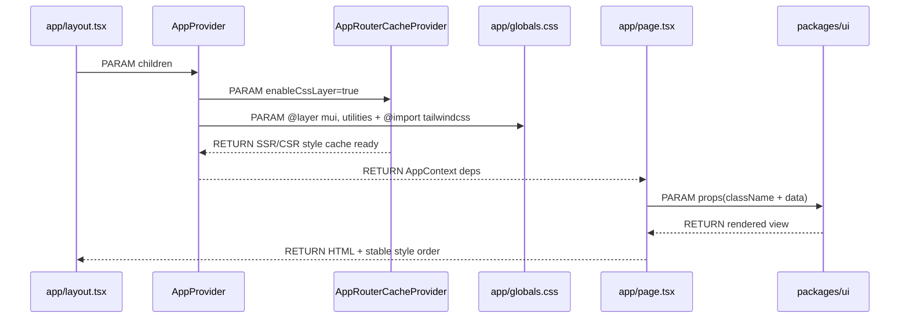
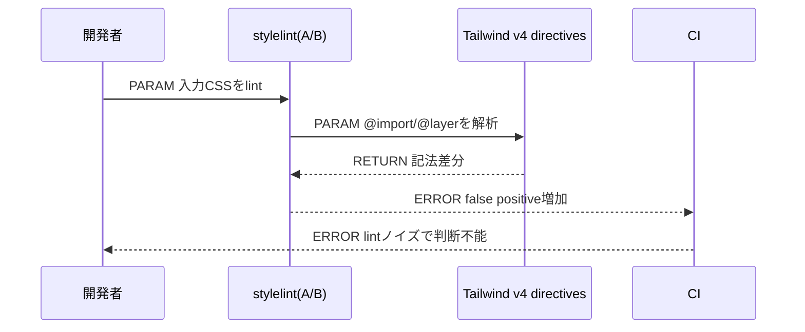
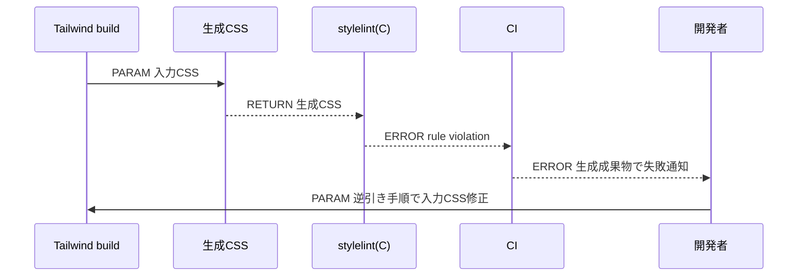
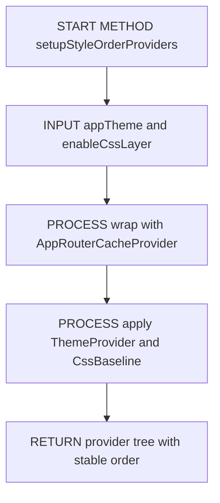
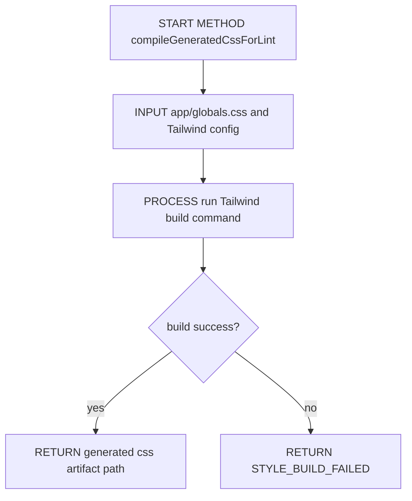
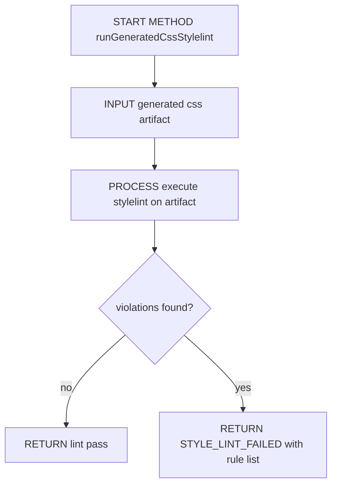

# Implementation Plan — Next(App Router) Tailwind v4 × MUI(Emotion) 共存と stylelint 運用方式のSSOT化

## 0. 実装入力コンテキスト

| 項目 | 記入 |
| --- | --- |
| 対象Issue | #111 `[DESIGN] Next(App Router): Tailwind v4 × MUI(Emotion) 共存 / stylelint運用（A/B/C比較・リスク表・設計判断をSSOT化）` |
| 対象リポジトリ内パス（実装起点） | `/home/runner/work/Agile-PMBOK-Assist/Agile-PMBOK-Assist` |

### 0.1 変更サマリ一覧（複数行）

| 区分（追加/修正/削除） | 対象（機能/画面/API） | 変更概要 |
| --- | --- | --- |
| 修正 | スタイリング基盤運用 | Tailwind v4 と MUI(Emotion) の SSR/CSR スタイル順序固定の実装手順を明文化する |
| 修正 | stylelint運用 | A/B/C 3方式を比較し、採用方式を設計判断として固定する |
| 追加 | CI品質ゲート | 生成CSS lint の実行順序・成果物扱い・再現性ガードを実装手順として定義する |
| 修正 | Storybook運用 | 本番と同じスタイル注入順の再現方針を固定する |
| 修正 | ドキュメント運用 | スタイリング運用SSOTの更新責務を定義する |

### 0.2 入力制約一覧（複数行）

| 制約区分（互換性/禁止事項/期限/その他） | 制約内容 | 適用対象 |
| --- | --- | --- |
| 互換性 | Next.js App Router の SSR/CSR で hydration mismatch を発生させない | `app/layout.tsx`, `src/providers/AppProvider.tsx`, `app/globals.css` |
| 互換性 | MUI は Emotion エンジン前提で運用し、Tailwind は utility 役割に限定する | スタイリング責務分離 |
| 互換性 | Tailwind の上書き順は CSS Layers で固定する | `app/globals.css` |
| 禁止事項 | page/ui に具象依存を持ち込まない（DI境界を崩さない） | `app/*/page.tsx`, `packages/ui/*` |
| 禁止事項 | stylelint を CSS-in-JS 全面監査に拡張しない | lint運用 |
| 禁止事項 | DESIGNフェーズで実装コードを変更しない | 本Issue |
| その他 | 本Issueでは stylelint 運用方式の SSOT 化を主目的とし、デザインシステム全面整備は対象外 | スコープ管理 |

### 0.3 関連機能・関連仕様一覧（複数行）

| 種別（要件/設計方針/ADR/調査/既存実装/外部仕様/その他） | パス/識別子 | この設計での利用目的 |
| --- | --- | --- |
| 要件 | `.github/copilot/10-requirements.md` | 受入条件をテスト可能な文で固定する |
| 設計方針 | `.github/copilot/20-architecture.md` | AppProvider 起点の責務分離を維持する |
| テスト戦略 | `.github/copilot/40-testing-strategy.md` | lint/build/test の品質ゲートとの整合を取る |
| セキュリティ | `.github/copilot/50-security.md` | CIログへの機密混入防止を確認する |
| CI品質 | `.github/copilot/60-ci-quality-gates.md` | stylelint 運用を品質ゲートへ接続する |
| テンプレート | `.github/copilot/80-templates/implementation-plan.md` | plan の章立てと記述粒度を準拠させる |
| 既存実装 | `app/globals.css` | `@layer mui, utilities;` + `@import "tailwindcss";` の現状を基準にする |
| 既存実装 | `src/providers/AppProvider.tsx` | `AppRouterCacheProvider(enableCssLayer)` と `ThemeProvider/CssBaseline` の責務を固定する |
| 既存実装 | `docs/styling.md` | Tailwind と MUI の使い分けルールを運用基準に反映する |

---

## 1. 実装対象機能と機能ゴール

| 項目 | 内容 | 根拠 |
| --- | --- | --- |
| 実装対象詳細（機能/画面/API） | Tailwind v4 × MUI(Emotion) 共存の順序・責務・衝突回避を固定し、stylelint 運用方式 A/B/C の比較結果を最終判断付きで実装可能な指示に落とす | Issue本文「ゴール」「設計書に必ず書くこと」 |
| 機能ゴール（実装後に観測できるユーザーユース） | 開発者が SSR/CSR の順序競合を再発させず、CIで stylelint を安定運用できる | Issue本文「目的」 |
| 非ゴール（今回やらないこと） | デザインシステム完成、既存画面全面リファクタ、CSS-in-JS全面監査 | Issue本文「Out of Scope」 |
| 完了条件（実装完了の判定） | A/B/C の比較表と採用判断に従って実装し、lint/build/test/securityゲートを通過できる | Issue本文「受け入れ条件」 |
| 受入確認手順（1行で再現可能） | `npm run lint && npm run test -- --run && npm run build` と stylelint用CIジョブを通し、SSR/CSR のスタイル順と hydration mismatch 非発生を確認する | CI品質ゲート方針 |

---

## 2. 前提・制約（SSOT）

| 種別 | 内容 | 根拠（ファイル/ADR/Issue） |
| --- | --- | --- |
| 参照したSSOT | `.github/copilot/00-index.md` 参照順に従い、設計入力を固定する | `.github/copilot/00-index.md` |
| Next.js構成前提（app/src/packages） | App Router 構成を維持し、`app/layout.tsx` を DI 起点として扱う | `.github/copilot/20-architecture.md` |
| 依存境界前提（page.tsx / AppProvider / contracts） | `AppProvider` が唯一の Composition Root。`app/*/page.tsx` は薄い橋渡しのみ | `.github/copilot-instructions.md` |
| 技術制約（互換性/期限/運用/セキュリティ） | SSR/CSRで順序固定、stylelintは現実解として品質ゲート設計を優先し、ログへSecretsを出さない | Issue本文、`.github/copilot/50-security.md` |
| 未確定前提（TBD） | なし（採用方式と実装ガードは本設計で確定） | 本ドキュメント |

---

## 3. 要件定義（実装受入条件）

### 3.1 機能要件

| ID | 要件 | 受入条件（テスト可能な形） |
| --- | --- | --- |
| FR-01 | MUI(Emotion) の SSR 挿入順を固定する | `AppRouterCacheProvider` の `enableCssLayer: true` が維持され、MUIスタイルが `@layer mui` に入る |
| FR-02 | Tailwind v4 レイヤー順を固定する | `app/globals.css` 先頭で `@layer mui, utilities;` と `@import "tailwindcss";` の順を維持する |
| FR-03 | Preflight/CssBaseline の衝突回避方針を固定する | `CssBaseline` は有効のまま、同一要素同一プロパティの二重指定禁止ルールを docs に従って運用する |
| FR-04 | 背景方針を明文化する | 「CSS-in-JS まで厳密に全面適用はハマりやすく、現実解は品質ゲート用途に割り切る」を plan本文に文章で記載する |
| FR-05 | 難しい原因1を明文化する | Tailwind v4 ディレクティブ/レイヤー起因で stylelint ノイズが増える説明を文章で記載する |
| FR-06 | 難しい原因2を明文化する | Emotion/styled の厳密lintは表現揺れと追随コストで破綻しやすい説明を文章で記載する |
| FR-07 | stylelint A/B/C の仕組みを明文化する | 各方式の対象・適用範囲・チェック対象を記述する |
| FR-08 | A/B/Cリスク表を設ける | 指定軸（対象、ノイズ、追随、CI、原因追跡、DX、SSR/CSR整合、採用可否）を含むMarkdown表を記載する |
| FR-09 | 採用方式を1つ確定する | 採用方式と不採用理由を短文で明記する |
| FR-10 | 製造Issue向け次タスクリストを固定する | 生成手順、lint手順、CIゲート、生成物扱い、ドキュメント更新のチェックリストを記載する |

### 3.2 非機能要件

| ID | 要件 | 受入条件（テスト可能な形） |
| --- | --- | --- |
| NFR-01 | 安定性 | stylelint実行で誤検知由来のCI不安定を抑制する設計がある |
| NFR-02 | 再現性 | 生成CSS lint は同一Node/同一コマンドで再現手順が固定されている |
| NFR-03 | 保守性 | Tailwind v4 / stylelint依存更新時の確認観点が定義されている |
| NFR-04 | 追跡容易性 | 失敗時に「生成手順→lint結果→入力CSS」の逆引き導線がある |
| NFR-05 | DX | 日常開発で守れる運用粒度（過度な抑制設定増殖を防ぐ）が示されている |
| NFR-06 | セキュリティ | CIログに機密を出さない方針が明記されている |
| NFR-07 | スコープ遵守 | DESIGN段階では設計文書のみ更新する |

---

## 4. スコープ境界

### 4.0 スコープ境界の定義（機能単位）

| 区分（In-Scope/Out-of-Scope） | 対象機能/責務 | 判定理由 |
| --- | --- | --- |
| In-Scope | Tailwind v4 × MUI(Emotion) 共存の順序固定 | SSR/CSR 競合回避の中核要件 |
| In-Scope | `AppRouterCacheProvider` / `ThemeProvider` / `CssBaseline` 責務の固定 | App Router での style 注入順制御に必須 |
| In-Scope | stylelint A/B/C 比較とリスク表 | 本Issueの必須成果 |
| In-Scope | 採用方式（最終判断）の確定 | 実装へ引き継ぐ設計判断として必須 |
| In-Scope | 実装タスクチェックリスト化 | 製造Issueの着手条件固定 |
| Out-of-Scope | 既存画面全面リファクタ | Issue明示の対象外 |
| Out-of-Scope | MUI/Tailwindテーマの深い統合 | 共存優先のため対象外 |
| Out-of-Scope | CSS-in-JS全面lint監査 | 本Issueは運用方式決定が主題 |
| Out-of-Scope | デザインシステム規約の全面整備 | 別Issueで扱う |
| Out-of-Scope | 実装コード変更 | DESIGNフェーズのため |

### 4.2 実装時の影響範囲・互換性リスク

| 影響対象 | 結論（影響あり/なし/未確定） | 影響内容 |
| --- | --- | --- |
| UI/画面 | 影響あり | style順序固定により Tailwind utility の上書き挙動が安定する |
| API契約 | 影響なし | API I/F の変更は行わない |
| データ互換 | 影響なし | DB/永続化へ影響しない |
| 外部依存 | 影響あり | stylelint/Tailwind関連設定のCI運用手順に影響する |
| CI/運用 | 影響あり | 生成CSS lint を導入する場合、実行時間と成果物管理が新規に必要 |

### 4.3 外部依存・Secrets の扱い

| 項目 | 内容 | リスク/対応 |
| --- | --- | --- |
| 外部依存の追加/更新 | 実装段階で stylelint 実行方式に応じた設定見直しが発生する可能性がある | 依存更新は固定バージョン戦略と変更ログ確認で管理する |
| Secrets 利用有無 | なし | stylelintジョブでSecrets不要 |
| ログ/設定への機密混入対策 | lintログにはCSSパス・ルール違反のみを出力する | 環境変数やトークンのechoを禁止する |

### 4.4 4章の自己検証（必須）

| チェック項目 | 合格条件 |
| --- | --- |
| Design PR差分を書いていないか | 実装責務/運用責務のみ記載し、設計作業そのものを要件化していない |
| 実装責務を書いているか | In-Scope に5件の実装責務を記載している |
| 実装影響を書いているか | 4.2 で `影響あり` が3件あり、具体影響を記載している |

---

## 5. アーキテクチャ設計

### 5.0 DI生成経路（テキスト必須）

| 区分（記載例/追記No） | 生成/受け渡し主体 | 契約名（contract） | 具象名（impl/plugins） | 入力（契約/型/設定） | 出力（契約/型/設定） | 境界制約（禁止事項を含む） |
| --- | --- | --- | --- | --- | --- | --- |
| 01 | `app/layout.tsx` | `AppProviderEntry（contract）` | `RootLayoutImpl（app）` | `children` | `AppProvider` 呼び出し | layoutで具象style実装を生成しない |
| 02 | `src/providers/AppProvider.tsx` | `StyleProviderContract` | `MUIEmotionProviderImpl` | `appTheme`, `enableCssLayer` | `ThemeProvider + CssBaseline + AppRouterCacheProvider` | 依存解決はAppProviderに限定 |
| 03 | `app/globals.css` | `GlobalStyleContract` | `TailwindLayerImpl` | `@layer`, `@import "tailwindcss"` | MUI→Tailwind utilities の順序 | CSSレイヤー順を任意変更しない |
| 04 | `app/*/page.tsx` | `PageBridgeContract` | `PageBridgeImpl` | `AppContext` 由来依存 | `packages/ui` props | pageでstyle engine設定を変更しない |
| 05 | `packages/ui/*` | `UiRenderContract` | `MUI+Tailwind UI Impl` | props, className | 描画結果 | UIでDI生成やSecrets参照をしない |

#### 5.0.1 最小固定セット（TBD禁止）

| 最小固定項目 | 必須記載内容 | 対応セクション |
| --- | --- | --- |
| DI単一路 | `app/layout.tsx -> AppProvider -> AppContext -> app/*/page.tsx -> packages/ui` | 5.0, 5.7.0, 5.7.2 |
| Server/Client境界 | cookie/session は Server 境界のみ。style処理で Client API を Server 側へ持ち込まない | 5.5.1, 8.3 |
| import許可/禁止 | `app/*/page.tsx` は `packages/contracts/*` `packages/ui/*` `AppContext` のみ参照。barrel経由 import を禁止 | 8.3, 8.4 |

### 5.1 設計判断

#### 5.1.1 責務分離 / データフロー（詳細）

| レイヤ | 主責務 | 禁止事項 |
| --- | --- | --- |
| `AppProvider` | Emotion/MUIのSSRキャッシュとテーマ適用を固定する | page/UI側で `ThemeProvider` を再生成しない |
| `globals.css` | Tailwind v4 の layer 順序を固定する | layer定義を後方に移動して順序を崩さない |
| `page` | AppContext依存をUIへ橋渡しする | 業務ロジックとstyle engine設定を持たない |
| `ui` | MUI部品とTailwind utilityを表示責務で使い分ける | fetch/storage/loggerなど具象I/Oを持たない |
| CI lint | stylelint 運用方式に基づく品質ゲートを提供する | ルール抑制を恒常化してノイズ放置しない |

#### 5.1.2 エッジケース / 例外系 / リトライ方針（詳細）

| No. | ケース | 方針（戻り値/表示/再試行） | 根拠 |
| --- | --- | --- | --- |
| 1 | Tailwind v4記法を stylelint が誤検知 | 運用方式比較に基づき対象範囲を限定し、誤検知抑制を設計で先に固定する | ノイズ起因のCI不安定回避 |
| 2 | CSS-in-JS 文字列で lint 失敗が多発 | CSS-in-JS 全面監査を採用しない。ESLint/TypeScript 側で補完する | 運用コスト過大化回避 |
| 3 | 生成CSSが環境差で変動 | Nodeバージョン固定と生成手順固定で再現性を担保する | CI安定性 |
| 4 | 生成CSS lint 失敗時に原因追跡困難 | 生成成果物へのコメント/ログ導線を定義し、入力CSSへの逆引き手順を運用化する | 修正速度確保 |
| 5 | Storybookと本番で表示差が出る | Storybook側も MUI + CssBaseline + Tailwind順を本番同等に維持する | 見た目の差分混入防止 |

#### 5.1.3 背景と難しい原因（必須明文化）

Tailwind v4 と MUI(Emotion) を App Router SSR で併用する構成では、stylelint を「全面適用（CSS-in-JSまで厳密に）」しようとすると失敗確率が高い。理由は、入力CSS側に Tailwind 固有ディレクティブや layer 宣言が含まれ、lintエンジン側との解釈差による誤検知が増えやすいこと、さらに CSS-in-JS 側はテンプレートリテラル・`sx` オブジェクト・動的式など表現が多様で、運用が複雑化しやすいことにある。

難しい原因1は、Tailwind v4 の `@import "tailwindcss";` と `@layer` を中心に、stylelint の標準ルールでノイズが生まれやすい点である。設定抑制が増えると lint の信頼性が下がり、CI での品質ゲート価値が薄れる。

難しい原因2は、Emotion / styled() を stylelint で厳密監査する運用が元々クセの強い領域である点である。CSS-in-JS は記法の幅が広く、プラグイン追随や例外設定の維持コストが継続的に発生するため、厳密適用を目指すほどDX悪化と運用破綻のリスクが高い。

このため本設計では、stylelint の役割を「品質ゲートとして有効な範囲へ限定」する。具体的には A/B/C 比較を行い、最終的に採用方式を1つへ固定する。

#### 5.1.4 ログと観測性（漏洩防止を含む / 詳細）

| No. | 観点 | 方針 | 根拠 |
| --- | --- | --- | --- |
| 1 | lintログ | 対象ファイル・ルールID・違反箇所のみを出力する | 調査容易性 |
| 2 | マスキング | Secrets/PII/トークンの出力を禁止する | `.github/copilot/50-security.md` |
| 3 | 失敗時記録 | 生成工程失敗と lint 失敗をジョブ分離またはステップ名で識別する | 原因追跡 |
| 4 | 監視 | required status checks に lint/build/test/security を維持する | `.github/copilot/60-ci-quality-gates.md` |
| 5 | 運用確認 | SSR/CSR順序崩れと stylelintノイズ率をPRで確認する | 品質ゲート実効性 |

### 5.2 トレードオフ

| 判断テーマ | 案A | 案B | 採用案 | 採用理由 | 不採用理由 |
| --- | --- | --- | --- | --- | --- |
| stylelint運用 | 入力CSS中心（A/B）を強化 | 生成CSS中心（C）に寄せる | 生成CSS中心（C） | Tailwind v4 記法由来ノイズを減らし、最終成果物品質を安定ゲート化できる | A/Bは設定追随コストと誤検知の継続負債が大きい |
| MUI/Tailwind上書き順 | 個別コンポーネントで調整 | AppProvider + CSS Layers で全体固定 | 全体固定 | SSR/CSR差分を抑え、画面横断で一貫挙動を維持できる | 局所調整は再発しやすい |

### 5.3 ルーティング方針の確定と移行戦略

| 項目 | 決定内容 | 根拠 |
| --- | --- | --- |
| App Router前提 | 維持（移行なし） | 既存実装が App Router 構成 |
| DI起点 | `app/layout.tsx` + `AppProvider` 固定 | SSOTのDIPルール |
| 移行単位 | 実装時はスタイル運用ルールとCI手順を段階導入する | 既存画面への影響を最小化 |
| ロールバック | 生成CSS lint を一時的に optional 化できる設計で段階導入する | CI停止リスク抑制 |

### 5.4 依存カテゴリ方針（境界崩壊防止）

| 依存カテゴリ（DataSource/Service/Adapter/Config） | 定義 | 許可レイヤ（app/src/contracts/ui/plugins） | 禁止レイヤ |
| --- | --- | --- | --- |
| Config | style順序・lint対象・CIジョブ設定 | `app`, `src/providers`, `.github/workflows` | `packages/ui` 内での環境依存定義 |
| Adapter | MUI Emotion SSR キャッシュ連携 | `src/providers` | `app/*/page.tsx` |
| Service | 生成CSS作成と lint 実行 | CIジョブ | `packages/contracts` |
| DataSource | 本Issueでは該当なし | なし | 全レイヤ |

### 5.5 データ取得ライフサイクル（SSR/SSG/CSR）

| データ種別 | 取得タイミング（SSR/SSG/CSR） | 取得場所（page/usecase/client等） | 理由 |
| --- | --- | --- | --- |
| MUIスタイルキャッシュ | SSR/CSR | `AppRouterCacheProvider` | hydration mismatch 回避 |
| Tailwind utilities | build時生成 + 実行時適用 | `app/globals.css` | 上書き順固定 |
| lint対象CSS | CI実行時 | stylelintジョブ | 品質ゲート |

#### 5.5.1 Server/Client 境界固定（Next.js）

| 対象処理 | 実行境界（Server/Client/Shared） | 実装場所（page/getServerSideProps/usecase等） | ブラウザAPI利用（可/不可） | Cookie/Session読取位置 | 禁止事項 |
| --- | --- | --- | --- | --- | --- |
| style挿入順制御 | Shared（SSR + CSR） | `src/providers/AppProvider.tsx` | 不可 | なし | page/uiで順序制御しない |
| Tailwind layer宣言 | Shared | `app/globals.css` | 不可 | なし | レイヤー順序を任意変更しない |
| stylelint実行 | Server（CI） | workflow/job | 不可 | なし | Client側でlint実行しない |

### 5.6 エラーハンドリング標準形

| 分類（network/unauthorized/notfound/unknown） | 返却型/エラーコード | UI表示ルール | 再試行ルール |
| --- | --- | --- | --- |
| network | `CI_NETWORK_ERROR` | CI失敗として表示 | ネットワーク回復後に再実行 |
| unauthorized | `CI_PERMISSION_ERROR` | CI失敗として表示 | permissions修正後に再実行 |
| notfound | `STYLE_TARGET_NOT_FOUND` | lint対象設定不整合として表示 | 対象パス修正後に再実行 |
| unknown | `STYLE_PIPELINE_UNKNOWN_ERROR` | CI失敗として表示 | ログ確認後に再実行 |

| ログ方針 | 内容 |
| --- | --- |
| 出力する情報 | コマンド、対象ファイル、ルール違反、終了コード |
| 出力しない情報 | トークン、Cookie、セッション、生の機密設定 |

#### 5.6.1 エラー変換責務（例外 -> 契約エラー）

| 層 | 例外入力 | 変換後契約エラー | 利用側ハンドリング |
| --- | --- | --- | --- |
| CI生成ステップ | Tailwind生成失敗 | `STYLE_BUILD_FAILED` | lintステップを停止し、生成ログを表示 |
| stylelintステップ | lint実行失敗 | `STYLE_LINT_FAILED` | 失敗ルールと対象を明示 |
| Storybook確認ステップ | 表示差分検知 | `STYLE_VISUAL_DRIFT` | デコレーター順序を見直して再実行 |

### 5.7 シーケンス図（Mermaid / 複数必須）

#### 5.7.0 DI生成経路（テキスト再掲 / 必須）

| 区分（記載例/追記No） | 生成主体 | 消費主体 | 契約名（contract） | 具象名（impl/plugins） | 経路（`A -> B -> C`） | 境界制約チェック | 関連シーケンス |
| --- | --- | --- | --- | --- | --- | --- | --- |
| 01 | `app/layout.tsx` | `AppProvider` | `AppProviderEntry（contract）` | `RootLayoutImpl` | `layout -> AppProvider` | layoutで具象DIを生成しない | SEQ-01 |
| 02 | `AppProvider` | `AppContext` | `StyleProviderContract` | `MUIEmotionProviderImpl` | `AppProvider -> AppContext` | DI生成はAppProviderのみ | SEQ-01 |
| 03 | `AppContext` | `app/*/page.tsx` | `PageBridgeContract` | `PageBridgeImpl` | `AppContext -> page` | pageは橋渡し限定 | SEQ-01/02 |
| 04 | `page` | `packages/ui` | `UiRenderContract` | `UiRenderImpl` | `page -> ui` | UIで具象I/O禁止 | SEQ-01/02 |

#### 5.7.1 シーケンス対象一覧

| シーケンスID | 対象 | 目的 |
| --- | --- | --- |
| SEQ-01 | 正常系（SSR/CSR共存） | MUIとTailwindの順序固定を確認 |
| SEQ-02 | 異常系（stylelintノイズ） | A/B方式の運用破綻点を可視化 |
| SEQ-03 | 異常系（生成CSS lint失敗） | C方式の原因追跡導線を明確化 |

#### 5.7.2 正常系シーケンス（必須）

#### 5.7.3 異常系シーケンス（業務エラー）

#### 5.7.4 異常系シーケンス（システムエラー）

### 5.8 処理フロー図（メソッドレベル / 複数必須）

#### 5.8.1 メソッド一覧

| メソッドID | メソッド名 | 責務 | 実装想定位置 |
| --- | --- | --- | --- |
| FLOW-01 | `setupStyleOrderProviders` | AppProvider で style 注入順を固定する | `src/providers/AppProvider.tsx` |
| FLOW-02 | `compileGeneratedCssForLint` | 生成CSSをlint対象として作成する | CI workflow script |
| FLOW-03 | `runGeneratedCssStylelint` | 生成CSSに stylelint を実行し結果を返す | CI workflow script |

#### メソッドフロー(FLOW-01)

#### メソッドフロー(FLOW-02)

#### メソッドフロー(FLOW-03)

## 6. 契約仕様（Interface Contract）

### 6.0 DIP固定前提（Plugin型アーキテクチャ）

- Composition Root は `AppProvider` のみとし、page/uiでDI生成しない。
- `contracts` には interface/type のみを定義し、I/O実装を置かない。
- 例外の契約エラー変換は providers/plugins/CI実行境界で行う。

### 6.1 入出力契約（API/関数/UseCase）

| 契約名 | 入力 | 出力 | エラー |
| --- | --- | --- | --- |
| `StyleOrderProviderContract` | `appTheme`, `enableCssLayer` | Provider tree | `STYLE_PROVIDER_CONFIG_ERROR` |
| `GeneratedCssBuildContract` | 入力CSSパス、ビルドコマンド | 生成CSSパス | `STYLE_BUILD_FAILED` |
| `GeneratedCssLintContract` | 生成CSSパス、lintルール | pass/fail結果 | `STYLE_LINT_FAILED` |

### 6.2 型/DTO/スキーマ

| 名称 | 種別 | 必須項目 |
| --- | --- | --- |
| `GeneratedCssLintResult` | DTO | `status`, `targetFile`, `violations[]` |
| `StyleOrderConfig` | type | `enableCssLayer`, `layerOrder` |
| `StylePipelineError` | type | `code`, `message`, `step` |

### 6.3 契約インターフェース定義（実装エンジニア向け固定案）

#### 6.3.1 stylelint 運用方式 A/B/C の仕組み

| 方式 | 仕組み | 対象ファイル | 対象外 |
| --- | --- | --- | --- |
| A（設計図 lint） | `app/globals.css` / `*.module.css` など入力CSSを直接 lint する | 入力CSS | 生成CSS、CSS-in-JSの大半 |
| B（v4追随設定 lint） | Aを成立させるために stylelint 設定を Tailwind v4記法へ追随させる | 入力CSS + 追随設定 | 生成CSS |
| C（完成品 lint） | Tailwind が生成した最終CSSのみを lint する | 生成CSS | 入力CSS直接lint、CSS-in-JS全面lint |

#### 6.3.2 A/B/C リスク比較表（必須）

| 方式 | 対象（入力CSS / 生成CSS / 設定追随） | 誤検知・ノイズ耐性 | Tailwind v4 追随コスト | CI安定性（環境差） | 原因追跡のしやすさ | DX（日常運用） | SSR/CSR（MUI併用）整合性 | 採用可否（最終判断）と理由 |
| --- | --- | --- | --- | --- | --- | --- | --- | --- |
| A | 入力CSS | 低い（`@import`/`@layer` 由来ノイズが出やすい） | 中〜高（抑制ルール調整が継続） | 中（lintノイズで実質不安定） | 高い（入力を直せる） | 低〜中（ノイズ対応負荷） | 中（順序整合は別途担保が必要） | 不採用。追随運用なしではノイズが多く品質ゲートが形骸化しやすい |
| B | 入力CSS + v4追随設定 | 中（設定次第で改善） | 高い（config/plugin追随が必須） | 中（依存更新で崩れる） | 中（設定層の切り分けが必要） | 低（設定メンテが重い） | 中（設定維持に依存） | 不採用。ロックインと保守コストが高く、長期運用で破綻しやすい |
| C | 生成CSS | 高い（ディレクティブ誤検知を回避） | 低〜中（生成手順固定が主） | 中〜高（再現条件固定で安定） | 中（逆引き手順が必要） | 中〜高（ノイズ少なく守りやすい） | 高い（最終成果物で整合性を確認可能） | 採用。最終成果物品質を直接ゲートでき、Tailwind v4記法ノイズを抑えられる |

#### 6.3.3 最終設計判断（採用方式）

- 採用方式: **C（生成CSSを lint する方式）**
- 採用理由: Tailwind v4 ディレクティブ由来の誤検知を回避しつつ、ブラウザが解釈する最終成果物を品質ゲートできるため。
- A不採用理由: 入力CSS直lintはノイズ増加と抑制設定肥大化を招き、CIの判定品質が落ちるため。
- B不採用理由: config/plugin追随の継続コストが高く、破壊的変更に弱いため。

## 7. データ設計（必要な場合のみ）

| 項目 | 内容 |
| --- | --- |
| 永続化データ追加 | なし |
| 生成物 | 生成CSS（CIワークスペース内の一時成果物） |
| 生成物保持方針 | デフォルトはCI内一時利用。デバッグ時のみ artifact 保存を許可 |
| 再現性キー | Node/Tailwind/stylelint バージョン固定とコマンド固定 |

## 8. 実装指示（製造Agent向け）

### 8.1 変更予定ファイル一覧（必須）

以下は **IMPLEMENT フェーズでの変更予定** であり、DESIGNフェーズの本PR差分ではない。

| 区分 | ファイル | 目的 |
| --- | --- | --- |
| 修正 | `src/providers/AppProvider.tsx` | `AppRouterCacheProvider` + `ThemeProvider` + `CssBaseline` の順序固定を維持・明確化 |
| 修正 | `app/globals.css` | `@layer` と Tailwind import の順序固定を維持 |
| 修正 | `.github/workflows/*`（該当lintジョブ） | 生成CSS lint 手順とCIゲートを実装 |
| 修正 | `docs/styling.md` | 運用方式Cと責務分離ルールを反映 |

### 8.2 実装手順（順序付き）

1. 現状の MUI/Tailwind 共存構成（AppProvider + globals.css）を崩さないことを先に確認する。
2. 生成CSSを作るコマンドをCIで固定し、Nodeバージョンと実行順を明示する。
3. stylelint は生成CSSのみを対象に実行する。
4. lint失敗時ログに、対象ファイル・違反ルール・逆引き手順を残す。
5. docs/styling.md と関連運用ドキュメントへ採用方式Cと不採用理由（A/B）を記載する。
6. lint/build/test/security を required status checks として通過確認する。

### 8.3 実装禁止事項（ガードレール）

- `app/*/page.tsx` で DI コンテナを生成しない。
- `packages/ui` で具象I/O依存（fetch/storage/logger）を追加しない。
- stylelint対象を CSS-in-JS全面監査に拡張しない。
- `contracts` に実装ロジックを追加しない。
- `AppProvider` 外で `ThemeProvider` / `CssBaseline` の根本順序を再定義しない。

### 8.4 import制約の自動化

| ルール | 内容 |
| --- | --- |
| contracts参照 | `@contracts/*` エイリアスのみ使用する |
| pageの依存境界 | `packages/contracts/*` `packages/ui/*` `AppContext` 以外の具象importを禁止 |
| barrel禁止 | `app/` `src/` 境界横断で `index.ts` 経由 import を禁止 |
| UI export | Named Export を維持し default export を増やさない |

## 9. テスト実装計画

### 9.1 テストケース

| ID | レベル | 観点 | 手順 | 期待結果 |
| --- | --- | --- | --- | --- |
| T-01 | lint | 生成CSS lint成功 | 生成CSS作成後に stylelint 実行 | ノイズでなく実違反のみ検出 |
| T-02 | build | SSR/CSR整合 | `npm run build` 実行 | hydration mismatch が発生しない |
| T-03 | test | UIスモーク | 既存 Vitest を実行 | 既存UIテストが通過 |
| T-04 | visual | Storybook整合 | MUI + Tailwind 使用コンポーネント確認 | 本番と同じ上書き順を維持 |
| T-05 | recovery | 失敗導線 | 生成CSS lintを意図的に失敗 | 逆引き可能なログが得られる |

## 10. オープン課題 / ADR

| ID | 内容 | 期限 | 担当 |
| --- | --- | --- | --- |
| OQ-01 | 生成CSS lintの実行時間が許容範囲か計測し、必要なら並列化/キャッシュ方針を追加する | IMPLEMENT初回PR | 実装担当 |
| OQ-02 | stylelintルールセットの最小構成を定義し、過剰ルールを避ける | IMPLEMENT初回PR | 実装担当 |

### 10.1 TBD回収トラッキング（必須）

| 対象 | 現在値 | 回収方針 |
| --- | --- | --- |
| 未確定項目 | なし | 本設計で採用方式と運用手順を固定済み |

## 11. 新規ページ追加テンプレ（設計規約）

### 11.1 docs 必須項目

- `docs/styling.md` に運用方式Cと A/B 不採用理由を追記する。
- Tailwind utility と MUI役割分離ルールを維持する。

### 11.2 contracts 必須項目

- stylelint運用で新規契約型を追加する場合、interface/type のみを定義する。
- 例外変換ロジックを contracts に置かない。

### 11.3 ui 必須項目

- UIは表示責務に限定し、style engine設定を持たない。
- 同一プロパティの Tailwind/MUI 多重指定を避ける。

### 11.4 app page 必須項目

- pageは AppContext 依存を UIへ橋渡しするだけにする。
- style順序制御は AppProvider と globals.css に集約する。

## 付録A: stylelint運用A/B/C比較の要点

### 比較対象

- A: 入力CSSを直接lint
- B: Aを成立させるためのTailwind v4追随設定を追加
- C: 生成CSSのみlint

### 最終判断

- 採用: C
- 判断根拠: ノイズ耐性、CI安定性、SSR/CSR整合性の総合評価が最も高い。

## 付録B: 製造Issueへ渡す次の実装タスクチェックリスト

- [ ] 生成手順: Tailwind 生成CSSコマンドをCIに固定し、Nodeバージョンを明示する。
- [ ] lint手順: stylelint を生成CSSのみに適用し、対象外（CSS-in-JS全面監査）を明記する。
- [ ] CIゲート: lint/build/test/security を required status checks として通過確認する。
- [ ] 生成物の扱い: 生成CSSは基本一時成果物とし、デバッグ時のみ artifact 保存する。
- [ ] ドキュメント更新: `docs/styling.md` と関連運用文書に採用方式CとA/B不採用理由を追記する。
