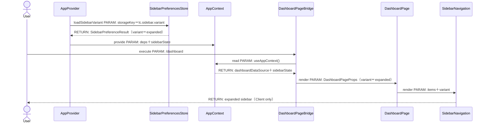
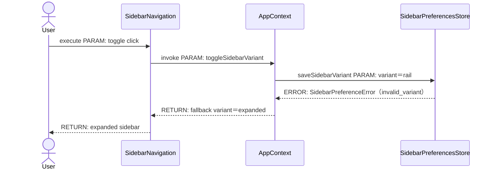
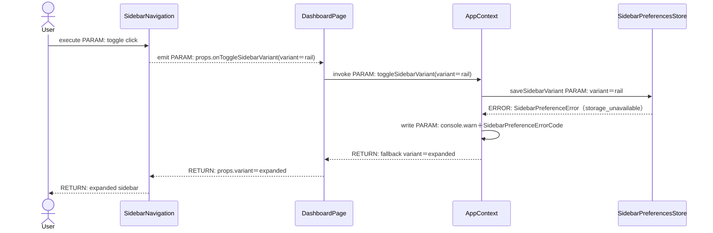
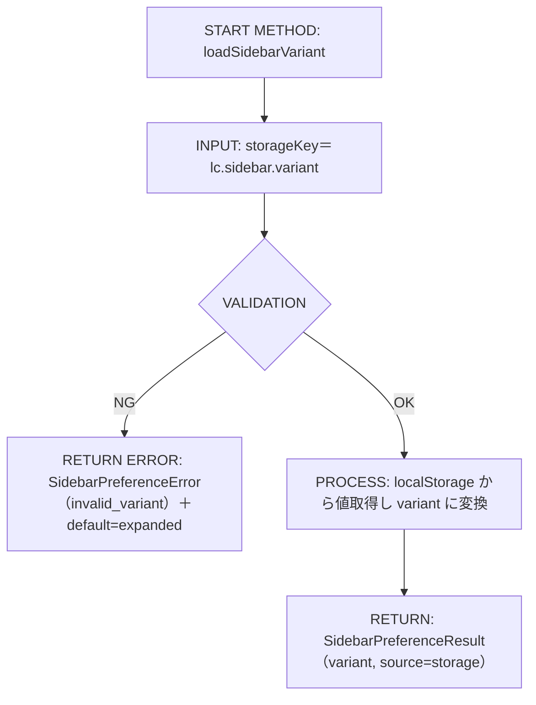
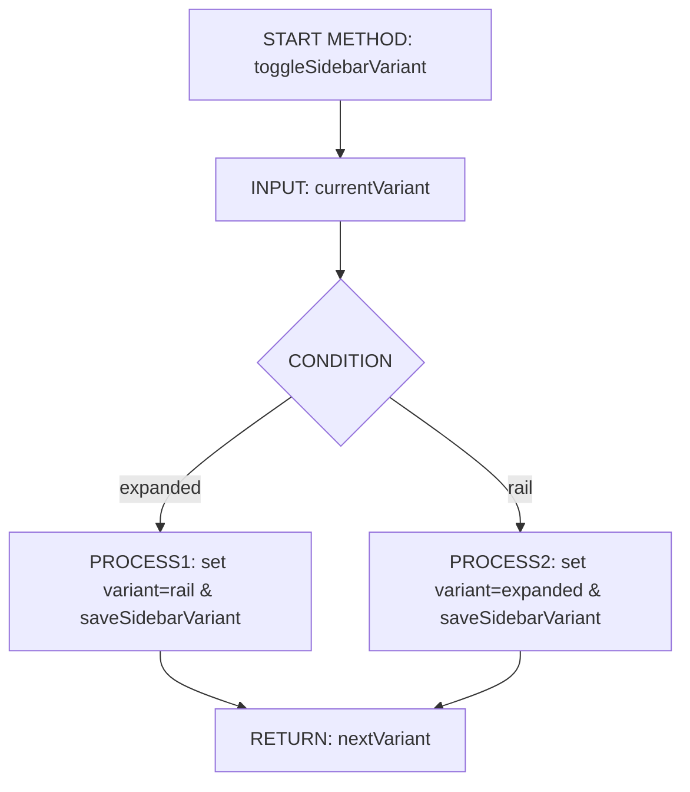
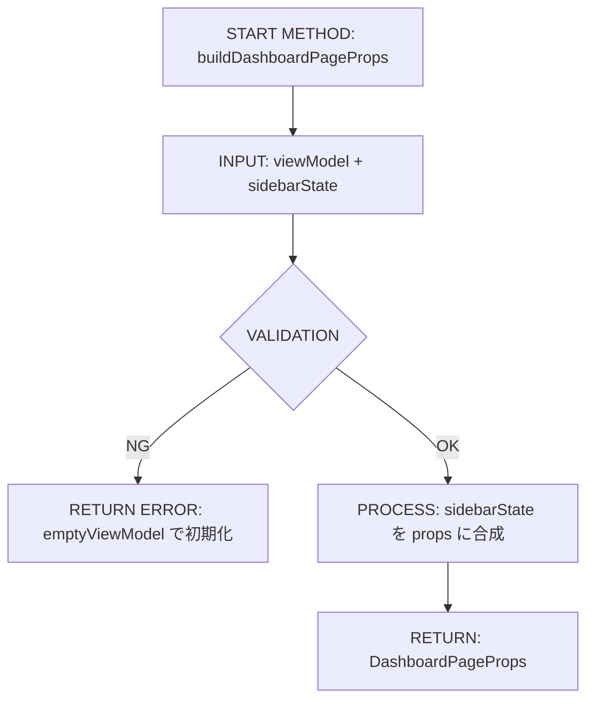
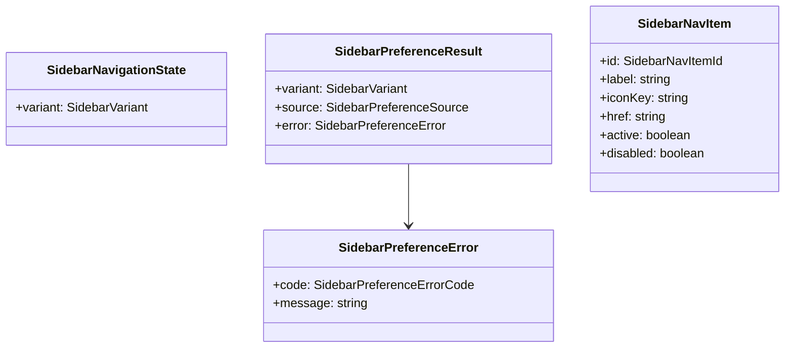
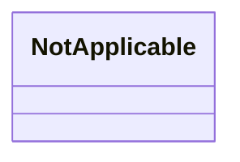

# Implementation Plan: 127-layout-sidebar-nav-rail

---

## 0. 実装入力コンテキスト

| 項目 | 記入 |
| --- | --- |
| 対象Issue | [DESIGN] Upstream Demo: 折りたたみナビ（レール）対応（左メニュー新設 + アイコン大型化） |
| 対象リポジトリ内パス（実装起点） | packages/ui/src/organisms/SidebarNavigation.tsx / src/providers/AppProvider.tsx / packages/contracts/src/pages/dashboard.ts |

運用補足: Agentが実装時に直接参照する入力のみを記載する。未確定は `TBD（理由/決定条件/期限）` で記載する。

### 0.1 変更サマリ一覧（複数行）

| 区分（追加/修正/削除） | 対象（機能/画面/API） | 変更概要 |
| --- | --- | --- |
| 追加 | サイドバー状態契約 | SidebarVariant/SidebarNavItemId/SidebarPreferencesStore を契約として追加する |
| 追加 | SidebarPreferencesStore 実装 | localStorage 永続化とフォールバックをクライアントUI（AppProvider）で完結させる |
| 追加 | サイドバートグルUI | レール/展開トグルボタンと Tooltip を UI 部品として追加する |
| 修正 | SidebarNavigation | rail/expanded の UI 表示、アイコン大型化、a11y を実装する |
| 修正 | DashboardPage / app/dashboard/page.tsx | AppContext の rail 状態を UI に渡して切替可能にする |
| 修正 | AppProvider/AppContext | rail 状態の永続化とグローバル状態共有を追加する |
| 修正 | createClientDeps | ナビ項目に href と ID を追加して SSOT を固定する |

運用補足: 行数が不足する場合は同じ形式で行を追加する。

### 0.2 入力制約一覧（複数行）

| 制約区分（互換性/禁止事項/期限/その他） | 制約内容 | 適用対象 |
| --- | --- | --- |
| 互換性 | Dashboard 画面の既存データ契約（DashboardViewModel など）を維持し、追加は後方互換のみにする | contracts/pages/dashboard.ts |
| 互換性 | 既存の nav 項目の表示順と文言は維持する | SidebarNavigation / createClientDeps |
| 互換性 | `AppProvider -> createClientDeps -> AppContext -> page -> UI` の DI 単一路を維持する | AppProvider/AppContext/app/dashboard/page.tsx |
| 禁止事項 | `page`/`ui` から localStorage 等の browser API を直接呼ばない | app/*/page.tsx / packages/ui |
| 禁止事項 | `packages/contracts` に実装ロジックや localStorage 操作を入れない | packages/contracts |
| 禁止事項 | UI で default export や index.ts 経由 import を新規導入しない | packages/ui |
| 期限 | 期限指定なし（本Issueに納期指定なし） | 全体 |
| その他 | サーバーAPI/DB/Route Handler 追加なし、フロントUI（app/page + packages/ui）で完結させる | app/dashboard/page.tsx |
| その他 | MUI + Emotion 以外の UI ライブラリ追加は禁止 | packages/ui |

運用補足: 行数が不足する場合は同じ形式で行を追加する。

### 0.3 関連機能・関連仕様一覧（複数行）

| 種別（要件/設計方針/ADR/調査/既存実装/外部仕様/その他） | パス/識別子 | この設計での利用目的 |
| --- | --- | --- |
| 要件 | Issue 本文（[DESIGN] Upstream Demo: 折りたたみナビ） | FR/NFR の根拠にする |
| 設計方針 | .github/copilot/20-architecture.md | DI/責務分離の固定方針を適用する |
| 設計方針 | .github/copilot-instructions.md | SSOT・DIP・import ルールの参照 |
| 既存実装 | packages/ui/src/organisms/SidebarNavigation.tsx | rail/expanded UI の拡張対象 |
| 既存実装 | src/providers/AppProvider.tsx / src/providers/AppContext.tsx | 状態永続化の置き場 |
| 既存実装 | app/dashboard/page.tsx | AppContext から UI への橋渡し |
| 既存実装 | src/lib/createClientDeps.ts | ナビ項目 SSOT（ダミーデータ） |
| その他 | .github/copilot/80-templates/implementation-plan.md | 本 plan の章構成ルール |

運用補足: 行数が不足する場合は同じ形式で行を追加する。

---

## 1. 実装対象機能と機能ゴール

| 項目 | 内容 | 根拠 |
| --- | --- | --- |
| 実装対象詳細（機能/画面/API） | Dashboard の左ナビを expanded / rail で切替可能にし、レール時はアイコン中心表示にする | Issue 目的/要件 |
| 機能ゴール（実装後に観測できるユーザーユース） | ユーザーが左ナビを折りたたんでも主要導線にアクセスでき、状態が画面遷移後も維持される | Issue ゴール/受入条件 |
| 非ゴール（今回やらないこと） | ルーティング全体再設計、認証・権限・外部 API 連携、デザインシステム刷新 | Issue 非ゴール |
| 完了条件（実装完了の判定） | expanded/rail 切替・永続化・a11y 設計が実装され、lint/typecheck/test が全て成功する | 受入条件/品質ゲート |
| 受入確認手順（1行で再現可能） | `/dashboard` 表示 → 左ナビのトグル操作 → 画面遷移後に rail 状態維持を確認 → `npm run lint && npm run test` | Issue 受入条件 |

運用補足: 「完了条件」はテストまたは確認手順で判定可能な文で記載する。
運用補足: 「受入確認手順」はコマンド/操作を1行で再現できる形で記載する（例: `/dashboard` 表示確認 + lint 実行）。

---

## 2. 前提・制約（SSOT）

| 種別 | 内容 | 根拠（ファイル/ADR/Issue） |
| --- | --- | --- |
| 参照したSSOT | 00-index.md 参照順に従い、copilot-instructions と 20-architecture を優先する | .github/copilot/00-index.md |
| Next.js構成前提（app/src/packages） | app router で `app/layout.tsx` が Composition Root | app/layout.tsx |
| 依存境界前提（page.tsx / AppProvider / contracts） | `AppProvider -> createClientDeps -> AppContext -> page -> UI` の単一路を維持する | .github/copilot-instructions.md |
| 技術制約（互換性/期限/運用/セキュリティ） | MUI + Emotion 前提、Tailwind は補助用途、Secrets/PII のログ禁止 | Issue 要件/20-architecture |
| 未確定前提（TBD） | 未確定前提なし（本設計で全て確定） | Issue 要件 |

運用補足: 根拠は `ファイルパス` または `Issue/ADR` を必ず記載する。

---

## 3. 要件定義（実装受入条件）

### 3.1 機能要件

| ID | 要件 | 受入条件（テスト可能な形） |
| --- | --- | --- |
| FR-01 | 左ナビが expanded/rail で切替可能である | `/dashboard` でトグル操作すると幅と表示が切り替わる |
| FR-02 | rail 状態でも nav 項目のアイコンから遷移導線に到達できる | rail 時に nav アイテムがクリック可能で tooltip が表示される |
| FR-03 | nav の選択状態が expanded/rail 両方で判別できる | 選択中 item が背景/インジケータ/aria-current で示される |
| FR-04 | トグルボタンが左ナビ上部に常設される | rail/expanded いずれでもトグルが表示される |
| FR-05 | トグル状態が AppContext で保持され、画面遷移後も維持される | ブラウザストレージ（localStorage）から復元され、再描画で保持される |
| FR-06 | アイコンが現状より大きく、クリック領域 40px 以上を確保する | expanded: 24px、rail: 32px 以上、ボタン最小高さ 40px |
| FR-07 | nav 項目の SSOT（id/label/iconKey/href/order）を契約に固定する | contracts で型定義し、createClientDeps で同順序のダミーを生成 |
| FR-08 | rail 時はラベルを非表示とし、tooltip によって補助する | rail 表示で label が DOM 非表示、Tooltip が label を示す |
| FR-09 | keyboard フォーカスと aria 属性が設定される | ListItemButton に focus ring と aria-current/aria-label が付与される |
| FR-10 | Toggle に aria-expanded と aria-label を付与する | トグルの aria 属性が状態に連動する |
| FR-11 | rail/expanded の幅を固定値で定義する | expanded=256px, rail=72px を満たす |

運用補足: IDは `FR-01` 形式の連番（欠番禁止）。

### 3.2 非機能要件

| ID | 要件 | 受入条件（テスト可能な形） |
| --- | --- | --- |
| NFR-01 | 既存の DashboardViewModel に対して後方互換を保つ | 既存項目は維持し、追加は optional でデフォルトを用意する |
| NFR-02 | Storybook で expanded/rail/selected 状態を確認できる | SidebarNavigation の story を3パターン以上作成する |
| NFR-03 | UI の単体テストで rail/expanded と toggle 挙動を検証する | SidebarNavigation.test で両状態の DOM を検証する |
| NFR-04 | E2E でトグル→遷移→保持を検証する方針とする | Playwright の smoke テストを追加する |
| NFR-05 | MUI + Emotion を利用し、Tailwind は補助用途に留める | UI 実装が既存の MUI と統一される |
| NFR-06 | DI/境界ルール（AppProvider 起点、contracts 直参照）を遵守する | page/ui で localStorage や plugins 直接 import を行わない |
| NFR-07 | ログに PII/Secrets を含めない | localStorage エラー時もメッセージのみ出力する |

運用補足: IDは `NFR-01` 形式の連番（欠番禁止）。

---

## 4. スコープ境界

運用補足: この章は「実装時の影響範囲」を記載する。設計Agentの作業内容や設計書ファイル変更そのものは書かない。
運用補足: この章は「この設計を実装したときの想定差分」を書く。現在のDesign PR差分は書かない。

### 4.0 スコープ境界の定義（機能単位）

| 区分（In-Scope/Out-of-Scope） | 対象機能/責務 | 判定理由 |
| --- | --- | --- |
| In-Scope | SidebarNavigation の rail/expanded 表示切替 | FR-01/FR-02/FR-08 |
| In-Scope | トグルボタンと状態保持（AppContext + localStorage） | FR-04/FR-05 |
| In-Scope | アイコン大型化とタップターゲット拡大 | FR-06 |
| In-Scope | nav 項目の SSOT を contracts に固定 | FR-07 |
| In-Scope | a11y 属性とフォーカス表示 | FR-09/FR-10 |
| Out-of-Scope | ルーティング再設計（画面追加・階層変更） | 非ゴール |
| Out-of-Scope | 認証・権限・外部 API 連携 | 非ゴール |
| Out-of-Scope | デザインシステム刷新（テーマ変更） | 非ゴール |
| Out-of-Scope | サーバーサイドでの状態永続化 | 制約（Client only） |
| Out-of-Scope | サーバーAPI/DB/Route Handler の追加 | フロントUIのみで完結 |
| Out-of-Scope | CI 設定の追加・変更 | Design 範囲外 |

運用補足: 対象機能/責務は「実装で変更される責務単位」を書く（例: 初期表示データ取得責務、エラー標準化責務、import境界強制責務）。
運用補足: 判定理由は FR/NFR への対応、または非対象理由（別Issue/条件未達）で書く。
運用補足: ファイル列挙は `8.1 変更予定ファイル一覧` に一本化する。

### 4.2 実装時の影響範囲・互換性リスク

| 影響対象 | 結論（影響あり/なし/未確定） | 影響内容 |
| --- | --- | --- |
| UI/画面 | 影響あり | Sidebar の幅・表示・トグル追加により UI 構成が変わる |
| API契約 | 影響あり | SidebarNavItem への `href`/`id` 型追加などの契約拡張が発生する |
| データ互換 | 影響なし | 既存フィールドは維持し、追加は optional のみ |
| 外部依存 | 影響なし | 新規外部 API や認証導入なし |
| CI/運用 | 影響あり | Storybook/Unit/E2E テスト追加により実行対象が増える |

運用補足: 結論は `影響あり` / `影響なし` / `未確定` のいずれかを記載する。
運用補足: 結論が `未確定` の場合は、関連セクションに `TBD（理由/決定条件/期限）` を記載する。
運用補足: 影響内容は「どの挙動/契約/運用がどう変わるか」を書く。Design PRの事実説明は書かない。

### 4.3 外部依存・Secrets の扱い

| 項目 | 内容 | リスク/対応 |
| --- | --- | --- |
| 外部依存の追加/更新 | 追加なし | 既存依存のまま実装する |
| Secrets 利用有無 | 利用なし | localStorage のみで完結 |
| ログ/設定への機密混入対策 | PII/Secrets をログに含めない | エラーログはメッセージのみ出力 |

### 4.4 4章の自己検証（必須）

| チェック項目 | 合格条件 |
| --- | --- |
| Design PR差分を書いていないか | `.github/copilot/plans/*.md` への変更のみ、などの記述がない |
| 実装責務を書いているか | In-Scope に実装責務が2件以上ある |
| 実装影響を書いているか | 4.2で `影響あり/未確定` が1件以上あり、影響内容が具体記述されている |

---

## 5. アーキテクチャ設計

### 5.0 DI生成経路（テキスト必須）

| 区分（記載例/追記No） | 生成/受け渡し主体 | 契約名（contract） | 具象名（impl/plugins） | 入力（契約/型/設定） | 出力（契約/型/設定） | 境界制約（禁止事項を含む） |
| --- | --- | --- | --- | --- | --- | --- |
| 記載例 | `AppProvider` | `AppDeps（contract）` | `createPublicDepsImpl（plugins）` | 設定/環境値 | `deps` 生成開始 | `page` から `deps` を生成しない |
| 記載例 | `createPublicDeps` 等のDIファクトリ | `DashboardDataSource（contract）` | `DashboardDataSourceImpl（plugins）` | Provider入力 | 具象実装入り `deps` | 具象はこの境界外へ露出しない |
| 記載例 | `AppContext.Provider` | `AppDeps（contract）` | `AppContextProviderImpl（plugins）` | `deps` | Context配布 | Context値を加工しない |
| 記載例 | `pages/<slug>.tsx` | `DashboardDataSource（contract）` | `PageBridgeImpl（pages）` | `useAppContext()` | UIへのprops | `contracts/ui/AppContext` 以外の具象import禁止 |
| 記載例 | `ui/pages/<Slug>Page.tsx` | `DashboardPageProps（contract）` | `DashboardPageImpl（ui）` | 画面props | 表示 | DataSource呼び出し/DI生成をしない |
| 01 | AppProvider | SidebarPreferencesStore（contract） | AppProviderSidebarPreferencesStore（providers） | localStorage key | store instance | ブラウザストレージは AppProvider 内に閉じる |
| 02 | AppProvider | SidebarNavigationState（contract） | useSidebarRailState（providers） | SidebarPreferencesStore | sidebarState | page/ui で localStorage を使わない |
| 03 | AppContext.Provider | SidebarNavigationState（contract） | AppContextProvider（providers） | sidebarState | Context 配布 | AppContext 以外でグローバル状態を持たない |
| 04 | app/dashboard/page.tsx | DashboardDataSource（contract） | DashboardPageBridge（page） | useAppContext() | DashboardPageProps | page で DI 生成しない |
| 05 | packages/ui/src/pages/dashboard/DashboardPage.tsx | SidebarNavigationProps（contract） | SidebarNavigation（ui） | sidebar items + variant | nav 表示 | UI で storage を直接操作しない |

運用補足: 本表は必須。シーケンス図より先に確定し、`5.7` の図と差分がないことを確認する。
運用補足: 上5行の記載例は参照用として残し、必要に応じて追記行を記載する。
運用補足: 追記行は `01` から採番し、欠番を作らない。
運用補足: 同一主体は全章で同一表記に統一する（表記ゆれ禁止）。
運用補足: 名称は `Xxx（contract）` と `XxxImpl（plugins）` のように「契約」と「具象」を必ず名前で区別する。
運用補足: `5.0` / `5.7.0` / シーケンス図 / 本文で contract 名と impl 名の表記ゆれを禁止する。
運用補足: 未確定値は `TBD（理由/決定条件/期限）` を使用し、空欄を禁止する。

#### 5.0.1 最小固定セット（TBD禁止）

| 最小固定項目 | 必須記載内容 | 対応セクション |
| --- | --- | --- |
| DI単一路 | `AppProvider -> createClientDeps -> AppContext -> app/dashboard/page.tsx -> DashboardPage` を固定する | `5.0`, `5.7.0`, `5.7.2` |
| Server/Client境界 | localStorage と UI 操作は Client のみで実行し、Cookie/Session は使用しない | `5.5.1`, `8.3` |
| import許可/禁止 | `app`/`ui` から `providers/plugins` 具象 import を禁止する | `8.3`, `8.4`, `5.7.2` |

運用補足: 上記3項目は `TBD（理由/決定条件/期限）` を禁止する。
運用補足: 上記3項目の記述が未確定の場合は設計未完了として扱い、実装へ進めない。
運用補足: 上記3項目は「文章・表・図」の3形式すべてで同一結論にそろえる。いずれか1つでも `プレースホルダー` / `TBD（理由/決定条件/期限）` が残る場合は不合格。

### 5.1 設計判断

#### 5.1.1 責務分離 / データフロー（詳細）

| 記載形式 | 選択（A/B） |
| --- | --- |
| 形式A: 箇条書き |  |
| 形式B: テーブル | 選択 |

運用補足: A/Bのどちらか一方のみ記載する。

形式B（テーブル）
| No. | 決定事項（実装責務単位） | 根拠 | 未確定（あれば） |
| --- | --- | --- | --- |
| 1 | rail 状態の永続化は AppProvider で管理し、フロントUI（page）内で完結させる | FR-05 | 未確定なし |
| 2 | SidebarNavigation は `variant` を受け取り、expanded/rail の UI を切替える | FR-01/FR-08 | 未確定なし |
| 3 | nav 項目の SSOT は contracts に固定し、createClientDeps がダミー値を提供する | FR-07 | 未確定なし |
| 4 | localStorage 操作はクライアント側のみで行い、ブラウザストレージを利用する | FR-05 | 未確定なし |
| 5 | rail 時は tooltip でラベル補助、aria-label を必須とする | FR-08/FR-09 | 未確定なし |
| 6 | トグル操作は AppContext から提供し、page が UI に渡す | FR-04 | 未確定なし |
| 7 | Sidebar の幅は expanded=256px、rail=72px、item 高さ=44px で固定する | FR-06/FR-11 | 未確定なし |

#### 5.1.2 エッジケース / 例外系 / リトライ方針（詳細）

| 記載形式 | 選択（A/B） |
| --- | --- |
| 形式A: 箇条書き |  |
| 形式B: テーブル | 選択 |

運用補足: A/Bのどちらか一方のみ記載する。

形式B（テーブル）
| No. | ケース | 方針（戻り値/表示/再試行） | 根拠 | 未確定（あれば） |
| --- | --- | --- | --- | --- |
| 1 | localStorage 値が `expanded/rail` 以外 | `SidebarPreferenceError` を返し default=expanded へフォールバック | FR-05 | 未確定なし |
| 2 | localStorage が利用不可（例: security error） | エラーをログし default=expanded で継続 | NFR-07 | 未確定なし |
| 3 | nav item の iconKey が未登録 | IconResolver で fallback 表示（空でもレイアウト維持） | 既存仕様 | 未確定なし |
| 4 | active item が存在しない | すべて非選択状態で表示 | FR-03 | 未確定なし |
| 5 | rail 時に tooltip を表示できない環境 | aria-label のみで操作可能にする | FR-09 | 未確定なし |
| 6 | トグル連打による状態競合 | React state の単一更新に統一し再試行なし | UI 標準 | 未確定なし |

#### 5.1.3 Atomic Design UI部品一覧（dashboard）

| レイヤ | UI部品名（設計上の候補） | 主責務 | 対応機能 |
| --- | --- | --- | --- |
| templates | DashboardLayoutTemplate | header/sidebar/main の骨組み | FR-01 |
| organisms | SidebarNavigation | nav 項目と rail/expanded の表示 | FR-01/FR-02/FR-03 |
| organisms | DashboardHeader | 既存ヘッダー表示 | 既存機能 |
| organisms | ProjectListPanel | 既存パネル | 既存機能 |
| organisms | MemberListPanel | 既存パネル | 既存機能 |
| organisms | BudgetExecutionPanel | 既存パネル | 既存機能 |
| molecules | SidebarToggleButton | rail/expanded の切替操作 | FR-04 |
| molecules | SidebarNavItemButton | nav item ボタンと a11y | FR-02/FR-03 |
| atoms | LcIcon | nav アイコン表示 | FR-06 |
| atoms | LcSectionTitle | sidebar タイトル表示 | 既存機能 |
| atoms | LcIconButton | 既存アイコンボタン（必要に応じて再利用） | 既存機能 |

#### 5.1.4 ログと観測性（漏洩防止を含む / 詳細）

| 記載形式 | 選択（A/B） |
| --- | --- |
| 形式A: 箇条書き | 選択 |
| 形式B: テーブル |  |

運用補足: A/Bのどちらか一方のみ記載する。

形式A（箇条書き）
- localStorage 読み込み失敗時のみ warn レベルで 1 行ログを出力する
- ログにはユーザー名や nav ラベルなど PII を含めない
- UI 操作（クリック/hover）ログは追加しない
- エラー内容は `SidebarPreferenceErrorCode` のみを出力する
- 監視メトリクスは追加しない（最小実装）
- 監視/アラートは既存運用に従う

### 5.2 トレードオフ

| 判断テーマ | 案A | 案B | 採用案 | 採用理由 | 不採用理由 |
| --- | --- | --- | --- | --- | --- |
| 状態永続化 | localStorage | URL パラメータ | localStorage | 画面遷移後も維持しやすく UI 影響が少ない | URL 汚染/共有時に意図しない状態伝播が起きる |
| rail のラベル表示 | 非表示 + tooltip | 折返し表示 | 非表示 + tooltip | クリック領域を広く保ち、視認性を確保 | レール幅が増え UI が崩れる |

### 5.3 ルーティング方針の確定と移行戦略

| 項目 | 決定内容 | 根拠 |
| --- | --- | --- |
| 現時点の採用ルーター（pages/app） | app router を継続 | app/ 構成 |
| 現方針の固定条件（理由/期限/見直し条件） | ルーティング再設計は別Issueで扱うため本設計では固定 | Issue 非ゴール |
| app router 採用条件 | `app/*` 配下でレイアウト共通化 | Next.js 現状 |
| pages/app 併用時の境界（ディレクトリ単位でOK/NG） | pages router は使用しない | app router 方針 |

### 5.4 依存カテゴリ方針（境界崩壊防止）

| 依存カテゴリ（DataSource/Service/Adapter/Config） | 定義 | 許可レイヤ（app/src/contracts/ui/plugins） | 禁止レイヤ |
| --- | --- | --- | --- |
| DataSource | 画面表示に必要な取得処理 | contracts + providers/plugins | ui/page での具象実装 |
| Service | UI 以外の業務ロジック | providers（必要時のみ） | ui/contracts |
| Adapter | localStorage など I/O 依存 | providers（AppProvider） | ui/page/contracts |
| Config | UI 定数・キー | ui または providers | contracts で実装ロジック |

運用補足: logger/feature flag/analytics/i18n/date/storage/auth は上記カテゴリに必ず分類してから配置を決める。

### 5.5 データ取得ライフサイクル（SSR/SSG/CSR）

| データ種別 | 取得タイミング（SSR/SSG/CSR） | 取得場所（page/usecase/client等） | 理由 |
| --- | --- | --- | --- |
| 初期表示必須データ | CSR | app/dashboard/page.tsx（DashboardDataSource） | 既存仕様に合わせる |
| ユーザー操作後データ | CSR | DashboardPageBridge | nav 切替は UI 状態のみ |
| 再取得/更新データ | CSR | DashboardPageBridge | 本設計で SSR/SSG は不要 |

| キャッシュ方針 | 採用有無 | ルール |
| --- | --- | --- |
| SWR | 採用なし | データソースがモックのため不要 |
| React Query | 採用なし | 既存依存を増やさない |
| 独自キャッシュ | 採用なし | localStorage は nav 状態のみ |

#### 5.5.1 Server/Client 境界固定（Next.js）

| 対象処理 | 実行境界（Server/Client/Shared） | 実装場所（page/getServerSideProps/usecase等） | ブラウザAPI利用（可/不可） | Cookie/Session読取位置 | 禁止事項 |
| --- | --- | --- | --- | --- | --- |
| 初期表示データ取得 | Client | app/dashboard/page.tsx | 可 | Client不可 | Server Component で DashboardDataSource を呼ばない |
| ユーザー操作イベント処理 | Client | SidebarNavigation / AppProvider | 可 | Client不可 | page/ui で cookie を読むこと禁止 |
| 認証/認可判定 | Shared（実装なし） | 本設計では対象外 | 不可 | Server 限定（未使用） | Client で auth 判定を追加しない |
| ローカル保存（storage等） | Client | AppProvider | 可 | Client不可 | ui/page で localStorage 直接使用禁止 |
| ログ出力 | Client | providers/AppProvider | 可 | Client不可 | UI から logger 直接 import 禁止 |

運用補足: `ブラウザAPI`（window/document/localStorage等）は `Client` または `Shared（Client側のみ実行保証）` でのみ `可` を選択する。
運用補足: `Cookie/Session読取位置` は `getServerSideProps` / `API Route` / `Client不可` など具体位置で記載する。
運用補足: 境界違反は `8.3 実装禁止事項` と `8.4 import制約` に同じ内容で反映する。

### 5.6 エラーハンドリング標準形

| 分類（network/unauthorized/notfound/unknown） | 返却型/エラーコード | UI表示ルール | 再試行ルール |
| --- | --- | --- | --- |
| network | DashboardContractError | 既存 UI のエラー表示を流用 | リトライなし |
| unauthorized | DashboardContractError | 本設計では対象外 | 対象外 |
| notfound | SidebarPreferenceError（invalid_variant） | default=expanded で継続 | 再試行なし |
| unknown | SidebarPreferenceError（storage_unavailable） | default=expanded で継続 | 再試行なし |

| ログ方針 | 内容 |
| --- | --- |
| 出力する情報 | SidebarPreferenceErrorCode と簡易メッセージ |
| 出力しない情報（Secrets/PII） | ユーザー名・nav ラベル・storage 内容 |

#### 5.6.1 エラー変換責務（例外 -> 契約エラー）

| 変換対象 | 例外発生層 | 契約エラーへ変換する層 | 上位層へ渡す型 | 禁止事項 |
| --- | --- | --- | --- | --- |
| 外部I/O例外（HTTP/Network） | providers/plugins | providers/plugins | DashboardContractError | page/ui で生例外を直接判定しない |
| 認可/権限エラー | 対象外 | providers/plugins | DashboardContractError | contracts に変換ロジックを実装しない |
| notfound/業務エラー | providers/plugins | providers/plugins | SidebarPreferenceError | page で独自エラーコードを増やさない |
| unknown/予期せぬ例外 | providers/plugins | providers/plugins | SidebarPreferenceError | stacktrace/機密情報をUIへ渡さない |
| バリデーションエラー | providers/plugins | providers/plugins | SidebarPreferenceError | ui で storage 値を直接判定しない |

運用補足: 例外から契約エラーへの変換責務は `providers/plugins` に固定する。
運用補足: `contracts` はエラー型定義のみを持ち、変換ロジックを持たない。
運用補足: `page/ui` は契約エラー型を受けて表示分岐するのみとし、生例外を扱わない。

### 5.7 シーケンス図（Mermaid / 複数必須）

運用補足: 正常系・異常系で participant 名を統一し、図ごとに別名へ置換しない。
運用補足: 図は境界保護の確認に必要な粒度へ限定し、UI内部の見た目分岐など変動が大きい詳細は書かない。
運用補足: `ログ責務` / `例外->契約エラー変換責務` / `Server/Client境界` は本文・表・図で同一結論に統一する（矛盾禁止）。

| 必須項目 | 記載ルール |
| --- | --- |
| DI生成経路 | 必須（`AppProvider -> DIファクトリ -> AppContext -> Page -> UI` を明記） |
| 正常系 | 必須（最低1本） |
| 異常系 | 必須（最低2本。業務エラー系/システムエラー系） |
| パラメータ | 各呼び出しメッセージに `PARAM` を明記 |
| 戻り値 | 各応答メッセージに `RETURN` を明記 |
| エラー返却 | 各異常系で `ERROR` の返却値とハンドリング先を明記 |

#### 5.7.0 DI生成経路（テキスト再掲 / 必須）

| No | 開始主体 | 終了主体 | 契約名（contract） | 具象名（impl/plugins） | 経路文字列（`A -> B -> C`） | 境界チェック観点 | 対応シーケンス図ID |
| --- | --- | --- | --- | --- | --- | --- | --- |
| 記載例 | `AppProvider` | `ui/pages/<Slug>Page.tsx` | `DashboardDataSource（contract）` | `DashboardDataSourceImpl（plugins）` | `AppProvider -> createPublicDeps -> AppContext.Provider -> pages/<slug>.tsx -> ui/pages/<Slug>Page.tsx` | 具象が `page/ui/contracts` に漏れていないこと | SEQ-01 |
| 01 | AppProvider | SidebarNavigation | SidebarPreferencesStore（contract） | AppProviderSidebarPreferencesStore（providers） | AppProvider -> createClientDeps -> AppContext.Provider -> app/dashboard/page.tsx -> DashboardPage -> SidebarNavigation | storage 具象が ui/page に漏れない | SEQ-01 |
| 02 | AppProvider | DashboardPage | SidebarNavigationState（contract） | useSidebarRailState（providers） | AppProvider -> AppContext.Provider -> app/dashboard/page.tsx -> DashboardPage | AppContext 以外のグローバル状態禁止 | SEQ-01 |
| 03 | AppProvider | DashboardPage | DashboardDataSource（contract） | createClientDeps（providers） | AppProvider -> createClientDeps -> AppContext.Provider -> app/dashboard/page.tsx -> DashboardPage | DataSource 具象の隔離 | SEQ-01 |
| 04 | SidebarNavigation | AppProvider | SidebarPreferencesStore（contract） | AppProviderSidebarPreferencesStore（providers） | SidebarNavigation -> AppProvider | ui で storage 例外を直接処理しない | SEQ-02 |

運用補足: 記載例の行は削除せず参照用に残す。
運用補足: 経路文字列は `AppProvider -> DIファクトリ -> AppContext -> Page -> UI` を基準として記載する。
運用補足: 経路文字列は `主体名` を `->` で連結した1行形式で記載する。
運用補足: `契約名（contract）` と `具象名（impl/plugins）` は `5.0` と同じ表記を使用する。

#### 5.7.1 シーケンス対象一覧

| 図ID | 種別（正常/異常） | 起点（画面/API） | 終点（UseCase/外部I/O） | 対応要件ID（FR/NFR） |
| --- | --- | --- | --- | --- |
| SEQ-01 | 正常（DI生成経路） | Dashboard | SidebarNavigation | FR-01/FR-04/FR-05 |
| SEQ-02 | 異常 | SidebarToggle | SidebarPreferencesStore | FR-05/NFR-07 |
| SEQ-03 | 異常 | SidebarToggle | AppProvider（console.warn） | FR-05/NFR-07 |

#### 5.7.1.1 境界整合チェック（必須）

| 境界テーマ | 文章セクション | 表セクション | 図セクション | 整合判定（OK/NG） |
| --- | --- | --- | --- | --- |
| ログ責務（どの層で出力するか） | `5.1.4` | `5.6` | `5.7.4` | OK |
| 例外->契約エラー変換責務 | `5.1.2` | `5.6.1` | `5.7.3` | OK |
| Server/Client境界 | `5.5.1` | `8.3` | `5.7.2` | OK |

運用補足: 3行すべて `OK` になるまで設計を確定しない。
運用補足: `NG` の場合は、図ではなく `文章/表/図` の3点を同時に修正して再判定する。

#### 5.7.1.2 最小固定セット具体化チェック（必須）

| 最小固定項目 | 文章セクション | 表セクション | 図セクション | TBD残存数（0のみ可） |
| --- | --- | --- | --- | --- |
| DI単一路（`AppProvider -> createClientDeps -> AppContext -> page -> UI`） | `5.0.1` | `5.0` | `5.7.2` | 0 |
| Server/Client境界（cookie/session・ブラウザAPI） | `5.5.1` | `5.5.1` | `5.7.2` | 0 |
| import許可/禁止（lint強制含む） | `8.3` | `8.4` | `5.7.2` | 0 |

運用補足: `TBD残存数` は各項目で `0` 以外を禁止する。
運用補足: 1件でも `0` 以外の場合は設計未完了として扱い、実装へ進めない。

#### 5.7.2 正常系シーケンス（必須）

運用補足: Mermaidのラベルでは半角括弧/半角カギ括弧を使わず、全角の `（ ）［ ］｛ ｝` を使用する。
運用補足: participant は前後機能のつながり（呼び出し元/呼び出し先/外部I/O/ログ出力先）に登場する主体をすべて列挙し、省略しない。
運用補足: 図全体を `プレースホルダー` / `TBD（理由/決定条件/期限）` で埋めることを禁止する。`PARAM` と `RETURN` はすべて具体値を記載し、最低1行は Server/Client境界の制約を明記する。

#### 5.7.3 異常系シーケンス（業務エラー）

運用補足: Mermaidのラベルでは半角括弧/半角カギ括弧を使わず、全角の `（ ）［ ］｛ ｝` を使用する。
運用補足: participant は前後機能のつながり（呼び出し元/呼び出し先/外部I/O/ログ出力先）に登場する主体をすべて列挙し、省略しない。
運用補足: 図全体を `プレースホルダー` / `TBD（理由/決定条件/期限）` で埋めることを禁止する。`ERROR` の契約型、変換層、戻り先を具体値で記載する。

#### 5.7.4 異常系シーケンス（システムエラー）

運用補足: Mermaidのラベルでは半角括弧/半角カギ括弧を使わず、全角の `（ ）［ ］｛ ｝` を使用する。
運用補足: participant は前後機能のつながり（呼び出し元/呼び出し先/外部I/O/ログ出力先）に登場する主体をすべて列挙し、省略しない。
運用補足: 図全体を `プレースホルダー` / `TBD（理由/決定条件/期限）` で埋めることを禁止する。`ERROR` とログ出力責務の主体を具体値で記載する。

### 5.8 処理フロー図（メソッドレベル / 複数必須）

| 必須項目 | 記載ルール |
| --- | --- |
| 対象メソッド数 | 必須（最低3メソッド） |
| 分岐 | 各メソッドで正常/異常分岐を明記 |
| 入出力 | 各メソッドの入力/出力を明記 |
| 例外処理 | 例外時の戻り値または伝播先を明記 |

運用補足: 図は境界維持に効くメソッドを優先し、少なくとも2本は `provider/context/page/contracts` の境界に関わるメソッドを対象にする。
運用補足: UIの細かな表示分岐のみを図示することは禁止。境界/契約に影響する分岐を記載する。
運用補足: メソッドフロー図を全件 `プレースホルダー` / `TBD（理由/決定条件/期限）` で埋めることを禁止する。最低3本は `INPUT` / `PROCESS` / `RETURN` を具体値で記載する。

#### 5.8.1 メソッド一覧

| 図ID | メソッド名 | 層（page/usecase/adapter等） | 対応要件ID（FR/NFR） |
| --- | --- | --- | --- |
| FLOW-01 | loadSidebarVariant | providers/AppProvider | FR-05 |
| FLOW-02 | toggleSidebarVariant | providers/AppProvider | FR-04/FR-05 |
| FLOW-03 | buildDashboardPageProps | app/dashboard/page.tsx | FR-01 |

運用補足: メソッド名の全件 `プレースホルダー` / `TBD（理由/決定条件/期限）` は禁止する。最低3件は具体メソッド名を記載する。

#### メソッドフロー(FLOW-01)

運用補足: Mermaidのラベルでは半角括弧/半角カギ括弧を使わず、全角の `（ ）［ ］｛ ｝` を使用する。
運用補足: 図全体を `プレースホルダー` / `TBD（理由/決定条件/期限）` で埋めることを禁止する。`INPUT` / `PROCESS` / `RETURN` の3要素は具体値で記載する。

#### メソッドフロー(FLOW-02)

運用補足: Mermaidのラベルでは半角括弧/半角カギ括弧を使わず、全角の `（ ）［ ］｛ ｝` を使用する。

#### メソッドフロー(FLOW-03)

運用補足: Mermaidのラベルでは半角括弧/半角カギ括弧を使わず、全角の `（ ）［ ］｛ ｝` を使用する。

---

## 6. 契約仕様（Interface Contract）

### 6.0 DIP固定前提（Plugin型アーキテクチャ）

| 項目 | 固定方針 |
| --- | --- |
| Composition Root | `AppProvider` のみで依存解決する |
| `contracts` の責務 | interface/type のみ定義し、具象実装を含めない |
| 具象実装の配置 | `providers/plugins` のDI境界内に限定する |
| `page` / `ui` の責務 | 契約に依存し、具象依存を直接 import しない |

運用補足: 契約定義が曖昧な場合は実装を開始しない。先にこの章を確定させる。

### 6.1 入出力契約（API/関数/UseCase）

| ID | 入口（画面/API/関数） | 入力 | 出力 | エラー | 備考 |
| --- | --- | --- | --- | --- | --- |
| IFC-01 | SidebarPreferencesStore.loadSidebarVariant | なし | SidebarPreferenceResult | SidebarPreferenceError | default=expanded を返す |
| IFC-02 | SidebarPreferencesStore.saveSidebarVariant | SidebarVariant | null | SidebarPreferenceError | error 時は state を維持 |

運用補足: IDは `IFC-01` 形式の連番。入口ごとに採番する。

### 6.2 型/DTO/スキーマ

| ID | 対象 | 変更内容（追加/変更/削除） | 後方互換 |
| --- | --- | --- | --- |
| TYPE-01 | SidebarVariant / SidebarNavItemId | 追加 | 互換（新規） |
| TYPE-02 | SidebarPreferenceError / SidebarPreferenceResult / SidebarPreferenceSource | 追加 | 互換（新規） |
| TYPE-03 | SidebarNavigationState / SidebarVariant | 追加 | 互換（新規） |
| TYPE-04 | SidebarNavItem | 変更（href/disabled追加） | 互換（optional 追加） |
| TYPE-05 | SidebarNavigationProps | 変更（variant/toggle追加） | 互換（optional 追加） |

運用補足: IDは `TYPE-01` 形式の連番。変更内容は `追加` / `変更` / `削除` を使用する。

### 6.3 契約インターフェース定義（実装エンジニア向け固定案）

#### 6.3.1 ページ別DataSource契約

| No. | 契約ファイル（`packages/contracts/src/pages/*.ts`） | interface名 | メソッド署名（戻り値まで） | 備考 |
| --- | --- | --- | --- | --- |
| 1 | packages/contracts/src/pages/dashboard.ts | DashboardDataSource | getDashboardView(input: DashboardViewRequest): Promise<DashboardViewModel> | 既存契約を維持 |
| 2 | packages/contracts/src/pages/dashboard.ts | DashboardDataSource | resolveSettingAction(actionId: SettingActionId): Promise<SettingActionResult> | 既存契約を維持 |

#### 6.3.2 ドメインクラス図（Mermaid classDiagram）

| 図ID（固定: CLS-01） | ドメイン | 対応契約ファイル | 対応要件ID（FR/NFR） |
| --- | --- | --- | --- |
| CLS-01 | SidebarLayout | packages/contracts/src/layout/sidebar.ts | FR-01/FR-05 |
| CLS-02 | 対象外 | 追加なし | 対象外 |
| CLS-03 | 対象外 | 追加なし | 対象外 |
| CLS-04 | 対象外 | 追加なし | 対象外 |
| CLS-05 | 対象外 | 追加なし | 対象外 |

##### ドメインレベルのクラス図(CLS-01)

運用補足: ドメイン単位でクラスをグルーピングし、関連（集約/参照）と主要フィールドを明記する。
運用補足: Mermaidのラベルでは半角括弧/半角カギ括弧を使わず、全角の `（ ）［ ］｛ ｝` を使用する。

##### ドメインレベルのクラス図(CLS-02)

##### ドメインレベルのクラス図(CLS-03)

##### ドメインレベルのクラス図(CLS-04)

##### ドメインレベルのクラス図(CLS-05)

#### 6.3.3 ドメイン別モデル定義（省略不可）

運用補足: 論理名ではなく、コード上の物理名（実際の型名/プロパティ名）で記載する。
運用補足: `必須フィールド` のような要約列は禁止。全プロパティを行単位で列挙する。
運用補足: `any` / `unknown` / `object` の曖昧型は禁止。複合型は `6.3.3.3` で展開する。

##### 6.3.3.1 モデル一覧

| ドメイン | エンティティ名（型名） | 区分（Entity/ValueObject/DTO） | 用途 |
| --- | --- | --- | --- |
| sidebar | SidebarNavigationState | ValueObject | rail/expanded 状態の保持 |
| sidebar | SidebarVariant | ValueObject | rail/expanded の列挙 |
| sidebar | SidebarPreferenceResult | DTO | localStorage 読み込み結果 |
| sidebar | SidebarPreferenceSource | ValueObject | 取得元の列挙 |
| sidebar | SidebarPreferenceError | ValueObject | storage エラー情報 |
| sidebar | SidebarPreferenceErrorCode | ValueObject | storage エラーコード |
| navigation | SidebarNavItem | DTO | nav 項目の表示と遷移 |
| navigation | SidebarNavItemId | ValueObject | nav 項目 ID 制約 |

##### 6.3.3.2 プロパティ詳細定義（全項目を行で列挙）

| ドメイン | エンティティ名 | プロパティ物理名（path可） | TypeScript型（完全表記） | 利用コンポーネント/型定義名（ui） | 必須（Y/N） | Nullable（Y/N） | 説明 | 例 |
| --- | --- | --- | --- | --- | --- | --- | --- | --- |
| sidebar | SidebarNavigationState | variant | SidebarVariant | SidebarNavigationProps | Y | N | rail/expanded の状態 | "expanded" |
| sidebar | SidebarPreferenceResult | variant | SidebarVariant | AppProvider | Y | N | storage から得た状態 | "rail" |
| sidebar | SidebarPreferenceResult | source | SidebarPreferenceSource | AppProvider | Y | N | 取得元 | "storage" |
| sidebar | SidebarPreferenceResult | error | SidebarPreferenceError | AppProvider | N | Y | エラー情報 | { code: "invalid_variant", message: "..." } |
| sidebar | SidebarPreferenceError | code | SidebarPreferenceErrorCode | AppProvider | Y | N | storage エラーコード | "storage_unavailable" |
| sidebar | SidebarPreferenceError | message | string | AppProvider | Y | N | ログ用メッセージ | "localStorage error" |
| navigation | SidebarNavItem | id | SidebarNavItemId | SidebarNavigation | Y | N | nav 項目 ID | "projects" |
| navigation | SidebarNavItem | label | string | SidebarNavigation | Y | N | 表示ラベル | "プロジェクト" |
| navigation | SidebarNavItem | iconKey | string | SidebarNavigation | Y | N | LcIcon のキー | "folder" |
| navigation | SidebarNavItem | href | string | SidebarNavigation | Y | N | 遷移先パス | "/dashboard" |
| navigation | SidebarNavItem | active | boolean | SidebarNavigation | Y | N | 選択中フラグ | true |
| navigation | SidebarNavItem | disabled | boolean | SidebarNavigation | N | Y | 無効化フラグ | false |

運用補足: `利用コンポーネント/型定義名（ui）` には `DashboardPage` / `ProjectList` などの利用先コンポーネント名、または `ProjectListProps` など ui 側型定義名を必ず記載する。
運用補足: `DashboardPageData` の部分集合をそのまま渡す場合も、再定義する場合も、どちらの方針かが判別できる名前で統一する。

##### 6.3.3.3 複合型/ネスト型の展開定義（Node.js向け）

| 型名 | 種別（object/array/union/tuple/map） | 定義（省略不可） | 使用箇所 |
| --- | --- | --- | --- |
| SidebarNavItem[] | array | SidebarNavItem[] | DashboardSidebarView.items |
| SidebarNavItemId | union | "projects" / "members" / "reports" / "settings" | SidebarNavItem.id |
| SidebarPreferenceSource | union | "storage" / "default" | SidebarPreferenceResult.source |
| SidebarPreferenceErrorCode | union | "invalid_variant" / "storage_unavailable" | SidebarPreferenceError.code |

#### 6.3.4 列挙値/リテラル制約

| No. | 対象型 | 制約値（union literal） | 用途 |
| --- | --- | --- | --- |
| 1 | SidebarVariant | "expanded" / "rail" | rail/expanded 状態 |
| 2 | SidebarNavItemId | "projects" / "members" / "reports" / "settings" | nav 項目 ID 固定 |
| 3 | SidebarPreferenceErrorCode | "invalid_variant" / "storage_unavailable" | storage エラー |

#### 6.3.5 契約互換性ルール

| 項目 | ルール |
| --- | --- |
| 破壊的変更の扱い | 既存の DashboardDataSource は維持し、破壊的変更は禁止 |
| Optional追加の扱い | `href`/`disabled` などは optional 追加で既存互換を維持 |
| 型名変更/移動の扱い | 型名変更は行わず、新規追加のみ許可 |
| 実装側（plugins/providers）への影響確認手順 | typecheck と lint を実行し型崩れを確認する |

---

## 7. データ設計（必要な場合のみ）

| 項目 | 内容 | 互換性/移行 |
| --- | --- | --- |
| スキーマ変更 | 変更なし | 互換性影響なし |
| マイグレーション方針 | 不要 | DB なし |
| 既存データ影響 | 影響なし | localStorage のみ |
| ロールバック方針 | localStorage key を削除し default=expanded に戻す | 影響軽微 |

---

## 8. 実装指示（製造Agent向け）

### 8.1 変更予定ファイル一覧（必須）

| No. | パス | 区分（app/src/contracts/ui/plugins/other） | 変更タイプ（追加/変更/削除） | 実装内容（具体） | 完了条件 |
| --- | --- | --- | --- | --- | --- |
| 1 | packages/contracts/src/layout/sidebar.ts | contracts | 追加 | SidebarVariant/SidebarPreferencesStore/SidebarPreferenceError を定義 | 型定義が追加され typecheck が通る |
| 2 | packages/contracts/src/pages/dashboard.ts | contracts | 変更 | SidebarNavItem に href/disabled/ID 型を追加し props を拡張 | 既存型が後方互換で拡張される |
| 3 | src/providers/AppContext.tsx | src | 変更 | sidebarState と toggle 関数を AppContext に追加 | useAppContext で状態を取得できる |
| 4 | src/providers/AppProvider.tsx | src | 変更 | localStorage で状態を保持し AppContext に渡す | rail 状態が保持される |
| 5 | src/lib/createClientDeps.ts | src | 変更 | nav 項目に href を追加し SSOT を固定 | ダミー nav が仕様通りになる |
| 6 | app/dashboard/page.tsx | app | 変更 | AppContext の sidebarState を DashboardPage に渡す | UI が toggle 可能になる |
| 7 | packages/ui/src/pages/dashboard/DashboardPage.tsx | ui | 変更 | SidebarNavigation に variant/toggle を渡す | rail/expanded 表示が切替できる |
| 8 | packages/ui/src/organisms/SidebarNavigation.tsx | ui | 変更 | rail レイアウト・tooltip・a11y・アイコン大型化 | FR を満たす UI になる |
| 9 | packages/ui/src/molecules/SidebarToggleButton.tsx | ui | 追加 | トグルボタン UI を追加 | rail/expanded で表示切替できる |
| 10 | packages/ui/src/organisms/SidebarNavigation.test.tsx | ui | 追加 | rail/expanded 表示と tooltip を検証 | Unit テストが成功する |
| 11 | packages/ui/src/organisms/SidebarNavigation.stories.tsx | ui | 追加 | expanded/rail/selected の Story を追加 | Storybook で状態が確認できる |
| 12 | tests/e2e/sidebar-nav-rail.spec.ts | other | 追加 | トグル→遷移→保持の E2E を追加 | Playwright が成功する |

運用補足: 区分は `app` / `src` / `contracts` / `ui` / `plugins` / `other` のいずれか1つ。変更タイプは `追加` / `変更` / `削除` のみ。
運用補足: `createPublicDeps.ts` などモックデータ実装を含む行では、実装内容にデータバリエーション要件を明記する（例: 各一覧は最低3件以上、`status` は `open` と `closed` を最低1件ずつ含める）。

### 8.2 実装手順（順序付き）

| 手順 | 作業内容 | 対象ファイル/モジュール | 完了条件 |
| --- | --- | --- | --- |
| 1 | contracts に sidebar 関連型を追加し型エラーを解消する | packages/contracts/src/layout/sidebar.ts / dashboard.ts | typecheck が通る |
| 2 | AppProvider で localStorage を使った状態管理を行う | AppProvider.tsx | rail 状態が保持される |
| 3 | AppContext と app/dashboard/page.tsx で state を渡す | AppContext.tsx / app/dashboard/page.tsx | UI に variant が渡る |
| 4 | SidebarNavigation と Toggle UI を実装し rail 表示を完成させる | SidebarNavigation.tsx / SidebarToggleButton.tsx | FR-01〜FR-10 を満たす |
| 5 | Storybook/Unit/E2E を追加し品質ゲートを確認する | stories/test/e2e | tests が成功する |

運用補足: 手順は実行順で記載し、各手順に完了条件を必ず設定する。

### 8.3 実装禁止事項（ガードレール）

| 項目 | 内容 | 根拠 |
| --- | --- | --- |
| 禁止事項-1 | page/ui で localStorage を直接参照しない | DIP/20-architecture |
| 禁止事項-2 | AppProvider 以外で DI を生成しない | copilot-instructions |
| 禁止事項-3 | contracts に実装ロジックを追加しない | copilot-instructions |
| 禁止事項-4 | UI で default export を追加しない | import/export ルール |
| 禁止事項-5 | packages/contracts を相対パスで import しない | copilot-instructions |
| 禁止事項-6 | index.ts 経由 import を新規追加しない | import/export ルール |
| 禁止事項-7 | rail/expanded 状態を URL パラメータに保存しない | トレードオフ決定 |
| 禁止事項-8 | cookie/session を client から参照しない | Server/Client 境界 |

### 8.4 import制約の自動化

| 項目 | 設定内容 | 検証方法 |
| --- | --- | --- |
| `no-restricted-imports` 方針 | `app`/`ui` から `providers/plugins` 具象への直接importを禁止する | ESLint |
| path alias 方針（`@contracts/@ui/@app` など） | `packages/contracts` 参照は相対パス禁止。必ず `@contracts/*` を使用する | ESLint + Typecheck |
| UI export 方針（default export禁止） | UIコンポーネントは Named Export に統一し、`index.ts` 経由 import を禁止する | ESLint |
| CIでの強制（lint必須/違反時fail） | lint で no-restricted-imports / default export 禁止を検出する | GitHub Actions |

---

## 9. テスト実装計画

### 9.1 テストケース

Unitテストを完全網羅すること

| 区分（正常/例外/境界/回帰） | パターン名 | 対象 | シナリオ | 期待結果 |
| --- | --- | --- | --- | --- |
| 正常 | Expanded 表示 | SidebarNavigation | expanded props で表示 | label と icon が両方表示される |
| 正常 | Rail 表示 | SidebarNavigation | rail props で表示 | label が非表示で icon と tooltip が表示される |
| 正常 | Toggle 動作 | AppProvider | トグル操作 | variant が expanded↔rail で切替わる |
| 正常 | 状態永続化 | SidebarPreferencesStore | save→load | storage から同じ variant が返る |
| 正常 | aria-current 設定 | SidebarNavigation | active item | aria-current="page" が付与される |
| 例外 | invalid stored value | SidebarPreferencesStore | storage が不正値 | default=expanded と error が返る |
| 例外 | storage unavailable | SidebarPreferencesStore | localStorage が例外 | error を返して default で継続 |
| 例外 | save error | SidebarPreferencesStore | save で例外 | error を返して state 維持 |
| 例外 | tooltip 取得失敗 | SidebarNavigation | Tooltip が失敗 | aria-label で補助される |
| 境界 | アイコンサイズ | SidebarNavigation | rail/expanded 各 icon size | expanded=24px, rail=32px を満たす |
| 境界 | クリック領域 | SidebarNavigation | ボタン高さ/幅 | 40px 以上を満たす |
| 境界 | nav item 0 件 | SidebarNavigation | items が空 | 空表示でも layout が崩れない |
| 境界 | active なし | SidebarNavigation | active=false のみ | 選択表示がない |
| 境界 | toggle 連打 | AppProvider | 連続トグル | state が不整合にならない |
| 回帰 | Dashboard レイアウト | DashboardPage | existing panels | パネル表示が維持される |
| 回帰 | createClientDeps nav | createClientDeps | nav 項目 | 既存 nav 項目が維持される |
| 回帰 | AppContext 互換 | AppContext | 既存 dashboardDataSource | 型が崩れず使用できる |
| 回帰 | lint/typecheck | CI | lint/test | 既存品質ゲートが通る |
| 回帰 | E2E rail 維持 | Playwright | トグル→遷移→戻る | rail 状態が維持される |

| 網羅チェック | 判定（Y/N） | 根拠 |
| --- | --- | --- |
| 正常パターンを網羅している | Y | expanded/rail/toggle/永続化を定義 |
| 例外パターンを網羅している | Y | invalid/storage error/save error を定義 |
| 境界パターンを網羅している | Y | icon/クリック領域/空/連打を定義 |
| 回帰パターンを網羅している | Y | 既存 UI/CI 影響を定義 |

---

## 10. オープン課題 / ADR

| 論点 | 現状 | 決定期限/担当 | ADR要否（要/不要/TBD） |
| --- | --- | --- | --- |
| nav 以外のレイアウト拡張 | 別Issueで検討 | 実装PR作成前に確認 | 不要 |
| ルーティング追加 | 非ゴールのため未対応 | 実装完了後に別Issue化 | 不要 |

運用補足: ADR要否は `要` / `不要` / `TBD`。`TBD` の場合は「決定期限/担当」を `TBD（理由/決定条件/期限）` 形式で記載する。

### 10.1 TBD回収トラッキング（必須）

| TBD論点 | 現在の記載箇所（章/項目） | 解決ゲート（必須） | BLOCKER（Yes/No） | RESOLVE_IN（必須） | DEFAULT/ASSUMPTION（任意） | ADR記録先（必要時） |
| --- | --- | --- | --- | --- | --- | --- |
| TBDなし | 該当なし | GATE: 実装PR作成前 | BLOCKER: No | RESOLVE_IN: 該当なし | DEFAULT/ASSUMPTION: なし | 不要 |

運用補足: 本表には、本文中で `TBD（理由/決定条件/期限）` を使った項目をすべて列挙する。
運用補足: `解決ゲート` は日付ではなくイベントで記載する（例: `GATE: 実装PR作成前`）。
運用補足: `BLOCKER: Yes` の項目は codingAgent の作業開始禁止。`BLOCKER: No` の場合のみ暫定値で進行可能。
運用補足: `RESOLVE_IN` は章/図/ファイルパスを明示する（例: `6.1`, `5.7.2`, `contracts/pages/dashboard.ts`）。
運用補足: `DEFAULT/ASSUMPTION` は未解決時の暫定値を1行で記載する。
運用補足: ADRが必要な論点は `70-adr/` の記録先を明記する。

---

## 11. 新規ページ追加テンプレ（設計規約）

### 11.1 docs 必須項目

| 項目 | 記載内容 |
| --- | --- |
| `docs/pages/<slug>.md` の必須見出し | 新規ページ追加なし（本設計は既存 dashboard のレイアウト更新） |
| 受入条件リンク（FR/NFR/T） | 該当なし |

### 11.2 contracts 必須項目

| 項目 | 記載内容 |
| --- | --- |
| `contracts/pages/<slug>.ts` の必須型 | 新規ページ追加なし |
| 入出力/エラー契約との対応 | 該当なし |

### 11.3 ui 必須項目

| 項目 | 記載内容 |
| --- | --- |
| `ui/pages/<slug>/<Slug>Page.tsx` の責務 | 新規ページ追加なし |
| 禁止事項（I/O直接実装など） | 該当なし |

### 11.4 app page 必須項目

| 項目 | 記載内容 |
| --- | --- |
| `pages/<slug>.tsx` または `app/<slug>/page.tsx` の責務 | 新規ページ追加なし |
| 禁止事項チェック（import/ロジック/例外） | 該当なし |

---
