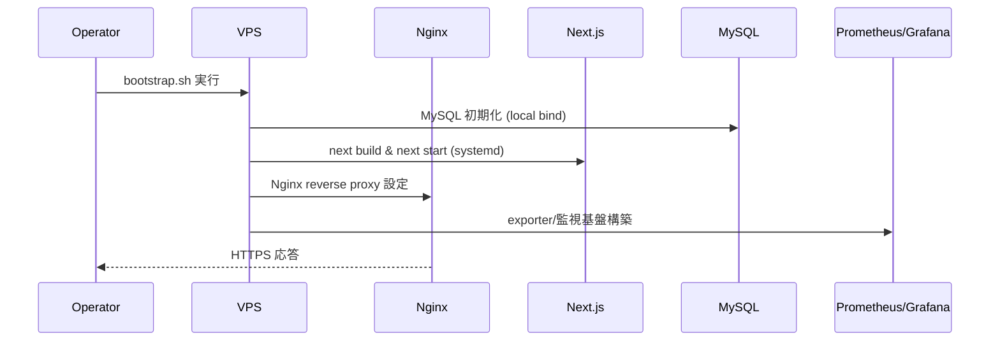
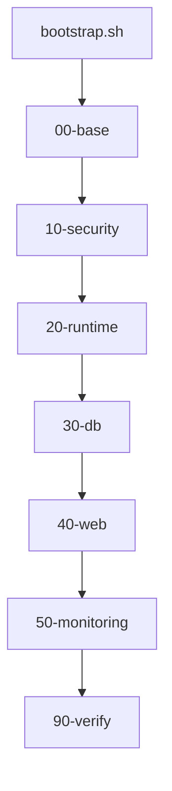

# Implementation Plan — 初回インフラ整備（SSR Next.js + MySQL + Node + Nginx + Let’s Encrypt + Monitoring）

## 1. 機能要件 / 非機能要件

- 機能要件:
  - さくらVPS（Ubuntu 22.04 LTS）上で SSR 前提の Next.js（`next build` + `next start`）を systemd 管理で起動する。
  - MySQL をローカルバインドで初期化し、アプリ用ユーザーを最小権限で発行する。
  - Nginx によるリバースプロキシ、rate limit、fail2ban 連携を設定する。
  - Let’s Encrypt による HTTPS 証明書取得と自動更新を構成する。
  - Prometheus + Grafana を導入し、node_exporter（必要に応じて mysqld_exporter）を監視する。
  - 初回整備専用の `infra/` ディレクトリ構造と bootstrap 手順を定義する。
- 非機能要件:
  - Docker は使用しない。
  - Node LTS を使用する（NodeSource などで導入）。
  - 外部公開ポートは 80/443 のみとし、監視 UI は IP 制限または Basic 認証を必須とする。
  - secrets は Git 管理外とし、`infra/env/*.env` はテンプレートのみ（実値は配置しない）。
  - root 直ログインは禁止し、sudo 可能な専用ユーザーで運用する。

成果物（必須）:
- `.github/copilot/80-templates/implementation-plan.md` に準拠した plan ドキュメントを`.github/copilot/plans/XXXXX-implementation-plan.md`に作成する(この1行は変更せずにそのまま出力する)

## 2. スコープと変更対象

- 変更ファイル（新規/修正/削除）:
  - 新規: `.github/copilot/plans/33-implementation-plan.md`
- 影響範囲・互換性リスク:
  - 設計ドキュメントのみ。既存コード・設定には影響を与えない。
- 外部依存・Secrets の扱い:
  - Node LTS、MySQL、Nginx、Prometheus、Grafana、fail2ban、certbot を OS パッケージで導入する。
  - secrets（MySQL パスワード、Grafana 管理者パスワード、Basic 認証情報等）は Git 管理外で、サーバー側に安全に配置する。

## 3. 設計方針

- 責務分離 / データフロー:
  - `infra/bootstrap.sh` が `infra/setup/*` を順序実行し、基盤 → セキュリティ → ランタイム → DB → Web → Monitoring → 検証の流れで初回整備する。
  - Next.js は `next build` の成果物を `next start` で SSR 実行し、Nginx が `localhost:4000` へプロキシする。
  - Prometheus は exporter から `localhost` 経由でメトリクス収集し、Grafana は Prometheus をデータソースに可視化する。
- エッジケース / 例外系 / リトライ方針:
  - 既存設定がある場合は上書き前にバックアップを作成し、Nginx 設定は `nginx -t` で検証してから reload する。
  - 証明書取得に失敗した場合は HTTP（80）運用にフォールバックし、再実行できるようにする。
  - MySQL 初期化は既存 DB/ユーザーがある場合はスキップし、冪等性を維持する。
- ログと観測性（漏洩防止を含む）:
  - systemd/journald に Next.js、Prometheus、Grafana を統合し、Nginx/MySQL は `/var/log` に出力する。
  - Nginx アクセスログはレスポンスコード・レイテンシ、監査ログは fail2ban が参照する。
  - secrets を含む環境変数や証明書内容はログに出力しない。

### 3.1 製造時の変更予定ファイル一覧

| No. | パス | 変更内容 |
| --- | -- | ---- |
| 1 | .github/copilot/plans/33-implementation-plan.md | 初回インフラ整備の設計 plan を追加 |

### 3.2 初回整備専用ディレクトリ構造

```
infra/
├── README.md
├── bootstrap.sh
├── env/
│   ├── prod.env
│   └── staging.env
└── setup/
    ├── 00-base/
    ├── 10-security/
    ├── 20-runtime/
    ├── 30-db/
    ├── 40-web/
    ├── 50-monitoring/
    └── 90-verify/
```

### 3.3 SSR 前提 Next.js 実行設計

- `next build` はデプロイ時に実行し、`next start` を systemd で起動する。
- Node 実行ユーザーは `appuser` を想定し、`/var/www/app` 配下に配置する。

```
[Unit]
Description=Next.js SSR Application
After=network.target mysql.service

[Service]
Type=simple
User=appuser
WorkingDirectory=/var/www/app
Environment=NODE_ENV=production
EnvironmentFile=/var/www/app/.env.production
ExecStart=/usr/bin/node node_modules/.bin/next start -p 4000
Restart=always
RestartSec=5
LimitNOFILE=65535
StandardOutput=journal
StandardError=journal

[Install]
WantedBy=multi-user.target
```

### 3.4 systemd ユニット詳細設計

- `nextjs.service` を `systemctl enable --now` で常駐させる。
- `prometheus.service`、`grafana-server.service`、`node_exporter.service` を追加し、`After=network.target` で起動順を担保する。
- ログは journald に集約し、エラー時は `journalctl -u <service>` で確認可能にする。

### 3.5 MySQL セキュア初期構成

- `bind-address = 127.0.0.1` とし、外部アクセスは禁止する。
- `mysql_secure_installation` 相当の設定を自動化（root リモートログイン禁止、匿名ユーザー削除、test DB 削除）。
- アプリ用ユーザーを `localhost` 限定で作成し、最小権限（対象 DB のみ）を付与する。

### 3.6 Nginx リバースプロキシ設計

- `server` ブロックは `listen 80/443` に限定し、`proxy_pass http://127.0.0.1:4000` を設定する。
- `proxy_set_header` に `Host`、`X-Forwarded-For`、`X-Forwarded-Proto` を設定し、SSR での URL 判定に利用する。

### 3.7 Nginx rate limit 設計

```
limit_req_zone $binary_remote_addr zone=one:10m rate=10r/s;
```

- `location /` で `limit_req zone=one burst=20 nodelay;` を適用し、DoS を緩和する。

### 3.8 fail2ban 連携設計

```
[nginx-http-auth]
enabled = true
port = http,https
filter = nginx-http-auth
logpath = /var/log/nginx/error.log
maxretry = 5
```

- SSH 用 `sshd` jail も有効化し、ログイン試行を制限する。

### 3.9 Let’s Encrypt 証明書取得・自動更新設計

- `certbot --nginx` で取得し、`systemd` タイマー（`certbot.timer`）で自動更新する。
- 更新時は `--deploy-hook "systemctl reload nginx"` を設定し、証明書更新後に自動反映する。

### 3.10 Prometheus + Grafana 監視構成

- `node_exporter` は `:9100`、`mysqld_exporter` は `127.0.0.1` バインド（必要時）とする。
- Prometheus は `localhost:9090` バインドで、Nginx を経由して IP 制限または Basic 認証を付与する。
- Grafana は `localhost:3000` バインドで、Nginx 経由の認証を通す。
- `prometheus.yml` には `node_exporter` と `mysqld_exporter` をターゲット登録する。

### 3.11 冪等性設計

- スクリプトは「存在チェック → 作成/変更」を基本とし、再実行で同一結果になるようにする。
- `useradd`/`groupadd` は `id -u` で判定、`systemctl enable` は再実行可能であることを前提にする。
- `nginx -t` を通過した場合のみ `systemctl reload nginx` を実行する。

### 3.12 SSH ロックアウト回避戦略

- 新しい sudo ユーザーと SSH 公開鍵を登録した後に `PermitRootLogin no` を適用する。
- `ufw allow OpenSSH` を先に実行し、`ufw enable` は最後に行う。
- 変更前後で `sshd -t` を実行し、設定の有効性を確認する。

### 3.13 ログ設計

- Next.js: `journalctl -u nextjs.service` で確認（`StandardOutput/StandardError` を journal）。
- Nginx: `/var/log/nginx/access.log`、`/var/log/nginx/error.log`。
- MySQL: `/var/log/mysql/error.log`（必要に応じて slow query log を有効化）。
- Prometheus/Grafana: journald に集約し、ログローテーションは OS の既定ポリシーに従う。

## 4. 設計UML

- シーケンス図:(MermaidでUMLを追加する)



- 処理フロー図:(MermaidでUMLを追加する)



## 5. 人間が行う作業:

| 手順ID | 作業名 | 作業の目的 | 具体的な作業内容（人間がやることを詳細に書く） | 判断・確認ポイント | 完了条件（チェック可能な状態） |
| ---- | --- | ----- | ----------------------- | --------- | --------------- |
| H-01 | VPS 事前準備 | セキュアな初期状態を整える | DNS 設定（A レコード）、新規 sudo ユーザー作成、SSH 公開鍵登録、root 直ログイン禁止を計画する | SSH で sudo ユーザーがログインできること | root 無効化前に新規ユーザーでログイン可能 |
| H-02 | Bootstrap 実行 | 自動整備の開始 | `infra/bootstrap.sh` を実行し、各 `setup/*` が完走することを確認する | `nginx -t` と `systemctl status` の確認 | Next.js/MySQL/Nginx/Prometheus/Grafana が起動 |
| H-03 | Secrets 配置 | 秘密情報の安全な配置 | `.env.production`、MySQL パスワード、Grafana 管理者パスワード、Basic 認証ファイルをサーバーに配置する | Git 管理外であること | 起動後に認証が必要な UI が保護されている |
| H-04 | 監視/HTTPS 確認 | 受入条件の確認 | https アクセス、/metrics、Grafana へのアクセスを確認する | 有効証明書・IP 制限・Basic 認証 | 受入条件の全項目を満たす |

### 5.1 使用する情報・資料

- 作業に必要な資料:
  - `.github/copilot/00-index.md` 〜 `60-ci-quality-gates.md`
  - `infra/README.md`（運用手順書）
  - 対象ドメイン、IP 制限用の許可リスト、Basic 認証用アカウント情報

## 6. テスト戦略

- テスト観点（正常 / 例外 / 境界 / 回帰）:
  - 正常: bootstrap 実行後に Next.js/MySQL/Nginx/監視が起動する。
  - 例外: 証明書取得失敗時の再試行、Nginx 設定エラー時のロールバック。
  - 境界: rate limit のしきい値、監視 UI のアクセス制御。
  - 回帰: 再実行で既存設定が崩れない。
- モック / フィクスチャ方針:
  - DESIGN フェーズでは実施しない。IMPLEMENT フェーズで最小限のスモーク検証を追加する。
- テスト追加の実行コマンド（例: `python -m pytest`）:
  - なし（設計のみ）。

## 7. CI 品質ゲート

- 実行コマンド（format / lint / typecheck / test / security）:
  - `npm run lint`（既存の Next.js フロントの品質チェック）。
- 通過基準と失敗時の対応:
  - lint が失敗した場合は差分の関連箇所を修正し、再実行する。

## 8. ロールアウト・運用

- ロールバック方法:
  - `systemctl stop nextjs.service` でアプリ停止し、Nginx 設定をバックアップから戻す。
  - 証明書更新に失敗した場合は `certbot` を再実行し、HTTP に一時フォールバックする。
- 監視・運用上の注意:
  - 監視 UI は IP 制限または Basic 認証必須。
  - `journalctl` と `/var/log/*` を定期確認し、容量逼迫時は logrotate を適用する。

## 9. オープンな課題 / ADR 要否

- 未確定事項:
  - 監視 UI の公開方式（IP 制限 or Basic 認証）の最終決定。
  - MySQL バックアップ（スナップショット/論理バックアップ）の方式。
- ADR に残すべき判断:
  - MySQL backup 方式、監視 UI の公開制限方針を ADR 化するか検討。
