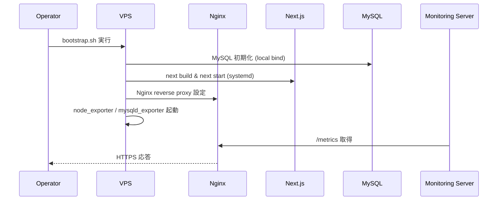
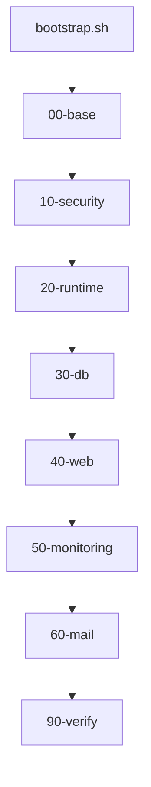

# Implementation Plan — 本番初回インフラ整備（SSR Next.js + MySQL + Node + Nginx + Let’s Encrypt + Exporters）

## 1. 機能要件 / 非機能要件

- 機能要件:
  - さくらVPS（Ubuntu 22.04 LTS）上で **本番環境** 向けの初回インフラ整備を自動化する。
  - OS 基本整備として `apt update/upgrade`、タイムゾーン（JST）、ロケール（`ja_JP.UTF-8`）を適用する。
  - `.bashrc`、`/etc/issue`、`/etc/update-motd.d` を整備し、運用向けの表示・履歴設定を行う。
  - Git を整備し、GitHub App の Installation Token を使って HTTPS でアプリ/スクリプトを取得できるようにする。
  - GitHub App の Installation Token を生成して pull する systemd timer を配置し、初回 clone を実施できるようにする。
  - SSR 前提の Next.js（`npm ci` + `npm run build` + `next start`）を systemd 管理で起動する。
  - MySQL を VPN 側 IP にバインドして初期化し、`prisma migrate deploy` を実行できる状態にする。
  - Nginx によるリバースプロキシ、rate limit、fail2ban 連携を設定する。
  - Let’s Encrypt 証明書取得と自動更新を構成する（443 のみ公開、DNS-01（ValueDomain API + manual hook））。
  - 監視対象サーバーとして node_exporter / mysqld_exporter を導入し、監視サーバーから取得できるようにする。
  - postfix を整備し、root 宛て通知をさくら SMTP 経由で外部メールに転送する。
- 非機能要件:
  - Docker は使用しない。
  - Node LTS を使用し、NodeSource の手順で導入する。
  - 外部公開ポートは 443 のみ。SSH は全 IP 許可（fail2ban 前提）。
  - 監視 UI（Prometheus/Grafana）は **別サーバー** 側に設置し、本サーバーには設置しない。
  - secrets は Git 管理外とし、実値は `infra/.env` に配置する（`infra/.env.sample` はテンプレート）。
  - root 直ログインは禁止し、sudo 可能な専用ユーザーで運用する。

- `.github/copilot/80-templates/implementation-plan.md` に準拠した plan ドキュメントを`.github/copilot/plans/XXXXX-implementation-plan.md`に作成する(この1行は変更せずにそのまま出力する)

## 2. スコープと変更対象

- 変更ファイル（新規/修正/削除）: 「3.1 製造時の変更予定ファイル一覧」を参照
- 影響範囲・互換性リスク: 新規環境のため既存システムへの影響はない。
- 外部依存・Secrets の扱い:
  - Node LTS、MySQL、Nginx、fail2ban、certbot、postfix、node_exporter、mysqld_exporter を OS パッケージで導入する。
  - Prometheus/Grafana は **監視サーバー側** で運用する。
  - secrets（MySQL パスワード、SMTP 認証情報、Basic 認証、GitHub App PEM 等）は Git 管理外で、サーバー側に安全に配置する。

## 3. 設計方針

- 責務分離 / データフロー:
  - `infra/bootstrap.sh` が `infra/setup/*` を順序実行し、基盤 → セキュリティ → ランタイム → DB → Web → 監視 → 検証の流れで初回整備する。
  - Next.js は `next build` の成果物を `next start` で SSR 実行し、Nginx が `localhost:${APP_PORT}` へプロキシする。
  - node_exporter / mysqld_exporter は外部アクセス可能なアドレスで起動し、UFW で監視 IP に限定する。
- エッジケース / 例外系 / リトライ方針:
  - 既存設定がある場合は上書き前にバックアップを作成し、Nginx 設定は `nginx -t` で検証してから reload する。
  - 証明書取得に失敗した場合は DNS-01（ValueDomain API + manual hook）の再試行を行い、失敗理由をログに残す。
  - MySQL 初期化は既存 DB/ユーザーがある場合はスキップし、冪等性を維持する。
- ログと観測性（漏洩防止を含む）:
  - systemd/journald に Next.js、exporter を統合し、Nginx/MySQL/postfix は `/var/log` に出力する。
  - secrets を含む環境変数や証明書内容はログに出力しない。

### 3.1 製造時の変更予定ファイル一覧

#### 3.1.1 `infra/` 配下で作成するファイル

| No. | パス | 変更内容 |
| --- | -- | ---- |
| 1 | infra/README.md | 初回整備の運用手順・再実行方法を記載 |
| 2 | infra/bootstrap.sh | `setup` を順序実行するエントリポイント |
| 3 | infra/.env.sample | 環境変数テンプレート（雛形） |
| 4 | infra/.env | 実運用の環境変数（Git 管理外） |
| 5 | infra/setup/00-base/00-packages.sh | `apt update/upgrade` と必須パッケージ導入 |
| 6 | infra/setup/00-base/10-locale.sh | タイムゾーン/ロケール設定 |
| 7 | infra/setup/00-base/20-shell.sh | `.bashrc` の履歴/alias 設定 |
| 8 | infra/setup/00-base/30-motd.sh | `/etc/issue` と `/etc/update-motd.d` の整備 |
| 9 | infra/setup/10-security/10-ssh.sh | root ログイン禁止と鍵認証の確認 |
| 10 | infra/setup/10-security/20-ufw.sh | 443 のみ公開、SSH は全 IP 許可（fail2ban 前提） |
| 11 | infra/setup/10-security/30-fail2ban.sh | fail2ban jail の配置 |
| 12 | infra/setup/20-runtime/10-node.sh | Node LTS の導入 |
| 13 | infra/setup/20-runtime/20-git.sh | Git 導入と GitHub App トークン取得に必要な依存準備 |
| 14 | infra/setup/20-runtime/30-github-app-pull.sh | GitHub App トークンで pull するスクリプトと timer の配置 |
| 15 | infra/setup/30-db/10-mysql.sh | MySQL セキュア初期化 |
| 16 | infra/setup/30-db/20-prisma.sh | `prisma migrate deploy` 用の準備 |
| 17 | infra/setup/40-web/10-nginx.sh | Nginx reverse proxy / rate limit 設定 |
| 18 | infra/setup/40-web/20-certbot.sh | DNS-01（ValueDomain manual hook）で証明書取得 |
| 19 | infra/setup/40-web/30-nextjs-service.sh | `nextjs.service` 配置（/opt/agile-pmbok-assist_repo/app.env 参照） |
| 20 | infra/setup/40-web/deploy.sh | pull後のビルド＋再起動処理 |
| 21 | infra/setup/50-monitoring/10-exporters.sh | node_exporter / mysqld_exporter 導入 |
| 22 | infra/setup/50-monitoring/20-metrics-proxy.sh | Nginx の metrics 逆プロキシ |
| 23 | infra/setup/60-mail/10-postfix.sh | postfix + さくら SMTP 設定 |
| 24 | infra/setup/90-verify/10-healthcheck.sh | 起動/疎通の検証 |

#### 3.1.2 サーバー上で配置・更新する設定ファイル

| No. | パス | 変更内容 |
| --- | -- | ---- |
| 1 | /etc/systemd/system/nextjs.service | SSR 用 systemd ユニット |
| 2 | /etc/systemd/system/agile-pmbok-assist-pull.service | GitHub App Token で pull する systemd ユニット |
| 3 | /etc/systemd/system/agile-pmbok-assist-pull.timer | GitHub App pull 用 timer |
| 4 | /etc/agile-pmbok-assist/pull.env | GitHub App pull 用の環境変数 |
| 5 | /usr/local/bin/agile-pmbok-assist-githubapp-pull.sh | GitHub App Token で pull するスクリプト |
| 6 | /etc/nginx/sites-available/app.conf | 443 専用リバースプロキシ |
| 7 | /etc/nginx/conf.d/metrics.conf | `/metrics/node` `/metrics/mysql` を監視 IP のみに公開 |
| 8 | /etc/fail2ban/jail.d/nginx-http-auth.conf | Nginx 認証失敗検知 |
| 9 | /etc/postfix/main.cf | さくら SMTP リレー設定 |
| 10 | /etc/postfix/generic | From 変換マップ |
| 11 | /etc/aliases | root 宛て通知の外部転送 |
| 12 | /etc/issue | ログイン前メッセージ |
| 13 | /etc/update-motd.d/99-custom | ログイン後のカスタム表示 |
| 14 | /etc/default/locale | LANG/LC_ALL 設定 |
| 15 | /etc/logrotate.d/nextjs | Next.js ログのローテーション |

### 3.2 初回整備専用ディレクトリ構造

```
infra/
├── README.md
├── bootstrap.sh
├── .env.sample
├── .env
└── setup/
    ├── 00-base/
    ├── 10-security/
    ├── 20-runtime/
    ├── 30-db/
    ├── 40-web/
    ├── 50-monitoring/
    ├── 60-mail/
    └── 90-verify/
```

### 3.3 事前に準備する環境値一覧

| 変数名 | 用途 | 例（ダミー） |
| --- | --- | --- |
| APP_REPO_URL | Next.js リポジトリ URL | https://github.com/example/app.git |
| APP_BRANCH | デプロイ対象ブランチ | main |
| APP_DIR | 配置先ディレクトリ | /opt/agile-pmbok-assist_repo |
| APP_USER | 実行ユーザー | appuser |
| APP_ENV_FILE | アプリ環境変数ファイル | /opt/agile-pmbok-assist_repo/app.env |
| APP_PORT | Nginx からの proxy 先ポート | 4000 |
| SSH_ALLOW_IPS | SSH 許可 IP（未指定なら全IP許可） | 203.0.113.10 |
| NODE_VERSION | Node LTS バージョン | 20 |
| GITHUB_APP_ID | GitHub App ID | 123456 |
| GITHUB_INSTALLATION_ID | GitHub App Installation ID | 12345678 |
| GITHUB_APP_PEM_PATH | GitHub App PEM パス | /etc/app/github-app.pem |
| MYSQL_ROOT_PASSWORD | MySQL root パスワード | `***` |
| MYSQL_APP_DB | アプリ用 DB 名 | app_db |
| MYSQL_APP_USER | アプリ用 DB ユーザー | app_user |
| MYSQL_APP_PASSWORD | アプリ用 DB パスワード | `***` |
| MYSQL_BIND_ADDRESS | MySQL bind（VPN 側 IP） | 10.8.0.1 |
| ACME_DOMAIN | 証明書対象ドメイン | app.example.com |
| ACME_CHALLENGE | ACME 方式 | tls-alpn-01 / dns-01 |
| METRICS_ALLOW_IPS | 監視サーバーの IP（未指定なら全IP許可・明示指定推奨） | 203.0.113.10 |
| POSTFIX_RELAY_HOST | さくら SMTP | smtp.sakura.ne.jp |
| POSTFIX_RELAY_PORT | SMTP ポート | 587 |
| POSTFIX_RELAY_USER | SMTP ユーザー | user@example.com |
| POSTFIX_RELAY_PASS | SMTP パスワード | `***` |
| ALERT_FROM | From アドレス | root@app01.example.com |
| ALERT_TO | 転送先メール | alert@your-domain |
| TIMEZONE | タイムゾーン | Asia/Tokyo |
| LANG | ロケール | ja_JP.UTF-8 |

#### 3.3.1 取り込み方法（推奨）

- `infra/.env` に実値を記載し、`source infra/.env` で一括読み込みする（個別 `export` は不要）。
- `infra/.env` は `.gitignore` で除外する。
- 環境変数ファイルにはパスワードや SMTP 認証情報などの機密情報を含むため、以下のセキュリティ要件を満たすこと。
  - `infra/bootstrap.sh` または各セットアップスクリプトで、`chmod 600 infra/.env` を実行し、所有者のみが読み書き可能なパーミッション (rw-------) に設定する。
- `infra/.env` の所有者はアプリケーションの実行ユーザー（例: `appuser`）または管理ユーザーとし、不必要に共有アカウントからアクセスできないようにする。
- バックアップやログに `infra/.env` の内容が含まれないようにし、ダンプ取得時はマスクや除外ルールを適用する。
- `infra/.env` のパーミッションは `chmod 600`、所有者は `appuser` など最小権限で保持する。
- GitHub App の PEM ファイルは `chmod 600`、所有者は `root` など最小権限で管理する。
- `/opt/agile-pmbok-assist_repo/app.env` には `PORT` を設定し、`APP_PORT` と同じ値を指定する。

### 3.4 ベースOS整備（本番向け）

- パッケージ更新: `apt update && apt upgrade -y` を実行する（Ubuntu のため `dnf` は使用しない）。
- `sysstat` を導入し、`mpstat` を motd で利用できるようにする。
- タイムゾーン: `timedatectl set-timezone Asia/Tokyo`。
- ロケール: `locale-gen ja_JP.UTF-8` と `localectl set-locale LANG=ja_JP.UTF-8 LC_ALL=ja_JP.UTF-8`。
- logrotate: `systemctl status logrotate.timer` で有効化を確認する。
- Node LTS は NodeSource の apt リポジトリを利用して導入する（keyring + sources.list 方式）。
- `.bashrc` に以下を追記する。

```
export HISTTIMEFORMAT='%F %T '
alias ll='ls -alF'
export HISTCONTROL=ignoreboth
export HISTSIZE=10000
export HISTFILESIZE=20000
```

- `/etc/issue` に以下を設定する。

```
       _-_
    /~~     ~~\
  |   *  sakura  *   |
    \_       _/
        `-_-'

 Welcome, sakura.
 This server is managed with care.
```

- 端末幅で崩れる場合はスペース量を調整する。

- `/etc/update-motd.d/99-custom` を作成し、以下を出力する。

```
#!/bin/bash

LANG=C
echo "----------------------------------------"
echo " System Status ($(date '+%Y-%m-%d %H:%M:%S'))"
echo "----------------------------------------"

# Host / OS
echo " Hostname : $(hostname)"
echo " OS       : $(. /etc/os-release; echo ${PRETTY_NAME})"

# Uptime / Load
echo " Uptime   : $(uptime -p)"
echo " LoadAvg  : $(cut -d ' ' -f1-3 /proc/loadavg)"

# CPU（mpstat の最終列が %idle）
CPU_IDLE=$(mpstat 1 1 | awk '/Average:.*all/ {print $NF}')
echo " CPU Idle : ${CPU_IDLE}%"

# Memory
free -b | awk '
/Mem:/ {
  used=$3; total=$2;
  printf " Memory   : %.1f%% used (%.1fGiB/%.1fGiB)\n", used/total*100, used/1024/1024/1024, total/1024/1024/1024
}'

# Disk
df -h / | awk '
NR==2 {
  printf " Disk /   : %s used (%s)\n", $5, $4
}'

echo "----------------------------------------"
```


### 3.5 SSR 前提 Next.js 実行設計

- `next build` はデプロイ時に実行し、`next start` を systemd で起動する。
- Node 実行ユーザーは `appuser` を想定し、`/opt/agile-pmbok-assist_repo` 配下に配置する。

```
[Unit]
Description=Next.js SSR Application
After=network.target mysql.service

[Service]
Type=simple
User=appuser
WorkingDirectory=/opt/agile-pmbok-assist_repo
EnvironmentFile=/opt/agile-pmbok-assist_repo/app.env
ExecStart=/usr/bin/node /opt/agile-pmbok-assist_repo/node_modules/next/dist/bin/next start -p ${PORT}
Restart=always
RestartSec=5
LimitNOFILE=65535
StandardOutput=journal
StandardError=journal

[Install]
WantedBy=multi-user.target
```

### 3.6 systemd ユニット詳細設計

- `nextjs.service` を `systemctl enable --now` で常駐させる。
  - `[Unit]` では `After=network.target mysql.service` に加えて `Wants=mysql.service`（より強く縛る場合は `Requires=mysql.service`）を指定し、MySQL を前提とすることを明示する。
  - アプリ側は Prisma の接続リトライにより MySQL 起動待ちを行う前提とし、より厳密に行う場合は `ExecStartPre` で MySQL への接続確認（例: `mysqladmin ping`）を実施する。
- exporter 用に `node_exporter.service`、`mysqld_exporter.service` を追加し、以下のように依存関係を設計する。
  - `node_exporter.service`: `After=network.target` のみを指定し、ネットワーク有効化後に起動させる。
  - `mysqld_exporter.service`: `After=network.target mysql.service` とし、`Wants=mysql.service`（または `Requires=mysql.service`）を指定して MySQL サービスとの依存関係を明確にする。
- `agile-pmbok-assist-pull.service` は GitHub App の Installation Token を取得して HTTPS で pull し、`/etc/agile-pmbok-assist/pull.env` に App ID / Installation ID / PEM / repo / branch / dir / user を保持する。
  - PEM は root 所有のため service は root 実行し、git 操作は `sudo -u ${APP_USER}` で実行して所有者を維持する。
  - `agile-pmbok-assist-pull.timer` は `OnBootSec=1min`、`OnUnitActiveSec=5min` で定期実行する。
- ログは journald に集約し、エラー時は `journalctl -u <service>` で確認可能にする。
- `nextjs.service` には `Wants=network-online.target` と `After=network-online.target mysql.service` を追加し、`Requires=mysql.service` の付与を検討する。

### 3.7 MySQL セキュア初期構成

- `bind-address = ${MYSQL_BIND_ADDRESS}` とし、VPN 側 IP に限定する。
- 1GB VPS 前提で `innodb_buffer_pool_size=256M` など軽量設定にする。
- slow_query_log は ON、general_log は OFF（必要時のみ ON）とする。
- `infra/setup/30-db/10-mysql.sh` にて、`mysql_secure_installation` 相当の設定を**対話なしで自動化**する（Section 3.1.1 (No.14) で詳細を記載）:
  - root パスワードは **環境変数**（例: `MYSQL_ROOT_PASSWORD`）から読み込み、`mysql` クライアントに標準入力で SQL を流し込む方式で設定する（パスワードをコマンドライン引数や履歴に残さない）。
  - MySQL 8.0 以降を前提とし、初回パスワード設定は `ALTER USER 'root'@'localhost' IDENTIFIED BY '********';` を用いて行う。
  - 匿名ユーザー削除、`test` DB 削除、root のリモートログイン禁止などの処理は、`mysql_secure_installation` と同等の内容を **個別の SQL コマンド** で実行する（必要に応じて `DROP DATABASE test;`、不必要な `mysql.user` レコードの削除など）。
  - ルート接続用には `/root/.my.cnf` を用意し、`[client]` セクションに `user=root` と `password=********` を記載しておくことで、運用時にパスワードをコマンドラインに渡さず接続できるようにする（ファイルパーミッションは 600 を前提とする）。
  - アプリ用ユーザー用のパスワードも環境変数（例: `MYSQL_APP_PASSWORD`）から読み込み、SQL でユーザー作成・権限付与を行う。
  - `ALTER USER 'root'@'localhost' IDENTIFIED WITH mysql_native_password BY '$MYSQL_ROOT_PASSWORD';`
  - `DELETE FROM mysql.user WHERE User='';`、`DROP DATABASE IF EXISTS test;`
- アプリ用ユーザーを `localhost` 限定で作成し、最小権限（対象 DB のみ）を付与する。
- `prisma migrate deploy` を `APP_DIR` で実行できるように `DATABASE_URL` を設定する。

### 3.8 Nginx リバースプロキシ設計

- `server` ブロックは `listen 443 ssl http2` のみに限定する。
- `proxy_pass http://127.0.0.1:4000` を設定し、`proxy_set_header` に `Host`、`X-Forwarded-For`、`X-Forwarded-Proto` を指定する。
- 443 以外の外部公開は行わず、80 は閉じる（HTTP リダイレクトは行わない）。
  - セキュリティポリシー上、インターネット公開ポートは 443/TCP のみに限定し、80/TCP は L4 ファイアウォールと Nginx の両方で閉塞する。
  - 利用者向けドキュメントおよび運用手順に「必ず https:// でアクセスすること（http:// でのアクセスは不可）」を明記する。
- ACME は **DNS-01（ValueDomain API + manual hook）を前提**とし、80 を開放しない（Certbot は TLS-ALPN-01 をサポートしないため 3.11 に準拠）。
- SSE（HTTP ストリーミング）向けの API パス（例: `/api/stream/`）では、Nginx バッファリングによる遅延を避けるため以下を設定する。
  - `proxy_buffering off`
  - `proxy_cache off`
  - `proxy_read_timeout 3600s`（長時間生成に備えて調整）
  - `proxy_send_timeout 3600s`
  - 必要に応じて `gzip off`
- WebSocket パス（例: `/ws/`）では HTTP Upgrade に対応するため以下を設定する。
  - `proxy_http_version 1.1`
  - `proxy_set_header Upgrade $http_upgrade`
  - `proxy_set_header Connection $connection_upgrade`
  - `proxy_read_timeout 3600s`
  - `proxy_send_timeout 3600s`
  - `map $http_upgrade $connection_upgrade` は http コンテキスト（`/etc/nginx/conf.d/connection_upgrade.conf`）で定義する。
- 設定例（抜粋）:

```
map $http_upgrade $connection_upgrade {
  default upgrade;
  ''      close;
}

location /api/stream/ {
  proxy_pass http://127.0.0.1:4000;
  proxy_buffering off;
  proxy_cache off;
  proxy_read_timeout 3600s;
  proxy_send_timeout 3600s;
  gzip off;
}

location /ws/ {
  proxy_pass http://127.0.0.1:4000;
  proxy_http_version 1.1;
  proxy_set_header Upgrade $http_upgrade;
  proxy_set_header Connection $connection_upgrade;
  proxy_read_timeout 3600s;
  proxy_send_timeout 3600s;
}
```

### 3.9 Nginx rate limit 設計

```
limit_req_zone $binary_remote_addr zone=one:10m rate=10r/s;
```

- `location /` で `limit_req zone=one burst=20 nodelay;` を適用し、DoS を緩和する。
- `zone=one:10m` は IP を約 16 万件保持する前提で設定し、`burst` はピーク許容値として調整する。
- `rate=10r/s` は 1 クライアント IP あたりの許容リクエスト数として運用に合わせて見直す。
- `burst=20` と `nodelay` は短時間スパイクを許容し、超過分は即時拒否する前提で調整する。

### 3.10 fail2ban 連携設計

```
[nginx-http-auth]
enabled = true
port = https
filter = nginx-http-auth
logpath = /var/log/nginx/error.log
maxretry = 5
```

- SSH 用 `sshd` jail も有効化し、ログイン試行を制限する。
- 80/TCP は閉塞するため、`port = https` のみに限定する。

### 3.11 Let’s Encrypt 証明書取得・自動更新設計

- 80/TCP を公開しないため、**Certbot は DNS-01（ValueDomain API + manual hook）を利用する**。
  - Certbot 自体が TLS-ALPN-01 をサポートしていないため、`certbot --nginx --preferred-challenges tls-alpn-01` を前提とした設計は採用しない。
  - ValueDomain の API キーを `CERTBOT_DNS_CREDENTIALS` で指定したファイルに 1 行で保存し、`CERTBOT_DNS_PLUGIN=manual` を設定する。
  - hook スクリプトは `CERTBOT_DOMAIN` と `CERTBOT_VALIDATION` を用いて `_acme-challenge` の TXT レコードを追加/削除する。
- 追加の SAN / wildcard が必要な場合は `ACME_EXTRA_DOMAINS` にスペース区切りで指定する。
- DNS 伝播待ち時間は `CERTBOT_DNS_PROPAGATION_SECONDS`（デフォルト 60 秒）で調整する。
- DNS-01 の実施コマンド（例）:
  - `certbot certonly --manual --preferred-challenges dns --manual-auth-hook /etc/letsencrypt/valuedomain-hooks/valuedomain-auth.sh --manual-cleanup-hook /etc/letsencrypt/valuedomain-hooks/valuedomain-cleanup.sh -d $ACME_DOMAIN`
- `apt install -y certbot` を前提とする（DNS プラグインは不要）。
- systemd timer は環境差があるため `systemctl list-timers | grep -E "certbot|certbot\.timer|certbot-renew|snap\.certbot"` で確認する。
  - `certbot.timer` が存在する場合は `systemctl enable --now certbot.timer` を実行する。
- `certbot` の自動更新後、`/etc/letsencrypt/renewal-hooks/deploy/reload-nginx.sh` で `systemctl reload nginx` を実行する。

### 3.12 監視（node_exporter / mysqld_exporter）設計

- 本サーバーには Prometheus/Grafana を設置しない。
- exporter は `127.0.0.1` にバインドし、Nginx を経由して `/metrics` を 443 で公開する。
- `/metrics/node` は `proxy_pass http://127.0.0.1:9100/metrics`、`/metrics/mysql` は `proxy_pass http://127.0.0.1:9104/metrics` を設定する。
- `/metrics` は用途別に `/metrics/node` と `/metrics/mysql` に分割し、単一パスで混在させない。
- `/metrics` 配下は `METRICS_ALLOW_IPS` 指定時に許可IPのみ許可し、未指定の場合は全IP許可（明示指定を推奨）。
- mysqld_exporter 用に `exporter` ユーザーを作成し、`PROCESS, REPLICATION CLIENT, SELECT` を付与する。
- mysqld_exporter は `/etc/.mysqld_exporter.cnf` に認証情報を置き、`--web.listen-address=127.0.0.1:9104` で起動する。
- `/etc/.mysqld_exporter.cnf` は `[client]` で `user`/`password` を記載し、`chmod 600` を適用する。

### 3.13 postfix アラートメール設計

- さくら SMTP を relayhost とし、SMTP AUTH を有効化する。
- `smtp_generic_maps = hash:/etc/postfix/generic` を `main.cf` に設定する。
- `/etc/postfix/generic` に以下を設定し、`postmap /etc/postfix/generic` を実行する。
  - 1 行あたり「送信元アドレス 変換先アドレス」をタブ区切りで記載する（スペースでも動作するがタブを推奨）。
  - 左側: 実際の送信元アドレス（例: `root@app01.example.com`）、右側: envelope sender（Return-Path）の変換先（From ヘッダの変更は別設定で行う）。

```
root@app01.example.com alert@your-domain
```

- `/etc/aliases` に `root: alert@your-domain` を設定し、`newaliases` を実行する。
- `ALERT_FROM` は `smtp_generic_maps` により envelope sender（Return-Path）が書き換えられるため、SPF/DKIM が有効なドメインを選定する（From ヘッダを変える場合は `header_checks` 等で別途対応する）。

### 3.14 冪等性設計

- スクリプトは「存在チェック → 作成/変更」を基本とし、再実行で同一結果になるようにする。
- `useradd`/`groupadd` は `id -u` で判定、`systemctl enable` は再実行可能であることを前提にする。
- `nginx -t` を通過した場合のみ `systemctl reload nginx` を実行する。

### 3.15 SSH ロックアウト回避戦略

- 新しい sudo ユーザーと SSH 公開鍵を登録した後に `PermitRootLogin no` を適用する。
- `ufw allow OpenSSH` を先に実行し、`ufw enable` は最後に行う。
- 変更前後で `sshd -t` を実行し、設定の有効性を確認する。
- UFW 例: `ufw default deny incoming`、`ufw allow 443/tcp`、`ufw allow 22/tcp`、`ufw allow 9100/tcp`、`ufw allow 9104/tcp`。

### 3.16 ログ設計

- Next.js: `journalctl -u nextjs.service` で確認（`StandardOutput/StandardError` を journal）。
- Nginx: `/var/log/nginx/access.log`、`/var/log/nginx/error.log`。
- MySQL: `/var/log/mysql/error.log`（必要に応じて slow query log を有効化）。
- postfix: `/var/log/mail.log`。
- logrotate の有効化を `logrotate.timer` で確認し、必要に応じて Next.js 用のポリシーを追加する。

## 4. 設計UML

- シーケンス図:(MermaidでUMLを追加する)



- 処理フロー図:(MermaidでUMLを追加する)



## 5. 人間が行う作業:

| 手順ID | 作業名 | 作業の目的 | 具体的な作業内容（人間がやることを詳細に書く） | 判断・確認ポイント | 完了条件（チェック可能な状態） |
| ---- | --- | ----- | ----------------------- | --------- | --------------- |
| H-00 | VPS 初期リセット | 新規 VPS の確保 | さくら VPS コンソールからサーバーリセットを依頼する | 初期化完了通知の確認 | 新規 VPS にログイン可能 |
| H-01 | VPS 事前準備 | セキュアな初期状態を整える | DNS 設定（A レコード）、新規 sudo ユーザー作成、SSH 公開鍵登録、root 直ログイン禁止を計画する | SSH で sudo ユーザーがログインできること | root 無効化前に新規ユーザーでログイン可能 |
| H-02 | GitHub App 準備 | pull 用の認証情報を用意する | GitHub App を作成し、Contents: Read-only を付与して対象 repo にインストール、PEM を発行し App ID / Installation ID を控える | App が対象 repo にインストール済みであること | App ID / Installation ID / PEM が準備済み |
| H-03 | 環境値/Secrets 配置 | 秘密情報の安全な配置 | `infra/.env` を用意し、`.env.production`、MySQL パスワード、SMTP 認証情報、Basic 認証ファイル、GitHub App PEM をサーバーに配置する | Git 管理外であること | secrets がサーバーにのみ存在 |
| H-04 | Bootstrap 実行 | 自動整備の開始 | `infra/bootstrap.sh` を実行し、各 `setup/*` が完走することを確認する | `nginx -t` と `systemctl status` の確認 | Next.js/MySQL/Nginx/Exporters/Postfix が起動 |
| H-05 | GitHub App pull 実行 | 初回 clone と同期 | `systemctl start agile-pmbok-assist-pull.service` を実行し、`/opt/agile-pmbok-assist_repo` に clone されることを確認する | `git status` が取得できること | リポジトリが配置済み |
| H-06 | アプリ初期化 | DB と SSR を同期 | `infra/setup/40-web/deploy.sh` を実行し、`systemctl restart nextjs` を確認する | build の成功 | SSR が 443 で応答 |
| H-07 | 監視疎通確認 | 監視対象として登録 | 監視サーバーから `/metrics` を取得し、IP 制限が有効か確認 | 監視 IP のみ取得可能 | node_exporter 値が取得可能 |
| H-08 | 通知メール確認 | アラート転送の検証 | `mail` で root 宛てを送信し、外部メールへ転送されることを確認 | SMTP 認証成功 | 外部メールで受信できる |

### 5.1 使用する情報・資料

- 作業に必要な資料:
  - `.github/copilot/00-index.md` 〜 `60-ci-quality-gates.md`
  - `infra/README.md`（運用手順書）
  - 対象ドメイン、IP 制限用の許可リスト、SMTP 認証情報、GitHub App ID/Installation ID/PEM

## 6. テスト戦略

- テスト観点（正常 / 例外 / 境界 / 回帰）:
  - 正常: bootstrap 実行後に「本番リリース確認（受入）」の判定条件を満たす。
  - 例外: 証明書取得失敗時の再試行、Nginx 設定エラー時のロールバック。
  - 境界: rate limit のしきい値、監視 `/metrics` のアクセス制御。
  - 回帰: 再実行で既存設定が崩れない。
  - Given/When/Then 受入条件:
    - Given: 新規VPS, When: bootstrap実行, Then: Next.js/MySQL/Nginx が起動する。
    - Given: HTTPSアクセス, When: httpsアクセス, Then: 有効証明書で接続できる。
    - Given: DoS的連続アクセス, When: 高頻度リクエスト, Then: rate limit で制御される。
    - Given: VPS再起動, When: 再起動後, Then: nextjs.service が自動起動する。
    - Given: Prometheus, When: /metrics確認, Then: node_exporter 値が取得できる。
    - Given: logrotate, When: timer 状態確認, Then: logrotate.timer が active。
    - Given: メール転送, When: root 宛て送信, Then: 外部宛てに転送される。
- モック / フィクスチャ方針:
  - DESIGN フェーズでは実施しない。IMPLEMENT フェーズで最小限のスモーク検証を追加する。
- テスト追加の実行コマンド（例: `python -m pytest`）:
  - なし（設計のみ）。

## 7. CI 品質ゲート

- 実行コマンド（format / lint / typecheck / test / security）:
  - `shellcheck infra/bootstrap.sh infra/setup/**/*.sh`
  - `bash -n infra/bootstrap.sh` および主要 `infra/setup/**/*.sh`
  - 本タスクは `infra/*.sh` 追加が中心のため、アプリ（Next.js）の lint は対象外とする。
- 通過基準と失敗時の対応:
  - `shellcheck` / `bash -n` が失敗した場合は該当スクリプトを修正して再実行する。

## 8. ロールアウト・運用

- ロールバック方法:
  - `systemctl stop nextjs.service` でアプリ停止し、Nginx 設定をバックアップから戻す。
  - 証明書更新に失敗した場合は `certbot` を再実行し、ValueDomain API キーと hook 設定を再確認する。
- 監視・運用上の注意:
  - 公開ポートは 443 のみ。SSH は全 IP 許可（fail2ban 前提）。
  - `/metrics` は監視 IP のみ許可し、Basic 認証を併用する場合は secrets 管理外とする。
  - 運用確認として 80/TCP の閉塞、SSE のストリーミング疎通、WebSocket の Upgrade、`certbot renew --dry-run` を確認する。
- デプロイ運用の前提:
  - 本タスクのスコープでは CI/CD（自動デプロイ）は対象外とし、コード取得は GitHub App pull timer を利用する。
  - ビルド/再起動は手動実行（`infra/setup/40-web/deploy.sh`）を前提とする。

## 9. オープンな課題 / ADR 要否

- 未確定事項:
  - CI/CD / 自動デプロイ全般（本設計ではスコープ外）:
    - デプロイスクリプトの配置場所および命名規則。
    - デプロイ手順（ビルド / マイグレーション / プロセス再起動等）の自動化レベル。
    - pull 後の build/restart を自動化するかの判断（外部 CI / systemd timer / 完全手動など）。
  - MySQL バックアップ（スナップショット / 論理バックアップ）の方式。
- ADR に残すべき判断:
  - CI/CD / 自動デプロイの採用有無および方式、バックアップ方式、監視 `/metrics` の公開方法。
