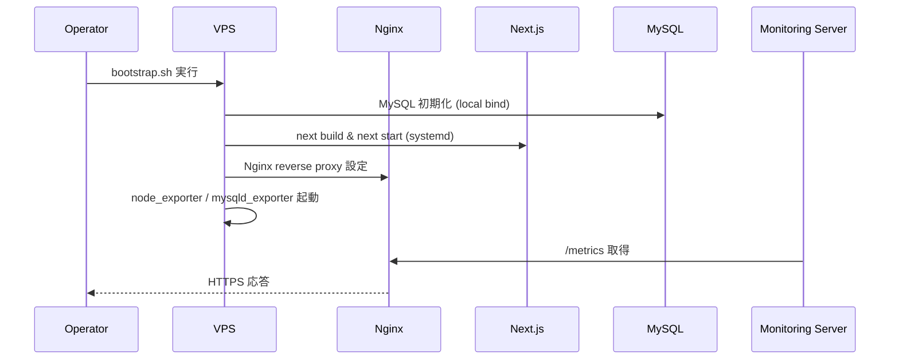
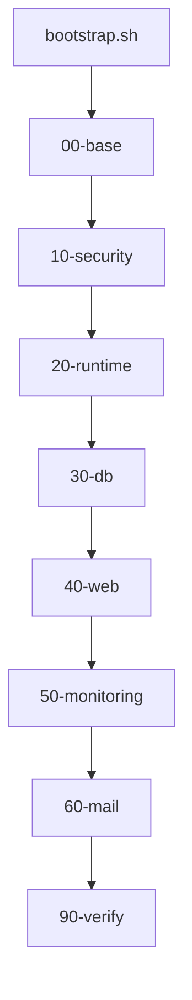

# Implementation Plan — 本番初回インフラ整備（SSR Next.js + MySQL + Node + Nginx + Let’s Encrypt + Exporters）

## 1. 機能要件 / 非機能要件

- 機能要件:
  - さくらVPS（Ubuntu 22.04 LTS）上で **本番環境** 向けの初回インフラ整備を自動化する。
  - OS 基本整備として `apt update/upgrade`、タイムゾーン（JST）、ロケール（`ja_JP.UTF-8`）を適用する。
  - `.bashrc`、`/etc/issue`、`/etc/update-motd.d` を整備し、運用向けの表示・履歴設定を行う。
  - Git を整備して GitHub からアプリ/スクリプトをクローンできるようにする。
  - SSR 前提の Next.js（`next build` + `next start`）を systemd 管理で起動する。
  - MySQL をローカルバインドで初期化し、`prisma migrate deploy` を実行できる状態にする。
  - Nginx によるリバースプロキシ、rate limit、fail2ban 連携を設定する。
  - Let’s Encrypt 証明書取得と自動更新を構成する（443 のみ公開、TLS-ALPN-01 または DNS-01）。
  - 監視対象サーバーとして node_exporter / mysqld_exporter を導入し、監視サーバーから取得できるようにする。
  - postfix を整備し、root 宛て通知をさくら SMTP 経由で外部メールに転送する。
- 非機能要件:
  - Docker は使用しない。
  - Node LTS を使用する（NodeSource などで導入）。
  - 外部公開ポートは 443 のみ。SSH は管理 IP のみ許可する。
  - 監視 UI（Prometheus/Grafana）は **別サーバー** 側に設置し、本サーバーには設置しない。
  - secrets は Git 管理外とし、実値は `infra/env/.env` に配置する（`sample.env` はテンプレート）。
  - root 直ログインは禁止し、sudo 可能な専用ユーザーで運用する。

- `.github/copilot/80-templates/implementation-plan.md` に準拠した plan ドキュメントを`.github/copilot/plans/XXXXX-implementation-plan.md`に作成する(この1行は変更せずにそのまま出力する)

## 2. スコープと変更対象

- 変更ファイル（新規/修正/削除）: 「3.1 製造時の変更予定ファイル一覧」を参照
- 影響範囲・互換性リスク: 新規環境のため既存システムへの影響はない。
- 外部依存・Secrets の扱い:
  - Node LTS、MySQL、Nginx、fail2ban、certbot、postfix、node_exporter、mysqld_exporter を OS パッケージで導入する。
  - Prometheus/Grafana は **監視サーバー側** で運用する。
  - secrets（MySQL パスワード、SMTP 認証情報、Basic 認証、Deploy Key 等）は Git 管理外で、サーバー側に安全に配置する。

## 3. 設計方針

- 責務分離 / データフロー:
  - `infra/bootstrap.sh` が `infra/setup/*` を順序実行し、基盤 → セキュリティ → ランタイム → DB → Web → 監視 → 検証の流れで初回整備する。
  - Next.js は `next build` の成果物を `next start` で SSR 実行し、Nginx が `localhost:4000` へプロキシする。
  - node_exporter / mysqld_exporter はローカルバインドし、Nginx 経由で監視サーバーにのみ公開する。
- エッジケース / 例外系 / リトライ方針:
  - 既存設定がある場合は上書き前にバックアップを作成し、Nginx 設定は `nginx -t` で検証してから reload する。
  - 証明書取得に失敗した場合は TLS-ALPN-01/DNS-01 の再試行を行い、失敗理由をログに残す。
  - MySQL 初期化は既存 DB/ユーザーがある場合はスキップし、冪等性を維持する。
- ログと観測性（漏洩防止を含む）:
  - systemd/journald に Next.js、exporter を統合し、Nginx/MySQL/postfix は `/var/log` に出力する。
  - secrets を含む環境変数や証明書内容はログに出力しない。

### 3.1 製造時の変更予定ファイル一覧

#### 3.1.1 `infra/` 配下で作成するファイル

| No. | パス | 変更内容 |
| --- | -- | ---- |
| 1 | infra/README.md | 初回整備の運用手順・再実行方法を記載 |
| 2 | infra/bootstrap.sh | `setup` を順序実行するエントリポイント |
| 3 | infra/env/sample.env | 環境変数テンプレート（雛形） |
| 4 | infra/env/.env | 実運用の環境変数（Git 管理外） |
| 5 | infra/setup/00-base/00-packages.sh | `apt update/upgrade` と必須パッケージ導入 |
| 6 | infra/setup/00-base/10-locale.sh | タイムゾーン/ロケール設定 |
| 7 | infra/setup/00-base/20-shell.sh | `.bashrc` の履歴/alias 設定 |
| 8 | infra/setup/00-base/30-motd.sh | `/etc/issue` と `/etc/update-motd.d` の整備 |
| 9 | infra/setup/10-security/10-ssh.sh | root ログイン禁止と sshd 設定 |
| 10 | infra/setup/10-security/20-ufw.sh | 443 のみ公開、SSH は管理 IP 制限 |
| 11 | infra/setup/10-security/30-fail2ban.sh | fail2ban jail の配置 |
| 12 | infra/setup/20-runtime/10-node.sh | Node LTS の導入 |
| 13 | infra/setup/20-runtime/20-git.sh | Git 導入と clone 用設定 |
| 14 | infra/setup/30-db/10-mysql.sh | MySQL セキュア初期化 |
| 15 | infra/setup/30-db/20-prisma.sh | `prisma migrate deploy` 用の準備 |
| 16 | infra/setup/40-web/10-nginx.sh | Nginx reverse proxy / rate limit 設定 |
| 17 | infra/setup/40-web/20-certbot.sh | TLS-ALPN-01/DNS-01 で証明書取得 |
| 18 | infra/setup/40-web/30-nextjs-service.sh | `nextjs.service` 配置 |
| 19 | infra/setup/40-web/deploy.sh | Next.js 更新用のデプロイ処理 |
| 20 | infra/setup/50-monitoring/10-exporters.sh | node_exporter / mysqld_exporter 導入 |
| 21 | infra/setup/50-monitoring/20-metrics-proxy.sh | Nginx の metrics 逆プロキシ |
| 22 | infra/setup/60-mail/10-postfix.sh | postfix + さくら SMTP 設定 |
| 23 | infra/setup/90-verify/10-healthcheck.sh | 起動/疎通の検証 |

#### 3.1.2 サーバー上で配置・更新する設定ファイル

| No. | パス | 変更内容 |
| --- | -- | ---- |
| 1 | /etc/systemd/system/nextjs.service | SSR 用 systemd ユニット |
| 2 | /etc/nginx/sites-available/app.conf | 443 専用リバースプロキシ |
| 3 | /etc/nginx/conf.d/metrics.conf | `/metrics` を監視 IP のみに公開 |
| 4 | /etc/fail2ban/jail.d/nginx-http-auth.conf | Nginx 認証失敗検知 |
| 5 | /etc/postfix/main.cf | さくら SMTP リレー設定 |
| 6 | /etc/postfix/generic | From 変換マップ |
| 7 | /etc/aliases | root 宛て通知の外部転送 |
| 8 | /etc/issue | ログイン前メッセージ |
| 9 | /etc/update-motd.d/99-custom | ログイン後のカスタム表示 |
| 10 | /etc/default/locale | LANG/LC_ALL 設定 |
| 11 | /etc/logrotate.d/nextjs | Next.js ログのローテーション |

### 3.2 初回整備専用ディレクトリ構造

```
infra/
├── README.md
├── bootstrap.sh
├── env/
│   ├── sample.env
│   └── .env
└── setup/
    ├── 00-base/
    ├── 10-security/
    ├── 20-runtime/
    ├── 30-db/
    ├── 40-web/
    ├── 50-monitoring/
    ├── 60-mail/
    └── 90-verify/
```

### 3.3 事前に準備する環境値一覧

| 変数名 | 用途 | 例（ダミー） |
| --- | --- | --- |
| APP_REPO_URL | Next.js リポジトリ URL | git@github.com:example/app.git |
| APP_BRANCH | デプロイ対象ブランチ | main |
| APP_DIR | 配置先ディレクトリ | /var/www/app |
| APP_USER | 実行ユーザー | appuser |
| NODE_VERSION | Node LTS バージョン | 20.x |
| MYSQL_ROOT_PASSWORD | MySQL root パスワード | `***` |
| MYSQL_APP_DB | アプリ用 DB 名 | app_db |
| MYSQL_APP_USER | アプリ用 DB ユーザー | app_user |
| MYSQL_APP_PASSWORD | アプリ用 DB パスワード | `***` |
| MYSQL_BIND_ADDRESS | MySQL bind | 127.0.0.1 |
| ACME_DOMAIN | 証明書対象ドメイン | app.example.com |
| ACME_CHALLENGE | ACME 方式 | tls-alpn-01 / dns-01 |
| METRICS_ALLOW_IPS | 監視サーバーの IP | 203.0.113.10 |
| POSTFIX_RELAY_HOST | さくら SMTP | smtp.sakura.ne.jp |
| POSTFIX_RELAY_PORT | SMTP ポート | 587 |
| POSTFIX_RELAY_USER | SMTP ユーザー | user@example.com |
| POSTFIX_RELAY_PASS | SMTP パスワード | `***` |
| ALERT_FROM | From アドレス | root@app01.example.com |
| ALERT_TO | 転送先メール | alert@your-domain |
| TIMEZONE | タイムゾーン | Asia/Tokyo |
| LANG | ロケール | ja_JP.UTF-8 |

#### 3.3.1 取り込み方法（推奨）

- `infra/env/.env` に実値を記載し、`source infra/env/.env` で一括読み込みする（個別 `export` は不要）。
- `infra/env/.env` は `.gitignore` で除外する。
- `infra/env/.env` のパーミッションは `chmod 600`、所有者は `appuser` など最小権限で保持する。

### 3.4 ベースOS整備（本番向け）

- パッケージ更新: `apt update && apt upgrade -y` を実行する（Ubuntu のため `dnf` は使用しない）。
- `sysstat` を導入し、`mpstat` を motd で利用できるようにする。
- タイムゾーン: `timedatectl set-timezone Asia/Tokyo`。
- ロケール: `locale-gen ja_JP.UTF-8` と `localectl set-locale LANG=ja_JP.UTF-8 LC_ALL=ja_JP.UTF-8`。
- logrotate: `systemctl status logrotate.timer` で有効化を確認する。
- Node LTS は NodeSource の手順で導入する（`curl -fsSL https://deb.nodesource.com/setup_lts.x | sudo -E bash -` → `apt install -y nodejs`）。
- `.bashrc` に以下を追記する。

```
export HISTTIMEFORMAT='%F %T '
alias ll='ls -alF'
export HISTCONTROL=ignoreboth
export HISTSIZE=10000
export HISTFILESIZE=20000
```

- `/etc/issue` に以下を設定する。

```
       _-_
    /`     `\
  |   🌸  sakura  🌸   |
    \_       _/
        `-_-'

 Welcome, sakura.
 This server is managed with care.
```

- 端末幅で崩れる場合はスペース量を調整する。

- `/etc/update-motd.d/99-custom` を作成し、以下を出力する。

```
#!/bin/bash

LANG=C
echo "----------------------------------------"
echo " System Status ($(date '+%Y-%m-%d %H:%M:%S'))"
echo "----------------------------------------"

# Host / OS
echo " Hostname : $(hostname)"
echo " OS       : $(. /etc/os-release; echo ${PRETTY_NAME})"

# Uptime / Load
echo " Uptime   : $(uptime -p)"
echo " LoadAvg  : $(cut -d ' ' -f1-3 /proc/loadavg)"

# CPU（mpstat の最終列が %idle）
CPU_IDLE=$(mpstat 1 1 | awk '/Average:.*all/ {print $NF}')
echo " CPU Idle : ${CPU_IDLE}%"

# Memory
free -b | awk '
/Mem:/ {
  used=$3; total=$2;
  printf " Memory   : %.1f%% used (%.1fGiB/%.1fGiB)\n", used/total*100, used/1024/1024/1024, total/1024/1024/1024
}'

# Disk
df -h / | awk '
NR==2 {
  printf " Disk /   : %s used (%s)\n", $5, $4
}'

echo "----------------------------------------"
```

- Git 導入は `infra/setup/20-runtime/20-git.sh` で自動化し、詳細は H-02 の手順に従う。

### 3.5 SSR 前提 Next.js 実行設計

- `next build` はデプロイ時に実行し、`next start` を systemd で起動する。
- Node 実行ユーザーは `appuser` を想定し、`/var/www/app` 配下に配置する。

```
[Unit]
Description=Next.js SSR Application
After=network.target mysql.service

[Service]
Type=simple
User=appuser
WorkingDirectory=/var/www/app
Environment=NODE_ENV=production
EnvironmentFile=/var/www/app/.env.production
ExecStart=/usr/bin/node node_modules/.bin/next start -p 4000
Restart=always
RestartSec=5
LimitNOFILE=65535
StandardOutput=journal
StandardError=journal

[Install]
WantedBy=multi-user.target
```

### 3.6 systemd ユニット詳細設計

- `nextjs.service` を `systemctl enable --now` で常駐させる。
- exporter 用に `node_exporter.service`、`mysqld_exporter.service` を追加し、`After=network.target` で起動順を担保する。
- ログは journald に集約し、エラー時は `journalctl -u <service>` で確認可能にする。
- `nextjs.service` には `Wants=network-online.target` と `After=network-online.target mysql.service` を追加し、`Requires=mysql.service` の付与を検討する。

### 3.7 MySQL セキュア初期構成

- `bind-address = 127.0.0.1` とし、外部アクセスは禁止する。
- `mysql_secure_installation` 相当の設定を自動化（root リモートログイン禁止、匿名ユーザー削除、test DB 削除）。
  - `ALTER USER 'root'@'localhost' IDENTIFIED WITH mysql_native_password BY '$MYSQL_ROOT_PASSWORD';`
  - `DELETE FROM mysql.user WHERE User='';`、`DROP DATABASE IF EXISTS test;`
- アプリ用ユーザーを `localhost` 限定で作成し、最小権限（対象 DB のみ）を付与する。
- `prisma migrate deploy` を `APP_DIR` で実行できるように `DATABASE_URL` を設定する。

### 3.8 Nginx リバースプロキシ設計

- `server` ブロックは `listen 443 ssl http2` のみに限定する。
- `proxy_pass http://127.0.0.1:4000` を設定し、`proxy_set_header` に `Host`、`X-Forwarded-For`、`X-Forwarded-Proto` を指定する。
- 443 以外の外部公開は行わず、80 は閉じる（HTTP リダイレクトは行わない）。
- ACME は TLS-ALPN-01 / DNS-01 を利用し、80 を開放しない（要件により 443 のみ公開）。

### 3.9 Nginx rate limit 設計

```
limit_req_zone $binary_remote_addr zone=one:10m rate=10r/s;
```

- `location /` で `limit_req zone=one burst=20 nodelay;` を適用し、DoS を緩和する。
- `zone=one:10m` は IP を約 16 万件保持する前提で設定し、`burst` はピーク許容値として調整する。

### 3.10 fail2ban 連携設計

```
[nginx-http-auth]
enabled = true
port = https
filter = nginx-http-auth
logpath = /var/log/nginx/error.log
maxretry = 5
```

- SSH 用 `sshd` jail も有効化し、ログイン試行を制限する。

### 3.11 Let’s Encrypt 証明書取得・自動更新設計

- 443 のみ公開するため TLS-ALPN-01 または DNS-01 を利用する。
- `certbot --nginx --preferred-challenges tls-alpn-01 -d $ACME_DOMAIN` を基本とし、DNS-01 が可能なら DNS プラグインを利用する。
- `certbot.timer` により自動更新し、`/etc/letsencrypt/renewal-hooks/deploy/reload-nginx.sh` で `systemctl reload nginx` を実行する。

### 3.12 監視（node_exporter / mysqld_exporter）設計

- 本サーバーには Prometheus/Grafana を設置しない。
- exporter は `127.0.0.1` にバインドし、Nginx を経由して `/metrics` を 443 で公開する。
- `/metrics/node` は `proxy_pass http://127.0.0.1:9100/metrics`、`/metrics/mysql` は `proxy_pass http://127.0.0.1:9104/metrics` を設定する。
- `/metrics` 配下は `allow $METRICS_ALLOW_IPS; deny all;` で監視サーバーのみ許可する。
- mysqld_exporter 用に `exporter` ユーザーを作成し、`PROCESS, REPLICATION CLIENT, SELECT` を付与する。
- mysqld_exporter は `/etc/.mysqld_exporter.cnf` に認証情報を置き、`--web.listen-address=127.0.0.1:9104` で起動する。

### 3.13 postfix アラートメール設計

- さくら SMTP を relayhost とし、SMTP AUTH を有効化する。
- `smtp_generic_maps = hash:/etc/postfix/generic` を `main.cf` に設定する。
- `/etc/postfix/generic` に以下を設定し、`postmap /etc/postfix/generic` を実行する。
  - 1 行あたり「送信元アドレス 変換先アドレス」をスペースまたはタブ区切りで記載する。

```
root@app01.example.com alert@your-domain
```

- `/etc/aliases` に `root: alert@your-domain` を設定し、`newaliases` を実行する。
- `ALERT_FROM` は `smtp_generic_maps` により envelope sender を書き換えるため、使用するドメインで SPF/DKIM が有効なものを選定する。

### 3.14 冪等性設計

- スクリプトは「存在チェック → 作成/変更」を基本とし、再実行で同一結果になるようにする。
- `useradd`/`groupadd` は `id -u` で判定、`systemctl enable` は再実行可能であることを前提にする。
- `nginx -t` を通過した場合のみ `systemctl reload nginx` を実行する。

### 3.15 SSH ロックアウト回避戦略

- 新しい sudo ユーザーと SSH 公開鍵を登録した後に `PermitRootLogin no` を適用する。
- `ufw allow OpenSSH` を先に実行し、`ufw enable` は最後に行う。
- 変更前後で `sshd -t` を実行し、設定の有効性を確認する。
- UFW 例: `ufw default deny incoming`、`ufw allow 443/tcp`、`ufw allow from <ADMIN_IP> to any port 22`。

### 3.16 ログ設計

- Next.js: `journalctl -u nextjs.service` で確認（`StandardOutput/StandardError` を journal）。
- Nginx: `/var/log/nginx/access.log`、`/var/log/nginx/error.log`。
- MySQL: `/var/log/mysql/error.log`（必要に応じて slow query log を有効化）。
- postfix: `/var/log/mail.log`。
- logrotate の有効化を `logrotate.timer` で確認し、必要に応じて Next.js 用のポリシーを追加する。

## 4. 設計UML

- シーケンス図:(MermaidでUMLを追加する)



- 処理フロー図:(MermaidでUMLを追加する)



## 5. 人間が行う作業:

| 手順ID | 作業名 | 作業の目的 | 具体的な作業内容（人間がやることを詳細に書く） | 判断・確認ポイント | 完了条件（チェック可能な状態） |
| ---- | --- | ----- | ----------------------- | --------- | --------------- |
| H-00 | VPS 初期リセット | 新規 VPS の確保 | さくら VPS コンソールからサーバーリセットを依頼する | 初期化完了通知の確認 | 新規 VPS にログイン可能 |
| H-01 | VPS 事前準備 | セキュアな初期状態を整える | DNS 設定（A レコード）、新規 sudo ユーザー作成、SSH 公開鍵登録、root 直ログイン禁止を計画する | SSH で sudo ユーザーがログインできること | root 無効化前に新規ユーザーでログイン可能 |
| H-02 | Git/Clone 準備 | アプリと整備スクリプトを取得する | Git をインストールし、Deploy Key で `APP_REPO_URL` と `infra` リポジトリをクローンする | `git clone` が成功すること | `/var/www/app` と `/opt/infra` に配置済み |
| H-03 | 環境値/Secrets 配置 | 秘密情報の安全な配置 | `infra/env/.env` を用意し、`.env.production`、MySQL パスワード、SMTP 認証情報、Basic 認証ファイルをサーバーに配置する | Git 管理外であること | secrets がサーバーにのみ存在 |
| H-04 | Bootstrap 実行 | 自動整備の開始 | `infra/bootstrap.sh` を実行し、各 `setup/*` が完走することを確認する | `nginx -t` と `systemctl status` の確認 | Next.js/MySQL/Nginx/Exporters/Postfix が起動 |
| H-05 | アプリ初期化 | DB と SSR を同期 | `npm ci` → `npm run build` → `prisma migrate deploy` を実行し、`systemctl restart nextjs` | migrate の成功 | SSR が 443 で応答 |
| H-06 | 監視疎通確認 | 監視対象として登録 | 監視サーバーから `/metrics` を取得し、IP 制限が有効か確認 | 監視 IP のみ取得可能 | node_exporter 値が取得可能 |
| H-07 | 通知メール確認 | アラート転送の検証 | `mail` で root 宛てを送信し、外部メールへ転送されることを確認 | SMTP 認証成功 | 外部メールで受信できる |

### 5.1 使用する情報・資料

- 作業に必要な資料:
  - `.github/copilot/00-index.md` 〜 `60-ci-quality-gates.md`
  - `infra/README.md`（運用手順書）
  - 対象ドメイン、IP 制限用の許可リスト、SMTP 認証情報

## 6. テスト戦略

- テスト観点（正常 / 例外 / 境界 / 回帰）:
  - 正常: bootstrap 実行後に「本番リリース確認（受入）」の判定条件を満たす。
  - 例外: 証明書取得失敗時の再試行、Nginx 設定エラー時のロールバック。
  - 境界: rate limit のしきい値、監視 `/metrics` のアクセス制御。
  - 回帰: 再実行で既存設定が崩れない。
  - Given/When/Then 受入条件:
    - Given: 新規VPS, When: bootstrap実行, Then: Next.js/MySQL/Nginx が起動する。
    - Given: HTTPSアクセス, When: httpsアクセス, Then: 有効証明書で接続できる。
    - Given: DoS的連続アクセス, When: 高頻度リクエスト, Then: rate limit で制御される。
    - Given: VPS再起動, When: 再起動後, Then: nextjs.service が自動起動する。
    - Given: Prometheus, When: /metrics確認, Then: node_exporter 値が取得できる。
  - 初期実行後の本番チェックリスト:
    - 443/TLS でアプリが正常応答し、証明書が有効（期限・SAN が正しい）。
    - Next.js/MySQL/Nginx/Exporters/Postfix が `systemctl` で active。
    - `/metrics` が監視サーバー IP のみ許可され、想定メトリクスが取得できる。
    - fail2ban が有効で `jail` が active、SSH は管理 IP のみ許可。
    - logrotate.timer が active、Next.js ログがローテーション対象。
    - root 宛てのテストメールが外部へ転送される。
  - 確認コマンド例:
    - `systemctl status nextjs mysql nginx node_exporter mysqld_exporter postfix`
    - `curl -I https://$ACME_DOMAIN`（HTTP 200/302 を確認）
    - `openssl s_client -connect $ACME_DOMAIN:443 -servername $ACME_DOMAIN </dev/null`
    - `curl -s https://$ACME_DOMAIN/metrics`（監視 IP 以外では拒否されること）
    - `fail2ban-client status`
    - `systemctl status logrotate.timer`
    - `echo "test" | mail -s "release-check" root`
- モック / フィクスチャ方針:
  - DESIGN フェーズでは実施しない。IMPLEMENT フェーズで最小限のスモーク検証を追加する。
- テスト追加の実行コマンド（例: `python -m pytest`）:
  - なし（設計のみ）。

## 7. CI 品質ゲート

- 実行コマンド（format / lint / typecheck / test / security）:
  - `shellcheck infra/bootstrap.sh infra/setup/**/*.sh`
  - `bash -n infra/bootstrap.sh` および主要 `infra/setup/**/*.sh`
  - 本タスクは `infra/*.sh` 追加が中心のため、アプリ（Next.js）の lint は対象外とする。
- 通過基準と失敗時の対応:
  - `shellcheck` / `bash -n` が失敗した場合は該当スクリプトを修正して再実行する。

## 8. ロールアウト・運用

- ロールバック方法:
  - `systemctl stop nextjs.service` でアプリ停止し、Nginx 設定をバックアップから戻す。
  - 証明書更新に失敗した場合は `certbot` を再実行し、TLS-ALPN-01/DNS-01 を切り替える。
- 監視・運用上の注意:
  - 公開ポートは 443 のみ。SSH は管理 IP 制限。
  - `/metrics` は監視 IP のみ許可し、Basic 認証を併用する場合は secrets 管理外とする。
  - 自動デプロイ方針:
    - `infra/setup/40-web/deploy.sh` を用意し、以下の手順を実行する。
      - `git fetch`
      - `git checkout $APP_BRANCH`
      - `npm ci`
      - `npm run build`
      - `prisma migrate deploy`
      - `systemctl restart nextjs`
    - systemd timer で 5 分〜10 分間隔のポーリングを行うか、手動実行にするかを運用で選定する。

## 9. オープンな課題 / ADR 要否

- 未確定事項:
  - 自動デプロイをポーリングにするか、手動実行にするかの選定。
  - MySQL バックアップ（スナップショット/論理バックアップ）の方式。
- ADR に残すべき判断:
  - 自動デプロイ方針、バックアップ方式、監視 `/metrics` の公開方法。
