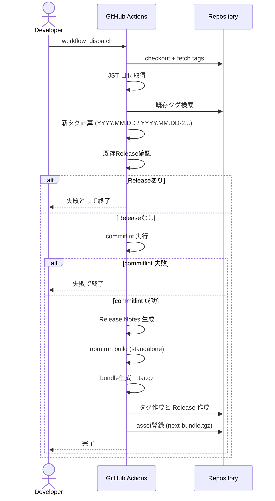
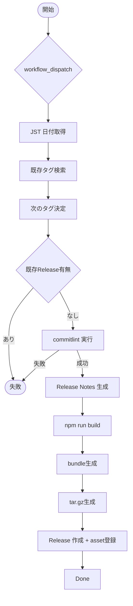

# GitHub 日付ベース Release 管理 plan（Next.js standalone bundle 登録追記）

## 1. 機能要件 / 非機能要件

- 機能要件:
  - workflow_dispatch を起点に、日付ベースの GitHub Release を作成できること。
  - タグ形式は初回 `YYYY.MM.DD` とし、同日 2 回目以降は `YYYY.MM.DD-2` から枝番を付与すること。初回をサフィックス無しで固定するため `-1` は使用しない。
  - Conventional Commits を解析して Release Notes を自動生成すること。
  - 無効な Conventional Commits を検知した場合はワークフローを失敗として停止すること。
  - Release 作成・タグ作成・Release Notes 生成・bundle 添付を単一 workflow で完結できること。
  - workflow_dispatch 実行時に Next.js standalone ビルドを行い、bundle を tar.gz 化して Release asset を登録できること。
  - bundle には `server.js` / `.next/static` / `public` / `package.json` が含まれること。
  - 既存 Release が同一タグで存在する場合は workflow を失敗として停止すること。
- 非機能要件:
  - GITHUB_TOKEN を用いた最小権限設計で実行できること。
  - 同日複数実行でもタグ衝突が起きない冪等性を担保すること。
  - 自動デプロイや npm publish を含めないこと。
  - Node.js は 20.x に固定すること。
  - build 失敗時は Release 作成/asset 登録を行わない fail-fast を徹底すること。

## 2. スコープと変更対象

- リリース対象スコープ:
  - `.github/copilot/05-structure/monorepo.md` で定義された monorepo 全体を対象とし、`app/` および `mock/v1/web` を含むリポジトリ全体のリリース情報を管理する。
  - タグ `YYYY.MM.DD[-N]` はリポジトリ単位で一意となるように付与し、アプリケーションごとの個別バージョンタグは本ワークフローの対象外とする。
  - 本ワークフローは GitHub Release / タグ作成 / Release Notes 生成 / bundle 登録までを行い、各アプリケーションのデプロイやパッケージ公開は別ワークフローに委ねる（本 plan のスコープ外）。
  - 既存の日付ベース Release 管理仕様を維持しつつ、Next.js standalone bundle の Release asset 登録を単一 workflow に統合する。
  - タグ戦略は JST 日付ベースで `YYYY.MM.DD` を採用し、同日複数回は `-2` 以降の枝番を付与する。
  - JST を採用する理由は、リリース日付の基準を日本時間に統一し運用判断を一致させるため。
  - 本番サーバー側の pull/unpack、デプロイ自動化、Docker 化、GHCR 登録は対象外とする。
- 変更ファイル（新規/修正/削除）:
  - DESIGN フェーズの成果物は本 plan ドキュメントのみ。
  - 実装フェーズで `.github/workflows/release-date.yml` を単一 workflow として更新する。
  - 実装フェーズで `./next.config.ts`、`docs/release-process.md` の追加/更新を想定。
- 影響範囲・互換性リスク:
  - monorepo 全体に対して Release 作成のみを対象とし、アプリ本体の挙動やデプロイには影響しない。
  - main ブランチの履歴が Conventional Commits に準拠していない場合、ワークフローが失敗する。
- 外部依存・Secrets の扱い:
  - GitHub Actions の公式アクションと GITHUB_TOKEN のみを利用する。
  - Secrets/PII をログ出力しない。
  - permissions は `contents: write` を最小権限として明示する。

## 3. 設計方針

- 責務分離 / データフロー:
  - workflow_dispatch により手動実行し、JST 日付取得・既存タグ確認・コミット検証・新タグ計算・Release Notes 生成・build/bundle 生成・Release 作成を順次実行する。
  - Conventional Commits 検証は commitlint（`@commitlint/cli` + `@commitlint/config-conventional`）で実施し、以下のタイミングで強制する。
    - ローカル: pre-push フック（例: husky）で、push 対象コミットに対して `npx commitlint --from <BASE> --to HEAD` を実行し、不正なコミットは push 前に検出する。
    - CI: main ブランチ向けすべての PR で `npx commitlint --from <BASE> --to HEAD` を実行し、PR 内に不正なコミットが含まれる場合はジョブを失敗させてマージをブロックする。
    - Release ワークフロー: Release 対象レンジ（直近タグ〜HEAD）のコミットに対しても `npx commitlint --from <LAST_TAG> --to HEAD` を実行し、main に混入した不正コミットがある場合は Release を失敗として停止する最終ゲートとする。
  - Release Notes は `conventional-changelog-cli`（内部で `conventional-changelog` を利用）を用い、`conventionalcommits` プリセット（例: `npx conventional-changelog -p conventionalcommits -r 0`）で生成し、直近タグから HEAD まで（`git log <前回タグ>..HEAD` 相当）を対象とする。既存タグが 1 つも存在しない初回リリース時は、リポジトリ初期コミットから HEAD までを対象とする。
  - npm コマンド（commitlint / conventional-changelog-cli）は `.github/workflows/ci-nextjs.yml` と同様に `mock/v1/web` を作業ディレクトリとして実行し、git タグ操作はリポジトリルートで行う。
  - Next.js standalone bundle Release asset 登録は日付ベース Release 管理と同一 workflow で実行し、以下の順序で処理する。既存Release確認はタグ算出後に実施し、build前に fail-fast とする。
    1. checkout
    2. setup-node（Node 20 固定）
    3. npm ci
    4. JST 日付取得とタグ計算: `YYYY.MM.DD` / `YYYY.MM.DD-2` 以降
    5. 既存 Release 確認（存在する場合は失敗）
    6. commitlint 実行
    7. Release Notes 生成
    8. npm run build（standalone 出力）
    9. bundle 生成
    10. tar.gz 生成（`next-bundle.tgz`）
    11. Release 作成
    12. asset 登録
  - GitHub Actions は `actions/checkout` / `actions/setup-node` / Release 登録用アクションをタグまたは commit SHA で固定する。
  - standalone 設定はリポジトリルートの `./next.config.ts` に `output: "standalone"` を追加し、既存設定を保持する。
  - 以下は `next.config.ts` の書式に合わせた例であり、実装時は既存設定を維持する。

```ts
import type { NextConfig } from "next";

const nextConfig: NextConfig = {
  output: "standalone",
};

export default nextConfig;
```

  - bundle 構成は以下で固定する。

```
bundle/
  server.js
  .next/
    static/
  public/
  package.json
```

  - bundle 生成は以下の手順で固定し、workflow 内の bundle 生成ステップで検証を行う。
    - build 完了直後に `test -f .next/standalone/server.js` を実行し、存在しない場合は workflow を失敗させる（コピー前の検証）
    - `rm -rf bundle && mkdir -p bundle`
    - `cp -R .next/standalone/* bundle/`
    - `mkdir -p bundle/.next && cp -R .next/static bundle/.next/static`
    - `cp -R public bundle/public`
    - `cp package.json bundle/package.json`
    - コピー後に `bundle/server.js` が存在することを確認する
  - tar.gz の生成は `tar -czf next-bundle.tgz -C bundle .` で行い、`tar -xzf next-bundle.tgz -C <確認用ディレクトリ>` で展開した際に展開先直下へ `server.js` などが配置される構成を固定する。
  - Release asset 登録は計算したタグを利用し、`gh release create` で Release 作成後に `gh release upload` で登録する。
- エッジケース / 例外系 / リトライ方針:
  - JST 日付で `git tag -l "YYYY.MM.DD*"` を取得し、当日一致タグが 0 件の場合は `YYYY.MM.DD`（サフィックス無し）を新タグとする。
  - `-1` を使わず `-2` から開始する理由は、初回リリースをサフィックス無しで固定し、2回目以降を明示的に区別するため。
  - 既存タグがある場合は `YYYY.MM.DD-2` 以降の枝番を対象とし、最小の未使用番号を新タグに採用する。例: `2026.02.20` が既にあれば次は `2026.02.20-2`、`2026.02.20-2` が存在する場合は `2026.02.20-3`、`2026.02.20` と `2026.02.20-5` のみが存在する場合は `2026.02.20-2` を採用する。欠番がなければ最大値 +1 とし、手動削除時の再利用を許容する。
  - 既存 Release がある場合は workflow を失敗させる。
  - GitHub API を用いるタグ作成および Release 作成処理について、一時的な失敗（5xx / rate limit など）が発生した場合は最大 3 回までリトライし、各試行間に 5 秒の固定待機を挟む。永続的な 4xx エラーはリトライせず即時に失敗とし、最終的に解消しない場合は非 0 で終了する。
  - `.next/standalone/server.js` が存在しない場合は bundle 生成を失敗させる。
  - `gh release view <tag>` または GitHub API で既存 Release を検知した場合は workflow を失敗させる。
  - build 失敗や tar.gz 生成失敗時は Release 作成を行わない。
  - 依存コマンドは `set -euo pipefail` 相当で fail-fast を担保する。
- ログと観測性（漏洩防止を含む）:
  - 生成した日付・タグ・対象コミット範囲をログに出力する。
  - GITHUB_TOKEN や外部 URL はログに出さない。
  - tag 名、bundle 出力先、tar.gz 生成完了をログに出力する。

### 3.1 製造時の変更予定ファイル一覧

| No. | パス | 変更内容 |
| --- | --- | --- |
| 1 | .github/workflows/release-date.yml | 日付ベース Release 生成と bundle 登録を行う単一 workflow に統合 |
| 2 | mock/v1/web/.commitlintrc.cjs | Conventional Commits 検証ルールの新規追加 |
| 3 | mock/v1/web/package.json | commitlint/conventional-changelog 追加に伴う devDependencies 更新 |
| 4 | ./next.config.ts | 既存設定を保持したまま `output: "standalone"` を追加して standalone 出力を有効化 |
| 5 | docs/release-process.md | Release 作成手順・bundle 検証方法・失敗時対応の概要を明文化 |
| 6 | package.json | build script を確認（変更不要の場合は維持） |

## 4. 設計UML

- シーケンス図:



- 処理フロー図:



## 5. 人間が行う作業:

| 手順ID | 作業名 | 作業の目的 | 具体的な作業内容（人間がやることを詳細に書く） | 判断・確認ポイント | 完了条件（チェック可能な状態） |
| ---- | --- | ----- | ----------------------- | --------- | --------------- |
| H-01 | Conventional Commits 運用確認 | 解析失敗を防ぐ | main ブランチの履歴が Conventional Commits に準拠しているか確認する | 例外的なコミットがないこと | 直近のリリース対象コミットが規約に合致している |
| H-02 | ワークフロー手動実行 | 初回動作確認 | workflow_dispatch を実行し、期待するタグと Release が生成されるか確認する | 日付タグと Release Notes の整合 | Release が GitHub 上で確認できる |
| H-03 | 失敗時の復旧 | 運用手順の確立 | タグのみ作成され Release が失敗した場合、再実行/削除の方針を確認する | タグ・Release の整合性 | 復旧手順が明文化され、再実行で復旧できる |
| H-04 | standalone 設定確認 | 出力形式の固定 | `next.config.ts` に `output: "standalone"` が入っていることを確認する | `next build` で `.next/standalone` が生成される | `.next/standalone/server.js` が存在する |
| H-05 | workflow手動検証 | 初回実行の確認 | workflow_dispatch を実行し、tag/Release/bundle 登録を確認する | Release が作成され、asset が登録される | GitHub Release に `next-bundle.tgz` が存在する |
| H-06 | bundle内容確認 | 成果物の妥当性確認 | `tar -tzf next-bundle.tgz` で bundle 内容を確認する | bundle ルートに `server.js` があり `.next/static` が含まれる | bundle 構成が設計通りである |
| H-07 | 既存Release検証 | 冪等性の確認 | 同一タグで再実行し、workflow が失敗することを確認する | Release 既存時に失敗する | Release が重複作成されない |

### 5.1 使用する情報・資料

- 作業に必要な資料:
  - [00-index](../00-index.md)
  - [10-requirements](../10-requirements.md)
  - [20-architecture](../20-architecture.md)
  - [40-testing-strategy](../40-testing-strategy.md)
  - [60-ci-quality-gates](../60-ci-quality-gates.md)

## 6. テスト戦略

- テスト観点（正常 / 例外 / 境界 / 回帰）:
  - 正常: workflow_dispatch 実行で Conventional Commits が存在し、Release が生成される。
  - 例外: commitlint が失敗した場合にワークフローが停止する。
  - 境界: 同日 2 回目の実行で `-2` が付いたタグが生成される。
  - 回帰: 既存のタグがある状態でも既存 Release が重複作成されない。
  - 正常: workflow_dispatch 実行で `next-bundle.tgz` が Release に登録される。
  - 例外: build 失敗時は Release が作成されない。
  - 境界: 既存 Release が存在する場合に workflow が失敗する。
  - 回帰: bundle 内に `server.js` と `.next/static` が含まれる。
- モック / フィクスチャ方針:
  - GitHub Actions 上で実行し、モックは使用しない。
- テスト追加の実行コマンド（例: `python -m pytest`）:
  - `cd mock/v1/web && npm run lint`
  - `cd mock/v1/web && npm run typecheck`
  - `cd mock/v1/web && npm run test`
  - `cd mock/v1/web && npm run build`
  - `cd mock/v1/web && npm audit`
  - `npm run lint`
  - `npm run build`
  - `tar -tzf next-bundle.tgz`

## 7. CI 品質ゲート

- 実行コマンド（format / lint / typecheck / test / security）:
  - format: `cd mock/v1/web && npx prettier . --check`（未導入の場合は実装時に判断）
  - lint: `cd mock/v1/web && npm run lint`
  - typecheck: `cd mock/v1/web && npm run typecheck`
  - test: `cd mock/v1/web && npm run test`
  - security: `cd mock/v1/web && npm audit`
  - lint: `npm run lint`（Next.js standalone bundle workflow）
  - test: `tar -tzf next-bundle.tgz`（bundle 構成検証）
  - security: `npm audit`（Next.js standalone bundle workflow）
- 通過基準と失敗時の対応:
  - いずれかのコマンドが失敗した場合、Release ワークフローは停止し、原因を修正して再実行する。

## 8. ロールアウト・運用

- ロールバック方法:
  - 誤ったタグや Release が生成された場合は GitHub Release とタグを削除する。
  - 誤った bundle asset が登録された場合は Release から asset を削除する。
- 監視・運用上の注意:
  - Release 作成ログに Secrets を出さない。
  - main ブランチを基準に運用し、デプロイや npm publish は行わない。
  - workflow_dispatch を前提に運用し、本番サーバー側の pull/unpack は本 plan の対象外とする。

## 9. オープンな課題 / ADR 要否

- 未確定事項:
  - CI 品質ゲートの format/test コマンド整備範囲（別 Issue で判断）。
- ADR に残すべき判断:
  - なし。
