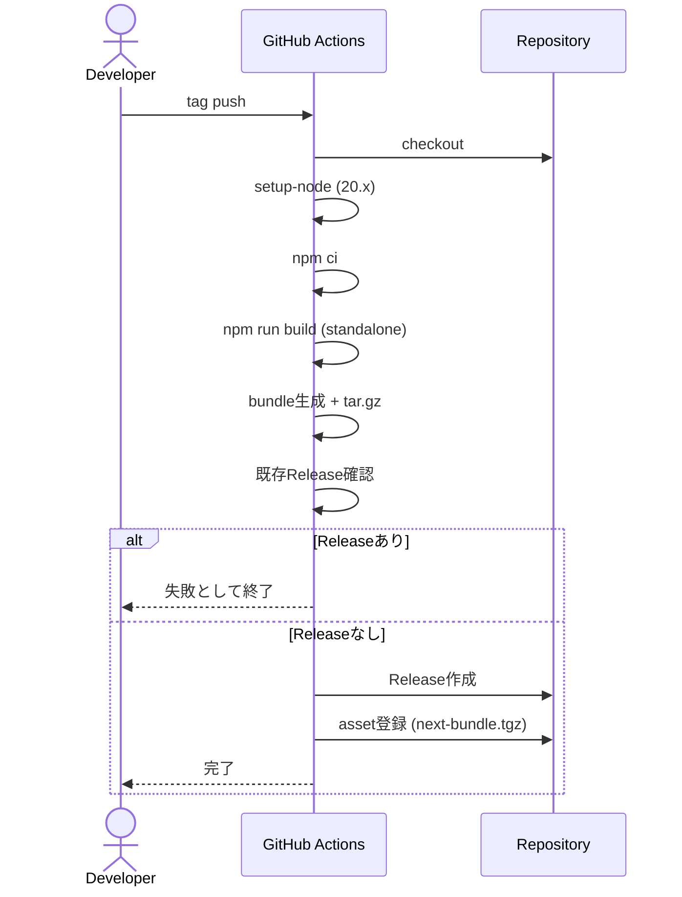
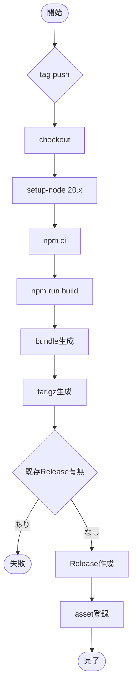

# Next.js standaloneビルド成果物のGitHub Release登録 plan

## 1. 機能要件 / 非機能要件

- 機能要件:
  - Next.js を `output: "standalone"` でビルドし、`bundle` ディレクトリを生成できること。
  - bundle を tar.gz 化し、成果物 `next-bundle.tgz` を生成できること。
  - tag push をトリガーに GitHub Actions で build → bundle 生成 → Release asset 登録を実行できること。
  - 既存 Release が同一タグで存在する場合は workflow を失敗として停止すること。
- 非機能要件:
  - Node.js は 20.x に固定すること。
  - GitHub Actions のみを利用し、`GITHUB_TOKEN` の最小権限で実行すること。
  - bundle 構成と tar.gz 生成仕様を固定し、再現可能な成果物を生成すること。
  - build 失敗時は Release 作成/asset 登録を行わない fail-fast を徹底すること。
  - Secrets/PII をログに出さないこと。

## 2. スコープと変更対象

- In Scope:
  - standalone 設定
  - CI build workflow
  - bundle 生成 / tar.gz 化
  - Release asset 登録
- Out of Scope:
  - タグ戦略（別Issueで定義済みのため本 plan では扱わない）
  - 本番サーバー側の pull/unpack/運用
  - デプロイ自動化 / ロールバック自動化
  - Docker 化 / GHCR 登録
- 変更ファイル（新規/修正/削除）:
  - DESIGN フェーズの成果物は本 plan ドキュメントのみ。
  - 実装フェーズで以下のファイル変更を想定する（詳細は 3.1 に記載）。
- 影響範囲・互換性リスク:
  - Next.js の出力が standalone になるため、ビルド成果物の構成が変わる。
  - 実行時挙動やデプロイ手順の自動化は本 plan の対象外。
- 外部依存・Secrets の扱い:
  - GitHub Actions 公式アクションと `GITHUB_TOKEN` のみを使用する。
  - 権限は `contents: write` を最小限として明示する。

## 3. 設計方針

- 責務分離 / データフロー:
  - workflow は tag push をトリガーに起動し、以下を順次実行する。
    1. checkout
    2. setup-node（Node 20 固定）
    3. npm ci
    4. npm run build（standalone 出力）
    5. bundle 生成
    6. tar.gz 生成（`next-bundle.tgz`）
    7. 既存 Release 確認
    8. Release 作成
    9. asset 登録
  - GitHub Actions は `actions/checkout` / `actions/setup-node` / Release 登録用アクションをタグまたは commit SHA で固定する。
  - standalone 設定はリポジトリルートの `./next.config.ts`（既存ファイル）に追加し、既存設定を保持したまま `output: "standalone"` を追記する。
  - 以下のコードは追加差分のイメージであり、実装時は既存設定を維持する。

```ts
import type { NextConfig } from "next";

const nextConfig: NextConfig = {
  output: "standalone",
};

export default nextConfig;
```

  - bundle 構成は以下で固定する。

```
bundle/
  server.js
  .next/
    static/
  public/
  package.json
```

  - bundle 生成は以下の手順で固定し、workflow 内の bundle 生成ステップで検証を行う。
    - build 完了直後に `test -f .next/standalone/server.js` を実行し、存在しない場合はエラーメッセージを出して workflow を失敗させる（コピー前の検証）
    - `rm -rf bundle && mkdir -p bundle`
    - `cp -R .next/standalone/* bundle/`
    - `mkdir -p bundle/.next && cp -R .next/static bundle/.next/static`
    - `cp -R public bundle/public`
    - `cp package.json bundle/package.json`
    - コピー後に `bundle/server.js` が存在することを確認する
  - tar.gz の生成は `tar -czf next-bundle.tgz -C bundle .` で行い、`tar -xzf next-bundle.tgz -C <確認用ディレクトリ>` で展開した際に展開先直下へ `server.js` などが配置される構成を固定する。
  - Release asset 登録は `github.ref_name` の tag を利用し、`gh release create` などで Release 作成後に `gh release upload` で登録する。
- エッジケース / 例外系 / リトライ方針:
  - `.next/standalone/server.js` が存在しない場合は bundle 生成を失敗させる。
  - `gh release view <tag>` または GitHub API で既存 Release を検知した場合は exit 1 で停止する。
  - build 失敗や tar.gz 生成失敗時は Release 作成を行わない。
  - 依存コマンドは `set -euo pipefail` 相当で fail-fast を担保する。
- ログと観測性（漏洩防止を含む）:
  - tag 名、bundle 出力先、tar.gz 生成完了をログに出す。
  - `GITHUB_TOKEN` など Secrets をログに出さない。

### 3.1 製造時の変更予定ファイル一覧

| No. | パス | 変更内容 |
| --- | --- | --- |
| 1 | ./next.config.ts | 既存設定を保持したまま `output: "standalone"` を追加して standalone 出力を有効化 |
| 2 | .github/workflows/build-and-release.yml | tag push で build → bundle → Release asset 登録を行う workflow を追加 |
| 3 | docs/release-process.md | Release 作成手順・bundle 検証方法・失敗時対応の概要を明文化 |
| 4 | package.json | build script を確認（変更不要の場合は維持） |

## 4. 設計UML

- シーケンス図:



- 処理フロー図:



## 5. 人間が行う作業:

| 手順ID | 作業名 | 作業の目的 | 具体的な作業内容（人間がやることを詳細に書く） | 判断・確認ポイント | 完了条件（チェック可能な状態） |
| ---- | --- | ----- | ----------------------- | --------- | --------------- |
| H-01 | standalone 設定確認 | 出力形式の固定 | `next.config.ts` に `output: "standalone"` が入っていることを確認する | `next build` で `.next/standalone` が生成される | `.next/standalone/server.js` が存在する |
| H-02 | workflow手動検証 | 初回実行の確認 | 有効なタグを push して workflow を実行する | Release が作成され、asset が登録される | GitHub Release に `next-bundle.tgz` が存在する |
| H-03 | bundle内容確認 | 成果物の妥当性確認 | `tar -tzf next-bundle.tgz` で bundle 内容を確認する | bundle ルートに `server.js` があり `.next/static` が含まれる | bundle 構成が設計通りである |
| H-04 | 既存Release検証 | 冪等性の確認 | 同一タグで再実行し、workflow が失敗することを確認する | Release 既存時に失敗する | Release が重複作成されない |

### 5.1 使用する情報・資料

- 作業に必要な資料:
  - [00-index](../00-index.md)
  - [10-requirements](../10-requirements.md)
  - [20-architecture](../20-architecture.md)
  - [40-testing-strategy](../40-testing-strategy.md)
  - [60-ci-quality-gates](../60-ci-quality-gates.md)

## 6. テスト戦略

- テスト観点（正常 / 例外 / 境界 / 回帰）:
  - 正常: 有効な tag push で `next-bundle.tgz` が Release に登録される。
  - 例外: build 失敗時は Release が作成されない。
  - 境界: 既存 Release が存在する場合に workflow が失敗する。
  - 回帰: bundle 内に `server.js` と `.next/static` が含まれる。
- モック / フィクスチャ方針:
  - GitHub Actions 上で検証し、モックは使用しない。
- テスト追加の実行コマンド（例: `python -m pytest`）:
  - `npm run lint`
  - `npm run build`
  - `tar -tzf next-bundle.tgz`

## 7. CI 品質ゲート

- 実行コマンド（format / lint / typecheck / test / security）:
  - format: 未整備の場合は導入可否を実装で判断する。
  - lint: `npm run lint`
  - typecheck: `npm run typecheck` （現状未整備のため別Issueで整備し、本 plan では実行対象外）
  - test: `tar -tzf next-bundle.tgz`（bundle 構成検証を最低限の統合テストとして実行）
  - test: `npm run test` （現状未整備のため別Issueで整備し、本 plan では実行対象外）
  - security: `npm audit`
- 通過基準と失敗時の対応:
  - いずれかのコマンドが失敗した場合は Release 作成を行わず、原因を修正して再実行する。

## 8. ロールアウト・運用

- ロールバック方法:
  - 誤った Release を作成した場合は GitHub Release と tag を削除する。
- 監視・運用上の注意:
  - Release 作成ログに Secrets を出さない。
  - tag の存在は前提とし、タグ戦略は別Issueで確定済みとする。

## 9. オープンな課題 / ADR 要否

- 未確定事項:
  - `npm run typecheck` / `npm run test` の整備有無と導入タイミング。
- ADR に残すべき判断:
  - なし。
