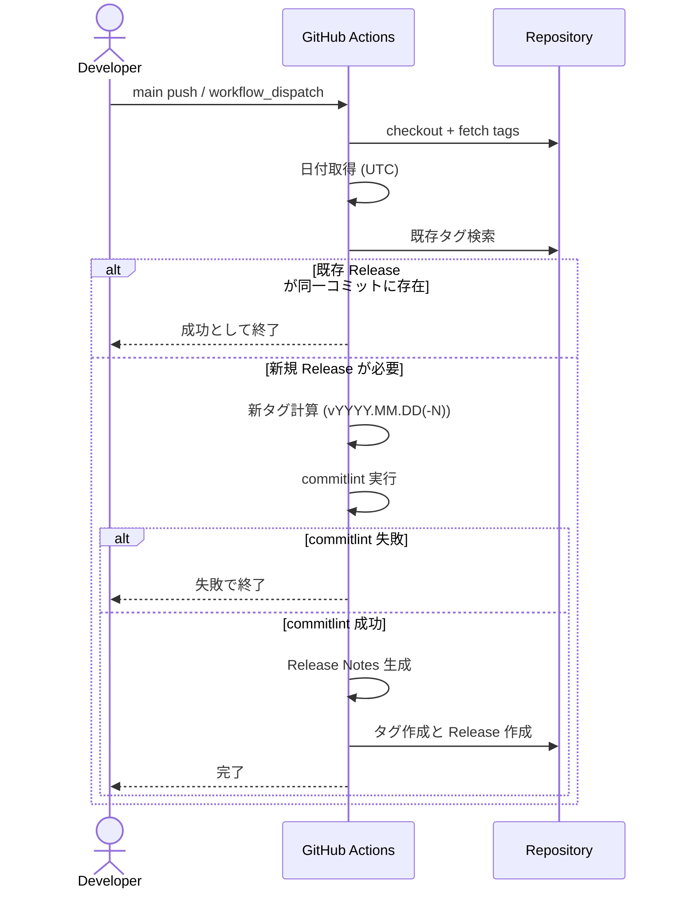
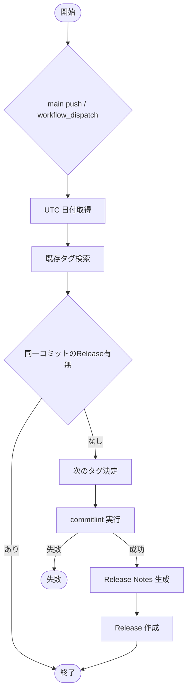

# GitHub 日付ベース Release 管理 plan

## 1. 機能要件 / 非機能要件

- 機能要件:
  - main ブランチの push / workflow_dispatch を起点に、日付ベースの GitHub Release を作成できること。
  - タグ形式は `vYYYY.MM.DD` とし、同日 2 回目以降は `vYYYY.MM.DD-1` のように連番を付与すること。
  - Conventional Commits を解析して Release Notes を自動生成すること。
  - 無効な Conventional Commits を検知した場合はワークフローを失敗として停止すること。
- 非機能要件:
  - GITHUB_TOKEN を用いた最小権限設計で実行できること。
  - 同日複数実行でもタグ衝突が起きない冪等性を担保すること。
  - 自動デプロイや npm publish を含めないこと。

## 2. スコープと変更対象

- リリース対象スコープ:
  - `.github/copilot/05-structure/monorepo.md` で定義された monorepo 全体を対象とし、`app/` および `mock/v1/web` を含むリポジトリ全体のリリース情報を管理する。
  - タグ `vYYYY.MM.DD[-N]` はリポジトリ単位で一意となるように付与し、アプリケーションごとの個別バージョンタグは本ワークフローの対象外とする。
  - 本ワークフローは GitHub Release / タグ作成のみを行い、各アプリケーションのデプロイやパッケージ公開は別ワークフローに委ねる（本 plan のスコープ外）。
- 変更ファイル（新規/修正/削除）:
  - DESIGN フェーズの成果物は本 plan ドキュメントのみ。
  - 実装フェーズで `.github/workflows/release-date.yml` などのワークフロー追加を想定。
- 影響範囲・互換性リスク:
  - monorepo 全体に対して Release 作成のみを対象とし、アプリ本体の挙動やデプロイには影響しない。
  - main ブランチの履歴が Conventional Commits に準拠していない場合、ワークフローが失敗する。
- 外部依存・Secrets の扱い:
  - GitHub Actions の公式アクションと GITHUB_TOKEN のみを利用する。
  - Secrets/PII をログ出力しない。
  - permissions は `contents: write` を最小権限として明示する。

## 3. 設計方針

- 責務分離 / データフロー:
  - Workflow で日付取得・タグ解決・コミット検証・Release Notes 生成・Release 作成を順次実行する。
  - Conventional Commits 検証は commitlint（config-conventional）で実施し、以下のタイミングで強制する。
    - ローカル: pre-push フック（例: husky）で、push 対象コミットに対して commitlint を実行し、不正なコミットは push 前に検出する。
    - CI: main ブランチ向けすべての PR で commitlint を実行し、PR 内に不正なコミットが含まれる場合はジョブを失敗させてマージをブロックする。
    - Release ワークフロー: Release 対象レンジ（直近タグ〜HEAD）のコミットに対しても commitlint を実行し、main に混入した不正コミットがある場合は Release を失敗として停止する最終ゲートとする。
  - Release Notes は `conventional-changelog` の conventionalcommits プリセットで生成し、直近タグから HEAD までを対象とする。既存タグが 1 つも存在しない初回リリース時は、リポジトリ初期コミットから HEAD までを対象とする。
- エッジケース / 例外系 / リトライ方針:
  - 同日の既存タグを `git tag -l "vYYYY.MM.DD*"` で取得し、未サフィックスは 0 とみなして最大サフィックス +1 を新タグに採用する。
  - 同一コミットで既存 Release が存在する場合は処理済みとして終了する。
  - GitHub API を用いるタグ作成および Release 作成処理について、一時的な失敗（5xx / rate limit など）が発生した場合は最大 3 回までリトライし、各試行間に 5 秒の固定待機を挟む。永続的な 4xx エラーはリトライせず即時に失敗とし、最終的に解消しない場合は非 0 で終了する。
- ログと観測性（漏洩防止を含む）:
  - 生成した日付・タグ・対象コミット範囲をログに出力する。
  - GITHUB_TOKEN や外部 URL はログに出さない。

### 3.1 製造時の変更予定ファイル一覧

| No. | パス | 変更内容 |
| --- | --- | --- |
| 1 | .github/workflows/release-date.yml | 日付ベース Release 生成ワークフローを新規追加 |
| 2 | mock/v1/web/.commitlintrc.cjs | Conventional Commits 検証ルールの追加 |
| 3 | mock/v1/web/package.json | commitlint/conventional-changelog 追加に伴う devDependencies 更新 |

## 4. 設計UML

- シーケンス図:

- 処理フロー図:

## 5. 人間が行う作業:

| 手順ID | 作業名 | 作業の目的 | 具体的な作業内容（人間がやることを詳細に書く） | 判断・確認ポイント | 完了条件（チェック可能な状態） |
| ---- | --- | ----- | ----------------------- | --------- | --------------- |
| H-01 | Conventional Commits 運用確認 | 解析失敗を防ぐ | main ブランチの履歴が Conventional Commits に準拠しているか確認する | 例外的なコミットがないこと | 直近のリリース対象コミットが規約に合致している |
| H-02 | ワークフロー手動実行 | 初回動作確認 | workflow_dispatch を実行し、期待するタグと Release が生成されるか確認する | 日付タグと Release Notes の整合 | Release が GitHub 上で確認できる |
| H-03 | 失敗時の復旧 | 運用手順の確立 | タグのみ作成され Release が失敗した場合、再実行/削除の方針を確認する | タグ・Release の整合性 | 復旧手順が明文化され、再実行で復旧できる |

### 5.1 使用する情報・資料

- 作業に必要な資料:
  - `.github/copilot/00-index.md`
  - `.github/copilot/10-requirements.md`
  - `.github/copilot/20-architecture.md`
  - `.github/copilot/40-testing-strategy.md`
  - `.github/copilot/60-ci-quality-gates.md`

## 6. テスト戦略

- テスト観点（正常 / 例外 / 境界 / 回帰）:
  - 正常: main に Conventional Commits が存在し、Release が生成される。
  - 例外: commitlint が失敗した場合にワークフローが停止する。
  - 境界: 同日 2 回目の実行で `-1` が付いたタグが生成される。
  - 回帰: 既存のタグがある状態でも既存 Release が重複作成されない。
- モック / フィクスチャ方針:
  - GitHub Actions 上で実行し、モックは使用しない。
- テスト追加の実行コマンド（例: `python -m pytest`）:
  - `npm run lint`
  - `npm run build`
  - `npx tsc --noEmit`
  - `npm audit`

## 7. CI 品質ゲート

- 実行コマンド（format / lint / typecheck / test / security）:
  - format: `npx prettier . --check`（未導入の場合は実装時に判断）
  - lint: `npm run lint`
  - typecheck: `npx tsc --noEmit`
  - test: `npm run test`（未定義の場合は実装時に整備）
  - security: `npm audit`
- 通過基準と失敗時の対応:
  - いずれかのコマンドが失敗した場合、Release ワークフローは停止し、原因を修正して再実行する。

## 8. ロールアウト・運用

- ロールバック方法:
  - 誤ったタグや Release が生成された場合は GitHub Release とタグを削除する。
- 監視・運用上の注意:
  - Release 作成ログに Secrets を出さない。
  - main ブランチを基準に運用し、デプロイや npm publish は行わない。

## 9. オープンな課題 / ADR 要否

- 未確定事項:
  - CI 品質ゲートの format/test コマンド整備範囲（別 Issue で判断）。
- ADR に残すべき判断:
  - なし。
