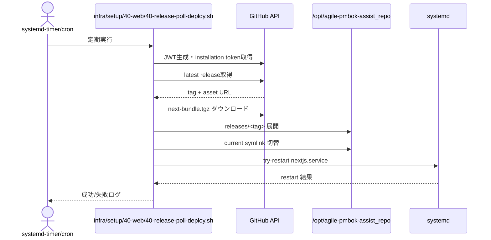
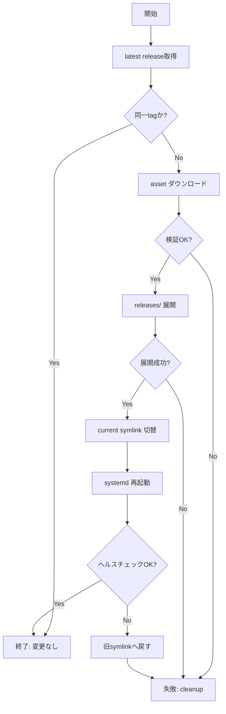

# Implementation Plan: GitHub Release連動のサーバー側自動デプロイ

## 1. 機能要件 / 非機能要件

- 機能要件:
  - GitHub Release（latest）から `next-bundle.tgz` を取得し、サーバーで自動デプロイする。
  - `/opt/agile-pmbok-assist_repo/releases/<tag>` へ展開し、`current` シンボリックリンクを切り替える。
  - デプロイ完了後に systemd 経由で `next start` を安全に再起動する。
  - 同一 tag の再取得を防ぎ、冪等に終了できる。
  - 失敗時は `current` を変更せず、ロールバックが実行できる。
  - ログに tag・結果・エラー理由を記録し、Secrets を出さない。
- 非機能要件:
  - ダウンタイムは最小化（symlink 切替 + graceful restart）。
  - GitHub App の最小権限を維持し、Secrets はサーバー側にのみ保持する。
  - Docker/Kubernetes には依存しない。

## 2. スコープと変更対象

- 変更ファイル（新規/修正/削除）:
  - `infra/setup/40-web/40-release-poll-deploy.sh`（新規）: Release 取得・展開・symlink 切替・再起動・ロールバック処理。
  - `infra/setup/40-web/30-nextjs-service.sh`（更新/置換）: systemd ユニット差し替え用の更新。
  - `docs/server-deployment.md`（新規）: 運用手順、ロールバック方法、監視観点。
  - シェル配置は `infra/` 配下に統一し、`scripts/` や `deploy/` 直置きは行わない。
- 影響範囲・互換性リスク:
  - サーバー運用に限定。アプリ本体コードや CI 設計は変更しない。
  - `systemctl restart nextjs.service` による短時間の停止が発生しうるため、graceful 停止とヘルスチェックで影響を最小化する。
- 外部依存・Secrets の扱い:
  - GitHub App の `App ID` / `Installation ID` / `Private Key` をサーバー側の環境変数（例: `/etc/agile-pmbok/deploy.env`）で管理。
  - GitHub API（Release / Asset ダウンロード）へのアクセスが必須。

## 3. 設計方針

- 責務分離 / データフロー:
  - `infra/setup/40-web/40-release-poll-deploy.sh` は「Release 検知 → 取得 → 展開 → 切替 → 再起動」を一貫して担当する。
  - Release 検知は **polling** を採用（systemd timer もしくは cron）。Webhook 依存を避けつつ Release asset デプロイを正とするため、既存 `agile-pmbok-assist-pull.timer` は停止/無効化する。
  - GitHub API 利用: GitHub App の JWT を生成し、`POST /app/installations/{id}/access_tokens` で installation token を取得。`GET /repos/{owner}/{repo}/releases/latest` から最新 Release を取得し、`next-bundle.tgz` の asset を `Accept: application/octet-stream` でダウンロード。
- 展開ディレクトリ設計:
  - `/opt/agile-pmbok-assist_repo/releases/<tag>` に展開。
  - `/opt/agile-pmbok-assist_repo/current -> releases/<tag>` を `ln -sfn` で原子的に切替。
  - 展開完了の印として `releases/<tag>/.deploy-complete` を作成。
- 冪等性設計:
  - `releases/<tag>` と `.deploy-complete` が存在し、`current` が同じ tag を指す場合は即終了。
  - ダウンロード途中・展開途中の一時ディレクトリは `.deploying` などに隔離し、失敗時は削除する。
- 再起動戦略（graceful restart）:
  - `systemctl try-restart nextjs.service` を実行。
  - `KillSignal=SIGTERM` と `TimeoutStopSec` を設定し、`next start` を正常停止させてから再起動。
  - 再起動後に `systemctl is-active` とアプリのヘルスチェック（HTTP 200）を確認。
- ロールバック設計:
  - `current` を直前のリリースへ戻し、`systemctl restart nextjs.service` を実行。
  - `infra/setup/40-web/40-release-poll-deploy.sh --rollback <tag>` を用意し、指定 tag へ切替可能にする。
- エラー時復旧フロー:
  - Release 取得失敗／Asset なし／ダウンロード失敗／展開失敗時は `current` を変更せず終了。
  - 再起動失敗時は symlink を旧バージョンへ戻し、再起動を再試行。
  - 失敗時ログに step・tag・理由を記録。
- ログと観測性（漏洩防止を含む）:
  - `logger` または stdout で journald へ出力。`TAG=`, `STEP=`, `RESULT=` など構造化キーを付与。
  - Token や Private Key はログに出さない。

### 3.1 製造時の変更予定ファイル一覧

| No. | パス | 変更内容 |
| --- | -- | ---- |
| 1 | `infra/setup/40-web/40-release-poll-deploy.sh` | Release 取得・展開・symlink 切替・再起動・ロールバックを実装 | 
| 2 | `infra/setup/40-web/30-nextjs-service.sh` | systemd ユニット差し替え（WorkingDirectory / ExecStart / StopSignal など） | 
| 3 | `docs/server-deployment.md` | 手順書・運用/監視・ロールバック方法の記載 | 

## 4. 設計UML

- シーケンス図:

- 処理フロー図:

## 5. 人間が行う作業:

| 手順ID | 作業名 | 作業の目的 | 具体的な作業内容（人間がやることを詳細に書く） | 判断・確認ポイント | 完了条件（チェック可能な状態） |
| ---- | --- | ----- | ----------------------- | --------- | --------------- |
| H-01 | GitHub App 資格情報の配置 | API 認証を可能にする | GitHub App の Private Key を `/etc/agile-pmbok/app.private-key.pem` に配置し、`APP_ID` と `INSTALLATION_ID` を `/etc/agile-pmbok/deploy.env` に設定する | 秘密鍵の権限が 600 であること | `infra/setup/40-web/40-release-poll-deploy.sh --check-auth` が成功する |
| H-02 | systemd ユニット差し替え | Next.js 起動を管理する | `infra/setup/40-web/30-nextjs-service.sh` を更新し、`/etc/systemd/system/nextjs.service` を差し替えた後に `systemctl daemon-reload` と `systemctl restart nextjs.service` を実行 | `systemctl status nextjs.service` が active | 起動後に HTTP 200 を返す |
| H-03 | 定期実行設定 | Release 検知を自動化 | systemd timer または cron で `infra/setup/40-web/40-release-poll-deploy.sh` を 5〜10 分間隔で実行 | 実行ログが定期的に出力される | 期待する頻度でログが残る |

### 5.1 使用する情報・資料

- 作業に必要な資料:
  - Issue #47, Issue #52
  - GitHub App 認証ガイド
  - `docs/server-deployment.md`

## 6. テスト戦略

- テスト観点（正常 / 例外 / 境界 / 回帰）:
  - 正常: 最新 Release が存在し、asset を取得して `current` が更新される。
  - 例外: asset 不在・ダウンロード失敗・展開失敗時に `current` が変わらない。
  - 境界: 同一 tag を再実行しても変更が発生しない。
  - 回帰: ロールバック後に旧バージョンで起動できる。
- モック / フィクスチャ方針:
  - 実装 PR では `--dry-run` モードとモック URL を用意し、GitHub API を直接叩かない検証経路を準備する。
- テスト追加の実行コマンド（例: `python -m pytest`）:
  - `bash -n infra/setup/40-web/40-release-poll-deploy.sh`
  - `./infra/setup/40-web/40-release-poll-deploy.sh --dry-run`

## 7. CI 品質ゲート

- 実行コマンド（format / lint / typecheck / test / security）:
  - 既存の `npm run lint` / `npm run build` を維持する（CI 追加は行わない）。
- 通過基準と失敗時の対応:
  - 既存の品質ゲートが成功すること。失敗時は実装 PR で原因を切り分け、最小差分で修正する。

## 8. ロールアウト・運用

- ロールバック方法:
  - `infra/setup/40-web/40-release-poll-deploy.sh --rollback <tag>` を実行し、`current` を旧リリースへ切替後に `systemctl restart nextjs.service`。
  - 直近のリリースを自動で検出する場合は `releases/` の作成日時順で選定。
- 監視・運用上の注意:
  - journald で `TAG=` `RESULT=` を含むログを監視。
  - ディスク容量（releases の世代数）を監視し、古いリリースを定期削除する運用ルールを定義。

## 9. オープンな課題 / ADR 要否

- 未確定事項:
  - polling 間隔（5分/10分）の最終決定。
  - ヘルスチェックの具体的なエンドポイント（`/api/health` 追加要否）。
  - Release asset の整合性検証（checksum 追加要否）。
- ADR に残すべき判断:
  - polling 採用の理由（Webhook 不要、サーバー公開を抑制）を ADR に残すか検討。

## コードレビューフィードバック対応

### 追記

- アプリ名（<app>）: `agile-pmbok-assist_repo`
- デプロイ先ルート: `/opt/agile-pmbok-assist_repo`
- 再起動対象 systemd service: `nextjs.service`
- デプロイスクリプト配置: `infra/setup/40-web/40-release-poll-deploy.sh`（`scripts/` や `deploy/` 直置き禁止）
- デプロイ済み判定（state file）:
  - `/opt/agile-pmbok-assist_repo/.last_deployed_tag`
- 実体切替（current symlink）:
  - `/opt/agile-pmbok-assist_repo/current -> /opt/agile-pmbok-assist_repo/releases/<tag>`
- デプロイは「成果物の入替 + 再起動」に限定し、**デプロイ先でのCI実行は行わない**（Release作成側で担保）。
- ポーリング方式デプロイは「state file + current symlink + restart」で堅牢化する。
- `<app>` はテンプレ記号ではなく、実名 `agile-pmbok-assist_repo` を固定値として扱う。
- アプリ名（app）: `agile-pmbok-assist_repo`（`<app>` 表記はラベルとして固定）
- 追記済みのアプリ名記述（`<app>`/`app`）は同一の固定ラベルを示し、表記差は意図しない。
- 表記の正は `<app>` とし、`app` 表記は補足説明としてのみ併記する。
- 既存 systemd 登録済みの unit/timer は「新規作成」ではなく差し替え（更新/置換）として扱う。
- A) `nextjs.service`（既存 `/etc/systemd/system/nextjs.service`）の差し替え手順:
  1. `sudo systemctl stop nextjs.service`
  2. `/etc/systemd/system/nextjs.service` を更新（`WorkingDirectory` / `EnvironmentFile` / `ExecStart` を `current` 前提に統一）
  3. `sudo systemctl daemon-reload`
  4. `sudo systemctl restart nextjs.service`
  5. `sudo systemctl status nextjs.service --no-pager -l`
  - unit を repo 管理する場合は `infra/setup/40-web/30-nextjs-service.sh` を更新し、そこから再配置する前提とする。
- B) 既存自動 pull（`agile-pmbok-assist-pull.service` / `agile-pmbok-assist-pull.timer`）との差し替え前提:
  - `agile-pmbok-assist-pull.*` は Git リポジトリの pull を担う。
  - 今回の release polling deploy は Release asset 取得・展開・current 切替・`nextjs.service` 再起動を担う。
  - **正の方式は Release asset デプロイとし、pull.timer は停止/無効化対象**とする（競合防止）。
  - 差し替え/無効化手順（Release asset デプロイを正とする場合）:
    1. `sudo systemctl stop agile-pmbok-assist-pull.timer`
    2. `sudo systemctl disable agile-pmbok-assist-pull.timer`
    3. `sudo systemctl stop agile-pmbok-assist-pull.service`
    4. `sudo systemctl daemon-reload`
  - pull を残す場合は責務が競合しないよう、実行タイミングの調整または排他制御（例: ロックファイル）を設計に追加する。
- bootstrap スクリプト運用（今回作業専用）:
  - `infra/bootstrap_20260220.sh` を新規作成し、systemd unit 差し替え等の今回作業に限定した手順のみを安全に再実行する。
  - フルの `bootstrap.sh` 再実行は副作用が大きいため避ける。
  - 実行コマンド（必須）: `sudo ENV_FILE=infra/.env bash infra/bootstrap_20260220.sh`
  - `ENV_FILE` の存在/権限を確認し、source で環境変数を読み込む。
  - `infra/setup/40-web/30-nextjs-service.sh` を実行した後に `systemctl daemon-reload` → `systemctl restart nextjs.service` → `systemctl status nextjs.service --no-pager -l` を実行する。
  - ヘルスチェックは `infra/setup/90-verify/10-healthcheck.sh` を呼び出す。
  - ヘルスチェック不足分の対応: `infra/setup/90-verify/10-healthcheck.sh` の `nextjs` チェックを有効化し、`systemctl is-active nextjs` を含める。
