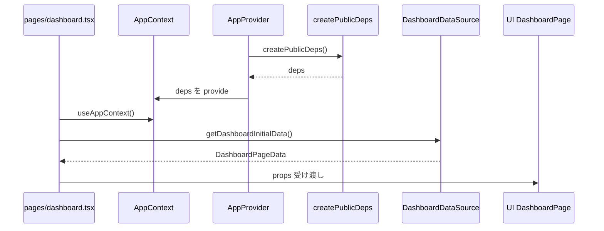
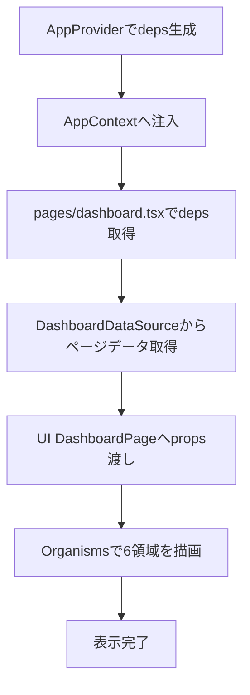

# Implementation Plan — Upstream Demo: ダッシュボード画面（DESIGN）

## 1. 機能要件 / 非機能要件

- 機能要件:
  - Upstream(public) デモとして `dashboard`1ページの追加手順を SSOT 化する。
  - ページ追加時の 4 点セット（docs / contracts / ui / app page）を再利用可能な型として定義する。
  - ダッシュボード画面を構成する領域（共通ヘッダ、左ペインメニュー、プロジェクト一覧、メンバー一覧、予算執行状況、設定ボタン）の責務分割を定義する。
  - DI は `AppProvider` のみで依存解決し、`pages/dashboard.tsx` は `packages/contracts` / `packages/ui` / `providers/AppContext` 以外を参照しない方針を固定する。
- 非機能要件:
  - private 実装/社内依存を持ち込まない（public 完結）。
  - 既存挙動の互換性を維持し、導入後もページ追加を同一手順で横展開できる。
  - CSS は MUI(Emotion) を前提とし、スタイル注入順（`StyledEngineProvider injectFirst`）を固定する。

## 2. スコープと変更対象

- 変更ファイル（新規/修正/削除）:
  - 新規: `.github/copilot/plans/75-page-dashboard.md`
- 影響範囲・互換性リスク:
  - 本 Issue は設計ドキュメントのみ変更。実装・ビルド成果物への直接影響はない。
  - 将来実装で構成を逸脱すると DIP 違反（ページから具象依存）になるため、実装時レビューで強制する。
- 外部依存・Secrets の扱い:
  - 依存追加なし、Secrets 利用なし。

## 3. 設計方針

- 責務分離 / データフロー:
  - `packages/contracts` は interface/type のみを定義し、取得方法（fetch/URL/認証）は定義しない。
  - `apps/demo-web/providers/public/createPublicDeps.ts` は public 完結実装としてモックデータを返し、DataSource の具象を閉じ込める。
  - `apps/demo-web/providers/AppProvider.tsx` が唯一の Composition Root として `deps` を生成し `AppContext` に注入する。
  - `apps/demo-web/pages/dashboard.tsx` は `useAppContext()` で `deps.dashboardDataSource` を受け取り、UI ページに `props` として渡すだけにする（ロジック最小化）。
  - `packages/ui/src/pages/dashboard/DashboardPage.tsx` は表示責務に集中し、画面構成を Atoms/Molecules/Organisms へ分割する。
- エッジケース / 例外系 / リトライ方針:
  - DataSource 失敗時は `DashboardLoadState`（`loading` / `ready` / `error`）で UI 表示を分岐。
  - 空配列時（プロジェクト0件、メンバー0件、予算データ0件）は空状態 UI を表示し、例外を握り潰さない。
  - モック段階ではリトライは UI ボタン起点の明示リトライのみ許可し、自動再試行は行わない。
- ログと観測性（漏洩防止を含む）:
  - public デモでは PII/Secrets をログに出さない。
  - 例外は `console.error` に固定文言 + エラー種別のみを出力し、レスポンス本文等は出さない。

### 3.1 製造時の変更予定ファイル一覧

| No. | パス | 変更内容 |
| --- | -- | ---- |
| 1 | `.github/copilot/plans/75-page-dashboard.md` | ページ追加の設計 SSOT（本 Issue 成果物） |
| 2 | `packages/contracts/src/pages/dashboard.ts` | dashboard 用の契約（interface/type）を定義 |
| 3 | `packages/contracts/src/index.ts` | `pages/dashboard` の export 追加 |
| 4 | `packages/ui/src/pages/dashboard/DashboardPage.tsx` | public ダッシュボードページ UI 実装 |
| 5 | `packages/ui/src/organisms/Header/Header.tsx` | 共通ヘッダ UI |
| 6 | `packages/ui/src/organisms/SidebarMenu/SidebarMenu.tsx` | 左ペインメニュー UI |
| 7 | `packages/ui/src/organisms/ProjectList/ProjectList.tsx` | プロジェクト一覧 UI |
| 8 | `packages/ui/src/organisms/MemberList/MemberList.tsx` | メンバー一覧 UI |
| 9 | `packages/ui/src/organisms/BudgetSummary/BudgetSummary.tsx` | 予算執行状況 UI |
| 10 | `packages/ui/src/organisms/SettingsActions/SettingsActions.tsx` | 設定ボタン群 UI |
| 11 | `apps/demo-web/providers/public/createPublicDeps.ts` | public モック DataSource 実装 |
| 12 | `apps/demo-web/providers/AppContext.tsx` | `deps` の型付き Context 定義 |
| 13 | `apps/demo-web/providers/AppProvider.tsx` | DI 接続（唯一の依存解決点） |
| 14 | `apps/demo-web/pages/dashboard.tsx` | ルーティングページ（Context→UI の橋渡しのみ） |

### 3.2 契約インターフェース（実装エンジニア向け固定案）

- `packages/contracts/src/pages/dashboard.ts` に以下を定義する。
  - `DashboardDataSource`
    - `getDashboardInitialData(): Promise<DashboardPageData>`
  - `DashboardPageData`
    - `header: DashboardHeaderModel`
    - `sidebar: DashboardSidebarModel`
    - `projects: DashboardProjectModel[]`
    - `members: DashboardMemberModel[]`
    - `budget: DashboardBudgetModel`
    - `settingsActions: DashboardSettingActionModel[]`
  - `DashboardProjectModel`
    - `id: string`
    - `name: string`
    - `code: string`
    - `status: "open" | "maintenance" | "estimate" | "closed" | "prospect"`
    - `startDateIso: string`
    - `memberCount: number`
    - `memberAvatars: string[]`
  - `DashboardMemberModel`
    - `id: string`
    - `name: string`
    - `role: string`
    - `status: "active" | "idle" | "vacation"`
    - `assignedProjectCount: number`
    - `avatarUrl: string`
  - `DashboardBudgetModel`
    - `series: Array<{ month: string; budget: number; actual: number }>`
    - `totalBudget: number`
    - `totalActual: number`
    - `executionRate: number`
  - `DashboardSettingActionModel`
    - `id: string`
    - `title: string`
    - `description: string`
    - `iconKey: "project" | "member" | "notification" | "security" | "permission" | "display" | "export" | "system"`

## 4. 設計UML

- シーケンス図:

- 処理フロー図:

## 5. 人間が行う作業:

| 手順ID | 作業名 | 作業の目的 | 具体的な作業内容（人間がやることを詳細に書く） | 判断・確認ポイント | 完了条件（チェック可能な状態） |
| ---- | --- | ----- | ----------------------- | --------- | --------------- |
| H-01 | docs 作成 | ページ追加手順を固定化 | `.github/copilot/plans/<slug>.md` をテンプレート準拠で作成し、4 点セット・責務・データフローを記述する | テンプレート準拠、非ゴール逸脱なし | plan がレビュー可能状態 |
| H-02 | contracts 実装 | 契約境界の固定 | `packages/contracts/src/pages/dashboard.ts` に interface/type のみを実装し、具象語を排除する | 実装コード混入なし | 型チェックで参照可能 |
| H-03 | public deps 実装 | public 完結の DI 入力作成 | `createPublicDeps` で dashboard 用 DataSource をモック実装し、戻り値を contracts 型へ一致させる | private 参照なし | `AppProvider` から利用可能 |
| H-04 | AppProvider 接続 | DI 入口を単一点化 | `AppProvider` で deps を生成し Context へ渡す。ページ側で new しない | DI が AppProvider のみ | `pages/dashboard.tsx` の import を確認し、`packages/contracts` / `packages/ui` / `providers/AppContext` 以外の参照が0件 |
| H-05 | UI ページ実装 | 画面構成の再利用可能化 | DashboardPage と Organisms を分割し、共通ヘッダ/左ペイン/4領域を表示する | Atoms/Moleculesは見た目責務中心 | Story/画面確認で表示一致 |
| H-06 | app page 実装 | pages 方式ルーティング確定 | `pages/dashboard.tsx` を作成し、Context 取得→UI 渡しのみに限定する | contracts/ui/AppContext 以外 import なし | lint/typecheck/build 通過 |

### 5.1 使用する情報・資料

- 作業に必要な資料:
  - Issue 本文（[DESIGN] Upstream Demo: ダッシュボード画面）
  - `mock/v1/web/src/app/page.jsx`（画面構成と表示要素の参照）
  - `.github/copilot/80-templates/implementation-plan.md`

## 6. テスト戦略

- テスト観点（正常 / 例外 / 境界 / 回帰）:
  - 正常: dashboard ページ表示で6領域がレンダリングされる。
  - 例外: DataSource エラー時に error state が表示される。
  - 境界: プロジェクト/メンバー/予算データが空配列でもクラッシュしない。
  - 回帰: `pages/dashboard.tsx` が禁止依存（providers/public 具象など）を直接 import しない。
- モック / フィクスチャ方針:
  - public モックデータは `createPublicDeps` に集約し、UI テストでは DataSource をスタブ差し替えする。
- テスト追加の実行コマンド（例: `python -m pytest`）:
  - 実装 Issue で `npm run lint` / `npm run build` を必須実行。
  - テストスクリプト整備後は `npm run test`（未整備なら別 Issue で追加）。

## 7. CI 品質ゲート

- 実行コマンド（format / lint / typecheck / test / security）:
  - `npm run lint`
  - `npm run build`
  - `codeql_checker`（PR 最終確認時）
- 通過基準と失敗時の対応:
  - lint/build 失敗時は dashboard 関連差分のみを修正し、無関係な既存不具合は別 Issue へ切り出す。
  - `pages/dashboard.tsx` の import 境界違反があれば修正必須（マージ不可）。

## 8. ロールアウト・運用

- ロールバック方法:
  - dashboard 追加関連コミットのみ `revert` し、既存ページ構成へ戻す。
- 監視・運用上の注意:
  - public デモ用途のため、実データ接続や認証情報の埋め込みは禁止。
  - ページ追加時は本 plan を複製し `<slug>` を置換して同一手順で運用する。

## 9. オープンな課題 / ADR 要否

- 未確定事項:
  - テストスクリプト（`npm run test`）の標準化タイミング。
  - `no-restricted-imports` を用いた pages import 制約の自動検査導入時期。
- ADR に残すべき判断:
  - pages 方式を継続する期間と app router 併用可否（将来方針）。
