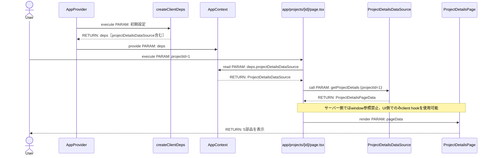
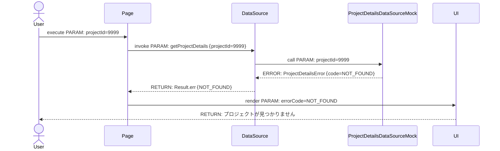
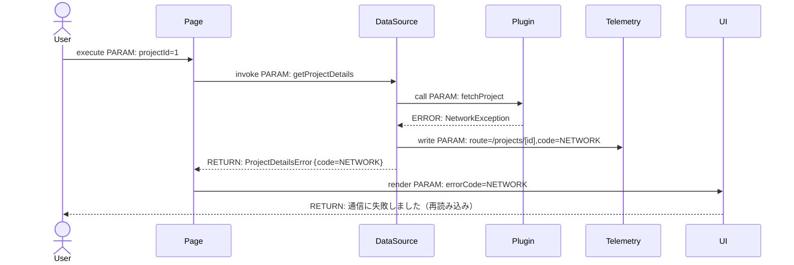
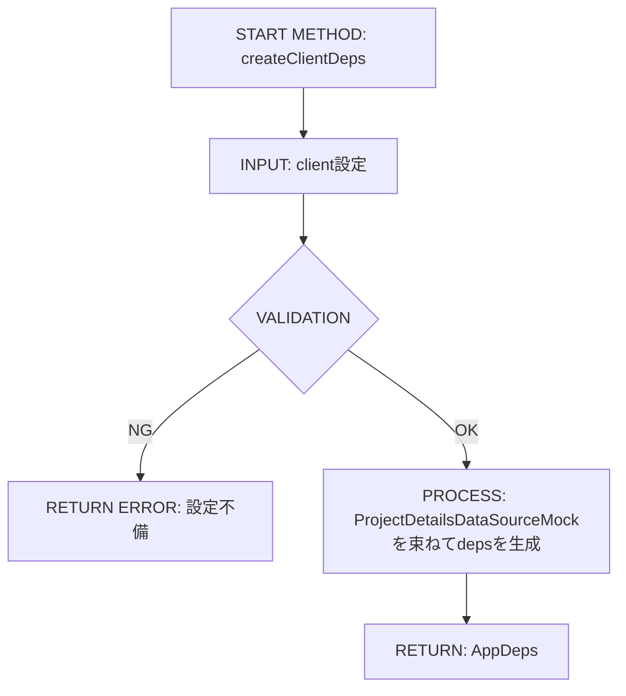
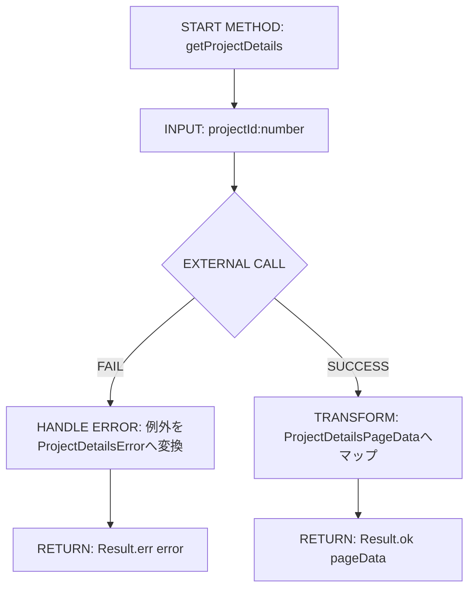
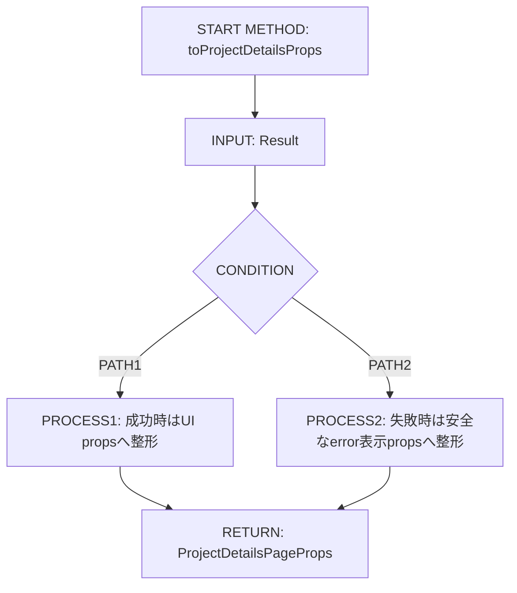
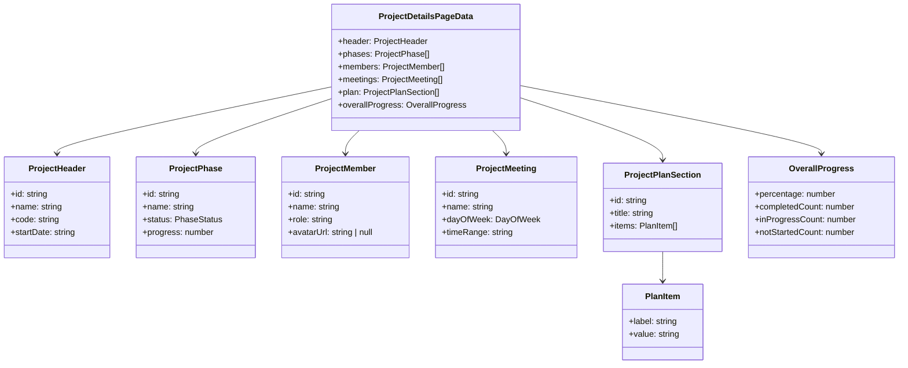

# Implementation Plan — Upstream Demo: プロジェクト詳細画面

## 0. 実装入力コンテキスト

| 項目 | 記入 |
| --- | --- |
| 対象Issue | [DESIGN] Upstream Demo: プロジェクト詳細画面 |
| 対象リポジトリ内パス（実装起点） | `リポジトリルート（Agile-PMBOK-Assist）` |

### 0.1 変更サマリ一覧（複数行）

| 区分（追加/修正/削除） | 対象（機能/画面/API） | 変更概要 |
| --- | --- | --- |
| 追加 | docs/pages/project-details | 画面仕様（表示要素、入出力、エラー表示、受入条件）を追加 |
| 追加 | contracts/pages/project-details | `ProjectDetailsDataSource` とページ表示型/エラー契約を追加 |
| 追加 | ui/pages/project-details/ProjectDetailsPage.tsx | public UI として画面描画責務を実装 |
| 追加 | app/projects/[id]/page.tsx | `AppContext` から依存を受け取り UI に橋渡しする薄い page を追加 |
| 追加 | packages/plugins 配下 | `ProjectDetailsDataSource` の upstream デモ実装（モックデータ）を追加 |
| 修正 | src/providers/AppProvider.tsx | `deps.projectDetailsDataSource` を提供対象に追加 |
| 修正 | src/lib/createClientDeps.ts | ページ用 DataSource を返すよう拡張 |
| 修正 | tests/storybook | ProjectDetailsPage の Story・テスト追加 |

### 0.2 入力制約一覧（複数行）

| 制約区分（互換性/禁止事項/期限/その他） | 制約内容 | 適用対象 |
| --- | --- | --- |
| 互換性 | 既存ページの挙動を変更しない | `app/` 既存ルート |
| 互換性 | `packages/contracts` は interface/type のみを維持 | `packages/contracts/**` |
| 禁止事項 | `app/*/page.tsx` で具象実装を `new` しない | `app/projects/[id]/page.tsx` |
| 禁止事項 | `packages/ui` で fetch/storage/window など I/O を実装しない | `packages/ui/**` |
| 禁止事項 | `contracts` から `plugins/providers` を import しない | `packages/contracts/**` |
| 期限 | DESIGN完了時点で実装可能な契約を確定する | 本 plan |
| その他 | Upstream(public) のみ対象。private 実装は記載しない | 全体 |

### 0.3 関連機能・関連仕様一覧（複数行）

| 種別（要件/設計方針/ADR/調査/既存実装/外部仕様/その他） | パス/識別子 | この設計での利用目的 |
| --- | --- | --- |
| 要件 | `.github/copilot/10-requirements.md` | 受入条件の構造化 |
| 設計方針 | `.github/copilot/20-architecture.md` | DIP/責務分離の固定 |
| テスト戦略 | `.github/copilot/40-testing-strategy.md` | テスト種別の割当 |
| セキュリティ | `.github/copilot/50-security.md` | 秘密情報非出力・例外方針 |
| CI | `.github/copilot/60-ci-quality-gates.md` | lint/typecheck/test/security の品質ゲート |
| テンプレート | `.github/copilot/80-templates/implementation-plan.md` | plan 章立て準拠 |
| 既存実装 | `mock/v1/web/src/app/projects/[id]/page.jsx` | デモ画面部品（フェーズ進捗、メンバー、会議体、全体進捗、計画）の抽出 |

---

## 1. 実装対象機能と機能ゴール

| 項目 | 内容 | 根拠 |
| --- | --- | --- |
| 実装対象詳細（機能/画面/API） | `/projects/[id]` でプロジェクト詳細を表示する1画面を追加する | Issue「モック画面」要件 |
| 機能ゴール（実装後に観測できるユーザーユース） | ユーザーがURLで指定した `id` の詳細を開き、5部品（フェーズ進捗・メンバー・会議体一覧・全体進捗・計画）を閲覧できる | Issue ゴール 1〜4 |
| 非ゴール（今回やらないこと） | private連携、DB接続、認証、複数画面量産 | Issue 非ゴール |
| 完了条件（実装完了の判定） | docs→contracts→ui→page→AppProvider の導線で型エラーなく画面表示でき、受入テストが全て成功する | 品質ゲート要件 |
| 受入確認手順（1行で再現可能） | `npm run lint && npm run build` 実行後、`/projects/1` を表示し5部品とエラー表示（not found）を確認する | CI + 画面受入 |

---

## 2. 前提・制約（SSOT）

| 種別 | 内容 | 根拠（ファイル/ADR/Issue） |
| --- | --- | --- |
| 参照したSSOT | `.github/copilot/00-index.md` の参照順に従う | `.github/copilot/00-index.md` |
| Next.js構成前提（app/src/packages） | ルーティングは `app/`、契約は `packages/contracts`、UIは `packages/ui`、実装差し替えは `packages/plugins` | Issue「フォルダ構造」 |
| 依存境界前提（page.tsx / AppProvider / contracts） | DI起点は `AppProvider` 固定、`app/*/page.tsx` は `AppContext` から依存を受けるのみ | Issue「Dependency Injection Rule」 |
| 技術制約（互換性/期限/運用/セキュリティ） | MUI + Emotion 前提、`StyledEngineProvider injectFirst` を使用、Secrets/PIIはログ出力しない | Issue「CSS必須ルール」「Security」 |
| 未確定前提（TBD） | TBD（理由: telemetry連携方式が未確定 / 決定条件: 既存Telemetry契約との適合確認 / 期限: IMPLEMENT PR 作成前） | `packages/contracts/src/ports/Telemetry.ts`（想定契約パス） |

---

## 3. 要件定義（実装受入条件）

### 3.1 機能要件

| ID | 要件 | 受入条件（テスト可能な形） |
| --- | --- | --- |
| FR-01 | `/projects/[id]` で対象プロジェクト名・コード・開始日を表示する | `id=1` でヘッダー3項目が表示される（UI test） |
| FR-02 | フェーズ毎の進捗一覧を表示する | 10件のフェーズ行が `status` と `%` を表示する（UI test） |
| FR-03 | プロジェクトメンバー一覧を表示する | メンバー名が件数一致で表示される（UI test） |
| FR-04 | 会議体一覧を表示する | 会議体が存在する場合は曜日/時間/名称、空の場合は空状態文言を表示（UI test） |
| FR-05 | 全体進捗状況（完了/進行中/未着手）を表示する | 集計値がフェーズ状態数と一致する（unit test） |
| FR-06 | プロジェクト計画（折りたたみセクション）を表示する | セクション開閉操作で詳細表示が切替わる（UI interaction test） |
| FR-07 | 指定 `id` が存在しない場合は not found 表示を行う | `id=9999` でエラーUIと戻る導線を表示（UI test） |
| FR-08 | page は AppContext から受けた契約のみでデータ取得する | `app/projects/[id]/page.tsx` に plugins 直接 import が無い（lint rule + static test） |
| FR-09 | contracts に実装コードを含めない | `packages/contracts/src/pages/project-details.ts` が type/interface のみ（static test） |
| FR-10 | DI は AppProvider 起点に固定する | 依存生成が `AppProvider -> createClientDeps -> AppContext` のみ（integration test） |

### 3.2 非機能要件

| ID | 要件 | 受入条件（テスト可能な形） |
| --- | --- | --- |
| NFR-01 | 依存方向（contracts ← plugins）を維持する | no-restricted-imports で違反時 lint fail |
| NFR-02 | 型安全を維持する | `npm run build` で型エラー 0 |
| NFR-03 | セキュリティ情報をUI/ログに露出しない | エラー表示は契約エラーの安全文言のみ（UI test） |
| NFR-04 | CSS競合を抑制する | `StyledEngineProvider injectFirst` を root で維持し、同一要素の多重指定をしない |
| NFR-05 | テスト再現性を確保する | APIモックは MSW に統一し成功/失敗/空/遅延を検証 |
| NFR-06 | Storybook で主要状態を視覚確認可能にする | 正常/空/エラー/loading の story を作成 |
| NFR-07 | E2E で主要導線を担保する | `/projects/1` 表示と notfound ケースの smoke が pass |

---

## 4. スコープ境界

### 4.0 スコープ境界の定義（機能単位）

| 区分（In-Scope/Out-of-Scope） | 対象機能/責務 | 判定理由 |
| --- | --- | --- |
| In-Scope | プロジェクト詳細画面の表示契約定義 | ゴール2/4に直結 |
| In-Scope | page と AppContext の橋渡し責務 | DI固定ルール検証対象 |
| In-Scope | public UI（表示とUI状態） | ゴール3（コピー可能な型）に必要 |
| In-Scope | upstream モックDataSource実装 | publicデモとして動作確認に必要 |
| In-Scope | テスト/Storybook設計 | Design Issue必須記載 |
| Out-of-Scope | private API 連携 | 非ゴール |
| Out-of-Scope | 認証/セッション永続化実装 | 非ゴール |
| Out-of-Scope | DB マイグレーション | 非ゴール |
| Out-of-Scope | 他ページの実装 | 非ゴール |
| Out-of-Scope | 大規模リファクタリング | Issue範囲外 |

### 4.2 実装時の影響範囲・互換性リスク

| 影響対象 | 結論（影響あり/なし/未確定） | 影響内容 |
| --- | --- | --- |
| UI/画面 | 影響あり | `/projects/[id]` の新規追加。既存画面は変更しない |
| API契約 | 影響あり | `packages/contracts/src/pages/project-details.ts` 追加 |
| データ互換 | 影響なし | 既存データ構造は変更しない（モック追加のみ） |
| 外部依存 | 影響なし | 新規ライブラリ追加なし |
| CI/運用 | 影響あり | lint/typecheck/testに新規対象が追加 |

### 4.3 外部依存・Secrets の扱い

| 項目 | 内容 | リスク/対応 |
| --- | --- | --- |
| 外部依存の追加/更新 | なし | 既存依存を利用 |
| Secrets 利用有無 | なし（デモモックのみ） | 実値を扱わない |
| ログ/設定への機密混入対策 | 例外文字列をそのままUI表示しない | 契約エラーへ変換し安全文言を表示 |

### 4.4 4章の自己検証（必須）

| チェック項目 | 合格条件 |
| --- | --- |
| Design PR差分を書いていないか | 実装時差分のみ記載し、Design作業記述は含めない |
| 実装責務を書いているか | In-Scopeに5件記載済み |
| 実装影響を書いているか | 4.2で影響ありを3件具体化済み |

---

## 5. アーキテクチャ設計

### 5.0 DI生成経路（テキスト必須）

| 区分（記載例/追記No） | 生成/受け渡し主体 | 契約名（contract） | 具象名（impl/plugins） | 入力（契約/型/設定） | 出力（契約/型/設定） | 境界制約（禁止事項を含む） |
| --- | --- | --- | --- | --- | --- | --- |
| 01 | `AppProvider` | `AppDeps` | `createClientDeps` | 環境設定 | `deps` | pageでdeps生成しない |
| 02 | `createClientDeps` | `ProjectDetailsDataSource` | `ProjectDetailsDataSourceMock` | `projectId` | `ProjectDetailsPageData` | contracts以外へ型を漏らさない |
| 03 | `AppContext.Provider` | `AppDeps` | `AppContext` | `deps` | React Context配布 | Context値を加工しない |
| 04 | `app/projects/[id]/page.tsx` | `ProjectDetailsDataSource` | `ProjectDetailsPageBridge` | `params.id` | UI props | plugins直接import禁止 |
| 05 | `ProjectDetailsPage.tsx` | `ProjectDetailsPageProps` | `ProjectDetailsPage` | 表示props | 画面描画 | fetch/DI生成禁止 |

#### 5.0.1 最小固定セット（TBD禁止）

| 最小固定項目 | 必須記載内容 | 対応セクション |
| --- | --- | --- |
| DI単一路 | `AppProvider -> createClientDeps -> AppContext -> app/projects/[id]/page.tsx -> ProjectDetailsPage` | `5.0`, `5.7.0`, `5.7.2` |
| Server/Client境界 | cookie/session読取は server 境界限定。`ProjectDetailsPage` は client-only hooks 可、serverで `window` 不可 | `5.5.1`, `8.3` |
| import許可/禁止 | `app/projects/[id]/page.tsx` は `@contracts/*` と `@ui/*` と `AppContext` のみ許可 | `8.4`, `8.3` |

### 5.1 設計判断

#### 5.1.1 責務分離 / データフロー（詳細）

形式A（箇条書き）
- `contracts/pages/project-details.ts` は `ProjectDetailsDataSource`、`ProjectDetailsPageData`、`ProjectDetailsError` のみ定義する。
- `plugins` は外部I/O例外を `ProjectDetailsError` へ変換する。
- `app/projects/[id]/page.tsx` は `AppContext` から DataSource を取得し、戻り値を UI props へ写像する。
- `packages/ui/src/pages/project-details/ProjectDetailsPage.tsx` は props を描画し、折りたたみ状態など表示状態のみ保持する。

#### 5.1.2 エッジケース / 例外系 / リトライ方針（詳細）

形式B（テーブル）
| No. | ケース | 判定条件 | 画面挙動 | リトライ方針 |
| --- | --- | --- | --- | --- |
| 1 | 不正id | `id` が数値変換不可 | not found 表示 | なし |
| 2 | 対象なし | DataSource が notfound を返却 | not found 表示 | なし |
| 3 | 会議体0件 | meetings.length = 0 | 空状態文言を表示 | なし |
| 4 | phases0件 | phases.length = 0 | 全体進捗 0%、一覧は空状態 | なし |
| 5 | ネットワーク失敗 | DataSource が network error | 再読み込み導線を表示 | 手動再試行 |

#### 5.1.3 ログと観測性（漏洩防止を含む / 詳細）

形式B（テーブル）
| No. | 観点 | 方針 | 根拠 | 未確定（あれば） |
| --- | --- | --- | --- | --- |
| 1 | ログ出力内容 | `route`, `projectId`, `errorCode` のみ構造化出力 | セキュリティ要件 | なし |
| 2 | マスキング/非出力項目 | メンバー詳細/任意文字列例外/Secretsは出力禁止 | 50-security | なし |
| 3 | エラー記録粒度 | plugins層で1回、page/uiで重複出力しない | 責務分離 | なし |
| 4 | 監視メトリクス | success/notfound/error 件数を計測可能にする | 運用観点 | TBD（理由: 現行計測基盤未確定 / 決定条件: telemetry契約確認 / 期限: IMPLEMENT PR前） |
| 5 | アラート条件 | 5xx系 error 連続時のみ通知対象 | 運用観点 | TBD（理由: 閾値未確定 / 決定条件: 運用チーム合意 / 期限: リリース前） |
| 6 | 運用確認手順 | notfound/network/unknown を手動発火しログキー確認 | テスト戦略 | なし |

#### 5.1.4 Atomic Design UI部品一覧（dashboard）

| レイヤ | UI部品名（設計上の候補） | 主責務 | 対応機能 |
| --- | --- | --- | --- |
| templates | `ProjectDetailsLayoutTemplate` | 2カラムレイアウトとセクション配置を固定する | 画面全体構成 |
| organisms | `ProjectDetailsHeader` | プロジェクト名/コード/開始日/全体進捗を表示する | 全体進捗状況 |
| organisms | `ProjectPhaseProgressList` | フェーズ一覧と進捗バーを表示する | フェーズ毎の進捗 |
| organisms | `ProjectMemberPanel` | メンバー一覧と役割を表示する | プロジェクトメンバー |
| organisms | `ProjectMeetingList` | 会議体一覧を表示し空状態を分岐する | 会議体一覧 |
| organisms | `ProjectPlanAccordion` | 計画セクションの折りたたみ表示を管理する | プロジェクト計画 |
| organisms | `ProjectDetailsErrorPanel` | notfound/network など契約エラーを表示する | 例外系表示 |
| molecules | `PhaseProgressItem` | 1フェーズ分の名称/状態/進捗率を描画する | フェーズ毎の進捗 |
| molecules | `MemberListItem` | メンバーの名前/役割/アバターを描画する | プロジェクトメンバー |
| molecules | `MeetingListItem` | 会議名/曜日/時間帯を描画する | 会議体一覧 |
| molecules | `PlanSectionPanel` | 計画項目の見出しと詳細リストを描画する | プロジェクト計画 |
| atoms | `ProjectCodeChip` | プロジェクトコードの強調表示 | ヘッダー表示 |
| atoms | `ProgressPercentText` | 進捗率テキスト表示 | 全体進捗/フェーズ進捗 |
| atoms | `StatusBadge` | 状態ラベル（完了/進行中/未着手）表示 | フェーズ状態表示 |
| atoms | `AvatarIcon` | メンバーのアバター画像表示 | メンバー表示 |
| atoms | `EmptyStateMessage` | 空データ時の案内文表示 | 会議体/一覧空状態 |

### 5.2 トレードオフ

| 判断テーマ | 案A | 案B | 採用案 | 採用理由 | 不採用理由 |
| --- | --- | --- | --- | --- | --- |
| DataSourceの配置 | `contracts/pages` 単位契約 | usecase単位契約のみ | 案A | 1ページ設計の再利用テンプレート化が容易 | 今回は画面単位での型検証が目的 |
| pageの実行境界 | Server page で取得 | Client page で取得 | 案A | cookie/session境界を守りやすくSEOにも有利 | Client取得はbrowser依存が増える |

### 5.3 ルーティング方針の確定と移行戦略

| 項目 | 決定内容 | 根拠 |
| --- | --- | --- |
| 現時点の採用ルーター（pages/app） | app router のみ採用 | Issue 前提 |
| 現方針の固定条件（理由/期限/見直し条件） | App Router維持。見直しは framework major 更新時のみ | Next.js方針 |
| app router 採用条件 | `app/projects/[id]/page.tsx` を Server Component で実装 | SSOT |
| pages/app 併用時の境界（ディレクトリ単位でOK/NG） | 併用しない（`pages/` 新規追加NG） | Issue 前提 |

### 5.4 依存カテゴリ方針（境界崩壊防止）

| 依存カテゴリ（DataSource/Service/Adapter/Config） | 定義 | 許可レイヤ（app/src/contracts/ui/plugins） | 禁止レイヤ |
| --- | --- | --- | --- |
| DataSource | 画面向け読み取り契約 | contracts, plugins, app | ui |
| Service | ビジネスロジックの純関数 | contracts/usecases, src | ui atoms/molecules |
| Adapter | 外部I/O具体実装 | plugins | contracts, ui |
| Config | 実行環境・feature flag | src/providers, src/lib | contracts, ui |

### 5.5 データ取得ライフサイクル（SSR/SSG/CSR）

| データ種別 | 取得タイミング（SSR/SSG/CSR） | 取得場所（page/usecase/client等） | 理由 |
| --- | --- | --- | --- |
| 初期表示必須データ | SSR | `app/projects/[id]/page.tsx` | 初回描画で5部品を同時表示するため |
| ユーザー操作後データ | CSR | `ProjectDetailsPage` 内のUI状態 | 折りたたみは表示状態のみ |
| 再取得/更新データ | CSR | 再読み込みボタン（page橋渡し） | network失敗時の手動再試行 |

| キャッシュ方針 | 採用有無 | ルール |
| --- | --- | --- |
| SWR | 不採用 | 1画面1回取得で十分 |
| React Query | 不採用 | 依存追加を避ける |
| 独自キャッシュ | 採用 | 同一リクエスト中の重複呼び出し回避のみ |

#### 5.5.1 Server/Client 境界固定（Next.js）

| 対象処理 | 実行境界（Server/Client/Shared） | 実装場所（page/getServerSideProps/usecase等） | ブラウザAPI利用（可/不可） | Cookie/Session読取位置 | 禁止事項 |
| --- | --- | --- | --- | --- | --- |
| 初期表示データ取得 | Server | `app/projects/[id]/page.tsx` | 不可 | Server page のみ | client hooks の使用禁止 |
| ユーザー操作イベント処理 | Client | `ProjectDetailsPage.tsx` | 可 | Client不可 | server専用API参照禁止 |
| 認証/認可判定 | Server | route handler / server usecase | 不可 | Server境界のみ | uiで認可判定ロジック禁止 |
| ローカル保存（storage等） | Client | 必要時のみui層 | 可 | 該当なし | server pathでlocalStorage禁止 |
| ログ出力 | Shared（実体はplugins） | `packages/plugins` | 条件付き可 | Server優先 | page/uiで生例外ログ禁止 |

### 5.6 エラーハンドリング標準形

| 分類（network/unauthorized/notfound/unknown） | 返却型/エラーコード | UI表示ルール | 再試行ルール |
| --- | --- | --- | --- |
| network | `ProjectDetailsError { code: "NETWORK" }` | 「通信に失敗しました」+再読込 | 手動再試行 |
| unauthorized | `ProjectDetailsError { code: "UNAUTHORIZED" }` | 権限エラー画面 | ログイン導線 |
| notfound | `ProjectDetailsError { code: "NOT_FOUND" }` | プロジェクトが見つかりません | なし |
| unknown | `ProjectDetailsError { code: "UNKNOWN" }` | 汎用エラー表示 | 手動再試行 |

| ログ方針 | 内容 |
| --- | --- |
| 出力する情報 | `route`, `projectId`, `code`, `timestamp` |
| 出力しない情報（Secrets/PII） | 生例外、個人名、認証情報、Cookie値 |

#### 5.6.1 エラー変換責務（例外 -> 契約エラー）

| 変換対象 | 例外発生層 | 契約エラーへ変換する層 | 上位層へ渡す型 | 禁止事項 |
| --- | --- | --- | --- | --- |
| 外部I/O例外（HTTP/Network） | plugins/http | providers/plugins | `ProjectDetailsError` | page/uiで生例外を直接判定しない |
| 認可/権限エラー | plugins/auth | providers/plugins | `ProjectDetailsError` | contractsに変換ロジックを実装しない |
| notfound/業務エラー | plugins/repository | providers/plugins | `ProjectDetailsError` | pageで独自エラーコードを増やさない |
| unknown/予期せぬ例外 | plugins/all | providers/plugins | `ProjectDetailsError` | stacktrace/機密情報をUIへ渡さない |
| バリデーションエラー | page params 解析 | page（契約に合わせて変換） | `ProjectDetailsError` | uiでparams検証しない |

### 5.7 シーケンス図（Mermaid / 複数必須）

#### 5.7.0 DI生成経路（テキスト再掲 / 必須）

| No | 開始主体 | 終了主体 | 契約名（contract） | 具象名（impl/plugins） | 経路文字列（`A -> B -> C`） | 境界チェック観点 | 対応シーケンス図ID |
| --- | --- | --- | --- | --- | --- | --- | --- |
| 01 | `AppProvider` | `ProjectDetailsPage` | `AppDeps` | `createClientDeps` | `AppProvider -> createClientDeps -> AppContext.Provider -> app/projects/[id]/page.tsx -> ProjectDetailsPage` | 具象が page/ui に漏れていない | SEQ-01 |
| 02 | `app/projects/[id]/page.tsx` | `ProjectDetailsDataSource` | `ProjectDetailsDataSource` | `ProjectDetailsDataSourceMock` | `page.tsx -> AppContext.deps.projectDetailsDataSource -> plugins` | page で plugins を直接importしない | SEQ-01 |
| 03 | `ProjectDetailsDataSourceMock` | `ProjectDetailsPage` | `ProjectDetailsPageData` | `ProjectDetailsMapper` | `plugins -> contract type -> page -> ui` | uiはcontract型のみ参照 | SEQ-01 |
| 04 | `ProjectDetailsDataSourceMock` | `ProjectDetailsError` | `ProjectDetailsError` | `toProjectDetailsError` | `plugins exception -> contract error -> page -> ui` | 例外変換責務がplugins固定 | SEQ-02 |
| 05 | `ProjectDetailsDataSourceMock` | `Telemetry` | `Telemetry` | `consoleTelemetry` | `plugins -> telemetry` | ログ責務がui/pageへ漏れない | SEQ-03 |

#### 5.7.1 シーケンス対象一覧

| 図ID | 種別（正常/異常） | 起点（画面/API） | 終点（UseCase/外部I/O） | 対応要件ID（FR/NFR） |
| --- | --- | --- | --- | --- |
| SEQ-01 | 正常（DI生成経路） | `/projects/[id]` | `ProjectDetailsDataSource` | FR-01, FR-08, FR-10 |
| SEQ-02 | 異常（業務エラー） | `/projects/[id]` | `ProjectDetailsError.NOT_FOUND` | FR-07, NFR-03 |
| SEQ-03 | 異常（システムエラー） | `/projects/[id]` | `ProjectDetailsError.NETWORK` | NFR-03, NFR-07 |

#### 5.7.1.1 境界整合チェック（必須）

| 境界テーマ | 文章セクション | 表セクション | 図セクション | 整合判定（OK/NG） |
| --- | --- | --- | --- | --- |
| ログ責務（どの層で出力するか） | `5.1.3` | `5.6` | `5.7.4` | OK |
| 例外->契約エラー変換責務 | `5.1.2` | `5.6.1` | `5.7.3` | OK |
| Server/Client境界 | `5.5.1` | `8.3` | `5.7.2` | OK |

#### 5.7.1.2 最小固定セット具体化チェック（必須）

| 最小固定項目 | 文章セクション | 表セクション | 図セクション | TBD残存数（0のみ可） |
| --- | --- | --- | --- | --- |
| DI単一路（`AppProvider -> createPublicDeps -> AppContext -> page -> UI`） | `5.0.1` | `5.0` | `5.7.0`, `5.7.2` | 0 |
| Server/Client境界（cookie/session・ブラウザAPI） | `5.5.1` | `5.5.1` | `5.7.2` | 0 |
| import許可/禁止（lint強制含む） | `8.3` | `8.4` | `5.7.2` | 0 |

#### 5.7.2 正常系シーケンス（必須）

#### 5.7.3 異常系シーケンス（業務エラー）

#### 5.7.4 異常系シーケンス（システムエラー）

### 5.8 処理フロー図（メソッドレベル / 複数必須）

#### 5.8.1 メソッド一覧

| 図ID | メソッド名 | 層（page/usecase/adapter等） | 対応要件ID（FR/NFR） |
| --- | --- | --- | --- |
| FLOW-01 | `createClientDeps()` | src/lib | FR-10, NFR-01 |
| FLOW-02 | `getProjectDetails(projectId)` | contracts/plugins | FR-01, FR-07 |
| FLOW-03 | `toProjectDetailsProps(result)` | app/page bridge | FR-08, NFR-03 |

#### メソッドフロー(FLOW-01)

#### メソッドフロー(FLOW-02)

#### メソッドフロー(FLOW-03)

---

## 6. 契約仕様（Interface Contract）

### 6.0 DIP固定前提（Plugin型アーキテクチャ）

| 項目 | 固定方針 |
| --- | --- |
| Composition Root | `AppProvider` のみで依存解決する |
| `contracts` の責務 | interface/type のみ定義し、具象実装を含めない |
| 具象実装の配置 | `packages/plugins` または `src/providers` のDI境界に限定 |
| `page` / `ui` の責務 | 契約依存のみ。具象依存を直接 import しない |

### 6.1 入出力契約（API/関数/UseCase）

| ID | 入口（画面/API/関数） | 入力 | 出力 | エラー | 備考 |
| --- | --- | --- | --- | --- | --- |
| IFC-01 | `ProjectDetailsDataSource.getProjectDetails` | `projectId: string` | `Promise<Result<ProjectDetailsPageData, ProjectDetailsError>>` | `NOT_FOUND/NETWORK/UNAUTHORIZED/UNKNOWN` | pageが呼び出す唯一の入口 |
| IFC-02 | `ProjectDetailsPage` | `ProjectDetailsPageProps` | `JSX.Element` | なし（propsで分岐） | UIは描画専念 |

### 6.2 型/DTO/スキーマ

| ID | 対象 | 変更内容（追加/変更/削除） | 後方互換 |
| --- | --- | --- | --- |
| TYPE-01 | `ProjectDetailsPageData` | 追加 | 新規型のため互換性影響なし |
| TYPE-02 | `ProjectDetailsError` | 追加 | 既存型へ非破壊 |

### 6.3 契約インターフェース定義（実装エンジニア向け固定案）

#### 6.3.1 ページ別DataSource契約

| No. | 契約ファイル（`packages/contracts/src/pages/*.ts`） | interface名 | メソッド署名（戻り値まで） | 備考 |
| --- | --- | --- | --- | --- |
| 1 | `packages/contracts/src/pages/project-details.ts` | `ProjectDetailsDataSource` | `getProjectDetails(projectId: string): Promise<Result<ProjectDetailsPageData, ProjectDetailsError>>` | page専用契約 |
| 2 | `packages/contracts/src/pages/project-details.ts` | `ProjectDetailsPageData` | `type` 定義 | 5部品の表示データ |
| 3 | `packages/contracts/src/pages/project-details.ts` | `ProjectDetailsError` | `type` 定義 | UI安全表示用エラー |

#### 6.3.2 ドメインクラス図（Mermaid classDiagram）

| 図ID（固定: CLS-01） | ドメイン | 対応契約ファイル | 対応要件ID（FR/NFR） |
| --- | --- | --- | --- |
| CLS-01 | ProjectDetails | `pages/project-details.ts` | FR-01〜FR-06 |

##### ドメインレベルのクラス図(CLS-01)

#### 6.3.3 ドメイン別モデル定義（省略不可）

##### 6.3.3.1 モデル一覧

| ドメイン | エンティティ名（型名） | 区分（Entity/ValueObject/DTO） | 用途 |
| --- | --- | --- | --- |
| ProjectDetails | ProjectDetailsPageData | DTO | 画面全体表示 |
| ProjectDetails | ProjectHeader | ValueObject | ヘッダー表示 |
| ProjectDetails | ProjectPhase | Entity | フェーズ進捗表示 |
| ProjectDetails | ProjectMember | Entity | メンバー表示 |
| ProjectDetails | ProjectMeeting | Entity | 会議体表示 |

##### 6.3.3.2 プロパティ詳細定義（全項目を行で列挙）

| ドメイン | エンティティ名 | プロパティ物理名（path可） | TypeScript型（完全表記） | 利用コンポーネント/型定義名（ui） | 必須（Y/N） | Nullable（Y/N） | 説明 | 例 |
| --- | --- | --- | --- | --- | --- | --- | --- | --- |
| ProjectDetails | ProjectHeader | id | string | `ProjectDetailsPageProps.header` | Y | N | プロジェクト識別子 | `"1"` |
| ProjectDetails | ProjectHeader | name | string | `ProjectDetailsPageProps.header` | Y | N | プロジェクト名 | `"ECサイトリニューアル"` |
| ProjectDetails | ProjectPhase | status | `"DONE" | "IN_PROGRESS" | "NOT_STARTED"` | `ProjectPhaseList` | Y | N | フェーズ状態 | `"IN_PROGRESS"` |
| ProjectDetails | ProjectPhase | progress | number | `ProjectPhaseList` | Y | N | 進捗率（0-100） | `60` |
| ProjectDetails | ProjectMember | avatarUrl | `string | null` | `ProjectMemberList` | N | Y | メンバー画像 | `null` |
| ProjectDetails | ProjectMeeting | dayOfWeek | `"MON" | "TUE" | "WED" | "THU" | "FRI"` | `MeetingList` | Y | N | 会議曜日 | `"MON"` |
| ProjectDetails | ProjectPlanSection | items | `PlanItem[]` | `ProjectPlanSectionPanel` | Y | N | 計画詳細行 | `[{ label: "発注元", value: "ABC株式会社" }]` |
| ProjectDetails | OverallProgress | percentage | number | `OverallProgressCard` | Y | N | 全体進捗率 | `45` |

##### 6.3.3.3 複合型/ネスト型の展開定義（Node.js向け）

| 型名 | 種別（object/array/union/tuple/map） | 定義（省略不可） | 使用箇所 |
| --- | --- | --- | --- |
| `ProjectDetailsPageData` | object | `{ header: ProjectHeader; phases: ProjectPhase[]; members: ProjectMember[]; meetings: ProjectMeeting[]; plan: ProjectPlanSection[]; overallProgress: OverallProgress }` | DataSource返却 |
| `PhaseStatus` | union | `"DONE" | "IN_PROGRESS" | "NOT_STARTED"` | ProjectPhase |
| `DayOfWeek` | union | `"MON" | "TUE" | "WED" | "THU" | "FRI"` | ProjectMeeting |
| `ProjectDetailsError` | object | `{ code: "NOT_FOUND" | "NETWORK" | "UNAUTHORIZED" | "UNKNOWN"; message: string }` | エラー契約 |

#### 6.3.4 列挙値/リテラル制約

| No. | 対象型 | 制約値（union literal） | 用途 |
| --- | --- | --- | --- |
| 1 | `PhaseStatus` | `DONE / IN_PROGRESS / NOT_STARTED` | フェーズ表示 |
| 2 | `DayOfWeek` | `MON / TUE / WED / THU / FRI` | 会議体表示 |
| 3 | `ProjectDetailsError.code` | `NOT_FOUND / NETWORK / UNAUTHORIZED / UNKNOWN` | エラー表示分岐 |

#### 6.3.5 契約互換性ルール

| 項目 | ルール |
| --- | --- |
| 破壊的変更の扱い | 既存型変更は不可。必要時は `v2` 型追加で対応 |
| Optional追加の扱い | Optional追加は許可。UI側デフォルト値を必須設定 |
| 型名変更/移動の扱い | 既存型名変更禁止。移動時はre-exportで移行期間を確保 |
| 実装側（plugins/providers）への影響確認手順 | `contracts` 変更時は `plugins` と `AppProvider` の型チェックを必須実施 |

---

## 7. データ設計（必要な場合のみ）

| 項目 | 内容 | 互換性/移行 |
| --- | --- | --- |
| スキーマ変更 | なし（モックデータのみ） | 互換性影響なし |
| マイグレーション方針 | 不要 | 不要 |
| 既存データ影響 | なし | なし |
| ロールバック方針 | 画面/契約追加分を差し戻し | 非破壊 |

---

## 8. 実装指示（製造Agent向け）

### 8.1 変更予定ファイル一覧（必須）

| No. | パス | 区分（app/src/contracts/ui/plugins/other） | 変更タイプ（追加/変更/削除） | 実装内容（具体） | 完了条件 |
| --- | --- | --- | --- | --- | --- |
| 1 | `docs/pages/project-details.md` | other | 追加 | 画面仕様と受入条件を記載 | FR/NFRにリンク済み |
| 2 | `packages/contracts/src/pages/project-details.ts` | contracts | 追加 | DataSource/型/エラー契約定義 | 実装コード0行 |
| 3 | `packages/contracts/src/index.ts` | contracts | 変更 | 新規契約のexport追加 | 型参照可能 |
| 4 | `packages/plugins/src/projectDetails/projectDetailsDataSourceMock.ts` | plugins | 追加 | 5部品を返すモックDataSource実装 | 成功/空/notfoundを返却可能 |
| 5 | `src/lib/createClientDeps.ts` | src | 変更 | `projectDetailsDataSource` をdepsへ追加 | AppProviderで取得可能 |
| 6 | `src/providers/AppProvider.tsx` | src | 変更 | deps型とProvider値を更新 | pageから参照可 |
| 7 | `app/projects/[id]/page.tsx` | app | 追加 | AppContext経由で取得しUIへprops橋渡し | 具象importなし |
| 8 | `packages/ui/src/pages/project-details/ProjectDetailsPage.tsx` | ui | 追加 | 画面描画とUI状態制御 | fetch/storage未使用 |
| 9 | `packages/ui/src/pages/project-details/ProjectDetailsPage.stories.tsx` | ui | 追加 | normal/empty/error/loading story | Storybookで表示確認 |
| 10 | `tests/e2e/project-details.spec.ts` | other | 追加 | `/projects/1` と notfound のsmoke | Playwright pass |

### 8.2 実装手順（順序付き）

| 手順 | 作業内容 | 対象ファイル/モジュール | 完了条件 |
| --- | --- | --- | --- |
| 1 | contracts を先に定義し型を確定 | `packages/contracts/src/pages/project-details.ts` | 型定義が確定 |
| 2 | plugins と deps を実装してDI経路を接続 | `packages/plugins`, `src/lib/createClientDeps.ts`, `AppProvider.tsx` | `AppContext` から DataSource 取得可能 |
| 3 | page/ui 実装とテスト・Story追加 | `app/projects/[id]/page.tsx`, `packages/ui/**`, tests | FR/NFRの受入条件を満たす |

### 8.3 実装禁止事項（ガードレール）

| 項目 | 内容 | 根拠 |
| --- | --- | --- |
| 禁止事項-1 | `app/projects/[id]/page.tsx` で plugins 具象を直接 import しない | DI固定ルール |
| 禁止事項-2 | `packages/ui` で fetch/axios/localStorage を直接利用しない | UI責務分離 |
| 禁止事項-3 | `packages/contracts` に実装ロジックを記述しない | contract方針 |
| 禁止事項-4 | `index.ts` barrel 経由で境界跨ぎ import しない（例: app/ui から contracts・plugins の再エクスポートを辿って参照しない） | import固定ルール |
| 禁止事項-5 | Clientファイルで cookie/session を直接読む実装をしない | Server/Client境界 |
| 禁止事項-6 | エラー時に stacktrace や生例外文字列をUI表示しない | セキュリティ |
| 禁止事項-7 | MUI/Tailwind/styled で同一要素に同一プロパティを多重指定しない | CSS必須ルール |
| 禁止事項-8 | default export で UI コンポーネントを公開しない | UI export規約 |

### 8.4 import制約の自動化

| 項目 | 設定内容 | 検証方法 |
| --- | --- | --- |
| `no-restricted-imports` 方針 | page/ui から plugins への直接importを禁止 | ESLint |
| path alias 方針（`@contracts/@ui/@app` など） | contracts参照は `@contracts/*` を使用し相対パス禁止 | ESLint + Typecheck |
| UI export 方針（default export禁止） | `export const` のみ許可、`index.ts` 経由 import 禁止 | ESLint |
| CIでの強制（lint必須/違反時fail） | 上記違反はPR必須チェックで fail | GitHub Actions |

---

## 9. テスト実装計画

### 9.1 テストケース

| 区分（正常/例外/境界/回帰） | パターン名 | 対象 | シナリオ | 期待結果 |
| --- | --- | --- | --- | --- |
| 正常 | 初期表示_5部品表示 | `ProjectDetailsPage` | `id=1` で表示 | 5部品が全て描画 |
| 正常 | フェーズ進捗集計 | `overallProgress計算` | phasesあり | 集計値が一致 |
| 正常 | 会議体表示 | `MeetingList` | meetingsあり | 曜日/時間/名称表示 |
| 例外 | notfound表示 | page + ui | `id=9999` | notfound文言表示 |
| 例外 | network失敗表示 | DataSource + ui | network error | 再読込導線表示 |
| 境界 | 会議体空配列 | ui | meetings=[] | 空状態表示 |
| 境界 | フェーズ空配列 | ui | phases=[] | 進捗0%表示 |
| 境界 | 無効ID | page | `id="abc"` | notfound扱い |
| 回帰 | DI境界維持 | `app/projects/[id]/page.tsx` | import検査 | plugins直接importなし |
| 回帰 | contracts純粋性 | `contracts/pages/project-details.ts` | 静的検査 | 実装コードなし |

| 網羅チェック | 判定（Y/N） | 根拠 |
| --- | --- | --- |
| 正常パターンを網羅している | Y | 正常3ケース定義 |
| 例外パターンを網羅している | Y | notfound/network を定義 |
| 境界パターンを網羅している | Y | 空配列/無効ID を定義 |
| 回帰パターンを網羅している | Y | DI境界/contracts境界を検証 |

追加テスト設計（Design Issue必須項目）
- 対象一覧: `app/projects/[id]/page.tsx`, `ProjectDetailsPage`, `ProjectDetailsDataSource`, `ProjectDetailsError変換`, Storybook stories, Playwright smoke
- 方式:
  - Unit(UI): Vitest + RTL
  - Unit(Domain/Usecase): Vitest
  - Integration(Route Handler): 本画面は route handler 追加なし（将来API化時は handler直呼び）
  - Integration(Mock): MSW で成功/失敗/空/遅延
  - E2E: Playwright で `/projects/1`, `/projects/9999`
- モック方針: `tests/mocks/next` に `next/navigation` 共通モック、`tests/mocks/msw` に handlers を集約
- 実行コマンド（ルート起点）:
  - `npm run lint`
  - `npm run build`
  - `npm run test`（実装Issueで追加/整備）
  - `npm run test:e2e`（実装Issueで追加/整備）
  - `npm run storybook`（手動確認）
- Storybook方針: `normal`, `empty-meetings`, `notfound`, `network-error` の4状態をStory化
- バックエンド統合方針: 将来 route handler 導入時はテストDBではなくトランザクション分離で直接呼び出し
- カバレッジ境界: `packages/` と `src/` を主対象、`app/` は橋渡しロジックのみ測定、Server Componentは境界テスト中心

---

## 10. オープン課題 / ADR

| 論点 | 現状 | 決定期限/担当 | ADR要否（要/不要/TBD） |
| --- | --- | --- | --- |
| alias 名称の最終確定（`@contracts` など） | repo内で表記ゆれの可能性あり | IMPLEMENT PR 作成前 / 実装担当 | 不要 |
| telemetry 契約の既存流用可否 | 既存契約の適合性を未確認 | 実装着手前 / 実装担当 | TBD |

### 10.1 TBD回収トラッキング（必須）

| TBD論点 | 現在の記載箇所（章/項目） | 解決ゲート（必須） | BLOCKER（Yes/No） | RESOLVE_IN（必須） | DEFAULT/ASSUMPTION（任意） | ADR記録先（必要時） |
| --- | --- | --- | --- | --- | --- | --- |
| telemetry 契約流用可否 | 5.1.3 | GATE: 契約（contracts）確定前 | BLOCKER: No | RESOLVE_IN: `packages/contracts/src/ports/Telemetry.ts`（想定契約パス） | DEFAULT/ASSUMPTION: consoleTelemetryを暫定利用 | `70-adr/`（必要時） |
| アラート閾値 | 5.1.3 | GATE: マージ前 | BLOCKER: No | RESOLVE_IN: 運用runbook | DEFAULT/ASSUMPTION: 5xx連続時のみ通知 | 不要 |

---

## 11. 新規ページ追加テンプレ（設計規約）

### 11.1 docs 必須項目

| 項目 | 記載内容 |
| --- | --- |
| `docs/pages/<slug>.md` の必須見出し | 概要、表示要素、入力、出力、エラー、受入条件、テスト方針 |
| 受入条件リンク（FR/NFR/T） | FR/NFR とテストケースの対応表を必須記載 |

### 11.2 contracts 必須項目

| 項目 | 記載内容 |
| --- | --- |
| `contracts/pages/<slug>.ts` の必須型 | `DataSource`, `PageData`, `PageError`, `PageProps` |
| 入出力/エラー契約との対応 | `Result<PageData, PageError>` 形式で統一 |

### 11.3 ui 必須項目

| 項目 | 記載内容 |
| --- | --- |
| `ui/pages/<slug>/<Slug>Page.tsx` の責務 | props 描画、UI状態管理（見た目に閉じる） |
| 禁止事項（I/O直接実装など） | fetch/storage/DI生成/生例外判定を禁止 |

### 11.4 app page 必須項目

| 項目 | 記載内容 |
| --- | --- |
| `app/<slug>/page.tsx` の責務 | AppContext から依存を受け取り UIへpropsを橋渡し |
| 禁止事項チェック（import/ロジック/例外） | plugins直接import禁止、業務ロジック禁止、例外変換はpluginsへ委譲 |

---
