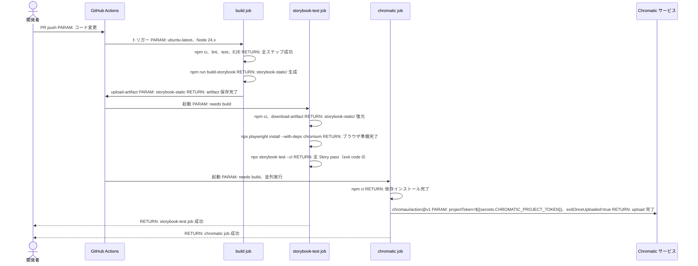
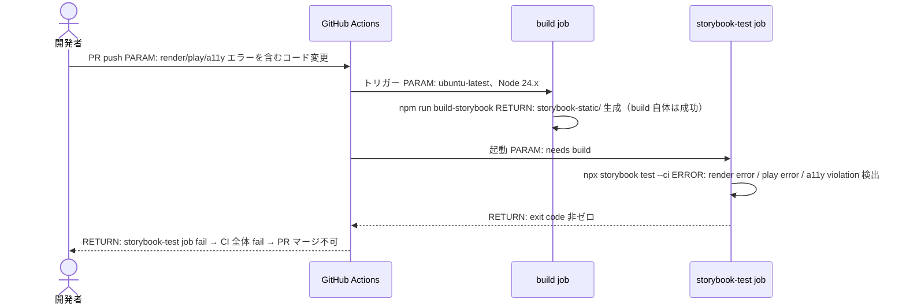
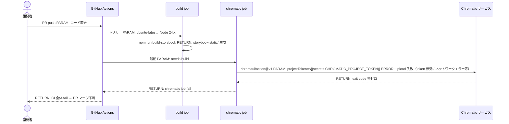
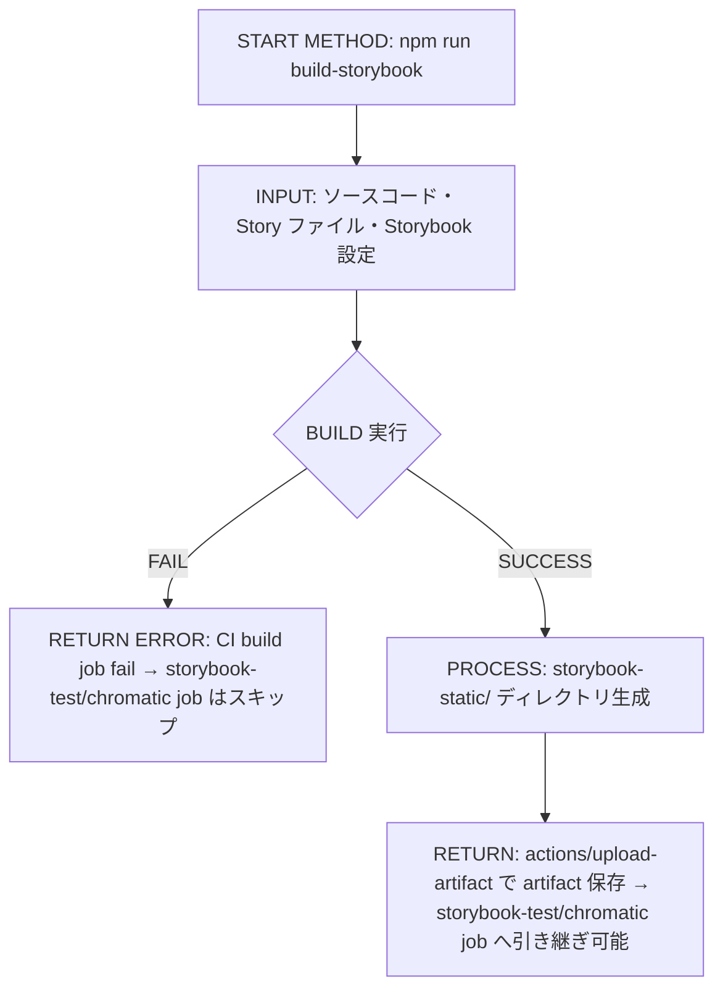
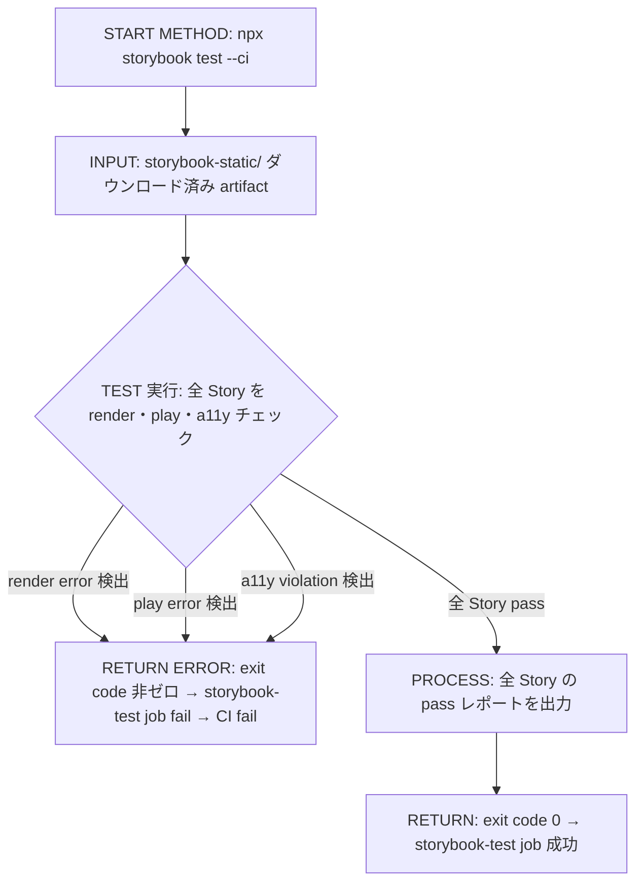

# Implementation Plan — Storybook CI 正式品質ゲート昇格

`.github/copilot/80-templates/implementation-plan.md` に準拠した plan ドキュメントを `.github/copilot/plans/94-storybook-ci-gate.md` に作成する。

---

## 0. 実装入力コンテキスト

| 項目 | 記入 |
| --- | --- |
| 対象Issue | [DESIGN] StorybookをCI正式品質ゲートに昇格させる |
| 対象リポジトリ内パス（実装起点） | `.github/workflows/ci-nextjs.yml`、`package.json` |

### 0.1 変更サマリ一覧

| 区分（追加/修正/削除） | 対象（機能/画面/API） | 変更概要 |
| --- | --- | --- |
| 追加 | GitHub Actions job: storybook-test | `@storybook/test-runner` による全 Story の描画・play 実行・a11y チェックを CI 上で保証する |
| 追加 | GitHub Actions job: chromatic | Chromatic VRT レイヤーを CI に統合し、`CHROMATIC_PROJECT_TOKEN` を使って差分検知を実施する |
| 修正 | `.github/workflows/ci-nextjs.yml` | 既存 build ジョブに Storybook Test Runner ステップを追加し、Chromatic job を追記する |
| 追加 | `package.json` devDependencies | `@storybook/test-runner` を追加し、`test:storybook` スクリプトを登録する |
| 維持 | 既存 lint / typecheck / test / e2e | 変更なし。既存品質ゲートを破壊しない |

### 0.2 入力制約一覧

| 制約区分（互換性/禁止事項/期限/その他） | 制約内容 | 適用対象 |
| --- | --- | --- |
| 互換性 | 既存 lint / typecheck / test / e2e ワークフローを破壊しない | `ci-nextjs.yml` |
| 互換性 | Storybook build（`npm run build-storybook`）は従来通り成功必須 | `ci-nextjs.yml` の既存 Build Storybook ステップ |
| 互換性 | Node.js バージョンは既存 CI（24.x）と統一する | 新規ステップ全体 |
| 禁止事項 | Test Runner による fail は CI 全体 fail とする（`continue-on-error: false`） | Storybook Test Runner ステップ |
| 禁止事項 | Secrets（`CHROMATIC_PROJECT_TOKEN`）をログに出力しない | Chromatic job |
| 禁止事項 | 既存ジョブの `permissions` 設定を変更しない | `ci-nextjs.yml` の `permissions: contents: read` |
| 禁止事項 | Story の新規追加・a11y ルール詳細定義は本 plan のスコープ外 | 実装 PR |
| その他 | VRT 差分ポリシー（fail / warning）は Undetermined として扱い、次工程へ持ち越す | Chromatic job |
| その他 | main ブランチと PR ブランチでの必須チェック差分は Undetermined | Branch Protection 設定 |

### 0.3 関連機能・関連仕様一覧

| 種別（要件/設計方針/ADR/調査/既存実装/外部仕様/その他） | パス/識別子 | この設計での利用目的 |
| --- | --- | --- |
| 設計方針 | `.github/copilot/40-testing-strategy.md` | Storybook を UI コンポーネント確認基盤とする方針の根拠 |
| 設計方針 | `.github/copilot/60-ci-quality-gates.md` | 必須ジョブの定義・ブランチ保護・Secrets/PII 管理の根拠 |
| 既存実装 | `.github/workflows/ci-nextjs.yml` | Storybook Test Runner / Chromatic job を追加する対象ファイル |
| 既存実装 | `package.json` | `@storybook/test-runner` を devDependencies に追加する対象ファイル |
| 外部仕様 | `@storybook/test-runner` npm パッケージ | Story 描画・play 実行・a11y チェックを CLI で実行するための実行エンジン |
| 外部仕様 | `chromaui/action` GitHub Action | Chromatic VRT 統合 |
| 外部仕様 | `CHROMATIC_PROJECT_TOKEN` GitHub Secret | Chromatic API 認証トークン |
| 要件 | Issue: [DESIGN] StorybookをCI正式品質ゲートに昇格させる | 設計の起点となる要件定義と制約 |

---

## 1. 実装対象機能と機能ゴール

| 項目 | 内容 | 根拠 |
| --- | --- | --- |
| 実装対象詳細（機能/画面/API） | GitHub Actions CI に Storybook Test Runner ジョブと Chromatic VRT ジョブを追加する | `.github/copilot/60-ci-quality-gates.md` 必須ジョブ定義 |
| 機能ゴール（実装後に観測できるユーザーユース） | CI 実行時に全 Story の render・play・a11y チェックが自動で実行され、エラーがあれば CI が fail する | Issue 要件「CI が Story レベルの破壊を検知できる状態を標準とする」 |
| 非ゴール（今回やらないこと） | Story の新規追加、a11y ルールの詳細定義、デザインレビュー運用、UI 差分の人間判断フロー設計 | Issue スコープ Out 定義 |
| 完了条件（実装完了の判定） | `npx storybook test` が CI 上で実行され、render error / play error / a11y violation のいずれかで CI 全体が fail すること。Chromatic が upload 成功すること | FR-01〜FR-05 |
| 受入確認手順（1行で再現可能） | `npm run test:storybook` をローカルで実行し、全 Story が pass することを確認する |  |

---

## 2. 前提・制約（SSOT）

| 種別 | 内容 | 根拠（ファイル/ADR/Issue） |
| --- | --- | --- |
| 参照したSSOT | `.github/copilot/00-index.md` → `40-testing-strategy.md` → `60-ci-quality-gates.md` | SSOT 参照順 |
| 技術スタック前提 | Node.js 24.x、npm、GitHub Actions（ubuntu-latest） | `.github/workflows/ci-nextjs.yml` 既存設定 |
| Storybook 前提 | `@storybook/nextjs` でセットアップ済み。`npm run build-storybook` は既に CI に含まれ成功必須 | `ci-nextjs.yml` 既存ステップ |
| Test Runner 実行前提 | `@storybook/test-runner` は built Storybook（static ファイル）または dev server のどちらでも動作する。CI では `--ci` フラグ付きで実行する | `@storybook/test-runner` 公式仕様 |
| Chromatic 前提 | `chromaui/action` を使用し、`projectToken` に `CHROMATIC_PROJECT_TOKEN` を渡す。`exitOnceUploaded: true` で upload 完了を以て終了とする | Issue 実装イメージ |
| 技術制約（互換性/期限/運用/セキュリティ） | `CHROMATIC_PROJECT_TOKEN` は GitHub Repository Secrets に登録し、ログに出力しない | `.github/copilot/60-ci-quality-gates.md` Secrets 管理方針 |
| 未確定前提（TBD） | Chromatic 差分を fail とするか warning とするか、main ブランチ限定か PR にも必須とするか | TBD（理由: チーム合意未達 / 決定条件: ブランチ戦略とチーム合意 / 期限: IMPLEMENT Issue 起票後のチーム議論） |

---

## 3. 要件定義（実装受入条件）

### 3.1 機能要件

| ID | 要件 | 受入条件（テスト可能な形） |
| --- | --- | --- |
| FR-01 | `@storybook/test-runner` を devDependencies に追加し、`test:storybook` スクリプトを `package.json` に登録する | `npm run test:storybook` が実行でき、全 Story を対象に render チェックが走ること |
| FR-02 | CI で全 Story の render 成功を保証する | Story に render error がある場合、`npx storybook test --ci` が非ゼロで終了し、CI job が fail すること |
| FR-03 | CI で全 Story の play 関数実行を保証する | play 関数にエラーがある場合、`npx storybook test --ci` が fail すること |
| FR-04 | CI で全 Story の a11y チェックを保証する | a11y violation がある Story が存在する場合、CI が fail すること |
| FR-05 | Chromatic VRT を CI に統合し、upload 成功を保証する | `chromaui/action` が実行され、`CHROMATIC_PROJECT_TOKEN` を使って Chromatic に upload が完了すること。upload failure は CI fail とする |
| FR-06 | 既存 CI ジョブ（lint / test / E2E / build-storybook）を破壊しない | 既存ステップが全て成功する状態を維持すること |
| FR-07 | `CHROMATIC_PROJECT_TOKEN` を GitHub Repository Secrets に登録し、workflow から参照できるようにする | `${{ secrets.CHROMATIC_PROJECT_TOKEN }}` が Chromatic job 内で参照でき、upload が成功すること |

### 3.2 非機能要件

| ID | 要件 | 受入条件（テスト可能な形） |
| --- | --- | --- |
| NFR-01 | Secrets をログに出力しない | CI ログに `CHROMATIC_PROJECT_TOKEN` の値が含まれないこと |
| NFR-02 | CI の `permissions` は既存の最小権限（`contents: read`）を維持する | `ci-nextjs.yml` の `permissions` が `contents: read` のままであること |
| NFR-03 | GitHub Actions のアクションはバージョン固定で利用する | `chromaui/action@v1` など、タグまたは commit SHA で固定されていること |
| NFR-04 | CI 失敗条件を明文化し、機械判定可能な粒度で定義する | 本 plan の「5.1.2 CI 失敗条件一覧」が明記され、IMPLEMENT エンジニアが曖昧なく実装できること |
| NFR-05 | VRT 差分ポリシーは Undetermined として扱い、決定を次工程へ持ち越す | plan および workflow の差分ポリシー設定に「Undetermined」が明示されていること |

---

## 4. スコープ境界

### 4.0 スコープ境界の定義（機能単位）

| 区分（In-Scope/Out-of-Scope） | 対象機能/責務 | 判定理由 |
| --- | --- | --- |
| In-Scope | GitHub Actions workflow 修正（`ci-nextjs.yml`） | FR-02〜FR-05 の実装に必要 |
| In-Scope | Storybook Test Runner 導入（`@storybook/test-runner` インストール、スクリプト追加） | FR-01〜FR-04 の実装に必要 |
| In-Scope | Chromatic 統合（`chromaui/action` job 追加） | FR-05 の実装に必要 |
| In-Scope | CI fail 条件明文化（render error / play error / a11y violation / upload failure） | NFR-04 に対応 |
| In-Scope | `CHROMATIC_PROJECT_TOKEN` Secrets 管理方針の明文化 | NFR-01 / NFR-02 に対応 |
| Out-of-Scope | Story の新規追加 | 別 Issue で対応 |
| Out-of-Scope | a11y ルールの詳細定義 | 別 Issue で対応 |
| Out-of-Scope | デザインレビュー運用（Chromatic の人間判断フロー設計） | 別 Issue で対応 |
| Out-of-Scope | VRT 差分ポリシーの最終決定（fail / warning） | Undetermined。チーム合意が必要 |
| Out-of-Scope | main / PR 必須チェック差分ポリシーの最終決定 | Undetermined。ブランチ戦略と照合が必要 |

### 4.2 実装時の影響範囲・互換性リスク

| 影響対象 | 結論（影響あり/なし/未確定） | 影響内容 |
| --- | --- | --- |
| UI/画面 | 影響なし | CI 設定のみの変更であり、アプリ本体の挙動は変わらない |
| API契約 | 影響なし | CI 設定のみの変更であり、API 契約は変わらない |
| データ互換 | 影響なし | Storybook static ファイルは build artifact であり、データスキーマとは無関係 |
| 外部依存 | 影響あり | `@storybook/test-runner` を devDependencies に追加する。`npm ci` の実行時間が増加する可能性がある |
| CI/運用 | 影響あり | CI 実行時間が Storybook build + Test Runner + Chromatic upload 分だけ増加する。`CHROMATIC_PROJECT_TOKEN` の Secrets 登録が事前作業として必要 |

### 4.3 外部依存・Secrets の扱い

| 項目 | 内容 | リスク/対応 |
| --- | --- | --- |
| 外部依存の追加/更新 | `@storybook/test-runner` を devDependencies に追加する。`chromaui/action@v1` を GitHub Actions で利用する | バージョン固定して利用し、Deprecated アクションは避ける |
| Secrets 利用有無 | `CHROMATIC_PROJECT_TOKEN` を GitHub Repository Secrets に登録し、`${{ secrets.CHROMATIC_PROJECT_TOKEN }}` で参照する | Secrets はログに出力しない。`echo` や `run: |` で値を展開することを禁止する |
| ログ/設定への機密混入対策 | `chromaui/action` は内部で token を安全に扱う。workflow の `run:` ステップで token 値を直接扱わない | CI ログを定期的に確認し、token 値が露出していないことを確認する |

### 4.4 4章の自己検証（必須）

| チェック項目 | 合格条件 |
| --- | --- |
| Design PR差分を書いていないか | `.github/copilot/plans/*.md` や「設計ドキュメントのみ変更」を記載していない ✓ |
| 実装責務を書いているか | In-Scope に実装責務が5件ある ✓ |
| 実装影響を書いているか | 4.2 で「影響あり」が2件あり、影響内容が具体記述されている ✓ |

---

## 5. アーキテクチャ設計

本 plan は CI ワークフロー設計であり、Next.js アプリケーションの DI アーキテクチャ（AppProvider / contracts / plugins）には変更を加えない。5.0〜5.0.1 の DI 生成経路セクションはアプリケーションコードに影響がないため N/A とし、CI ジョブ構成の設計に集中する。

### 5.1 設計判断

#### 5.1.1 CI ジョブ設計（責務分離 / 実行フロー）

形式B（テーブル）

| No. | 決定事項（実装責務単位） | 根拠 | 未確定（あれば） |
| --- | --- | --- | --- |
| 1 | `storybook-test` job を既存 `build` job の後続として追加する（`needs: build`） | Storybook build の成果物を前提とするため。ビルド成功後にのみ実行する | なし |
| 2 | Storybook Test Runner は `npx storybook test --ci` で実行し、`continue-on-error: false`（デフォルト）を維持する | Test Runner の fail を CI 全体 fail とするため | なし |
| 3 | Chromatic job は `storybook-test` job と並列または直列どちらでも可とし、`chromaui/action@v1` を使用する | Chromatic は独立した VRT レイヤーであり、Test Runner の成否に関わらず upload を試みる設計が望ましい | 並列か直列かはチームの CI 時間優先度に依存（Undetermined） |
| 4 | `exitOnceUploaded: true` を Chromatic action に設定し、upload 完了を CI 終了条件とする | Chromatic の承認ステップは人間判断であり、CI で待機しない | なし |
| 5 | VRT 差分ポリシー（fail / warning）は Undetermined。`autoAcceptChanges` / `exitZeroOnChanges` の設定は次工程で決定する | チーム合意が未確定 | TBD（理由: チーム合意未達 / 決定条件: PR ブロックポリシー合意 / 期限: IMPLEMENT Issue チームレビュー） |
| 6 | Storybook build の成果物（`storybook-static/`）は artifact として保存し、`storybook-test` job で参照できるようにする | job 間のファイル共有のため `actions/upload-artifact` / `actions/download-artifact` を使用する | なし |

#### 5.1.2 CI 失敗条件一覧（エッジケース / 例外系）

形式B（テーブル）

| No. | ケース | 方針（CI 判定） | 根拠 | 未確定（あれば） |
| --- | --- | --- | --- | --- |
| 1 | Story render error | `npx storybook test --ci` が非ゼロで終了 → CI job fail | FR-02 | なし |
| 2 | play 関数 error | `npx storybook test --ci` が非ゼロで終了 → CI job fail | FR-03 | なし |
| 3 | a11y violation | `@storybook/addon-a11y` による検出 → `npx storybook test --ci` が非ゼロで終了 → CI job fail | FR-04 | なし |
| 4 | Chromatic upload failure | `chromaui/action` が非ゼロで終了 → CI job fail | FR-05 | なし |
| 5 | Chromatic visual diff 検出 | Undetermined（fail / warning の決定は次工程） | NFR-05 | TBD（理由: チーム合意未達 / 決定条件: 差分ポリシー合意 / 期限: IMPLEMENT Issue チームレビュー） |

#### 5.1.3 CI ジョブ追加イメージ（`ci-nextjs.yml` への変更）

以下は IMPLEMENT エンジニアが参照する実装イメージである。実際の YAML 実装は本イメージを基に行う。

**既存 `build` ジョブへの追加ステップ:**

```yaml
      - name: Upload Storybook static
        uses: actions/upload-artifact@v4
        with:
          name: storybook-static
          path: storybook-static/
```

**新規 `storybook-test` ジョブ:**

```yaml
  storybook-test:
    needs: build
    runs-on: ubuntu-latest
    steps:
      - name: Checkout repository
        uses: actions/checkout@v6

      - name: Setup Node.js
        uses: actions/setup-node@v6
        with:
          node-version: "24"
          cache: npm
          cache-dependency-path: package-lock.json

      - name: Install dependencies
        run: npm ci

      - name: Download Storybook static
        uses: actions/download-artifact@v4
        with:
          name: storybook-static
          path: storybook-static/

      - name: Install Playwright browsers （Test Runner 依存）
        run: npx playwright install --with-deps chromium

      - name: Test Storybook stories
        run: npx storybook test --ci
```

**新規 `chromatic` ジョブ:**

```yaml
  chromatic:
    needs: build
    runs-on: ubuntu-latest
    steps:
      - name: Checkout repository
        uses: actions/checkout@v6
        with:
          fetch-depth: 0

      - name: Setup Node.js
        uses: actions/setup-node@v6
        with:
          node-version: "24"
          cache: npm
          cache-dependency-path: package-lock.json

      - name: Install dependencies
        run: npm ci

      - name: Publish to Chromatic
        uses: chromaui/action@v1
        with:
          projectToken: ${{ secrets.CHROMATIC_PROJECT_TOKEN }}
          exitOnceUploaded: true
```

#### 5.1.4 ログと観測性（漏洩防止を含む）

形式B（テーブル）

| No. | 観点 | 方針 | 根拠 | 未確定（あれば） |
| --- | --- | --- | --- | --- |
| 1 | ログ出力内容 | Test Runner の pass/fail ステータスと Story 名を出力する | CI の可観測性のため | なし |
| 2 | マスキング/非出力項目 | `CHROMATIC_PROJECT_TOKEN` の値をログに出力しない。`run:` ステップで token を `echo` しない | NFR-01 / `.github/copilot/60-ci-quality-gates.md` | なし |
| 3 | エラー記録粒度 | Test Runner の fail 時は Story 名と error メッセージを出力する（`npx storybook test --ci` のデフォルト動作） | CI デバッグのため | なし |
| 4 | 監視メトリクス | CI の pass/fail ステータスを GitHub Actions の required status checks で観測する | NFR-04 / `.github/copilot/60-ci-quality-gates.md` | なし |
| 5 | アラート条件 | `storybook-test` job または `chromatic` job の fail で PR のマージをブロックする（Branch Protection 設定） | NFR-04 | 主・PR 必須チェック範囲は Undetermined |
| 6 | 運用確認手順 | GitHub Actions の workflow run ページで各 job の pass/fail を確認する | 運用標準 | なし |

### 5.2 トレードオフ

| 判断テーマ | 案A | 案B | 採用案 | 採用理由 | 不採用理由 |
| --- | --- | --- | --- | --- | --- |
| Test Runner の実行対象 | built Storybook（static files）を参照して `npx storybook test --ci` を実行 | Storybook dev server を起動してテスト実行 | 案A | CI の再現性が高く、build 済みアーティファクトを利用できる | dev server 起動はフラキー性が高く CI に不向き |
| Chromatic job のタイミング | `build` job 完了後に並列実行（`needs: build`） | `storybook-test` job 完了後に直列実行（`needs: storybook-test`） | 案A（並列）を推奨。チームのポリシーに応じて選択可 | CI 実行時間を短縮できる | storybook-test fail 後でも Chromatic upload を行う設計 |

### 5.7 シーケンス図

本 plan は CI ワークフローの設計であり、Next.js アプリの DI 経路ではなく CI ジョブ実行フローを対象とする。

#### 5.7.1 シーケンス対象一覧

| 図ID | 種別（正常/異常） | 起点 | 終点 | 対応要件ID |
| --- | --- | --- | --- | --- |
| SEQ-01 | 正常（CI 全体通過） | GitHub PR push | 全 job 成功 | FR-01〜FR-07、NFR-01〜NFR-05 |
| SEQ-02 | 異常（Story render / play / a11y エラー） | GitHub PR push | `storybook-test` job fail | FR-02、FR-03、FR-04 |
| SEQ-03 | 異常（Chromatic upload failure） | GitHub PR push | `chromatic` job fail | FR-05 |

#### 5.7.2 正常系シーケンス（SEQ-01）



#### 5.7.3 異常系シーケンス（SEQ-02: Story エラー）



#### 5.7.4 異常系シーケンス（SEQ-03: Chromatic upload failure）



### 5.8 処理フロー図（CI ジョブフロー）

#### 5.8.1 メソッド（CI ジョブ）一覧

| 図ID | メソッド名（CI ジョブ/ステップ名） | 層（CI job/step） | 対応要件ID |
| --- | --- | --- | --- |
| FLOW-01 | Build Storybook（`npm run build-storybook`） | CI build job step | FR-06 |
| FLOW-02 | Test Storybook stories（`npx storybook test --ci`） | CI storybook-test job step | FR-02、FR-03、FR-04 |
| FLOW-03 | Publish to Chromatic（`chromaui/action@v1`） | CI chromatic job step | FR-05、NFR-01 |
| FLOW-04 | Install Playwright browsers | CI storybook-test job step | FR-02〜FR-04 前提 |
| FLOW-05 | Upload / Download Storybook artifact | CI build/storybook-test job step | FLOW-01 と FLOW-02 の連携 |

#### メソッドフロー（FLOW-01: Build Storybook）



#### メソッドフロー（FLOW-02: Test Storybook stories）



#### メソッドフロー（FLOW-03: Publish to Chromatic）

```mermaid
flowchart TD
  A[START METHOD: chromaui/action@v1] --> B[INPUT: CHROMATIC_PROJECT_TOKEN=${{secrets.CHROMATIC_PROJECT_TOKEN}}、exitOnceUploaded=true]
  B --> C{TOKEN 検証 / Chromatic サービス接続}
  C -->|接続失敗 / token 無効| D[RETURN ERROR: exit code 非ゼロ → chromatic job fail → CI fail]
  C -->|接続成功| E[PROCESS: Storybook をビルドして Chromatic にアップロード]
  E --> F{upload 完了?}
  F -->|upload failure| D
  F -->|upload 成功| G[PROCESS: visual diff 検出（差分ポリシーは Undetermined）]
  G --> H[RETURN: exit code 0（exitOnceUploaded=true のため upload 完了で終了）]
```

---

## 6. 契約仕様

本 plan は CI ワークフロー設計であり、Next.js アプリケーションの TypeScript interface / DTO 定義には変更を加えない。CI の「契約」は Secrets 管理とワークフロー入出力として定義する。

### 6.1 CI 入出力契約

| ID | 入口 | 入力 | 出力 | エラー | 備考 |
| --- | --- | --- | --- | --- | --- |
| IFC-01 | `storybook-test` job | `storybook-static/` artifact（`build` job 出力） | exit code 0（全 Story pass） | exit code 非ゼロ（render/play/a11y エラー） | `--ci` フラグ必須 |
| IFC-02 | `chromatic` job | `CHROMATIC_PROJECT_TOKEN`（GitHub Secret）、ソースコード | Chromatic URL（upload 完了） | exit code 非ゼロ（upload failure） | `exitOnceUploaded: true` 設定 |

### 6.2 Secrets 管理契約

| ID | 対象 | 管理方針 | 後方互換 |
| --- | --- | --- | --- |
| TYPE-01 | `CHROMATIC_PROJECT_TOKEN` | GitHub Repository Secrets に登録。ログ出力禁止。`run:` ステップで直接 echo しない | token ローテーション時は Secret を更新するだけで workflow の変更は不要 |

---

## 7. データ設計

本 plan は CI ワークフロー設計であり、アプリケーションのデータスキーマ・マイグレーションには変更を加えない。

| 項目 | 内容 | 互換性/移行 |
| --- | --- | --- |
| スキーマ変更 | なし | 該当なし |
| マイグレーション方針 | なし | 該当なし |
| 既存データ影響 | なし | 該当なし |
| ロールバック方針 | `ci-nextjs.yml` の変更は git revert で即座に元の状態に戻せる | 互換性あり |

---

## 8. 実装指示（製造Agent向け）

### 8.1 変更予定ファイル一覧（必須）

| No. | パス | 区分 | 変更タイプ | 実装内容（具体） | 完了条件 |
| --- | --- | --- | --- | --- | --- |
| 1 | `.github/workflows/ci-nextjs.yml` | other | 変更 | `build` job に `upload-artifact` ステップを追加。`storybook-test` job（`needs: build`）を追加。`chromatic` job（`needs: build`）を追加。5.1.3 の実装イメージを参照 | CI が実行され、`storybook-test` と `chromatic` job が独立して実行されること |
| 2 | `package.json` | other | 変更 | `devDependencies` に `@storybook/test-runner` を追加。`scripts` に `"test:storybook": "storybook test --ci"` を追加 | `npm run test:storybook` が実行できること |

### 8.2 実装手順（順序付き）

| 手順 | 作業内容 | 対象ファイル/モジュール | 完了条件 |
| --- | --- | --- | --- |
| 1 | `@storybook/test-runner` を devDependencies に追加する | `package.json` | `npm ci` が成功すること |
| 2 | `package.json` の `scripts` に `test:storybook` を追加する | `package.json` | `npm run test:storybook` が実行できること |
| 3 | `CHROMATIC_PROJECT_TOKEN` を GitHub Repository Secrets に登録する（人間作業） | GitHub リポジトリ設定 | Secrets に `CHROMATIC_PROJECT_TOKEN` が登録されていること |
| 4 | `ci-nextjs.yml` の既存 `build` job に Storybook artifact upload ステップを追加する | `.github/workflows/ci-nextjs.yml` | `storybook-static/` が artifact として保存されること |
| 5 | `storybook-test` job を追加する（`needs: build`） | `.github/workflows/ci-nextjs.yml` | `npx storybook test --ci` が CI で実行されること |
| 6 | `chromatic` job を追加する（`needs: build`） | `.github/workflows/ci-nextjs.yml` | `chromaui/action@v1` が CI で実行され、Chromatic に upload されること |
| 7 | PR で CI が実行されることを確認し、`storybook-test` と `chromatic` の pass を確認する | GitHub Actions workflow run | 全 job が成功すること |

### 8.3 実装禁止事項（ガードレール）

| 項目 | 内容 | 根拠 |
| --- | --- | --- |
| 禁止事項-1 | `CHROMATIC_PROJECT_TOKEN` の値を `run:` ステップで `echo` または環境変数として展開してログに出力しない | NFR-01 / `.github/copilot/60-ci-quality-gates.md` |
| 禁止事項-2 | 既存ジョブ（lint / test / E2E）の `permissions` を変更しない | NFR-02 / 最小権限原則 |
| 禁止事項-3 | `continue-on-error: true` を `storybook-test` job に設定しない（fail は CI 全体 fail とする） | FR-02〜FR-04 |
| 禁止事項-4 | `chromaui/action` のバージョンを `@latest` や `@*` など浮動タグで指定しない（`@v1` などタグ固定） | NFR-03 / `.github/copilot/60-ci-quality-gates.md` |
| 禁止事項-5 | Chromatic の差分ポリシー（`autoAcceptChanges` / `exitZeroOnChanges`）を本 plan の実装で確定設定しない（Undetermined） | NFR-05 / Issue 制約 |
| 禁止事項-6 | Story の新規追加・a11y ルール変更を本 IMPLEMENT PR に含めない | Issue スコープ Out |
| 禁止事項-7 | `fetch-depth: 0` を `storybook-test` job の checkout に設定しない（Chromatic job のみ全履歴取得が必要） | Chromatic の差分計算に全履歴が必要なのは Chromatic job のみ |
| 禁止事項-8 | `actions/upload-artifact` / `actions/download-artifact` のバージョンを未固定で使用しない | NFR-03 / 再現性維持 |

### 8.4 import 制約の自動化

本 plan は CI ワークフロー設計であり、TypeScript の import 制約変更はない。

| 項目 | 設定内容 | 検証方法 |
| --- | --- | --- |
| workflow YAML の lint | `.github/workflows/` の YAML は `actionlint` や GitHub Actions の構文チェックで検証する | GitHub Actions の workflow 構文エラー検出 |
| Secrets 参照形式 | `${{ secrets.CHROMATIC_PROJECT_TOKEN }}` の形式のみ許可。`env:` での展開は token 値を environment 経由で扱うため審査する | code review |

---

## 9. テスト実装計画

### 9.1 テストケース

| 区分（正常/例外/境界/回帰） | パターン名 | 対象 | シナリオ | 期待結果 |
| --- | --- | --- | --- | --- |
| 正常 | 全 Story 正常描画 | `storybook-test` job | 全 Story が render エラーなく描画される | `npx storybook test --ci` が exit code 0 で終了し、job 成功 |
| 正常 | play 関数正常実行 | `storybook-test` job | play 関数が定義された Story が正常に実行される | play 関数エラーなし、job 成功 |
| 正常 | a11y チェック通過 | `storybook-test` job | a11y violation が存在しない Story が全て pass する | a11y チェック通過、job 成功 |
| 正常 | Chromatic upload 成功 | `chromatic` job | 有効な `CHROMATIC_PROJECT_TOKEN` で Chromatic に upload が完了する | `chromaui/action@v1` が exit code 0 で終了し、job 成功 |
| 正常 | 既存 CI 維持 | `build` job | lint / test / E2E / build-storybook が従来通り成功する | 既存 job の全ステップが成功し、結果が変わらない |
| 例外 | Story render エラー | `storybook-test` job | render エラーを含む Story が存在する | `npx storybook test --ci` が非ゼロで終了 → CI fail |
| 例外 | play 関数エラー | `storybook-test` job | play 関数にエラーを含む Story が存在する | `npx storybook test --ci` が非ゼロで終了 → CI fail |
| 例外 | a11y violation | `storybook-test` job | a11y violation が存在する Story がある | `npx storybook test --ci` が非ゼロで終了 → CI fail |
| 例外 | Chromatic upload failure | `chromatic` job | `CHROMATIC_PROJECT_TOKEN` が無効または Chromatic サービスに接続不可 | `chromaui/action@v1` が非ゼロで終了 → CI fail |
| 例外 | `CHROMATIC_PROJECT_TOKEN` 未設定 | `chromatic` job | Secrets に `CHROMATIC_PROJECT_TOKEN` が未登録 | Chromatic action が認証エラーで fail → CI fail |
| 境界 | Storybook build 失敗時の後続 job 影響 | `storybook-test` / `chromatic` job | `build` job が fail した場合 | `needs: build` により `storybook-test` / `chromatic` が実行されずスキップ |
| 境界 | artifact が存在しない場合 | `storybook-test` job | `download-artifact` でファイルが見つからない | `download-artifact` step が fail → job fail |
| 境界 | 空の Story ファイル（0 Story） | `storybook-test` job | Story ファイルが存在しない / 0 件 | Test Runner の動作は実装時に確認（pass または warning） |
| 回帰 | 既存 lint が壊れていないこと | `build` job | `npm run lint` が既存通り実行される | lint 結果が変わらず成功 |
| 回帰 | 既存 E2E が壊れていないこと | `build` job | `npm run test:e2e` が既存通り実行される | E2E テスト結果が変わらず成功 |

| 網羅チェック | 判定（Y/N） | 根拠 |
| --- | --- | --- |
| 正常パターンを網羅している | Y | 全 Story pass / Chromatic upload 成功 / 既存 CI 維持の3観点を含む |
| 例外パターンを網羅している | Y | render/play/a11y/Chromatic の4失敗条件を全て含む |
| 境界パターンを網羅している | Y | build fail 時の後続 job スキップ / artifact 未存在 / 0 Story を含む |
| 回帰パターンを網羅している | Y | 既存 lint / E2E の動作維持を確認する観点を含む |

---

## 10. オープン課題 / ADR

| 論点 | 現状 | 決定期限/担当 | ADR要否（要/不要/TBD） |
| --- | --- | --- | --- |
| Chromatic 差分を fail とするか warning とするか | Undetermined。`autoAcceptChanges` / `exitZeroOnChanges` の設定値が未確定 | IMPLEMENT Issue のチームレビュー時。担当: チーム全体 | TBD |
| main ブランチと PR ブランチでの必須チェック差分 | Undetermined。Branch Protection での `storybook-test` / `chromatic` の required status checks 設定が未確定 | IMPLEMENT Issue のチームレビュー時。担当: チーム全体 | TBD |
| Story 必須対象範囲（全 Story か特定レイヤーか） | 現状は全 Story を対象。CI 実行時間が問題になる場合はフィルタリングを検討 | IMPLEMENT PR のパフォーマンス確認後。担当: IMPLEMENT エンジニア | 不要 |
| `storybook-test` と `chromatic` の直列・並列判断 | 並列（`needs: build`）を推奨するが、チームポリシーに依存 | IMPLEMENT PR レビュー時。担当: IMPLEMENT エンジニア | 不要 |

### 10.1 TBD 回収トラッキング（必須）

| TBD論点 | 現在の記載箇所（章/項目） | 解決ゲート（必須） | BLOCKER（Yes/No） | RESOLVE_IN（必須） | DEFAULT/ASSUMPTION（任意） | ADR記録先（必要時） |
| --- | --- | --- | --- | --- | --- | --- |
| Chromatic 差分ポリシー（fail / warning） | 5.1.1 No.5、5.1.2 No.5、5.8.1 FLOW-03 | GATE: IMPLEMENT PR レビュー前 | BLOCKER: No | RESOLVE_IN: `.github/workflows/ci-nextjs.yml` の `chromatic` job 設定 | DEFAULT/ASSUMPTION: `exitOnceUploaded: true` のみ設定し、差分 fail は設定しない（warning 扱い）で暫定進行 | 70-adr/ に判断を記録することを推奨 |
| main / PR 必須チェック差分 | 2. 前提・制約（未確定前提）、10. オープン課題 | GATE: IMPLEMENT PR マージ前 | BLOCKER: No | RESOLVE_IN: GitHub Repository の Branch Protection 設定 | DEFAULT/ASSUMPTION: main ブランチのみ必須チェックとして登録し、PR は任意チェックで暫定進行 | 不要 |

---

## 11. 新規ページ追加テンプレ（設計規約）

本 plan は CI ワークフロー設計であり、新規 Next.js ページの追加は含まれない。以下の各セクションは N/A とする。

### 11.1 docs 必須項目

| 項目 | 記載内容 |
| --- | --- |
| `docs/pages/<slug>.md` の必須見出し | N/A（CI 設定変更のみ） |
| 受入条件リンク（FR/NFR/T） | N/A（CI 設定変更のみ） |

### 11.2 contracts 必須項目

| 項目 | 記載内容 |
| --- | --- |
| `contracts/pages/<slug>.ts` の必須型 | N/A（CI 設定変更のみ） |
| 入出力/エラー契約との対応 | N/A（CI 設定変更のみ） |

### 11.3 ui 必須項目

| 項目 | 記載内容 |
| --- | --- |
| `ui/pages/<slug>/<Slug>Page.tsx` の責務 | N/A（CI 設定変更のみ） |
| 禁止事項（I/O直接実装など） | N/A（CI 設定変更のみ） |

### 11.4 app page 必須項目

| 項目 | 記載内容 |
| --- | --- |
| `pages/<slug>.tsx` または `app/<slug>/page.tsx` の責務 | N/A（CI 設定変更のみ） |
| 禁止事項チェック（import/ロジック/例外） | N/A（CI 設定変更のみ） |
