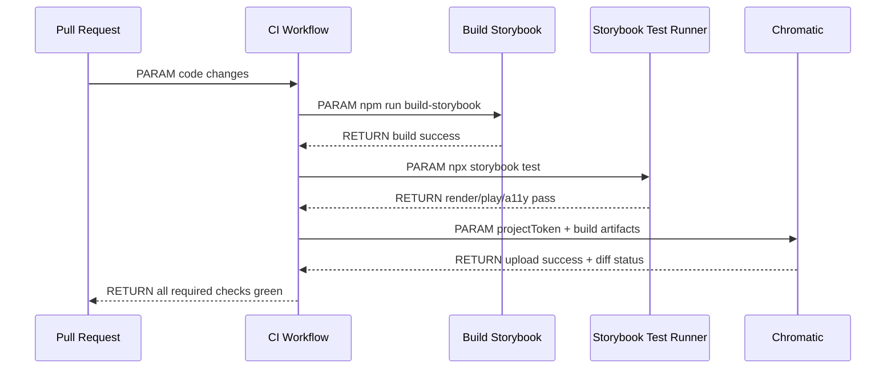
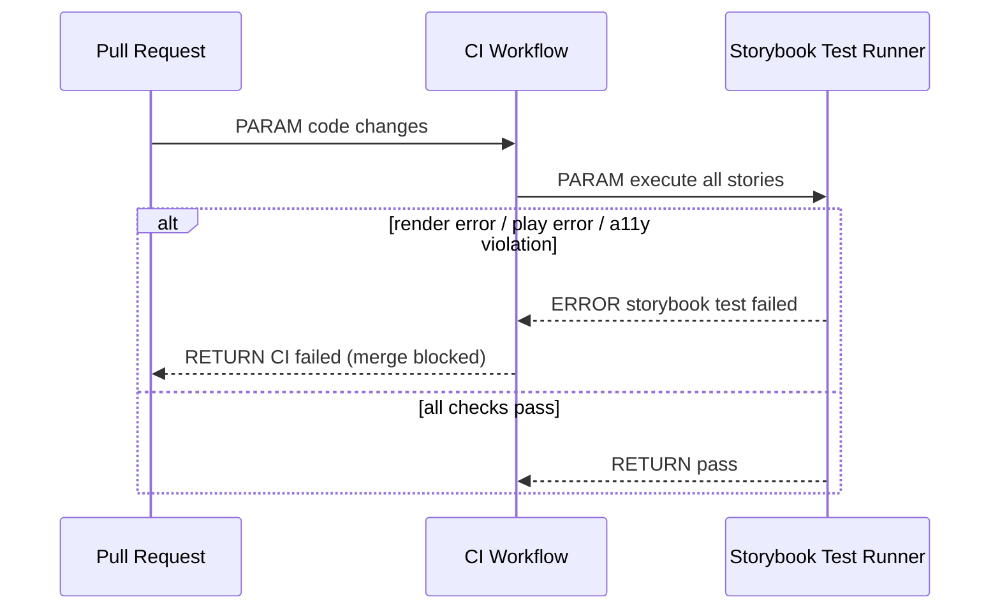
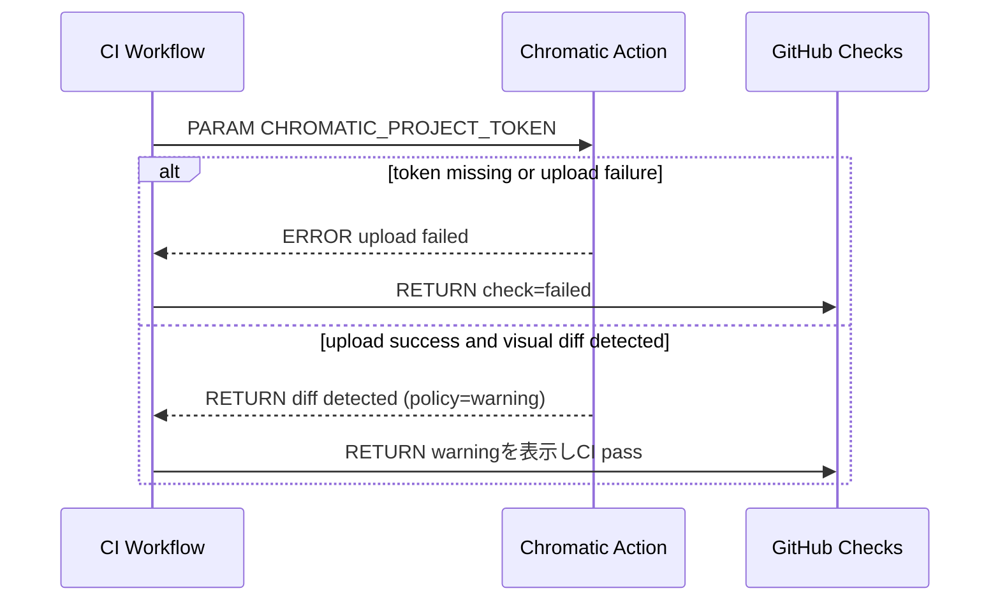
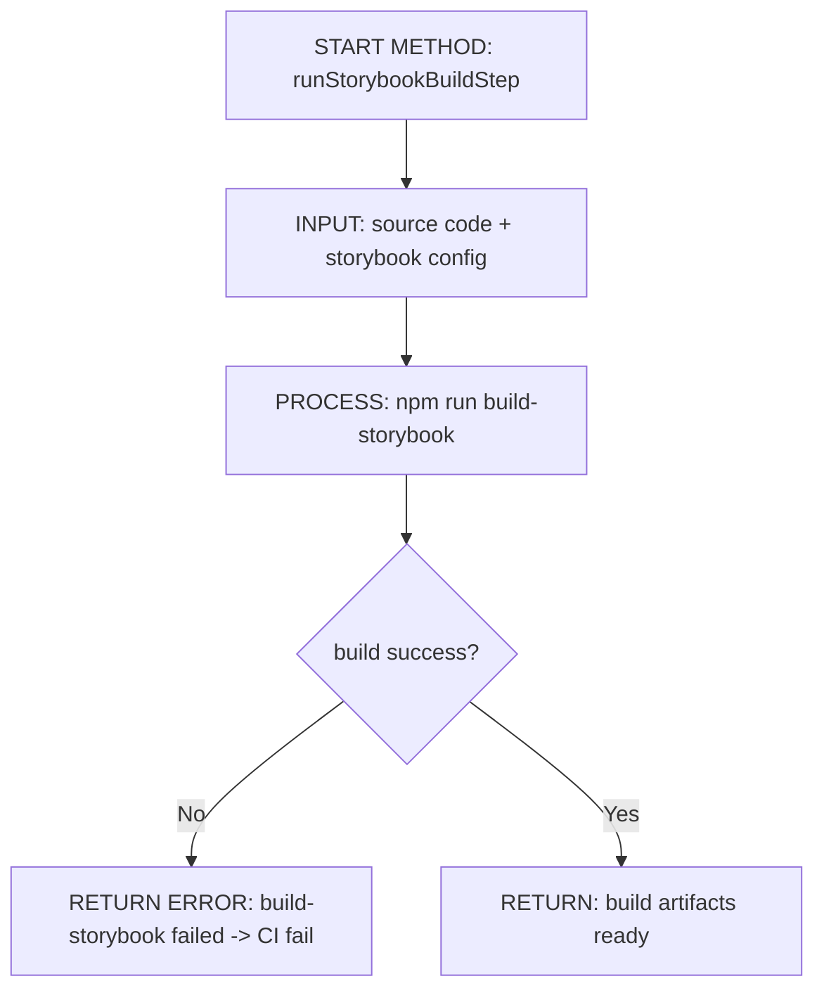
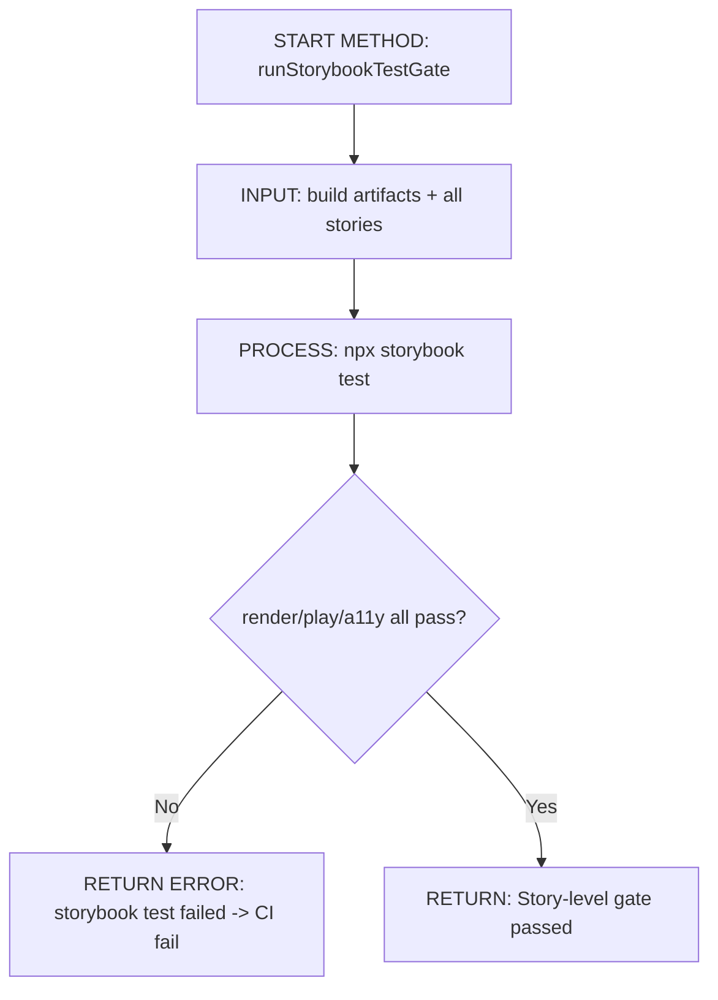
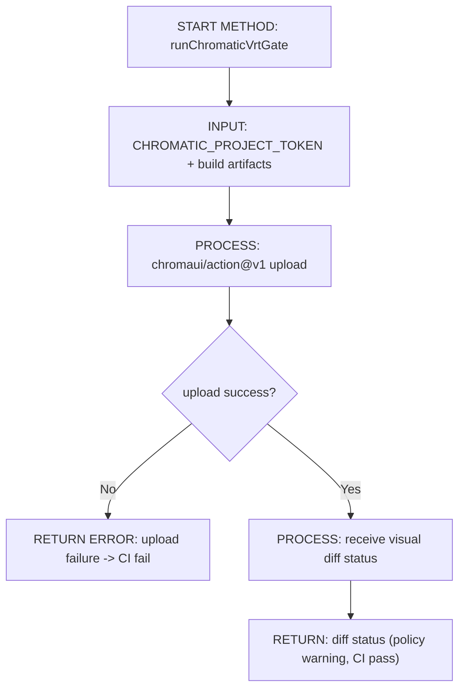
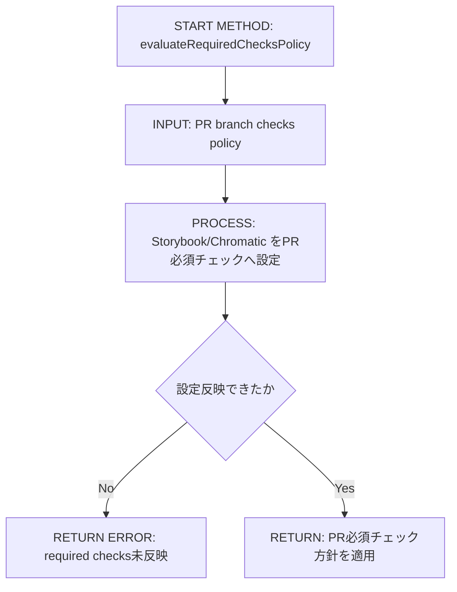
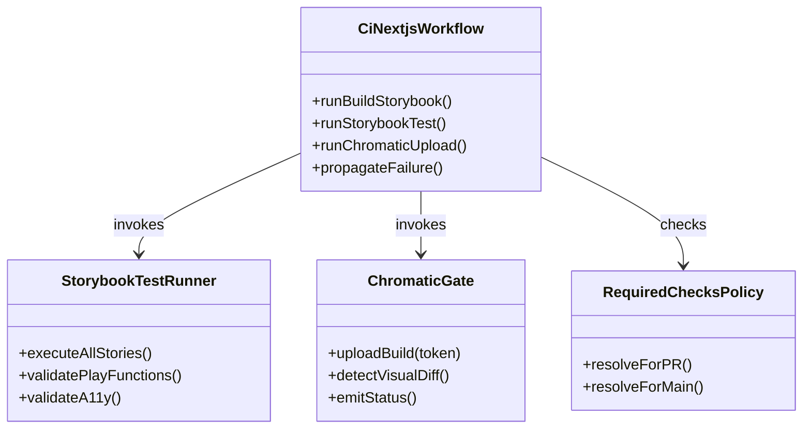

# Implementation Plan — StorybookをCI正式品質ゲートに昇格

---

## 0. 実装入力コンテキスト

| 項目 | 記入 |
| --- | --- |
| 対象Issue | `[DESIGN] StorybookをCI正式品質ゲートに昇格させる` |
| 対象リポジトリ内パス（実装起点） | `/home/runner/work/Agile-PMBOK-Assist/Agile-PMBOK-Assist` |

### 0.1 変更サマリ一覧（複数行）

| 区分（追加/修正/削除） | 対象（機能/画面/API） | 変更概要 |
| --- | --- | --- |
| 追加 | CI品質ゲート | Storybook Test Runner を必須ジョブとして追加する |
| 追加 | Storybookテスト | `npx storybook test` で全Storyのrender / play / a11y を検証する |
| 追加 | VRT | Chromatic を差分検知レイヤーとして統合する |
| 修正 | CI失敗条件 | render/play/a11y/upload failure をCI fail条件として固定する |
| 修正 | Secrets運用 | `CHROMATIC_PROJECT_TOKEN` の管理方針を明文化する |
| 修正 | 必須チェック方針 | PR時点でのrequired status checks方針を確定値で定義する |

### 0.2 入力制約一覧（複数行）

| 制約区分（互換性/禁止事項/期限/その他） | 制約内容 | 適用対象 |
| --- | --- | --- |
| 互換性 | 既存 lint / typecheck / test / e2e ワークフローを破壊しない | `.github/workflows/ci-nextjs.yml` |
| 互換性 | Storybook build は従来通り成功必須とする | `npm run build-storybook` |
| 禁止事項 | DESIGNフェーズで実コード実装を行わない | 本Issue |
| 禁止事項 | Story追加・a11yルール詳細定義・デザインレビュー運用設計を行わない | Out-of-Scope |
| その他 | Test Runner の fail はCI全体 failとして扱う | Storybook gate |
| その他 | VRT差分ポリシーは warning（注意表示）として扱い、CIは通す | Chromatic運用 |
| その他 | PRブランチでは Storybook/Chromatic を必須チェックとして運用する | branch protection |

### 0.3 関連機能・関連仕様一覧（複数行）

| 種別（要件/設計方針/ADR/調査/既存実装/外部仕様/その他） | パス/識別子 | この設計での利用目的 |
| --- | --- | --- |
| 要件 | `.github/copilot/10-requirements.md` | 受入条件をテスト可能な形で定義する |
| 設計方針 | `.github/copilot/20-architecture.md` | SSOT準拠と責務境界を維持する |
| テスト戦略 | `.github/copilot/40-testing-strategy.md` | Storybook Test Runner とVRTの検証観点を整理する |
| CI品質ゲート | `.github/copilot/60-ci-quality-gates.md` | required status checks とCI fail条件を定義する |
| テンプレート | `.github/copilot/80-templates/implementation-plan.md` | plan構成の準拠 |
| 既存実装 | `.github/workflows/ci-nextjs.yml` | 既存CIにStorybook gateを追加する設計前提 |
| 既存実装 | `package.json` | test-runner依存追加と実行コマンド整合を設計する |
| 外部仕様 | Storybook Test Runner (`npx storybook test`) | render/play/a11y 機械判定条件の根拠 |
| 外部仕様 | Chromatic GitHub Action (`chromaui/action@v1`) | VRTアップロードと差分検知レイヤーの統合根拠 |

---

## 1. 実装対象機能と機能ゴール

| 項目 | 内容 | 根拠 |
| --- | --- | --- |
| 実装対象詳細（機能/画面/API） | CI workflowに Storybook Test Runner と Chromatic を追加し、Story単位の破壊検知を正式品質ゲート化する | Issue要件/成果物 |
| 機能ゴール（実装後に観測できるユーザーユース） | PRでStory render/play/a11y/VRT異常を自動検知し、破壊変更をマージ前に検出できる | Issue要件 |
| 非ゴール（今回やらないこと） | Storyの新規追加、a11yルール詳細設計、デザインレビュー運用設計、人手差分判断フロー定義 | IssueスコープOut |
| 完了条件（実装完了の判定） | Storybook Test Runner結果とChromatic結果がCIチェックとして可視化され、fail条件が機械判定可能に定義される | Issue Done |
| 受入確認手順（1行で再現可能） | `npm run build-storybook && npx storybook test` と Chromatic Action 実行ログで失敗条件を確認する | Issueテスト観点 |

---

## 2. 前提・制約（SSOT）

| 種別 | 内容 | 根拠（ファイル/ADR/Issue） |
| --- | --- | --- |
| 参照したSSOT | `.github/copilot/00-index.md` の参照順に従い `10-60` とテンプレートを適用する | `.github/copilot/00-index.md` |
| Next.js構成前提（app/src/packages） | 本件はWorkflowと依存定義が対象であり、app/src/packagesの実装責務は変更しない | Issueスコープ |
| 依存境界前提（page.tsx / AppProvider / contracts） | DI境界（`app/layout.tsx`起点）は影響を受けない。CI層のみ変更対象とする | `.github/copilot/20-architecture.md` |
| 技術制約（互換性/期限/運用/セキュリティ） | 既存CIジョブを維持しつつ Storybook gate を追加し、Secretsは `CHROMATIC_PROJECT_TOKEN` のみ最小参照とする | Issue制約 |
| 未確定前提（TBD） | なし（本PRレビュー指摘への回答で未確定事項を解消） | PR review comments |

---

## 3. 要件定義（実装受入条件）

### 3.1 機能要件

| ID | 要件 | 受入条件（テスト可能な形） |
| --- | --- | --- |
| FR-01 | Storybook Test Runner をCI必須ジョブとして追加する | CI定義に `npx storybook test` 実行ステップがあり、失敗時にジョブが赤になる |
| FR-02 | 全Storyのrender成功を保証する（対象はAtomic DesignのTemplates/Organisms/Molecules/Atoms（Page/Layoutを除く）） | 対象レイヤのrender errorを含むStoryで `storybook test` が fail する |
| FR-03 | 全Storyのplay function実行を保証する | play function errorを含むStoryで CI が fail する |
| FR-04 | a11yチェック通過をCIで保証する | a11y violation を含むStoryで CI が fail する |
| FR-05 | Chromatic をVRTレイヤーとして統合する | workflowに `chromaui/action@v1` と `CHROMATIC_PROJECT_TOKEN` 参照が定義される |
| FR-06 | CI失敗条件を機械判定可能に明文化する | render/play/a11y/upload failure それぞれに fail判定が定義される |
| FR-07 | PR時点での必須チェック化方針を定義する | required checks 候補（storybook-test/chromatic）がplanに記載される |
| FR-08 | Storybook build 成功必須を維持する | `npm run build-storybook` stepが残り、失敗時にCI failとなる |
| FR-09 | VRT差分ポリシーを warning 運用として定義する | visual diff 検知時は warning として通知され、CIは fail しない |
| FR-10 | PRでのrequired checks方針を確定する | PRで Storybook/Chromatic チェックが必須として定義される |

### 3.2 非機能要件

| ID | 要件 | 受入条件（テスト可能な形） |
| --- | --- | --- |
| NFR-01 | 既存品質ゲート互換性 | lint/typecheck/test/e2eの既存ジョブ定義が維持される |
| NFR-02 | 再現性 | Storybook build -> test -> chromatic の順序が固定される |
| NFR-03 | 運用可観測性 | 失敗原因（render/play/a11y/upload）がログから識別できる |
| NFR-04 | セキュリティ | `CHROMATIC_PROJECT_TOKEN` は Secrets経由でのみ参照しログへ出力しない |
| NFR-05 | 最小権限 | workflow `permissions` は既存より権限を拡大しない |
| NFR-06 | fail-fast | Storybook Test Runner失敗時にCI全体をfailとして扱う |
| NFR-07 | スコープ遵守 | DESIGNでコード実装を行わず設計成果物のみ更新する |

---

## 4. スコープ境界

### 4.0 スコープ境界の定義（機能単位）

| 区分（In-Scope/Out-of-Scope） | 対象機能/責務 | 判定理由 |
| --- | --- | --- |
| In-Scope | `ci-nextjs.yml` への Storybook Test Runner step追加 | CIでStory破壊検知を実現する中核要件 |
| In-Scope | `ci-nextjs.yml` への Chromatic action統合 | VRTレイヤー統合が要件に含まれるため |
| In-Scope | `package.json` への `@storybook/test-runner` 追加設計 | 実装時の依存整備責務を明確化するため |
| In-Scope | fail条件（render/play/a11y/upload）の明文化 | CI fail判定を機械化するため |
| In-Scope | `CHROMATIC_PROJECT_TOKEN` 運用方針の定義 | Secrets管理を設計段階で固定するため |
| Out-of-Scope | Story新規追加・Story改修 | 本IssueはCIゲート化が目的 |
| Out-of-Scope | a11yルールセットの詳細定義 | 運用方針の別Issueとする |
| Out-of-Scope | デザインレビュー運用/人手差分判断フロー | 非機械判定の運用設計は対象外 |
| Out-of-Scope | アプリ本体（app/src/packages）機能変更 | CI設計Issueのため |
| Out-of-Scope | mainブランチ側の追加運用最適化 | 本IssueではPR必須チェック化を優先し、mainの追加最適化は別途検討 |

### 4.2 実装時の影響範囲・互換性リスク

| 影響対象 | 結論（影響あり/なし/未確定） | 影響内容 |
| --- | --- | --- |
| UI/画面 | 影響なし | Storybook対象コンポーネント実装は変更しない |
| API契約 | 影響なし | API契約は変更しない |
| データ互換 | 影響なし | DB/スキーマ変更なし |
| 外部依存 | 影響あり | Chromaticサービスとプロジェクトトークン依存が追加される |
| CI/運用 | 影響あり | Storybook test/chromatic の失敗がマージ可否に影響する |

### 4.3 外部依存・Secrets の扱い

| 項目 | 内容 | リスク/対応 |
| --- | --- | --- |
| 外部依存の追加/更新 | `@storybook/test-runner` と `chromaui/action@v1` を利用する | 依存更新で挙動差異が出るためバージョン固定で運用する |
| Secrets 利用有無 | あり（`CHROMATIC_PROJECT_TOKEN`） | リポジトリ/Organization Secrets で管理し、ログへ出力しない |
| ログ/設定への機密混入対策 | `projectToken: ${{ secrets.CHROMATIC_PROJECT_TOKEN }}` のみ参照しecho禁止 | token漏洩を防止する |

### 4.4 4章の自己検証（必須）

| チェック項目 | 合格条件 |
| --- | --- |
| Design PR差分を書いていないか | 設計内容のみを記載し、設計作業そのものを要件化していない |
| 実装責務を書いているか | In-Scopeに5件の実装責務を記載 |
| 実装影響を書いているか | 4.2で `影響あり` を2件記載し、影響内容を具体化 |

---

## 5. アーキテクチャ設計

### 5.0 DI生成経路（テキスト必須）

| 区分（記載例/追記No） | 生成/受け渡し主体 | 契約名（contract） | 具象名（impl/plugins） | 入力（契約/型/設定） | 出力（契約/型/設定） | 境界制約（禁止事項を含む） |
| --- | --- | --- | --- | --- | --- | --- |
| 01 | GitHub Actions workflow | `CI quality gate contract` | `.github/workflows/ci-nextjs.yml` | push/pull_request/workflow_dispatch | build/test/storybook/chromatic ジョブ実行 | 既存 lint/test/e2e を削除しない |
| 02 | Storybook build step | `storybook build contract` | `npm run build-storybook` | Storybook設定 + source code | static storybook bundle | build失敗を無視しない |
| 03 | Storybook test step | `story-level validation contract` | `npx storybook test` | 全Story + play + a11y | pass/fail 判定 | fail時に `continue-on-error` しない |
| 04 | Chromatic action step | `vrt upload contract` | `chromaui/action@v1` | Storybook build成果物 + project token | upload結果 + visual diff結果 | tokenをログ出力しない |
| 05 | Branch protection | `required checks contract` | GitHub required status checks | CI status群 | merge許可/拒否判定 | PRでは Storybook/Chromatic を必須チェックとして扱う |

#### 5.0.1 最小固定セット（TBD禁止）

| 最小固定項目 | 必須記載内容 | 対応セクション |
| --- | --- | --- |
| DI単一路 | `CI trigger -> Build Storybook -> storybook test -> Chromatic upload -> required checks` | 5.0, 5.7, 5.8 |
| Server/Client境界 | 本件はGitHub Actions内処理のみ。Next.jsのServer/Client境界は変更しない | 5.5.1, 8.3 |
| import許可/禁止 | アプリコード import 境界を変更しない。workflowとpackage依存のみ対象 | 8.1, 8.3 |

### 5.1 設計判断

#### 5.1.1 責務分離 / データフロー（詳細）

| レイヤ | 主責務 | 禁止事項 |
| --- | --- | --- |
| CI workflow layer | Storybook gateを既存CIに統合する | 既存品質ゲートの上書き・削除 |
| Storybook build layer | Storybook bundle生成を保証する | build失敗時の続行 |
| Storybook test layer | render/play/a11yの自動検証 | failureのwarning化 |
| Chromatic layer | VRTアップロードと差分検知 | token直書き、失敗無視 |
| Branch protection layer | required checksの運用適用（PR必須） | PR必須チェックを任意化しないこと |

#### 5.1.2 エッジケース / 例外系 / リトライ方針（詳細）

| No. | ケース | 方針（戻り値/表示/再試行） | 根拠 |
| --- | --- | --- | --- |
| 1 | Story render error | `storybook test` を即failしCI全体fail | 機械判定必須要件 |
| 2 | play function error | interaction失敗としてCI fail | Issue失敗条件 |
| 3 | a11y violation | a11y failとしてCI fail | Issue失敗条件 |
| 4 | Chromatic upload failure | upload失敗でCI fail | Issue失敗条件 |
| 5 | visual diff発生 | warningを通知し、CIはfailさせず継続する | PRレビュー回答 |
| 6 | token未設定 | Chromatic stepを失敗として可視化し、Secret設定を促す | Secrets管理要件 |

#### 5.1.3 Atomic Design UI部品一覧（dashboard）

| レイヤ（Atoms/Molecules/Organisms/Templates/Pages） | UI部品名 | 責務 | I/O | エラー時の扱い |
| --- | --- | --- | --- | --- |
| Atoms | 変更なし | 本Issue対象外 | 変更なし | 対象外 |
| Molecules | 変更なし | 本Issue対象外 | 変更なし | 対象外 |
| Organisms | 変更なし | 本Issue対象外 | 変更なし | 対象外 |
| Templates | 変更なし | 本Issue対象外 | 変更なし | 対象外 |
| Pages | 変更なし | 本Issue対象外 | 変更なし | 対象外 |

#### 5.1.4 ログと観測性（漏洩防止を含む / 詳細）

| No. | 観点 | 方針 | 根拠 |
| --- | --- | --- | --- |
| 1 | Storybook test失敗可視化 | render/play/a11y 失敗内容をジョブログで識別可能にする | 運用可観測性 |
| 2 | Chromatic失敗可視化 | upload失敗をstep失敗として残す | CI fail条件 |
| 3 | token漏洩防止 | token値を出力しない。Secret参照のみ許可 | セキュリティ |
| 4 | 判定ログ粒度 | fail条件ごとにどのstepで失敗したか追跡可能にする | 障害切り分け |
| 5 | 差分ポリシー管理 | visual diffは warning として記録し、CI通過を維持する | PRレビュー回答 |

### 5.2 トレードオフ

| 判断テーマ | 案A | 案B | 採用案 | 採用理由 | 不採用理由 |
| --- | --- | --- | --- | --- | --- |
| Storybook検証方式 | `build-storybook` のみ | `build-storybook + storybook test` | 案B | render/play/a11yを機械判定できる | 案Aは表示崩れ検知力が不足 |
| VRT統合方式 | Chromatic未導入 | Chromatic導入 | 案B | Story単位の視覚差分をCIで可視化できる | 案Aは視覚破壊の自動検知ができない |
| visual diff運用 | fail固定 | warning固定 | warning固定 | レビュー回答で「注意は出すがCIは通す」が確定したため | fail固定はPRブロックが強すぎる |

### 5.3 ルーティング方針の確定と移行戦略

| 項目 | 決定内容 | 根拠 |
| --- | --- | --- |
| CIエントリ | 既存 `ci-nextjs.yml` に統合し、新workflow乱立を避ける | 既存CI維持制約 |
| 実行順序 | Build Storybook -> Storybook test -> Chromatic | 失敗時切り分け容易性 |
| 移行戦略 | 既存必須チェックを維持したまま Storybook関連チェックを段階追加する | 互換性優先 |
| branch別required checks | PRでは Storybook/Chromatic を必須チェックに確定する | PRレビュー回答 |

### 5.4 依存カテゴリ方針（境界崩壊防止）

| 依存カテゴリ（DataSource/Service/Adapter/Config） | 定義 | 許可レイヤ（app/src/contracts/ui/plugins） | 禁止レイヤ |
| --- | --- | --- | --- |
| Config | GitHub Actions job/step 設定 | `.github/workflows` | `app/src/packages` |
| Service | Storybook Test Runner / Chromatic 実行 | `.github/workflows` | `app/src/packages` |
| Adapter | Secretsからのtoken受け渡し | `.github/workflows` | `packages/contracts` |
| DataSource | 本件では追加なし | なし | `app/src/packages` |

### 5.5 データ取得ライフサイクル（SSR/SSG/CSR）

| データ種別 | 取得タイミング（SSR/SSG/CSR） | 取得場所（page/usecase/client等） | 理由 |
| --- | --- | --- | --- |
| Storybook build artifacts | CI実行時 | GitHub Actions runner | Storybook test/chromatic前提 |
| Story test result | CI実行時 | `storybook test` step | render/play/a11y品質ゲート |
| Chromatic upload status | CI実行時 | `chromaui/action@v1` step | VRT結果可視化 |
| visual diff status | CI実行時 | Chromatic結果 | warning通知とCI通過を判定するため |

#### 5.5.1 Server/Client 境界固定（Next.js）

| 対象処理 | 実行境界（Server/Client/Shared） | 実装場所（page/getServerSideProps/usecase等） | ブラウザAPI利用（可/不可） | Cookie/Session読取位置 | 禁止事項 |
| --- | --- | --- | --- | --- | --- |
| CI job orchestration | Server | GitHub Actions workflow | 不可 | 対象外 | Next.js runtimeへ処理を混在させない |
| Storybook test execution | Shared（Node + browser automation） | Storybook Test Runner | 可（テストランタイム内のみ） | 対象外 | appコードにtest-runner実装を埋め込まない |
| Chromatic upload | Server | GitHub Actions step | 不可 | 対象外 | tokenをクライアント側へ露出しない |

### 5.6 エラーハンドリング標準形

| 分類（network/unauthorized/notfound/unknown） | 返却型/エラーコード | UI表示ルール | 再試行ルール |
| --- | --- | --- | --- |
| network | `chromatic upload network failure` | CI job failed として表示 | ネットワーク回復後に再実行 |
| unauthorized | `invalid or missing CHROMATIC_PROJECT_TOKEN` | CI job failed として表示 | Secret修正後に再実行 |
| notfound | `storybook story load error` | Storybook test failed として表示 | Story修正後に再実行 |
| unknown | `unexpected storybook/chromatic runtime error` | CI job failed として表示 | 原因調査後に再実行 |

| ログ方針 | 内容 |
| --- | --- |
| 出力する情報 | 失敗step名、story id、a11y violation概要、upload成否 |
| 出力しない情報（Secrets/PII） | project token、個人情報、認証ヘッダ |

#### 5.6.1 エラー変換責務（例外 -> 契約エラー）

| 変換対象 | 例外発生層 | 契約エラーへ変換する層 | 上位層へ渡す型 | 禁止事項 |
| --- | --- | --- | --- | --- |
| render exception | storybook runtime | storybook test step | fail status | warning扱いへ変換しない |
| play function exception | interaction runtime | storybook test step | fail status | 失敗黙殺をしない |
| a11y assertion violation | a11y checker | storybook test step | fail status | しきい値緩和で回避しない |
| chromatic upload exception | chromatic action | workflow step | fail status | tokenをログ表示しない |
| visual diff detected | chromatic comparison | policy decision layer | warning status | warning以外へ変換しない |

### 5.7 シーケンス図（Mermaid / 複数必須）

#### 5.7.0 DI生成経路（テキスト再掲 / 必須）

| No | 開始主体 | 終了主体 | 契約名（contract） | 具象名（impl/plugins） | 経路文字列（`A -> B -> C`） | 境界チェック観点 | 対応シーケンス図ID |
| --- | --- | --- | --- | --- | --- | --- | --- |
| 01 | pull_request event | Storybook Test Runner | `story validation contract` | `npx storybook test` | `pull_request -> build-storybook -> storybook test` | 既存lint/test/e2eを保持する | SEQ-01 |
| 02 | Storybook Test Runner | CI conclusion | `failure propagation contract` | GitHub Actions job status | `storybook test fail -> job fail -> workflow fail` | fail時に継続しない | SEQ-02 |
| 03 | build-storybook step | Chromatic action | `vrt upload contract` | `chromaui/action@v1` | `build-storybook -> chromatic upload -> visual diff status` | tokenをSecret参照のみで扱う | SEQ-03 |

#### 5.7.1 シーケンス対象一覧

| 図ID | 種別（正常/異常） | 起点（画面/API） | 終点（UseCase/外部I/O） | 対応要件ID（FR/NFR） |
| --- | --- | --- | --- | --- |
| SEQ-01 | 正常 | pull_request | storybook test pass | FR-01, FR-02, FR-03, FR-04 |
| SEQ-02 | 異常（業務） | storybook runtime | CI fail | FR-06, NFR-06 |
| SEQ-03 | 異常（システム） | chromatic upload | upload failure時CI fail / visual diff時warning | FR-05, FR-09, FR-10 |

#### 5.7.2 正常系シーケンス（必須）



#### 5.7.3 異常系シーケンス（業務エラー）



#### 5.7.4 異常系シーケンス（システムエラー）



### 5.8 処理フロー図（メソッドレベル / 複数必須）

#### 5.8.1 メソッド一覧

| 図ID | メソッド名 | 層（page/usecase/adapter等） | 対応要件ID（FR/NFR） |
| --- | --- | --- | --- |
| FLOW-01 | `runStorybookBuildStep` | workflow step | FR-08, NFR-02 |
| FLOW-02 | `runStorybookTestGate` | workflow step | FR-01, FR-02, FR-03, FR-04, FR-06 |
| FLOW-03 | `runChromaticVrtGate` | workflow step | FR-05, FR-09 |
| FLOW-04 | `evaluateRequiredChecksPolicy` | CI policy | FR-07, FR-10 |

#### メソッドフロー(FLOW-01)



#### メソッドフロー(FLOW-02)



#### メソッドフロー(FLOW-03)



#### メソッドフロー(FLOW-04)



---

## 6. 契約仕様（Interface Contract）

### 6.0 DIP固定前提（Plugin型アーキテクチャ）
- 本件はCI workflow設計のみを対象とし、アプリ側DI構造（`app/layout.tsx` 起点）を変更しない。
- `packages/contracts` にI/O実装を追加しない。
- `page/ui/providers/plugins` の責務境界に影響を与えない。

### 6.1 入出力契約（API/関数/UseCase）

| ID | 入口（画面/API/関数） | 入力 | 出力 | エラー | 備考 |
| --- | --- | --- | --- | --- | --- |
| IFC-01 | `Build Storybook` step | source + storybook config | build artifacts | build failure | 失敗時CI fail |
| IFC-02 | `storybook test` step | all stories + play + a11y | pass/fail | render/play/a11y failure | fail時CI fail |
| IFC-03 | `chromaui/action@v1` step | project token + artifacts | upload result + visual diff status | upload failure | upload failureはCI fail |
| IFC-04 | required checks policy | PR branch strategy | required checks set | policy apply failure | PR必須チェックを維持 |

### 6.2 型/DTO/スキーマ

| ID | 対象 | 変更内容（追加/変更/削除） | 後方互換 |
| --- | --- | --- | --- |
| TYPE-01 | CI workflow steps | 変更（storybook test/chromatic step追加） | 既存lint/typecheck/test/e2eを維持 |
| TYPE-02 | devDependencies | 追加（`@storybook/test-runner`） | 既存依存と共存 |
| TYPE-03 | Secrets contract | 追加（`CHROMATIC_PROJECT_TOKEN`） | 未設定時は明示的に失敗 |

### 6.3 契約インターフェース定義（実装エンジニア向け固定案）

#### 6.3.1 ページ別DataSource契約

| ページ/境界 | 契約名 | 変更有無 | 備考 |
| --- | --- | --- | --- |
| CI workflow境界 | `storybook-ci-gate contract` | 追加 | Story-level品質ゲートを定義 |
| app/pages境界 | 既存契約 | 変更なし | 本件対象外 |

#### 6.3.2 ドメインクラス図（Mermaid classDiagram）



#### 6.3.3 ドメイン別モデル定義（省略不可）

| ドメイン | モデル名 | 主要フィールド | 説明 |
| --- | --- | --- | --- |
| Storybook Test | `StoryTestResult` | `storyId`, `renderPassed`, `playPassed`, `a11yPassed` | Story単位の判定結果 |
| Chromatic | `ChromaticRunResult` | `uploaded`, `visualDiffDetected`, `buildUrl` | VRTアップロード結果 |
| CI Policy | `RequiredCheckPolicy` | `scope`, `status`, `decision` | required check適用方針 |

#### 6.3.4 列挙値/リテラル制約

| 対象 | 制約 |
| --- | --- |
| Storybook gate result | `pass` / `fail` |
| Chromatic upload result | `success` / `failure` |
| Visual diff policy | `warning`（注意表示、CIは通す） |
| Required checks scope | `PR required`（Storybook/Chromatic） |

#### 6.3.5 契約互換性ルール

| ルール | 内容 |
| --- | --- |
| 既存CI互換 | lint/typecheck/test/e2e のジョブ定義を維持する |
| build互換 | `Build Storybook` は従来通り必須成功 |
| fail互換 | Storybook Test Runner失敗はCI全体失敗 |
| 運用確定の維持 | visual diff policy は warning 固定、PR required checks を維持する |

---

## 7. データ設計（必要な場合のみ）

| 項目 | 内容 | 互換性/移行 |
| --- | --- | --- |
| スキーマ変更 | なし | 影響なし |
| マイグレーション方針 | 不要 | 影響なし |
| 既存データ影響 | なし | 影響なし |
| ロールバック方針 | Storybook test/chromatic step追加を戻せば従来CIに復帰可能 | Story破壊検知力は低下する |

---

## 8. 実装指示（製造Agent向け）

### 8.1 変更予定ファイル一覧（必須）

| No. | パス | 区分（app/src/contracts/ui/plugins/other） | 変更タイプ（追加/変更/削除） | 実装内容（具体） | 完了条件 |
| --- | --- | --- | --- | --- | --- |
| 1 | `.github/workflows/ci-nextjs.yml` | other | 変更 | Build Storybook後に `npx storybook test` を追加し、失敗時CI failを担保する | Storybook test失敗がworkflow failになる |
| 2 | `.github/workflows/ci-nextjs.yml` | other | 変更 | `chromaui/action@v1` を追加し `CHROMATIC_PROJECT_TOKEN` を参照する | upload失敗がworkflow failになる |
| 3 | `package.json` | other | 変更 | `@storybook/test-runner` を `devDependencies` に追加する | CIで `npx storybook test` が実行可能 |
| 4 | `package-lock.json` | other | 変更 | 依存更新をロックファイルへ反映する | 依存再現性を維持 |

### 8.2 実装手順（順序付き）

| 手順 | 作業内容 | 対象ファイル/モジュール | 完了条件 |
| --- | --- | --- | --- |
| 1 | 既存CIの build-storybook stepを起点に実行順序を整理する | `.github/workflows/ci-nextjs.yml` | build -> test -> chromatic 順が定義される |
| 2 | Storybook Test Runner step (`npx storybook test`) を追加する | `.github/workflows/ci-nextjs.yml` | render/play/a11y failでCI fail |
| 3 | Chromatic stepを追加し Secret参照を設定する | `.github/workflows/ci-nextjs.yml` | upload failureでCI fail |
| 4 | `@storybook/test-runner` を依存追加して lock を更新する | `package.json`, `package-lock.json` | ローカル/CIで同一依存解決 |
| 5 | PR必須チェック方針（Storybook/Chromatic）を運用設定へ反映する | 運用設定 | PRで必須チェックが有効化される |

### 8.3 実装禁止事項（ガードレール）

| 項目 | 内容 | 根拠 |
| --- | --- | --- |
| 禁止事項-1 | 既存 lint/typecheck/test/e2e ジョブを削除・弱体化しない | 互換性制約 |
| 禁止事項-2 | Build Storybook を任意化しない | 制約 |
| 禁止事項-3 | Storybook test失敗をwarning扱いにしない | fail-fast要件 |
| 禁止事項-4 | `CHROMATIC_PROJECT_TOKEN` を平文記載しない | セキュリティ |
| 禁止事項-5 | visual diff policy を warning 以外へ変更しない | PRレビュー確定事項 |
| 禁止事項-6 | PR required checks（Storybook/Chromatic）を任意化しない | PRレビュー確定事項 |
| 禁止事項-7 | DESIGN段階でアプリコードを変更しない | フェーズ制約 |

### 8.4 import制約の自動化

| 項目 | 設定内容 | 検証方法 |
| --- | --- | --- |
| workflow path制約 | 変更対象を `.github/workflows/ci-nextjs.yml` に限定 | PR diff review |
| dependency制約 | `@storybook/test-runner` 追加のみで最小差分維持 | package diff review |
| secret制約 | token参照は `${{ secrets.CHROMATIC_PROJECT_TOKEN }}` のみ | workflow review |
| fail-fast制約 | storybook/chromatic失敗は job failure に伝播 | CI実行ログ確認 |

---

## 9. テスト実装計画

### 9.1 テストケース

| 区分（正常/例外/境界/回帰） | パターン名 | 対象 | シナリオ | 期待結果 |
| --- | --- | --- | --- | --- |
| 正常 | 全Story render pass | storybook test | すべてのStoryが正常描画 | CI pass |
| 正常 | play function pass | storybook test | すべてのplayが成功 | CI pass |
| 正常 | a11y pass | storybook test | a11y違反なし | CI pass |
| 正常 | chromatic upload pass | chromatic action | token有効でアップロード成功 | CI pass |
| 例外 | Story render error | storybook test | 描画エラー含むStoryを実行 | CI fail |
| 例外 | play function error | storybook test | playで例外発生 | CI fail |
| 例外 | a11y violation | storybook test | a11y違反を含むStory | CI fail |
| 例外 | chromatic upload failure | chromatic action | token欠落/無効でupload失敗 | CI fail |
| 境界 | visual diff warning運用 | chromatic result | visual diffが発生 | warning表示でCIはpassする |
| 境界 | Story必須対象範囲（Templates/Organisms/Molecules/Atoms（Page/Layoutを除く）） | storybook test | Templates/Organisms/Molecules/AtomsにStory不足がある | 対象レイヤ不足として検知される |
| 回帰 | 既存lint/test/e2e維持 | ci-nextjs workflow | Storybook gate追加後に既存ジョブ実行 | 既存ジョブが継続実行 |
| 回帰 | build-storybook維持 | ci-nextjs workflow | Storybook buildのみ失敗ケース | CI fail（従来通り） |

| 網羅チェック | 判定（Y/N） | 根拠 |
| --- | --- | --- |
| 正常パターンを網羅している | Y | render/play/a11y/upload の成功を定義 |
| 例外パターンを網羅している | Y | render/play/a11y/upload failure を定義 |
| 境界パターンを網羅している | Y | warning運用と必須対象レイヤ境界を明示 |
| 回帰パターンを網羅している | Y | 既存CI維持とbuild必須を定義 |

---

## 10. オープン課題 / ADR

| 論点 | 現状 | 決定期限/担当 | ADR要否（要/不要/TBD） |
| --- | --- | --- | --- |
| Chromatic差分ポリシー | warning（注意表示、CIは通す） | 確定済み / @LevelCapTech | 不要 |
| Story必須対象範囲 | Atomic DesignのTemplates/Organisms/Molecules/Atoms（Page/Layoutを除く）を必須対象とする | 確定済み / @LevelCapTech | 不要 |
| 必須チェック範囲 | PR必須チェックとして Storybook/Chromatic を含める | 確定済み / @LevelCapTech | 不要 |

### 10.1 TBD回収トラッキング（必須）

| TBD論点 | 現在の記載箇所（章/項目） | 解決ゲート（必須） | BLOCKER（Yes/No） | RESOLVE_IN（必須） | DEFAULT/ASSUMPTION（任意） | ADR記録先（必要時） |
| --- | --- | --- | --- | --- | --- | --- |
| 該当なし（未確定事項はレビュー回答で確定済み） | 10章全体 | GATE: N/A | BLOCKER: No | RESOLVE_IN: N/A | DEFAULT/ASSUMPTION: warning運用 + PR必須チェック + Templates/Organisms/Molecules/Atoms をStory必須対象 | 不要 |

---

## 11. 新規ページ追加テンプレ（設計規約）

### 11.1 docs 必須項目
- 本件はCI workflow設計であり、`docs/pages/*` の新規追加は行わない。

### 11.2 contracts 必須項目
- 本件は `packages/contracts` の新規追加・変更を行わない。

### 11.3 ui 必須項目
- 本件は `packages/ui` の新規追加・変更を行わない。

### 11.4 app page 必須項目
- 本件は `app/*/page.tsx` の新規追加・変更を行わない。

---

## 付録A: CI Job追加イメージ（固定）

```yaml
- name: Build Storybook
  run: npm run build-storybook

- name: Test Storybook stories
  run: npx storybook test

- name: Publish to Chromatic
  uses: chromaui/action@v1
  with:
    projectToken: ${{ secrets.CHROMATIC_PROJECT_TOKEN }}
    exitOnceUploaded: true
```

## 付録B: 失敗条件（機械判定）
- Story render error -> fail
- play function error -> fail
- a11y violation -> fail
- Chromatic upload failure -> fail
- Chromatic visual diff policy -> warning（注意表示、CIは通す）

## 付録C: 完了後の次アクション
- 本planを固定入力として **[IMPLEMENT] Issue** を起票し、実装依頼を行う。
