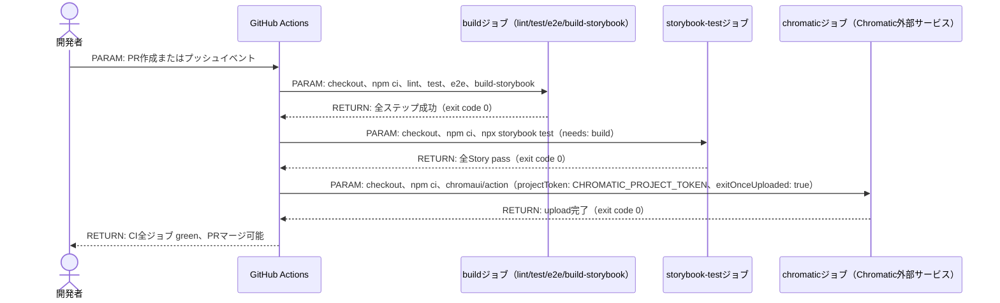
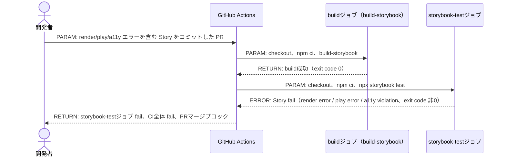
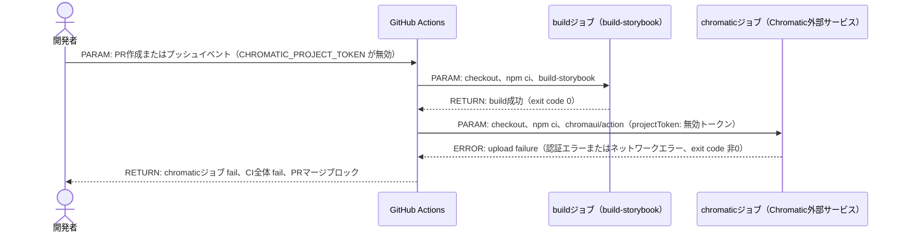
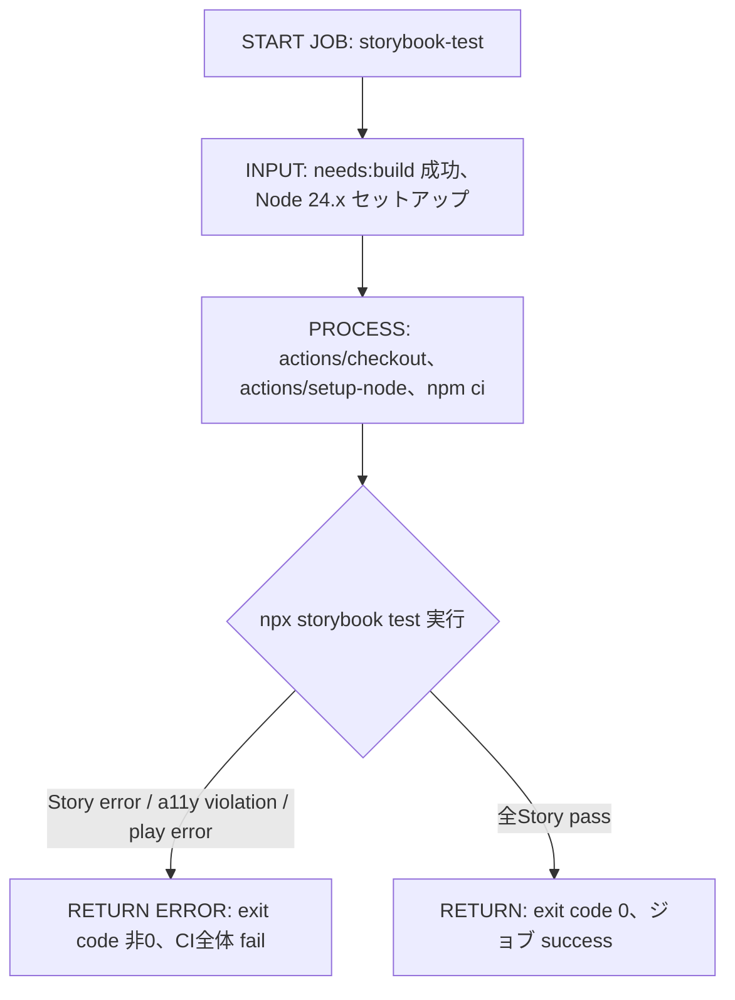
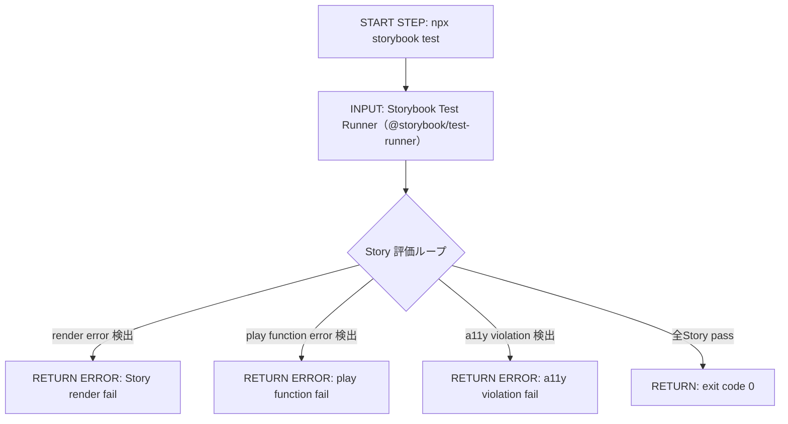
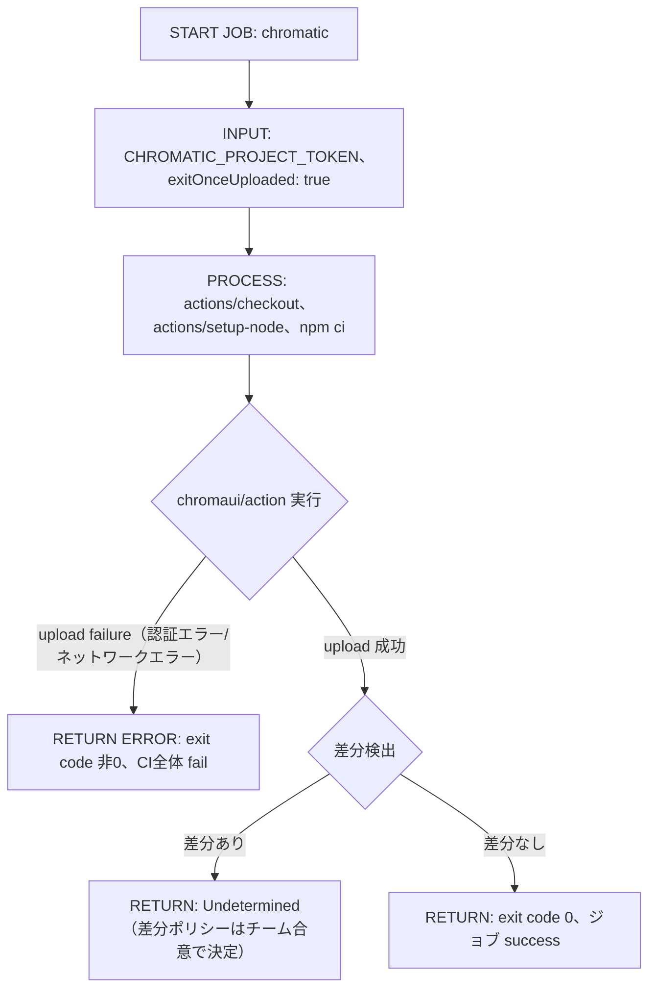

# Implementation Plan: StorybookをCI正式品質ゲートに昇格させる

---

## 0. 実装入力コンテキスト

| 項目 | 記入 |
| --- | --- |
| 対象Issue | [DESIGN] StorybookをCI正式品質ゲートに昇格させる |
| 対象リポジトリ内パス（実装起点） | `.github/workflows/ci-nextjs.yml`, `package.json` |

### 0.1 変更サマリ一覧

| 区分（追加/修正/削除） | 対象（機能/画面/API） | 変更概要 |
| --- | --- | --- |
| 修正 | `.github/workflows/ci-nextjs.yml` | Storybook Test Runner ジョブを追加し、全 Story の描画・play・a11y を CI で保証する |
| 修正 | `.github/workflows/ci-nextjs.yml` | Chromatic 連携ジョブを追加し、VRT（差分検知）を CI 上で実行する |
| 修正 | `package.json` | `@storybook/test-runner` を devDependencies に追加する |

### 0.2 入力制約一覧

| 制約区分（互換性/禁止事項/期限/その他） | 制約内容 | 適用対象 |
| --- | --- | --- |
| 互換性 | 既存 lint / typecheck / test / e2e ワークフローを破壊しない | `.github/workflows/ci-nextjs.yml` |
| 互換性 | Storybook build は従来通り成功必須（`npm run build-storybook` が存在し続ける） | `.github/workflows/ci-nextjs.yml` |
| 禁止事項 | Story の新規追加は本スコープ外 | 全ファイル |
| 禁止事項 | a11y ルールの詳細定義は本スコープ外 | 全ファイル |
| 禁止事項 | デザインレビュー運用の定義は本スコープ外 | 全ファイル |
| 禁止事項 | UI 差分の人間判断フロー設計は本スコープ外 | 全ファイル |
| その他 | Test Runner による fail は CI 全体 fail とする | `.github/workflows/ci-nextjs.yml` |
| その他 | VRT 差分ポリシー（fail / warning）は Undetermined とし、次工程で決定する | `.github/workflows/ci-nextjs.yml` |
| その他 | main ブランチと PR ブランチでの必須チェック差分は Undetermined | GitHub branch protection settings |

### 0.3 関連機能・関連仕様一覧

| 種別（要件/設計方針/ADR/調査/既存実装/外部仕様/その他） | パス/識別子 | この設計での利用目的 |
| --- | --- | --- |
| 要件 | `.github/copilot/10-requirements.md` | 品質ゲート要件の確認 |
| 設計方針 | `.github/copilot/60-ci-quality-gates.md` | CI 必須ジョブ・運用ルールの参照 |
| 設計方針 | `.github/copilot/40-testing-strategy.md` | Storybook テスト戦略の参照 |
| 既存実装 | `.github/workflows/ci-nextjs.yml` | 既存 CI ジョブ構成の確認 |
| 外部仕様 | `https://storybook.js.org/docs/writing-tests/test-runner` | Storybook Test Runner の動作仕様 |
| 外部仕様 | `https://www.chromatic.com/docs/github-actions/` | Chromatic GitHub Actions 連携仕様 |
| その他 | `.github/copilot-instructions.md` | エージェント実装規約 |

---

## 1. 実装対象機能と機能ゴール

| 項目 | 内容 | 根拠 |
| --- | --- | --- |
| 実装対象詳細（機能/画面/API） | GitHub Actions CI ワークフローへの Storybook Test Runner ジョブ追加・Chromatic VRT ジョブ追加 | Issue: [DESIGN] StorybookをCI正式品質ゲートに昇格させる |
| 機能ゴール（実装後に観測できるユーザーユース） | PR 作成時に全 Story の render 成功・play 実行・a11y チェックが CI 上で自動検証され、失敗時は CI 全体が fail してマージをブロックする | `.github/copilot/60-ci-quality-gates.md` |
| 非ゴール（今回やらないこと） | Story 新規追加、a11y ルール詳細定義、デザインレビュー運用、UI 差分の人間判断フロー設計 | Issue スコープ境界（Out） |
| 完了条件（実装完了の判定） | CI ジョブ `storybook-test` が green になること、`@storybook/test-runner` が `package.json` devDependencies に追加されること、Chromatic ジョブが CI で実行されること | 受入条件 FR-01〜FR-04 |
| 受入確認手順（1行で再現可能） | PR を作成して CI を実行し、GitHub Actions の `storybook-test` ジョブと `chromatic` ジョブが両方 pass することを確認する |  |

---

## 2. 前提・制約（SSOT）

| 種別 | 内容 | 根拠（ファイル/ADR/Issue） |
| --- | --- | --- |
| 参照したSSOT | `.github/copilot/60-ci-quality-gates.md`、`.github/copilot/40-testing-strategy.md` | SSOT 参照順 |
| 技術制約（互換性/期限/運用/セキュリティ） | `CHROMATIC_PROJECT_TOKEN` は GitHub Actions Secrets で管理し、ログに出力しない | `.github/copilot/60-ci-quality-gates.md` |
| 技術制約（互換性/期限/運用/セキュリティ） | 最小権限 `permissions: contents: read` を既存ジョブと同様に維持する | `.github/copilot/60-ci-quality-gates.md` |
| 技術制約（互換性/期限/運用/セキュリティ） | `chromaui/action` はバージョン固定（タグまたは commit SHA）で利用する | `.github/instructions/workflows.instructions.md` |
| 未確定前提（TBD） | TBD（Chromatic 差分ポリシー fail/warning: チーム合意で決定する） | Issue: 未確定事項 1 |
| 未確定前提（TBD） | TBD（PR 必須チェック範囲: main 限定か PR 必須か: ブランチ戦略と照合して決定する） | Issue: 未確定事項 3 |

---

## 3. 要件定義（実装受入条件）

### 3.1 機能要件

| ID | 要件 | 受入条件（テスト可能な形） |
| --- | --- | --- |
| FR-01 | Storybook Test Runner を CI 必須ジョブとして追加する | CI の `storybook-test` ジョブが `npm ci` → `npx storybook test` を実行し、全 Story が pass すること |
| FR-02 | Story に描画エラーがある場合、CI 全体が fail する | 意図的に壊れた Story をコミットした PR で `storybook-test` ジョブが fail し CI がブロックされること |
| FR-03 | Story に play 関数エラーがある場合、CI 全体が fail する | play 関数が例外を投げる Story をコミットした PR で `storybook-test` ジョブが fail すること |
| FR-04 | a11y violation がある場合、CI 全体が fail する | a11y ルールに違反する Story をコミットした PR で `storybook-test` ジョブが fail すること |
| FR-05 | Chromatic を VRT レイヤーとして CI に統合する | PR 作成時に `chromatic` ジョブが実行され、Chromatic ダッシュボードに builds が登録されること |
| FR-06 | Chromatic upload failure は CI fail とする | `CHROMATIC_PROJECT_TOKEN` が無効の場合などアップロード失敗時に CI が fail すること |
| FR-07 | `@storybook/test-runner` を devDependencies に追加する | `package.json` の devDependencies に `@storybook/test-runner` が存在し、`npm ci` で正常インストールされること |

### 3.2 非機能要件

| ID | 要件 | 受入条件（テスト可能な形） |
| --- | --- | --- |
| NFR-01 | 既存 CI ジョブ（lint / test / e2e / build-storybook）を破壊しない | 既存の全 CI ジョブが引き続き green であること |
| NFR-02 | Secrets をログに出力しない | `CHROMATIC_PROJECT_TOKEN` が CI ログに平文で出力されないこと |
| NFR-03 | GitHub Actions は最小権限で動作する | workflow の `permissions` に `contents: read` のみを明示し、追加権限が不要なこと |
| NFR-04 | 使用する Actions はバージョン固定で利用する | `chromaui/action` はタグまたは commit SHA でバージョン固定されること |
| NFR-05 | Chromatic 差分ポリシーは Undetermined として明示する | Chromatic ジョブの `exitOnceUploaded: true` 設定で差分判定をアップロード完了まで限定し、diff 判定はチーム合意まで保留すること |

---

## 4. スコープ境界

### 4.0 スコープ境界の定義（機能単位）

| 区分（In-Scope/Out-of-Scope） | 対象機能/責務 | 判定理由 |
| --- | --- | --- |
| In-Scope | GitHub Actions workflow への Storybook Test Runner ジョブ追加責務 | FR-01〜FR-04 対応 |
| In-Scope | GitHub Actions workflow への Chromatic VRT ジョブ追加責務 | FR-05〜FR-06 対応 |
| In-Scope | `@storybook/test-runner` の devDependencies 追加責務 | FR-07 対応 |
| In-Scope | CI fail 条件の明文化責務 | NFR-01〜NFR-05 対応 |
| In-Scope | `CHROMATIC_PROJECT_TOKEN` Secret 管理方針の明示責務 | NFR-02 対応 |
| Out-of-Scope | Story の新規追加 | 別 Issue で対応する |
| Out-of-Scope | a11y ルールの詳細定義 | 別 Issue で対応する |
| Out-of-Scope | デザインレビュー運用フロー設計 | 別 Issue で対応する |
| Out-of-Scope | UI 差分の人間判断フロー設計 | Undetermined として次工程に持ち越す |
| Out-of-Scope | Chromatic 差分ポリシー（fail/warning）の最終決定 | Undetermined としてチーム合意で決定する |

### 4.2 実装時の影響範囲・互換性リスク

| 影響対象 | 結論（影響あり/なし/未確定） | 影響内容 |
| --- | --- | --- |
| UI/画面 | 影響なし | CI ジョブ追加のみで UI コードは変更しない |
| API契約 | 影響なし | CI ジョブ追加のみで API 定義は変更しない |
| データ互換 | 影響なし | CI ジョブ追加のみでデータスキーマは変更しない |
| 外部依存 | 影響あり | `@storybook/test-runner` を devDependencies に追加する。`chromaui/action` を GitHub Actions で利用する |
| CI/運用 | 影響あり | CI 実行時間が増加する（Storybook Test Runner ジョブ + Chromatic ジョブ分）。`CHROMATIC_PROJECT_TOKEN` Secret を GitHub Actions に登録する必要がある |

### 4.3 外部依存・Secrets の扱い

| 項目 | 内容 | リスク/対応 |
| --- | --- | --- |
| 外部依存の追加/更新 | `@storybook/test-runner`（devDependencies に追加）、`chromaui/action`（GitHub Actions で利用） | semver でバージョンを固定し、`npm audit` による脆弱性確認を維持する |
| Secrets 利用有無 | `CHROMATIC_PROJECT_TOKEN` を GitHub Actions Secrets に登録して利用する | Secrets は GitHub リポジトリ設定で管理し、ログへの平文出力を禁止する |
| ログ/設定への機密混入対策 | `CHROMATIC_PROJECT_TOKEN` は `${{ secrets.CHROMATIC_PROJECT_TOKEN }}` 形式でのみ参照し、直接値を workflow ファイルに記載しない | GitHub Actions はデフォルトで Secrets をマスクするが、`echo` 等による意図的な出力を行わない |

### 4.4 4章の自己検証（必須）

| チェック項目 | 合格条件 |
| --- | --- |
| Design PR差分を書いていないか | `.github/copilot/plans/*.md` や「設計ドキュメントのみ変更」を記載していない ✅ |
| 実装責務を書いているか | In-Scopeに実装責務が5件ある ✅ |
| 実装影響を書いているか | 4.2で `影響あり` が2件あり、影響内容が具体記述されている ✅ |

---

## 5. アーキテクチャ設計

### 5.1 設計判断

#### 5.1.1 責務分離 / データフロー（詳細）

| 記載形式 | 選択（A/B） |
| --- | --- |
| 形式B: テーブル | 採用 |

| No. | 決定事項（実装責務単位） | 根拠 | 未確定（あれば） |
| --- | --- | --- | --- |
| 1 | Storybook Test Runner ジョブは既存 `build` ジョブと独立したジョブとして追加する | 並列実行による CI 時間最適化と、失敗箇所の明示化のため | なし |
| 2 | `storybook-test` ジョブは `needs: [build]` で実行順序制御を行う。ただし GitHub Actions の各ジョブは独立した VM で実行されるためファイルシステムは共有されず、`storybook-test` ジョブ内で独自に `npm run build-storybook` を再実行する | GitHub Actions のジョブ間ファイル共有なし仕様のため | なし |
| 3 | Chromatic ジョブは `storybook-test` とは独立したジョブとして追加する | Test Runner 失敗時でも Chromatic に build 状態を記録するため | なし |
| 4 | Chromatic ジョブは `exitOnceUploaded: true` を設定し、diff 判定をアップロード完了まで限定する | 差分ポリシーが Undetermined のため、アップロード成功のみを必須とする | 差分ポリシー（fail/warning）はチーム合意で決定する |
| 5 | `CHROMATIC_PROJECT_TOKEN` は GitHub Actions Secrets で管理し、`${{ secrets.CHROMATIC_PROJECT_TOKEN }}` 形式で参照する | Secrets/PII をログに出さない規約（`.github/copilot/60-ci-quality-gates.md`）に準拠するため | なし |
| 6 | Storybook Test Runner による fail は CI 全体 fail とする | render error / play error / a11y violation はすべて品質ゲートとして扱うため | なし |

#### 5.1.2 エッジケース / 例外系 / リトライ方針（詳細）

| 記載形式 | 選択（A/B） |
| --- | --- |
| 形式B: テーブル | 採用 |

| No. | ケース | 方針（戻り値/表示/再試行） | 根拠 | 未確定（あれば） |
| --- | --- | --- | --- | --- |
| 1 | Story render error | `storybook-test` ジョブが exit code 非0 で fail し、CI 全体が fail する | FR-02 | なし |
| 2 | play 関数エラー | `storybook-test` ジョブが exit code 非0 で fail し、CI 全体が fail する | FR-03 | なし |
| 3 | a11y violation | `storybook-test` ジョブが exit code 非0 で fail し、CI 全体が fail する | FR-04 | なし |
| 4 | Chromatic upload failure | `chromatic` ジョブが fail し、CI 全体が fail する | FR-06 | なし |
| 5 | Chromatic visual diff 検出 | 差分ポリシーに従って status が決定される（Undetermined） | Issue: 未確定事項 1 | 差分ポリシーはチーム合意で決定する |
| 6 | `CHROMATIC_PROJECT_TOKEN` が未設定 | `chromatic` ジョブが失敗し CI がブロックされる | NFR-02 | なし |

#### 5.1.4 ログと観測性（漏洩防止を含む / 詳細）

| 記載形式 | 選択（A/B） |
| --- | --- |
| 形式B: テーブル | 採用 |

| No. | 観点 | 方針 | 根拠 | 未確定（あれば） |
| --- | --- | --- | --- | --- |
| 1 | ログ出力内容 | GitHub Actions 標準ログのみ（ジョブ名・ステップ名・exit code）を出力する | GitHub Actions 標準動作 | なし |
| 2 | マスキング/非出力項目 | `CHROMATIC_PROJECT_TOKEN` は GitHub Actions の自動マスク機能で保護し、`echo` 等による意図的な出力を禁止する | NFR-02 | なし |
| 3 | エラー記録粒度 | `storybook test` の失敗は Story 単位で出力される（Test Runner 標準動作） | Storybook Test Runner 仕様 | なし |

### 5.2 トレードオフ

| 判断テーマ | 案A | 案B | 採用案 | 採用理由 | 不採用理由 |
| --- | --- | --- | --- | --- | --- |
| Chromatic 差分ポリシー | 差分検出を CI fail とする | 差分検出を warning のみとし CI を pass させる | Undetermined（チーム合意で決定） | PR ブロックポリシーへの影響が大きいため、チーム合意が必要 | — |
| Storybook Test Runner 実行タイミング | 既存 `build` ジョブ内に統合する | 独立した `storybook-test` ジョブとして追加する | 案B（独立ジョブ） | 失敗箇所の明示化と並列実行による CI 最適化のため | 案Aは既存ジョブの肥大化リスクがある |

### 5.3 ルーティング方針（本セクション非適用）

本 plan は CI ワークフロー設計のため、Next.js ルーティング方針は対象外。

### 5.4 依存カテゴリ方針（本セクション非適用）

本 plan は CI ワークフロー設計のため、DI/依存カテゴリ方針は対象外。

### 5.5 データ取得ライフサイクル（本セクション非適用）

本 plan は CI ワークフロー設計のため、SSR/SSG/CSR のデータ取得ライフサイクルは対象外。

### 5.6 エラーハンドリング標準形（本セクション非適用）

本 plan は CI ワークフロー設計のため、Next.js エラーハンドリング標準形は対象外。

### 5.7 シーケンス図（CI ジョブフロー / Mermaid）

#### 5.7.1 シーケンス対象一覧

| 図ID | 種別（正常/異常） | 起点（画面/API） | 終点（UseCase/外部I/O） | 対応要件ID（FR/NFR） |
| --- | --- | --- | --- | --- |
| SEQ-01 | 正常（CI 全ジョブ成功） | PR 作成またはプッシュイベント | Chromatic build 登録完了 | FR-01, FR-05, NFR-01 |
| SEQ-02 | 異常（Story render/play/a11y error） | PR 作成またはプッシュイベント | `storybook-test` ジョブ fail | FR-02, FR-03, FR-04 |
| SEQ-03 | 異常（Chromatic upload failure） | PR 作成またはプッシュイベント | `chromatic` ジョブ fail | FR-06 |

#### 5.7.2 正常系シーケンス（SEQ-01）



#### 5.7.3 異常系シーケンス（SEQ-02: Story エラー）



#### 5.7.4 異常系シーケンス（SEQ-03: Chromatic upload failure）



### 5.8 処理フロー図（CI ジョブレベル / 複数必須）

#### 5.8.1 メソッド一覧（CI ジョブ単位）

| 図ID | メソッド名（CI ジョブ/ステップ名） | 層（CI job/step） | 対応要件ID（FR/NFR） |
| --- | --- | --- | --- |
| FLOW-01 | storybook-test ジョブ全体フロー | CI job | FR-01, FR-02, FR-03, FR-04 |
| FLOW-02 | npx storybook test ステップ | CI step | FR-01, FR-02, FR-03, FR-04 |
| FLOW-03 | chromatic ジョブ全体フロー | CI job | FR-05, FR-06 |

#### メソッドフロー(FLOW-01): storybook-test ジョブ全体フロー



#### メソッドフロー(FLOW-02): npx storybook test ステップ



#### メソッドフロー(FLOW-03): chromatic ジョブ全体フロー



---

## 6. 契約仕様（CI 設定レベル）

### 6.1 入出力契約（CI ジョブ/ステップ）

| ID | 入口（CI イベント） | 入力 | 出力 | エラー | 備考 |
| --- | --- | --- | --- | --- | --- |
| IFC-01 | `storybook-test` ジョブ | `build` ジョブ成功後のワークスペース | 全 Story pass（exit code 0） | Story エラー/a11y violation（exit code 非0） | `needs: [build]` で依存関係を設定する |
| IFC-02 | `chromatic` ジョブ | `CHROMATIC_PROJECT_TOKEN`、Storybook ソース | Chromatic build 登録完了（exit code 0） | upload failure（exit code 非0） | `exitOnceUploaded: true` でアップロード完了まで待機する |

### 6.2 実装イメージ（CI Job YAML）

以下は `.github/workflows/ci-nextjs.yml` に追加する CI ジョブの実装イメージ。既存の `build` ジョブは変更せず、独立したジョブとして追加する。

**注意**: GitHub Actions の各ジョブは独立したランナー（VM）で実行されるため、ジョブ間でファイルシステムは共有されない。`storybook-test` ジョブおよび `chromatic` ジョブは、それぞれ独自に `npm run build-storybook` を実行する必要がある。`needs: [build]` は実行順序制御（main build の成否確認）のためであり、ビルド成果物の共有ではない。

```yaml
  storybook-test:
    runs-on: ubuntu-latest
    needs: [build]
    steps:
      - name: Checkout repository
        uses: actions/checkout@v6

      - name: Setup Node.js
        uses: actions/setup-node@v6
        with:
          node-version: "24"
          cache: npm
          cache-dependency-path: package-lock.json

      - name: Install dependencies
        run: npm ci

      - name: Build Storybook
        run: npm run build-storybook

      - name: Test Storybook stories
        run: npx storybook test

  chromatic:
    runs-on: ubuntu-latest
    needs: [build]
    steps:
      - name: Checkout repository
        uses: actions/checkout@v6
        with:
          fetch-depth: 0

      - name: Setup Node.js
        uses: actions/setup-node@v6
        with:
          node-version: "24"
          cache: npm
          cache-dependency-path: package-lock.json

      - name: Install dependencies
        run: npm ci

      - name: Publish to Chromatic
        uses: chromaui/action@v1
        with:
          projectToken: ${{ secrets.CHROMATIC_PROJECT_TOKEN }}
          exitOnceUploaded: true
```

---

## 7. データ設計

本 plan は CI ワークフロー設計のため、データベーススキーマ変更・マイグレーションは対象外。

---

## 8. 実装指示（製造Agent向け）

### 8.1 変更予定ファイル一覧（必須）

| No. | パス | 区分（app/src/contracts/ui/plugins/other） | 変更タイプ（追加/変更/削除） | 実装内容（具体） | 完了条件 |
| --- | --- | --- | --- | --- | --- |
| 1 | `.github/workflows/ci-nextjs.yml` | other | 変更 | `storybook-test` ジョブ（`needs: [build]`、`npx storybook test`）と `chromatic` ジョブ（`chromaui/action@v1`、`exitOnceUploaded: true`）を追加する | CI が `storybook-test` と `chromatic` を実行し、既存ジョブが引き続き green であること |
| 2 | `package.json` | other | 変更 | `@storybook/test-runner` を devDependencies に追加する | `npm ci` でインストール後に `npx storybook test` が実行可能であること |

### 8.2 実装手順（順序付き）

| 手順 | 作業内容 | 対象ファイル/モジュール | 完了条件 |
| --- | --- | --- | --- |
| 1 | `@storybook/test-runner` の最新安定バージョンを確認し、`package.json` の devDependencies に追加する | `package.json` | `npm ci` でエラーなくインストールされること |
| 2 | `.github/workflows/ci-nextjs.yml` に `storybook-test` ジョブを追加する（`needs: [build]`、`npm run build-storybook`、`npx storybook test`） | `.github/workflows/ci-nextjs.yml` | CI で `storybook-test` ジョブが実行され、全 Story が pass すること |
| 3 | `.github/workflows/ci-nextjs.yml` に `chromatic` ジョブを追加する（`needs: [build]`、`chromaui/action@v1`、`exitOnceUploaded: true`） | `.github/workflows/ci-nextjs.yml` | CI で `chromatic` ジョブが実行され、Chromatic ダッシュボードに build が登録されること |
| 4 | GitHub リポジトリ設定に `CHROMATIC_PROJECT_TOKEN` を Secrets として登録する | GitHub リポジトリ設定（管理者作業） | `chromatic` ジョブが認証エラーなく実行されること |
| 5 | 既存 CI ジョブ（lint / test / e2e / build-storybook）が引き続き green であることを確認する | `.github/workflows/ci-nextjs.yml` | 全既存ジョブが pass すること |

### 8.3 実装禁止事項（ガードレール）

| 項目 | 内容 | 根拠 |
| --- | --- | --- |
| 禁止事項-1 | `CHROMATIC_PROJECT_TOKEN` を workflow ファイルに直接記述しない | Secrets/PII をコード/ログに出さない規約 |
| 禁止事項-2 | 既存の `build` ジョブのステップを削除・変更しない | NFR-01（既存 CI ジョブを破壊しない） |
| 禁止事項-3 | `chromaui/action` のバージョンを固定せずに `@latest` などを使用しない | `.github/instructions/workflows.instructions.md`（アクションはバージョン固定） |
| 禁止事項-4 | Story の新規追加・変更を本 PR に含めない | スコープ外（本 plan は CI 設定変更のみ） |
| 禁止事項-5 | `exitOnceUploaded: true` を外して Chromatic の差分ポリシーを確定させない | 差分ポリシーは Undetermined（チーム合意が必要） |
| 禁止事項-6 | `permissions` に `contents: write` 以上の権限を追加しない | NFR-03（最小権限設計） |

### 8.4 import制約の自動化（本セクション非適用）

本 plan は CI ワークフロー設計のため、import 制約の自動化は対象外。

---

## 9. テスト実装計画

### 9.1 テストケース

| 区分（正常/例外/境界/回帰） | パターン名 | 対象 | シナリオ | 期待結果 |
| --- | --- | --- | --- | --- |
| 正常 | CI 全ジョブ成功 | `ci-nextjs.yml` | Story にエラーがない PR を作成する | `storybook-test` ジョブと `chromatic` ジョブが両方 pass する |
| 正常 | Chromatic build 登録成功 | `chromatic` ジョブ | 有効な `CHROMATIC_PROJECT_TOKEN` で PR を作成する | Chromatic ダッシュボードに build が登録される |
| 例外 | Story render error で fail | `storybook-test` ジョブ | render エラーを含む Story をコミットした PR を作成する | `storybook-test` ジョブが fail し CI 全体が fail する |
| 例外 | play 関数エラーで fail | `storybook-test` ジョブ | play 関数が例外を投げる Story をコミットした PR を作成する | `storybook-test` ジョブが fail し CI 全体が fail する |
| 例外 | a11y violation で fail | `storybook-test` ジョブ | a11y ルール違反を含む Story をコミットした PR を作成する | `storybook-test` ジョブが fail し CI 全体が fail する |
| 例外 | Chromatic upload failure で fail | `chromatic` ジョブ | `CHROMATIC_PROJECT_TOKEN` が無効な状態で CI を実行する | `chromatic` ジョブが fail し CI 全体が fail する |
| 回帰 | 既存 lint ジョブが引き続き成功する | `build` ジョブ | 通常の PR を作成する | `lint` ステップが pass する |
| 回帰 | 既存 test ジョブが引き続き成功する | `build` ジョブ | 通常の PR を作成する | `test` ステップが pass する |
| 回帰 | 既存 e2e ジョブが引き続き成功する | `build` ジョブ | 通常の PR を作成する | `e2e` ステップが pass する |
| 回帰 | 既存 build-storybook が引き続き成功する | `build` ジョブ | 通常の PR を作成する | `Build Storybook` ステップが pass する |

| 網羅チェック | 判定（Y/N） | 根拠 |
| --- | --- | --- |
| 正常パターンを網羅している | Y | SEQ-01 の正常系を2パターン定義済み |
| 例外パターンを網羅している | Y | render error / play error / a11y / upload failure の4パターンを定義済み |
| 境界パターンを網羅している | Y | Undetermined の差分ポリシーは次工程で検証する |
| 回帰パターンを網羅している | Y | 既存4ジョブの継続 pass を定義済み |

---

## 10. オープン課題 / ADR

| 論点 | 現状 | 決定期限/担当 | ADR要否（要/不要/TBD） |
| --- | --- | --- | --- |
| Chromatic 差分ポリシー（fail / warning） | Undetermined | TBD（チーム合意で決定する） | TBD（決定後にADR検討） |
| PR 必須チェックへの組み込み範囲 | Undetermined | TBD（ブランチ戦略と照合して決定する） | TBD（決定後にADR検討） |
| Story 必須対象範囲（全Storyか特定レイヤーか） | Undetermined | TBD（コンポーネント階層定義と照合して決定する） | TBD（決定後にADR検討） |

### 10.1 TBD回収トラッキング（必須）

| TBD論点 | 現在の記載箇所（章/項目） | 解決ゲート（必須） | BLOCKER（Yes/No） | RESOLVE_IN（必須） | DEFAULT/ASSUMPTION（任意） | ADR記録先（必要時） |
| --- | --- | --- | --- | --- | --- | --- |
| Chromatic 差分ポリシー（fail/warning） | 5.2, FLOW-03, 10 | GATE: IMPLEMENT PR 作成前 | BLOCKER: No | RESOLVE_IN: `.github/workflows/ci-nextjs.yml` の `chromatic` ジョブ設定 | DEFAULT/ASSUMPTION: `exitOnceUploaded: true` でアップロード完了のみを必須とし、差分判定は Chromatic ダッシュボードで手動確認する | `.github/copilot/70-adr/` に記録（必要時） |
| PR 必須チェックへの組み込み範囲 | 2（未確定前提）, 10 | GATE: IMPLEMENT PR マージ前 | BLOCKER: No | RESOLVE_IN: GitHub ブランチ保護設定（required status checks） | DEFAULT/ASSUMPTION: main ブランチへのプッシュ時のみ必須とし、PR 必須化はチーム合意後に設定する | `.github/copilot/70-adr/` に記録（必要時） |
| Story 必須対象範囲 | 10 | GATE: Story 追加 Issue の実装前 | BLOCKER: No | RESOLVE_IN: 別 Issue での Story 追加方針策定時 | DEFAULT/ASSUMPTION: 全 Story を対象とし、実行時間が問題になった場合に限定する | `.github/copilot/70-adr/` に記録（必要時） |

---

## 11. 未確定事項まとめ（Undetermined）

以下は本 plan 確定後も未決定であり、IMPLEMENT Issue 起票前にチーム合意が必要な項目。

| No. | 未確定事項 | 影響範囲 | 決定方法 |
| --- | --- | --- | --- |
| 1 | Chromatic 差分を fail とするか warning とするか | PR ブロックポリシーに直結する | チーム合意 |
| 2 | Story 必須対象範囲（全 Story か特定レイヤーか） | CI 実行時間 / 開発負荷に影響する | コンポーネント階層定義と照合する |
| 3 | PR 必須チェックに含めるか main 限定か | 開発フローの厳格度に影響する | ブランチ戦略と照合する |
